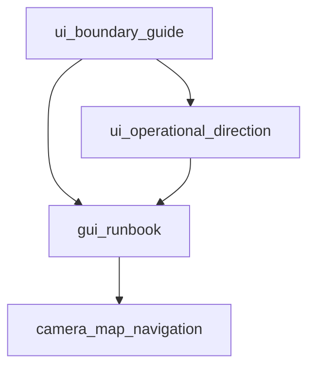

# Experience layer orchestrator `v1`

> **STATUS:** Draft **v1** — indexes **player-facing UI/UX** for strategic operations; child of [`simulation_expansion_orchestrator_v1.md`](simulation_expansion_orchestrator_v1.md).

Version: `v1.0.1`  
Audience: agents implementing HUD, overlays, camera, and inspector patterns without violating sim ownership.

**UX/HUD locks:** [`experience_layer_ux_hud_designer_brief_v1.md`](experience_layer_ux_hud_designer_brief_v1.md) (**BQ-119+**)  
**Visual/IA direction:** [`ui_operational_direction_runbook_v1.md`](ui_operational_direction_runbook_v1.md)  
**Hard boundary:** [`ui_boundary_guide_v1.md`](ui_boundary_guide_v1.md)

---

## 1. Purpose

Keep **one coherent experience stack**:

- **Bevy UI** — gameplay shell, overlays, inspectors, notifications (map-primary).
- **egui** — dev tools, tuning, editors (gated).
- **Input** — [`InputBindings`](../../src/gui/input_bindings.rs) and navigation per camera runbook.

---

## 2. Runbooks in this layer

| Runbook | Role |
|:---|:---|
| [`ui_operational_direction_runbook_v1.md`](ui_operational_direction_runbook_v1.md) | Mockup-derived epics: command table, planner, war overlay, minimal HUD *(2026-05-10: simulation HUD — strategic strip, overlay congestion/EW toggles live)* |
| [`ui_boundary_guide_v1.md`](ui_boundary_guide_v1.md) | Authoritative Bevy vs egui split |
| [`gui_runbook_v1.md`](gui_runbook_v1.md) | GUI integration harness; dev diagnostics (**F3**) exposes strategic playtest controls ([`diagnostics_ui.rs`](../../src/gui/diagnostics_ui.rs)) |
| [`camera_map_navigation_runbook_v1.md`](camera_map_navigation_runbook_v1.md) | Pan/zoom/rotate; respects egui capture |
| [`scenario_campaign_scripted_tools_runbook_v1.md`](scenario_campaign_scripted_tools_runbook_v1.md) | Editor-time **scripted engine tools** for scenario/campaign authoring (TEMP-EGUI panel; prerequisite §4 before four implementation waves) |
| [`simulation_explainability_runbook_v1.md`](simulation_explainability_runbook_v1.md) | L7 decision breakdown surfaces |
| [`operational_feedback_language_v1.md`](operational_feedback_language_v1.md) | Contributor phrasing for HUD / briefing |
| [`experience_layer_ux_hud_designer_brief_v1.md`](experience_layer_ux_hud_designer_brief_v1.md) | Locked UX-A–D tracks, minimap/transmission/construction/command shell (**BQ-119+**) |

## 3. Parallel UX tracks (post Stage-5 EXIT)

After unified representation + VT gates + preview parity + authoritative GPU draw ([`base_visual_world_representation_v1.md`](base_visual_world_representation_v1.md)):

| Track | Brief § | Engineering IDs |
|:---|:---|:---|
| **UX-A** Minimap / overlay shell | §2 | **UX-1**, **UX-5** |
| **UX-B** Media / transmission widget | §3 | **UX-3** |
| **UX-C** Construction & blueprint UX | §4 | **UX-4** |
| **UX-D** Command shell / intel timeline | §5 | **UX-6** (+ [`stage7_behavioral_world_designer_brief_v1.md`](stage7_behavioral_world_designer_brief_v1.md) §8) |

**Later:** campaign scripting + mission-driven transmissions ([`scenario_campaign_scripted_tools_runbook_v1.md`](scenario_campaign_scripted_tools_runbook_v1.md)). **Do not** block these tracks on full strategic AI.

## 4. Dependency sketch

---

## 5. Invariants

1. **Overlay-first, window-second** — avoid permanent floating panels for core play; prefer trays and toggles (see operational direction runbook).
2. **No gameplay mutation from dev panels** — dev egui writes diagnostics/tuning only.
3. **Strategic overlays** owned by sim systems; UI **toggles views** and **selects policy**, per expansion orchestrator §7.
4. **Single representation spine** — minimap, construction preview, transmission surfaces, and command overlays consume **`WorldRepresentationResolver`** outputs and shared overlay buffers; no per-widget ECS fire scans ([`experience_layer_ux_hud_designer_brief_v1.md`](experience_layer_ux_hud_designer_brief_v1.md) §1).
