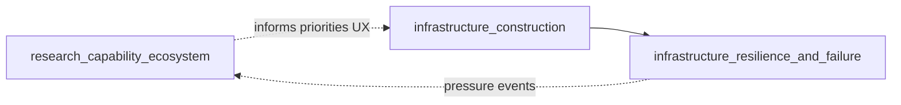

# Infrastructure and research orchestrator `v1`

> **STATUS:** Draft **v1** — indexes **research-as-capability** and **physical infrastructure** runbooks; child of [`simulation_expansion_orchestrator_v1.md`](simulation_expansion_orchestrator_v1.md).

Version: `v1.0.2`  
Audience: agents ordering construction, failure/resilience, and emergent research systems.

**Parent umbrella:** [`simulation_expansion_orchestrator_v1.md`](simulation_expansion_orchestrator_v1.md) — start coding via **§6** below after reading IX + I1.

**Parallel AI/fields track:** [`strategic_fields_and_ai_orchestrator_v1.md`](strategic_fields_and_ai_orchestrator_v1.md)  
**Execution order:** [`strategic_program_execution_plan_v1.md`](strategic_program_execution_plan_v1.md)

---

## 1. Purpose

Sequence work so that:

1. **Infrastructure is planned and built** with explicit graphs and construction states.
2. **Degradation, failure, and repair** extend that base (not a parallel fiction).
3. **Research** is modeled as institutions + capability dimensions that **consume** industry/logistics/terrain reality — not a disconnected tech tree UI.

---

## 2. Child runbooks (this orchestrator)

| Phase | Runbook | Role |
|:---|:---|:---|
| IX | [`territorial_infrastructure_orchestration_v1.md`](territorial_infrastructure_orchestration_v1.md) | Cross-cutting canon: runtime layers, **sites = graph nodes**, unified construction vs corridors, `ToolContext`, dirty/preview, GPU paths, ECS phase order |
| R0 | [`research_capability_ecosystem_runbook_v1.md`](research_capability_ecosystem_runbook_v1.md) | Knowledge domains, discovery graph, maturity, doctrine coupling *(may start as design-only; see execution plan)* |
| I1 | [`infrastructure_construction_runbook_v1.md`](infrastructure_construction_runbook_v1.md) | Networks, construction workflow, terrain/weather coupling, fortifications |
| I2 | [`infrastructure_resilience_and_failure_runbook_v1.md`](infrastructure_resilience_and_failure_runbook_v1.md) | Damage, maintenance crews, cascades, rerouting, ecological feedback |

**Hard rule:** **`infrastructure_resilience_and_failure`** lists **parent** [`infrastructure_construction_runbook_v1.md`](infrastructure_construction_runbook_v1.md) — do not implement resilience as global stubs that ignore construction ownership.

---

## 3. Dependency sketch

---

## 4. Cross-links

| Domain | Existing guides |
|:---|:---|
| Terrain / hydrology | [`terrain_unification_runbook_v1.md`](terrain_unification_runbook_v1.md), [`gap_remediation_runbook_v1.md`](gap_remediation_runbook_v1.md) (G1 hydrology) |
| Weather / fire | [`weather_simulation_runbook_v1.md`](weather_simulation_runbook_v1.md), [`fire_ecology_simulation_runbook_v1.md`](fire_ecology_simulation_runbook_v1.md) |
| Industry anchors | [`concrete_industry_sim_runbook_v1.md`](concrete_industry_sim_runbook_v1.md), [`petroleum_industry_simulation_runbook_v1.md`](petroleum_industry_simulation_runbook_v1.md) |
| UI | [`ui_boundary_guide_v1.md`](ui_boundary_guide_v1.md), [`ui_operational_direction_runbook_v1.md`](ui_operational_direction_runbook_v1.md) |
| Source drafts (archive) | [`base_reserch_draft.md`](base_reserch_draft.md) *(filename historical)* |

---

## 5. Invariants

1. **Construction before catastrophic failure semantics** — collapse/blackout behavior attaches to **real** network elements from construction.
2. **Research unlocks are emergent** — gate on capability vectors + institutions, not a single `tech_id` button unless legacy bridge is explicit.
3. **UI policy only** — gameplay panels set policy/resources per [`ui_boundary_guide_v1.md`](ui_boundary_guide_v1.md); they do not become a second mutation path for graphs.

---

## 6. Implementation kickoff (coding)

Use this **read order** when opening the repo to implement **P2** (see [`strategic_program_execution_plan_v1.md`](strategic_program_execution_plan_v1.md) §4):

| Step | Document | Action |
|:---:|:---|:---|
| 1 | [`simulation_expansion_orchestrator_v1.md`](simulation_expansion_orchestrator_v1.md) | Confirm layers §3, invariants §7, chunk/scheduler links |
| 2 | **This file** §2 | Pick **IX** + **I1** + corridor child; note **I2** follows I1 |
| 3 | [`territorial_infrastructure_orchestration_v1.md`](territorial_infrastructure_orchestration_v1.md) | Runtime layers A–E, §15 ECS phase order, §14 plugin sketch |
| 4 | [`infrastructure_construction_runbook_v1.md`](infrastructure_construction_runbook_v1.md) | **§10** state machine, §11 logistics progress, §25 acceptance |
| 5 | [`infrastructure_corridor_runbook_v1.md`](infrastructure_corridor_runbook_v1.md) | Align new site work with existing corridor/commit path |
| 6 | [`ui_boundary_guide_v1.md`](ui_boundary_guide_v1.md) + [`base_ui_direction_principls.md`](base_ui_direction_principls.md) | Player placement = Bevy; operations strip |

**First implementation slices (suggested):**

1. **Types:** `src/strategic/site_construction.rs` — [`SiteConstructionPhase`](../../src/strategic/site_construction.rs), [`SiteConstructionBook`](../../src/strategic/site_construction.rs), coarse [`site_phase_from_corridor_coarse`](../../src/strategic/site_construction.rs); corridor phases unchanged for R8 wire compat.
2. **Planning components:** [`PlannedSite`](../../src/strategic/site_construction.rs) + [`CommitConstructionSiteEvent`](../../src/strategic/site_construction.rs); chunk/preview dirty TBD.
3. **Reuse corridor pattern:** [`SiteConstructionBook`](../../src/strategic/site_construction.rs) registered in [`StrategicFieldsPlugin`](../../src/strategic/plugin.rs); extend with commit consumers next.
4. **Validation stub:** [`validate_terrain_for_site`](../../src/strategic/site_construction.rs) / [`validate_network_access_for_site`](../../src/strategic/site_construction.rs).

Track **P0** UX and **P1** overlays in parallel per execution plan; do not block I1 on full AI.

**Orchestrator pair:** **Simulation expansion** = ontology + layers + program invariants; **Infrastructure & research** = I1/I2/R0 + **IX** territorial canon. Both apply to every PR that touches construction or sites.

---

**Document history:** `v1.0.2` — §6 first slices landed in `src/strategic/site_construction.rs` + plugin registration. `v1.0.1` — §6 **Implementation kickoff (coding)**; header points to simulation umbrella §6; version bump.
