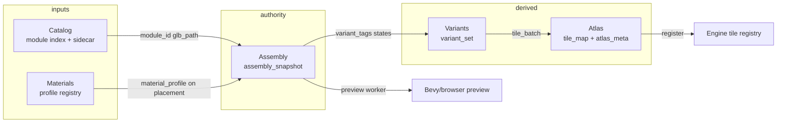

# APS-UX-AUDIT-001 — Art Pipeline Suite UX audit `v1`

| Field | Value |
|:---|:---|
| **Program ID** | **APS-UX-AUDIT-001** |
| **Plan** | [`plan_aps_artist_tool_exec_v1.md`](plan_aps_artist_tool_exec_v1.md) Phase 0 |
| **Brief** | [`prompts/designer_questions/aps_ux_audit_brief_v1.md`](../prompts/designer_questions/aps_ux_audit_brief_v1.md) |
| **Date** | 2026-06-03 |
| **Owner** | `@designer` |
| **Launch** | `python tools/mcp/art_pipeline_suite/run.py` (Python 3.13 MCP env) |
| **Verdict** | **PASS** |
| **Polish sign-off** | [`design_aps_ux_polish_signoff_v1.md`](design_aps_ux_polish_signoff_v1.md) — lead upgrade 2026-06-03 |
| **Informs** | APS-PREVIEW-CATALOG-001 · APS-ATLAS-PREVIEW-002 · APS-UX-TOOLTIPS-002 · APS-UX-POLISH-001 |

**Boundary:** Tk implementation = `@coder-mcp`. This doc is audit/signoff only.

---

## Executive summary

APS is **usable as an artist tool** for catalog browse → assembly generate → material assign → slot preview → variants → atlas QC **without Blender** for everyday paths. Tab intros, top Flow bar, slot previews (APS-PREVIEW-001 green), and collapsible metadata panels are strong.

**Gate notes:** P0 accessibility fixes verified in **APS-UX-POLISH-001-SIGNOFF** (validation colors, material status text, metadata first-visit expand). Lead verdict **PASS** as of 2026-06-03.

---

## Scores (1–10)

| Dimension | Score | Rationale |
|:---|:---:|:---|
| **Clarity** | **6** | Tab one-liners good; snapshot authority buried in collapsed panel; Assembly stack is long |
| **Discoverability** | **5** | Flow bar helps but prerequisites unclear; Catalog lacks list thumbs; Variants agent strip dominates |
| **Error recovery** | **7** | JSON save errors, messageboxes, Validate/P0 gate buttons; FAIL text exists but always green styling |
| **Accessibility** | **4** | ●◐○ + ✓/○ pipeline glyphs; Consolas 8 on atlas/meta/maps; validation color-only |
| **Workflow efficiency** | **6** | Materials↔Assembly links work; top Flow shortcuts good; 960×600 Assembly requires heavy scroll |

---

## Accessibility checklist

| Item | Result |
|:---|:---|
| Status not color/glyph alone | **FAIL** — material glyphs, pipeline ✓/○, validation always `#006400` |
| No Consolas 8 for primary labels | **FAIL** — atlas path/meta, maps line, cell strip labels |
| Critical actions not tooltip-only | **PASS** — Validate, Save, Apply, Pack are buttons |
| Scroll regions obvious | **PARTIAL** — footprint grid OK; Assembly tag stack scrolls without header stickiness |
| Panes usable at 960×600 | **PARTIAL** — `minsize` set; Assembly 3-pane + previews overflow vertically |
| Metadata → engine without ARCH-MAT doc | **PARTIAL** — panel exists but **collapsed by default** |
| Pipeline status bar mental model | **PARTIAL** — step order correct; glyph-only done state |

---

## Tab review

### Catalog

| ✓ | ✗ |
|:---|:---|
| Batch/category filters, sidecar + index split | No in-list GLB thumb (Phase 2) |
| Validate GLB + browser/trimesh preview | Validation line always green even on FAIL |
| Metadata flow (catalog context) | Sidecar vs assembly truth not visible until expand panel |

### Assembly

| ✓ | ✗ |
|:---|:---|
| Generate grammar/plain, footprint canvas, slot previews | Very tall — scroll fatigue at min width |
| Material library inline + Apply to slot | Tag pickers stack deep below previews |
| Save/Validate/P0 gate + path label | Grammar inspector always expanded |
| Semantic + variant tags with filter | "Open in Materials" easy to miss |

### Materials

| ✓ | ✗ |
|:---|:---|
| Studio tree scales to 300+ profiles | Tree rows: `● profile_id` glyph-only |
| Preview modes (sphere/wall/building) | Maps line Consolas 8 |
| Use in Assembly cross-link | Assign only on Assembly — stated but easy to skip |

### Variants

| ✓ | ✗ |
|:---|:---|
| Layer comboboxes map to variant_set_v1 | Agent patch strip reads as primary path |
| New from assembly, validate, bake selected | No tooltip bindings on tab controls |
| Bake status line | bake_status always green foreground |

### Atlas

| ✓ | ✗ |
|:---|:---|
| Pack + refresh preview, cell strip | No UV grid overlay (Phase 3) |
| atlas_meta one-liner | Meta/path Consolas 8 |
| Blender debug hidden by default | Validate atlas meta not exposed as button yet |

---

## Top 10 issues (ranked)

| # | Pri | Issue |
|:---:|:---:|:---|
| 1 | **P0** | **Validation FAIL styled green** — `catalog.validation`, `assembly.validation_var`, `variants.bake_status` use `#006400` regardless of PASS/FAIL |
| 2 | **P0** | **Material status glyph-only** — studio tree `●/◐/○` prefix without `Ready`/`Partial`/`Missing` text (`material_library_widget._status_glyph`) |
| 3 | **P0** | **Metadata→engine collapsed by default** — new artists miss snapshot authority (`MetadataFlowPanel._expanded` default `False`) |
| 4 | **P1** | **Assembly vertical overload** — Generate + 3-pane workspace + dual previews + tags + grammar inspector at 960×600 |
| 5 | **P1** | **Catalog no list thumbnail** — identity by `module_id` string only until APS-PREVIEW-CATALOG-001 |
| 6 | **P1** | **Pipeline status glyph-only** — `✓ Catalog` vs `○ Catalog` without `(done)`/`(pending)` words |
| 7 | **P1** | **Atlas QC meta unreadable** — `Consolas 8` on `_meta_var`, `_atlas_path_var`, `_cell_meta_var` |
| 8 | **P1** | **Variants agent strip prominence** — "Request agent" looks like daily artist step |
| 9 | **P2** | **Flow "Bake variants" no save guard** — can jump tabs without saved snapshot |
| 10 | **P2** | **Catalog cat_metadata tooltip on notebook** — binds to widget with weak hover target |

---

## Top 5 fixes for @coder-mcp

1. **Validation styling** — Set `foreground` from result: PASS `#0a6b0a`, FAIL `#a00000`, WARN `#a66b00`. Prefix label text: `Validation: FAIL —` not buried mid-string.
2. **Material row status text** — Tree/list: `Ready · steel_industrial_01` (optional muted glyph after word). Card grid already has `● ready` — promote word first, 9pt Segoe.
3. **Authority strip always visible** — Pin one line under Flow bar: `Ship truth: assembly_snapshot (materials + tags). Sidecar/atlas are inputs only.` Expand metadata panel on first run (`~/.aps_first_run` flag).
4. **Assembly compaction @960×600** — Accordion: Grammar inspector + Variant tags collapsed by default; sticky subhead on tag scroll region; ensure footprint pane ≥280px with visible vertical scrollbar.
5. **Pipeline + atlas labels** — Status bar: `Catalog — done` / `Catalog — pending`. Atlas meta: Segoe UI 9, human sentence: `Grid 2×1 · 512px · variant clean_day`.

---

## Tooltip copy

**Approved with edits** — see [`tools/mcp/art_pipeline_suite/aps_tooltips.py`](../tools/mcp/art_pipeline_suite/aps_tooltips.py) v2 (APS-UX-TOOLTIPS-002 DRAFT). New keys: `pipeline_step`, `cat_sidecar_truth`, `mat_status`, `var_layers`, `atl_qc`, `asm_save_reminder`.

---

## Information architecture (authority map)

| Tab | Owns | Does not own |
|:---|:---|:---|
| **Catalog** | Module discovery, sidecar hints, GLB validate | Ship materials/tags |
| **Assembly** | **Snapshot authority** — placements, materials, semantic tags | Tile atlas |
| **Materials** | Profile browse/generate/preview | Assignment (delegates to Assembly) |
| **Variants** | State layers → variant_set | Snapshot edits |
| **Atlas** | PNG QC, pack, atlas_meta | Per-slot materials |

---

## Artist journey (no Blender)

1. **Catalog** — filter batch → select module → Validate GLB → optional sidecar edit  
2. **Flow → Send to Assembly** — style pack + footprint  
3. **Assembly** — Generate snapshot → click footprint cell → pick material → slot previews update → semantic tags → **Save**  
4. **Materials** (optional) — browse/generate profile → Use in Assembly  
5. **Flow → Bake variants** — Variants tab → validate → Atlas batch prepared  
6. **Atlas** — set PNG folder → Pack → QC cells + packed atlas → register (CLI)

---

## Sign-off

| Role | Verdict | Date |
|:---|:---|:---|
| `@designer` | **PASS** | 2026-06-03 |

**Notes:** P0 a11y fixes verified in **APS-UX-POLISH-001-SIGNOFF** — [`design_aps_ux_polish_signoff_v1.md`](design_aps_ux_polish_signoff_v1.md). Lead verdict upgraded from PASS WITH NOTES.
