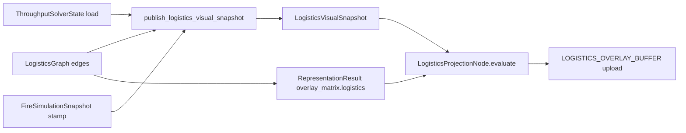

# Logistics visual lane — FULL_APP `log_rows` spec `v1`

**Status:** Active (Phase E · **LOG-E01**)  
**Throughput sim (separate):** [`logistics_throughput_todos.rs`](logistics_throughput_todos.rs) — economy causality  
**Triage:** [`stage5_triage_backlog.md`](stage5_triage_backlog.md) · **TRIAGE-LOGISTICS-VIS**

---

## 1. What “done” means

In the running app (or `--test visual`), the projection graph build signature must show **`log_rows > 0`** when logistics data exists:

```text
order=fire+logistics+ecology fire_inst=… fire_heat=… log_rows=N eco_rows=…
```

**Proof artifacts:**

| File | Field |
|------|--------|
| `debug_runs/stage5_full_app_live.json` | `projection_graph.logistics_active_rows` + `build_signature` |
| Console (`stage5_readiness::live`) | `READINESS_PROJECTION_GRAPH_BUILD` line |

**Not sufficient alone:** `logistics_throughput_live.json` green — that witnesses solver/freight, not render projection.

---

## 2. Data flow (single spine)



### 2.1 Fill (`fill_logistics_snapshot`)

**File:** [`src/render/visual_domain_snapshots.rs`](../render/visual_domain_snapshots.rs)

1. Prefer `LogisticsGraph` edges with `edge_flow_for_overlay(edge, solver) > 0`.  
2. Else fallback `CorridorConstructionBook` traffic factors.  
3. `active_overlay_rows = edge_rows.len()`; `stamp = fire.stamp`.

### 2.2 Policy gate

**File:** [`src/gui/world_representation.rs`](../gui/world_representation.rs) · `apply_representation_result`

```rust
inputs.overlay_policy.logistics = graph.is_some_and(|g| !g.edges.is_empty());
```

If graph is empty → `overlay_matrix.logistics == false` → **`log_rows` forced to 0** even if snapshot had rows.

### 2.3 Projection

**File:** [`src/render/extraction/render_projection_graph.rs`](../render/extraction/render_projection_graph.rs) · `LogisticsProjectionNode`

- Requires `ctx.logistics.stamp == ctx.committed_stamp` (visual fence alignment).  
- Requires `ctx.policy.overlay_matrix.logistics == true`.  
- Sets `active_rows` → becomes `log_rows` in signature.

---

## 3. Why `log_rows=0` in visual test (root cause)

`--test visual` auto-enters sim via [`test_harness.rs`](../engine/test_harness.rs) but historically **did not seed** `LogisticsGraph` edges. Empty graph → logistics overlay policy off → `log_rows=0` while `eco_rows>0` (climate aggregate always non-zero).

**Fix (code):** `seed_test_logistics_visual_proof` in test harness for `TestScene::Visual` (and documented optional play scenarios).

---

## 4. Implementation checklist

| ID | Item | Status |
|----|------|--------|
| VIS-01 | Graph + solver preferred in `fill_logistics_snapshot` | Done |
| VIS-02 | Corridor book fallback | Done |
| VIS-03 | Gate on `overlay_matrix.logistics` | Done |
| VIS-04 | `apply_representation_result` sets logistics bit from graph | Done |
| VIS-05 | HUD overlay tray → user toggle (minimap stress) | Open |
| VIS-06 | Per-view logistics extract (multiview) | Deferred (VM-08) |
| VIS-07 | Triage backlog Done after visual run | Operator |
| **VIS-08** | Visual test harness seeds graph + solver | **This slice** |
| **VIS-09** | Lib test: visual seed → snapshot rows > 0 | **This slice** |
| **VIS-10** | Projection cap uses logistics rows not fire cap | **This slice** |

---

## 5. Play scenario (manual sim)

1. Build road/rail corridor (construction) **or** place facilities that register `LogisticsGraph` nodes.  
2. Ensure `ThroughputSolverState` has non-zero `load` on edges (freight running).  
3. Toggle **Logistics stress** in overlay tray ([`HudOverlayTrayState`](../gui/hud/dock_shell.rs)).  
4. Confirm `READINESS_PROJECTION_GRAPH_BUILD` shows `log_rows>0`.

---

## 6. Verification commands

```powershell
cargo test -p proc_A_dine01 render::visual_domain_snapshots --lib
cargo test -p proc_A_dine01 engine::test_harness --lib
cargo run -p proc_A_dine01 --release -- --test visual
```

**Pass:** last command logs `log_rows=` with **N ≥ 1** before graceful exit.

Inspect:

```powershell
Get-Content debug_runs/stage5_full_app_live.json | Select-String log_rows
```

---

## 7. HUD / minimap (VIS-05 → UX-A M2)

Logistics **render** rows are independent of minimap **display**. M2 GPU minimap will sample the same `LogisticsVisualSnapshot` / overlay buffer — see [`ux_gpu_minimap_design_v1.md`](ux_gpu_minimap_design_v1.md).

Short-term: `logistics_stress_visible` on overlay tray affects strategic field injection (`StrategicOverlayDisplayPolicy`), not projection graph — do not conflate when debugging.

---

## 8. Files map

| Path | Role |
|------|------|
| `src/render/visual_domain_snapshots.rs` | Snapshot fill + publish systems |
| `src/render/logistics_visual_snapshot.rs` | Resource type |
| `src/render/extraction/render_projection_graph.rs` | `LogisticsProjectionNode` |
| `src/gui/world_representation.rs` | Overlay policy bit |
| `src/gui/view_representation.rs` | Schedule publish after fire build |
| `src/engine/test_harness.rs` | Visual scenario seed |
| `src/strategic/logistics_net.rs` | `edge_flow_for_overlay` |
| `src/render/stage5_full_app_harness.rs` | Proof JSON `logistics_active_rows` |

---

## 9. Acceptance (LOG-E01 closed)

- [ ] `--test visual` exit 0 with `log_rows > 0` in build signature  
- [ ] `stage5_full_app_live.json` has `logistics_active_rows > 0`  
- [ ] Lib tests for harness seed + existing snapshot tests pass  
- [ ] Triage row **TRIAGE-LOGISTICS-VIS** marked partial → Done in `stage5_triage_backlog.md`  
