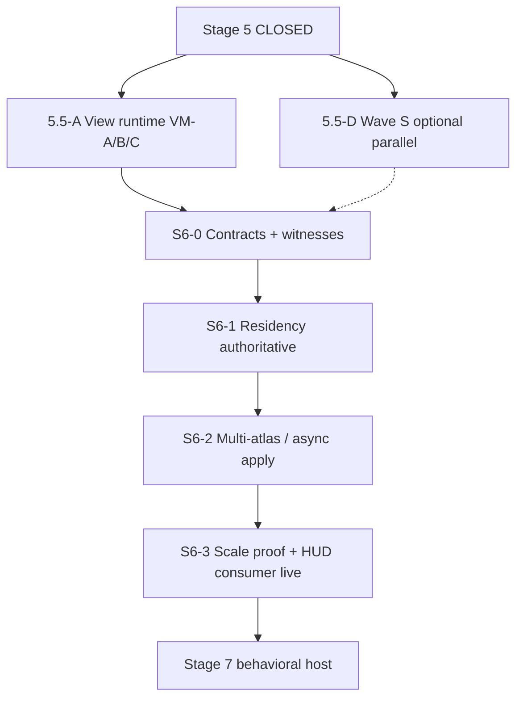

# Stage 6 — plan & design queue (open)

**Prerequisites:** [`stage5_operational_signoff.md`](stage5_operational_signoff.md) — Stage 5 **CLOSED**.  
**Bridge lane:** [`stage5_5_open.md`](stage5_5_open.md) — infrastructure hardening (recommended before S6 exit, not a repeat of FULL_APP).  
**Directive anchor:** [`prompts/guides/stage5_convergence_directive_v1.md`](../../prompts/guides/stage5_convergence_directive_v1.md) §10 — Stage 6 may proceed in parallel when work **attaches** to spine contracts; do not invent BQ thresholds in code.

---

## 1. What Stage 6 is (vs 5 / 5.5)

| Lane | Proves | Plain English |
|------|--------|---------------|
| **Stage 5 (done)** | FULL_APP spine green in running app | One fire extract, one preview authority, measurable LOD |
| **Stage 5.5** | Chosen track Done + no FULL_APP regression | VM writers, GPU tile, perf shell, Wave S, or fire depth |
| **Stage 6** | **Virtualization host** — chunk residency drives what sim/render consume | Scale world without second truth paths; ghost bands + atlas pressure |

**Stage 6 is not:** final art, Stage 7 AI, construction gameplay expansion, or “all VM tickets closed” unless explicitly scoped into S6 exit.

**Code already started (attach, don’t fork):**

| Area | Path | Role |
|------|------|------|
| Virtualization frame | `src/render/stage6_virtualization.rs` | `Stage6VirtualizationFrame`, residency window ∩ visible chunks |
| HUD consumer | `src/gui/hud/stage6_consumer.rs` | `ResidencyOverlayConsumerDto` (**BQ-134**) |
| Telemetry | `src/gui/hud/stage6_telemetry.rs`, `frame_budget_diagnostics.rs` | Budget attribution prep |
| Streaming / residency IO | `src/io/streaming/residency.rs`, `interest.rs` | Wave C ghost bands |
| Preview cull | `src/gui/editor/world_preview/gpu_preview.rs` | `intersect_visible_chunks_with_residency_window` |

**Readiness today:** `stage6_readiness_passes` requires Wave C + populated residency + projection window + atlas slots — tune exit criteria in **BQ** before tightening gates in CI.

---

## 2. Recommended program shape (planner)

**Recommendation:** Run **5.5-A (view runtime) as primary** for 2–3 cycles, **one** Wave S slice (BQ-128 or BQ-130) in parallel only if designer locks schema — avoids multiview + persistence churn during residency bring-up.

---

## 3. Phased milestones

### S6-0 — Bootstrap (1 cycle)

| Deliverable | Proof |
|-------------|--------|
| `stage6_plan_open.md` (this file) + design BQs answered | Sign-off row in §6 |
| `debug_runs/stage6_virtualization_live.json` envelope (new) | `_agent_meta` + `stage6_readiness` block |
| No new parallel `RepresentationResult` | Orchestrator authority scan 0 dup |

### S6-1 — Residency authoritative (2–4 cycles)

| Deliverable | Proof |
|-------------|--------|
| `ChunkResidencyTable` drives fire/overlay row caps via `Stage6VirtualizationFrame` (already partial) | JSON: `residency_chunk_count > 0`, cull visible in preview |
| Ghost band roles (`Core` vs `GhostBand`) visible in consumer DTO | `stage6_consumer` not `mock_*` in FULL_APP session |
| Wave C readiness green | `gather_wave_c_readiness` in live JSON |

**Contracts:** `publish_stage6_virtualization_frame` stays **after** `WorldRepresentationFrame`; consumers read frame only.

### S6-2 — Atlas & async domains (3+ cycles)

| Deliverable | Proof |
|-------------|--------|
| `PagedAtlasResidency` tied to real upload paths (terrain / overlay / utility) | `active_atlas_slots` matches GPU uploads |
| `AsyncDomainApplyQueue` drains on main thread only | TaskPool → buffer → ECS apply invariant |
| Per-view caps use `PerViewRepresentationPolicy` (from 5.5-B VM-B4) | `infrastructure_view_isolation_live.json` + stage6 JSON |

### S6-3 — Stage 6 exit gate (product-defined)

| Deliverable | Proof |
|-------------|--------|
| `stage6_readiness_passes` true in **running app** (not fixture-only) | `stage6_virtualization_live.json` |
| HUD residency panel reads **authoritative** DTO (**BQ-134** resolved) | F3 / diagnostics strip |
| FULL_APP regression | Re-run `stage5_full_app_live.json` after major spine change |

**Explicit non-goals for S6 exit:** infinite world, 3+ atlases fully optimized, Stage 7 comms — triage to Stage 7 / Track F.

---

## 4. Authority rules (coder)

**Allowed**

- Filter existing extract/upload **through** `Stage6VirtualizationFrame` / residency window.
- HUD DTOs in `stage6_consumer.rs` (display only).
- Extend `ChunkResidencyTable` and Wave C helpers.

**Not allowed**

- Second overlay field owner or duplicate fire ECS scan for HUD.
- Preview mutating sim state (Wave P invariant).
- New LOD policy outside `RepresentationResult` + projection graph.

**New-system check:** *Does residency introduce a second truth for “what chunks exist”?* If yes → residency owns membership; sim/render only consume.

---

## 5. Proof artifacts

| File | When refreshed |
|------|----------------|
| `debug_runs/stage6_virtualization_live.json` | New — each S6 cycle claiming progress |
| `debug_runs/stage5_full_app_live.json` | After S6-1/S6-2 spine-touching merges |
| `debug_runs/infrastructure_view_isolation_live.json` | Each 5.5-A / S6-2 multiview change |
| `debug_runs/fire_ecology_live.json` | Fire streaming depth (5.5-E), not S6 gate |

Wire writer: extend `debug_run_envelope.rs` `KNOWN_LIVE_PROOF_PATHS` when harness exists.

---

## 6. Design decision queue (designer + rulebook)

Resolve via **BQ row** in [`rulebook_backlog_designer_brief_v1.md`](../../docs/archive/2026-06-prompts-guides/runbooks/guides/rulebook_backlog_designer_brief_v1.md) §4 before locking thresholds in Rust.

| ID | Question | Options | Default if silent |
|----|----------|---------|-------------------|
| **DQ-S6-01** | **Entry gate:** Start S6-0 before 5.5-A VM-C exit? | A) No — 5.5-A through VM-B minimum B) Yes — S6-0 docs/witness only C) Yes — full S6-1 parallel | **B** |
| **DQ-S6-02** | **BQ-134 source of truth** for residency HUD? | A) `Stage6VirtualizationFrame` only B) `ChunkResidencyTable` direct C) New `ResidencyAuthority` resource | **A** |
| **DQ-S6-03** | **Exit “atlas active”** meaning? | A) Any slot in `PagedAtlasResidency` B) GPU upload bytes &gt; 0/frame C) Multi-atlas 2+ live | **B** for S6-3; **C** → triage |
| **DQ-S6-04** | **Ghost band UX** — show in editor? | A) Diagnostics only B) Minimap tint C) World preview outline | **A** then **B** |
| **DQ-S6-05** | **Wave S vs S6 sequencing** | A) S before S6-1 B) S6-1 before S C) Parallel with schema lock | **A** for save format; **C** for HUD layout only |
| **DQ-S6-06** | **Multiview + residency** — per-view windows? | A) Global focus chunk B) Per `ViewSurfaceId` window C) Preview only | **B** (requires 5.5-A VM-B) |
| **DQ-S6-07** | **Perf budget owner** for residency churn | A) `FrameBudgetDiagnostics.stage6` B) New perf board C) Orchestrator only | **A** |
| **DQ-S6-08** | **CI gate for Stage 6** | A) Lib tests only B) Headless readiness C) `--test visual` + JSON | **B** then **C** for exit |
| **DQ-S6-09** | **Mock consumer removal** | A) Keep mock in menu dev B) Replace at S6-1 C) Feature flag | **B** |
| **DQ-S6-10** | **Infinite / unbounded world** | A) Out of S6 B) S6 stretch C) Stage 7 | **A** |

**Wave S linkage (product):** BQ-128 (blueprint RON), BQ-130 (HUD layout), BQ-133 (shell envelope), BQ-134 (residency overlay feed) — see [`experience_layer_ux_hud_designer_brief_v1.md`](../../docs/archive/2026-06-prompts-guides/runbooks/guides/experience_layer_ux_hud_designer_brief_v1.md) §8.

---

## 7. User-visible outcomes (designer)

When Stage 6 is **done** (operational, not perfect):

1. **Editor / sim** — Only resident + ghost-band chunks participate in heavy extract/upload; preview respects residency window.
2. **Diagnostics (F3)** — Residency strip shows live counts (not mock), atlas pressure, Wave C status.
3. **Multiview** — Minimap / preview / main map do not pull full-world overlays when zoomed to tactical band (after 5.5-A).
4. **Saves / blueprints** — Wave S paths documented; no second preview truth (Wave P).

**Anti-patterns:** egui panel owning chunk membership; per-widget fire scans; `MapCameraDesired` as residency focus driver.

---

## 8. Agent routing (optimized handoffs)

| Work | Agent | First read |
|------|--------|------------|
| This plan + BQ decisions | **planner** | `stage6_plan_open.md`, directive §10 |
| HUD / multiview / BQ-128–134 | **designer** | `experience_layer_ux_hud_designer_brief_v1.md` |
| Residency frame, atlas, extract cull | **coder** | `stage6_virtualization.rs`, `gpu_preview.rs` |
| VM-06…11, viewport drift | **sim-steward** | `view_runtime_architecture_v1.md` §15 |
| Witness / authority drift | **debug-intelligence** | `stage5_full_app_live.json`, isolation JSON |
| Slice pick + queue | **orchestrator** | `cargo orchestrate --plan-slice` |
| Stuck Task subagents | **main-thread-orchestrator** | Same slice on main thread |

**Suggested first coder slice (1–2 weeks):** S6-0 + S6-1 — live `ResidencyOverlayConsumerDto` from `Stage6VirtualizationFrame`, add `stage6_virtualization_live.json` harness mirroring stage5 pattern (no new extraction).

---

## 9. Technical risks (coder)

1. **Residency vs FULL_APP** — Tight cull drops fire_inst to 0 → false regressions; gate VT-5 / fire witness policy (see `visual_run_blockers.md` VR-05).
2. **wgpu teardown** — Reuse `gpu_surface_teardown` graceful exit for any `--test stage6` visual mode.
3. **Dual focus** — `WorldRepresentationFrame.focus_chunk` vs camera pose; align in 5.5-A before per-view windows.
4. **TaskPool apply order** — Async terrain must not mutate ECS off main thread (runbook §1.5).
5. **Atlas pressure false positive** — `active_atlas_slots` / 3.0 heuristic in budget code is placeholder; BQ before CI gate.

---

## 10. First actions (this week)

See **[`stage6_active_todos.md`](stage6_active_todos.md)** — recommended start:

1. **S6-00 … S6-07** — live proof harness + `stage6_virtualization_live.json`
2. **S6-10 … S6-11** — wire HUD telemetry; remove mock residency DTO
3. **S6-12 … S6-13** — populate residency + fire visible-chunk cull
4. `cargo test -p proc_A_dine01 --lib stage6`

---

## 11. Sign-off log

| Date | Phase | Notes |
|------|-------|-------|
| 2026-05-23 | Plan opened | Post–Stage 5 §B |
| 2026-05-23 | **S6-0 DONE** | `stage6_live_proof.rs` + `KNOWN_LIVE_PROOF_PATHS`; run sim to refresh JSON |
| 2026-05-23 | **S6-1 DONE** | Residency table, fire/overlay cull, HUD chain after publish |
| 2026-05-23 | **S6-2 DONE** | GPU upload readiness, per-view windows, async apply invariant |
| 2026-05-23 | **S6-3 CLOSED** | [`stage6_operational_signoff.md`](stage6_operational_signoff.md) |

**Execution board:** [`stage6_active_todos.md`](stage6_active_todos.md) — S6-0…S6-3 complete; parallel Wave S/P/C optional.

**Status:** **CLOSED (operational)** — infrastructure depth remains in triage / Stage 5.5 backlog.
