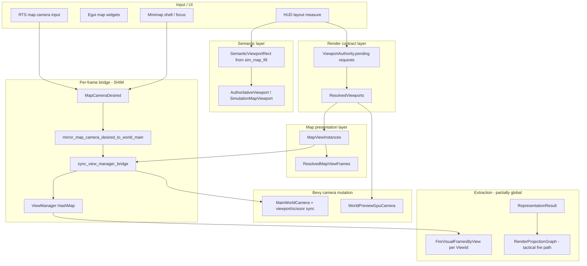
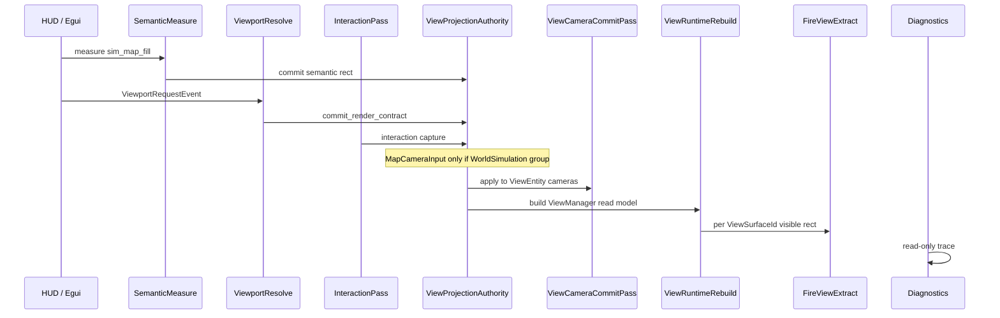

# View runtime architecture v1 — multiview isolation & authority

> **Lane:** Infrastructure hardening (VM-06…VM-11, `proj-viewport-authority`).  
> **Not** Stage 5 operational readiness / FULL_APP closure.  
> **Refs:** [`operational_readiness_vs_infrastructure_perf_v1.md`](../../prompts/guides/operational_readiness_vs_infrastructure_perf_v1.md), [`recovery_viewport.md`](recovery_viewport.md), [`construction_active_progress.md`](construction_active_progress.md), [`base_finsh_5.md`](../../prompts/guides/base_finsh_5.md).

---

## 0. Executive summary

The engine already has the **right ingredients** but they are **split across three parallel ID spaces** and **rebuilt each frame from legacy globals**:

| Today | Location | Role |
|-------|----------|------|
| `ViewId` + `ViewManager` | `src/gui/view_authority.rs` | Per-view camera, rect, policy (rebuilt by bridge) |
| `MapViewInstanceId` + `MapViewInstances` | `src/gui/map_view/` | Presentation, overlays, egui bind, interaction |
| `ResolvedViewports` | `src/render/viewport_pipeline.rs` | Committed logical/physical extents |
| Semantic sim-map hole | `src/gui/authoritative_viewport.rs` | HUD-measured tactical fill |
| Global spine | `RepresentationResult`, `RenderProjectionGraph` | World LOD + extract graph (not per-view yet) |

**Goal:** Unify under `src/render/view_runtime/` with **explicit ownership**, **four viewport layers**, and **hard isolation groups** so WorldMain, minimap, world preview, construction ghosts, and diagnostics cannot contaminate each other.

**Non-goals for this lane:** Replacing `RepresentationResult` spine, rewriting fire sim, or claiming FULL_APP is incomplete until VM rows close.

---

## 1. Architectural review (current state)

### 1.1 Data-flow today (simplified)



### 1.2 What already works (keep, harden)

- **`ViewManager` rebuild** each frame — avoids long-lived conflicting mutations (but hides who wrote inputs).
- **`ViewIsolationDiagnostics`** — lockstep heuristics (vm-06/10).
- **`ActiveMapViewInput`** — blocks main RTS input when preview/minimap focused (vm-07).
- **`ResolvedViewports`** as commit target for GPU preview + minimap panel sizing.
- **Revision-decoupled** `ResolvedMapViewFrames` for preview/minimap (anti texture churn).
- **`preview_render_contract` / `render_target_barrier`** — GPU preview lifecycle guards.
- **Map-view anti-alias tests** — `TacticalMap` must not alias `world_preview` texture.
- **Stage 5 witnesses** — `stage5_map_camera_bridge`, `viewport_authority_migration_witness.json`, `stage5_full_app_live.json`.

### 1.3 Four viewport layers (formalized target)

| Layer | Owns | Must never own |
|-------|------|----------------|
| **Semantic viewport** | Where the operator *expects* content (HUD slots, sim-map hole, panel chrome) | GPU scissor, camera matrices |
| **Render viewport** | Committed pixel extents, DPR, validity, render-target handles | World simulation state |
| **Interaction viewport** | Pointer capture, pan/zoom deltas, active surface id | Bevy `Camera` component mutation |
| **Overlay viewport** | Debug draws, construction ghosts *presentation*, diagnostics tint | Strategic simulation commits |

**Rule:** Only **one commit system** writes render viewport; only **one camera commit** writes Bevy camera state per `ViewSurface`.

---

## 2. Authority violations & coupling (inventory)

### 2.1 Critical violations (P0)

| ID | Violation | Evidence | Symptom |
|----|-----------|----------|---------|
| **V-01** | **Dual writer for WorldMain pose** | `MapCameraDesired` + `ViewManager` + `mirror_*` shim | Camera jitter, bridge drift witnesses |
| **V-02** | **Minimap shell mutates global camera** | `apply_minimap_camera_intent` → `MapCameraDesired` before bridge | Main map jumps when clicking minimap chrome |
| **V-03** | **SimulationMap shares WorldMain entity** | `sync_view_manager_bridge` sets same `camera_entity` | Cannot independently scissor/follow sim-hole vs full window without explicit policy |
| **V-04** | **Global `RepresentationResult` drives all views** | Single resource; per-view only via hints | Preview/minimap LOD/filters leak via shared band |
| **V-05** | **RenderProjectionGraph uses tactical fire only** | `tactical_fire_visual` → `WorldMain` in GPU path | Minimap/preview fire projection incorrect at extract |
| **V-06** | **Construction overlays bypass ViewId** | `phase_visual`, ghosts use `MainWorldCamera` + `SimulationMapViewport` only | Construction preview not isolated; future multiview breaks |
| **V-07** | **Shared overlay buffers** | `SharedOverlayFieldBuffers` tinted into multiple rasters | Fire heat on wrong surface |

### 2.2 Shared mutable state hotspots

| Resource | Writers | Risk |
|----------|---------|------|
| `MapCameraDesired` | RTS, minimap intent, tile fallback focus, diagnostics | Global gameplay camera truth |
| `MapViewInstances` | Presentation, `sync_editor_viewport_from_resolved` | Parallel to `ViewManager` |
| `ViewportAuthority.pending` | Many UI submitters | Cleared post-resolve; precedence unclear |
| `ViewManager` | Only bridge (OK) but **inputs** are multi-writer | Appears authoritative while sources bleed |
| `MinimapShellState` | HUD + presentation | Affects resolve + texture |

### 2.3 Shim / repair systems (migrate off)

| System | File | Replace with |
|--------|------|--------------|
| `mirror_map_camera_desired_to_world_main` | `view_authority.rs` | `ViewProjectionAuthority::commit_pose(ViewId::WorldMain, …)` |
| `sync_view_manager_bridge` | `view_authority.rs` | `ViewRuntime::rebuild_from_committed_contracts()` + event log |
| `sync_editor_viewport_from_resolved` | `viewport_pipeline.rs` | `ViewSurface::apply_resolved_extent` |
| `sync_map_follow_from_game_camera` | `tile_world_fallback.rs` | Explicit `ViewId::Minimap` follow policy resource |
| `frozen_exceeds_semantic_authority` | `viewport_layout_solver.rs` | Layout solver emits valid requests only |
| `sim_view_sync_debug` | `hud/sim_view_sync_debug.rs` | `ViewRuntimeTrace` (read-only) |

### 2.4 Systems likely causing bleed

1. **Order:** Minimap intent → `MapCameraDesired` → bridge (one frame lag if resolve after).
2. **Lockstep detection** firing when both views centered on same world origin (false positives vs real bleed).
3. **CPU shared raster** (`TileWorldFallbackState`) — same grid snapshot for minimap + sim map unless revision isolated.
4. **Egui texture bind** using stale `MapViewInstances.viewport_size` vs `ResolvedViewports`.
5. **Weather/VFX children** parented to main camera without `ViewIsolationGroup` filter.

---

## 3. Target module structure: `src/render/view_runtime/`

Unifies **contracts** (render side) with **authority** (view instances). GUI keeps egui widgets; they emit **events** only.

```text
src/render/view_runtime/
  mod.rs
  ids.rs                 # ViewSurfaceId (superset of ViewId), ViewIsolationGroup
  layers.rs              # Semantic / Render / Interaction / Overlay layer types
  surface.rs             # ViewSurface, ViewEntity (ECS), committed snapshot
  authority.rs           # ViewProjectionAuthority, sole camera writer
  projection.rs          # ViewProjectionAuthority helpers (from view_projection_authority.rs)
  isolation.rs           # ViewIsolationGroup, bleed detectors
  commit.rs              # ViewportCommitBus, merge requests → ResolvedViewports
  trace.rs               # ViewRuntimeTrace, ownership spans
  diagnostics.rs         # Extends ViewIsolationDiagnostics + proof hooks
  schedule.rs            # ViewRuntimeSystemSet ordering
  targets.rs             # ViewRenderTargetPool, per-surface caches
  passes.rs              # OverlayPass, InteractionPass markers
  plugin.rs              # ViewRuntimePlugin

src/gui/view_authority.rs          # THIN: re-export ViewId, migrate to view_runtime::ids
src/gui/map_view/                  # PRESENTATION ONLY: consumers, no camera writes
src/render/viewport_pipeline.rs    # THIN: calls view_runtime::commit
```

**Boundary rule:** `render/view_runtime` may depend on `gui` types for events, but **must not** depend on egui. `gui` submits `ViewportRequest` / `ViewInteractionEvent`.

---

## 4. Core types (definitions)

### 4.1 IDs and groups

```rust
// src/render/view_runtime/ids.rs

/// Stable surface identity (aligns with existing ViewId; room for CommanderMap, Replay, etc.).
#[derive(Debug, Clone, Copy, PartialEq, Eq, Hash)]
pub enum ViewSurfaceId {
    WorldMain,
    WorldPreview,
    Minimap,
    SimulationMap,
    /// Diagnostics-only host (no world mutation).
    DiagnosticsOverlay,
    /// Construction presentation-only host (ghosts; no commit authority).
    ConstructionPreview,
}

/// Hard isolation: systems declare which group they affect.
#[derive(Debug, Clone, Copy, PartialEq, Eq, Hash)]
pub enum ViewIsolationGroup {
    /// Tactical simulation + RTS input.
    WorldSimulation,
    /// Editor / world-gen preview panel.
    EditorPreview,
    /// Minimap chrome + follow camera.
    MinimapPresentation,
    /// HUD debug / VT / authority overlays.
    Diagnostics,
    /// Construction ghosts + build HUD (presentation only).
    ConstructionPresentation,
}

/// ECS marker: which entity is the camera for a surface (1:1).
#[derive(Component, Debug, Clone, Copy)]
pub struct ViewEntity {
    pub surface: ViewSurfaceId,
    pub group: ViewIsolationGroup,
}
```

**Mapping from today:**

| `ViewSurfaceId` | `ViewId` (today) | `MapViewInstanceId` |
|-----------------|------------------|---------------------|
| `WorldMain` | `WorldMain` | — |
| `WorldPreview` | `WorldPreview` | `WorldPreview` |
| `Minimap` | `Minimap` | `Minimap` |
| `SimulationMap` | `SimulationMap` | `SimulationMap` / `TacticalMap` |

### 4.2 `ViewSurface` — committed per-frame snapshot

```rust
// src/render/view_runtime/surface.rs

#[derive(Clone, Debug)]
pub struct ViewSurface {
    pub id: ViewSurfaceId,
    pub group: ViewIsolationGroup,
    /// Semantic layer (HUD / layout).
    pub semantic_rect: Option<SemanticViewportRect>,
    /// Render layer (GPU / egui sample).
    pub render: RenderViewportContract,
    /// Interaction layer.
    pub interaction: InteractionViewportState,
    /// Overlay layer (debug, construction draw policy).
    pub overlay: OverlayViewportPolicy,
    pub camera: ViewCameraState,
    pub render_policy: ViewRenderPolicy,
}

#[derive(Clone, Debug, Default)]
pub struct RenderViewportContract {
    pub logical_size: Vec2,
    pub physical_extent: UVec2,
    pub valid: bool,
    pub target: ViewRenderTargetDesc,
}

#[derive(Clone, Debug)]
pub enum ViewRenderTargetDesc {
    PrimaryWindowSubrect { min: Vec2, max: Vec2 },
    OffscreenImage { handle: Handle<Image> },
    None,
}
```

### 4.3 Authority: sole writers

```rust
// src/render/view_runtime/authority.rs

/// **Only** this resource may apply pose/extent to Bevy cameras and scissor rects.
#[derive(Resource, Default)]
pub struct ViewProjectionAuthority {
    pub surfaces: HashMap<ViewSurfaceId, ViewSurface>,
    pub last_commit_revision: u64,
    /// Who last wrote each surface (trace).
    pub last_writer: HashMap<ViewSurfaceId, ViewAuthorityWriter>,
}

#[derive(Clone, Copy, Debug, PartialEq, Eq)]
pub enum ViewAuthorityWriter {
    ViewportPipeline,
    MapCameraInput,
    MinimapFollow,
    PreviewPanel,
    BridgeCompat, // temporary VM-A label
}

impl ViewProjectionAuthority {
    pub fn commit_pose(&mut self, id: ViewSurfaceId, pose: ViewCameraState, writer: ViewAuthorityWriter) { /* … */ }
    pub fn commit_render_contract(&mut self, id: ViewSurfaceId, render: RenderViewportContract, writer: ViewAuthorityWriter) { /* … */ }
}
```

### 4.4 Pass markers (schedule discipline)

```rust
// src/render/view_runtime/passes.rs

/// Systems that only **read** world state and write view-local presentation.
pub struct OverlayPass;

/// Systems that route pointer input to one surface.
pub struct InteractionPass;

/// Systems that mutate Bevy Camera / RenderTarget for a ViewEntity.
pub struct ViewCameraCommitPass;
```

---

## 5. ECS components, resources, events

### 5.1 Components

| Component | Purpose |
|-----------|---------|
| `ViewEntity` | Links Bevy camera entity → `ViewSurfaceId` |
| `ViewRenderLayerMask` | Optional `RenderLayers` bit for isolation |
| `ViewSurfaceHost` | On offscreen preview root — marks GPU preview tree |

### 5.2 Resources

| Resource | Purpose |
|----------|---------|
| `ViewProjectionAuthority` | Committed surfaces (replaces ad-hoc bridge inputs) |
| `ViewRuntimeTrace` | Ring buffer of commits (read-only diagnostics) |
| `ViewRenderTargetPool` | Pooled `Image` targets per `ViewSurfaceId` |
| `PerViewRepresentationPolicy` | LOD caps, overlay bits — migrates from `PerViewLodHints` |
| `ViewIsolationReport` | Superset of `ViewIsolationDiagnostics` |

### 5.3 Events (replace hidden coupling)

```rust
#[derive(Event, Clone, Debug)]
pub struct ViewportRequestEvent {
    pub surface: ViewSurfaceId,
    pub logical_rect: Vec2,
    pub priority: u8,
}

#[derive(Event, Clone, Debug)]
pub struct ViewInteractionCapturedEvent {
    pub surface: ViewSurfaceId,
    pub group: ViewIsolationGroup,
}

#[derive(Event, Clone, Debug)]
pub struct ViewAuthorityViolationEvent {
    pub kind: ViewViolationKind,
    pub message: String,
}
```

---

## 6. Schedule & system ordering (canonical)



### `ViewRuntimeSystemSet` (Insert in `Update`)

```rust
#[derive(SystemSet, Debug, Clone, PartialEq, Eq, Hash)]
pub enum ViewRuntimeSystemSet {
    /// HUD measures → semantic rects only.
    MeasureSemantic,
    /// Merge ViewportRequestEvent → contracts.
    ResolveContracts,
    /// Pointer routing; sets ActiveSurface.
    Interaction,
    /// RTS / minimap follow → pose commits (group-gated).
    ApplyInput,
    /// Write Bevy Camera viewport + projection + scissor.
    CommitCameras,
    /// Build ViewManager + MapView frames from authority (read-only).
    PublishReadModel,
    /// Isolation heuristics + debug_assert.
    AuditIsolation,
}
```

**Ordering relative to existing sets:**

```text
PreUpdate:  (none — avoid camera fights)

Update:
  ViewRepresentationSystemSet::MeasureViewport   // existing HUD measure
  ViewRuntimeSystemSet::MeasureSemantic
  ViewportPipelineSet::Resolve                   // existing → calls view_runtime::commit
  ViewRuntimeSystemSet::ResolveContracts
  MapCameraSystemSet::ApplyInput                 // ONLY writes WorldSimulation group
  ViewRuntimeSystemSet::ApplyInput
  ViewRuntimeSystemSet::Interaction
  ViewRuntimeSystemSet::CommitCameras          // AFTER resolve
  ViewAuthoritySystemSet::RegisterViewCameras   // register entities
  ViewRuntimeSystemSet::PublishReadModel       // replaces sync_view_manager_bridge
  ViewAuthoritySystemSet::SyncViewManager       // thin read of PublishReadModel
  TileWorldFallbackAfterFireExtract
  FireVisualFrameSet::BuildProfiles
  ViewRuntimeSystemSet::AuditIsolation
  PostUpdate: map_view consumers (egui bind only)
```

---

## 7. Runtime assertions & diagnostics

### 7.1 Debug builds

```rust
fn assert_single_writer(last: Option<ViewAuthorityWriter>, writer: ViewAuthorityWriter, surface: ViewSurfaceId) {
    debug_assert!(
        last.map(|w| w == writer).unwrap_or(true),
        "ViewSurface {:?}: multiple writers in one frame ({:?} vs {:?})",
        surface, last, writer
    );
}

fn assert_preview_never_commits_world(event: &AppExit) {
    // Hook in construction commit systems:
    debug_assert!(
        !matches!(active_group(), ViewIsolationGroup::EditorPreview if world_mutation_occurred()),
        "Preview surface must not commit transport/construction/strategic state"
    );
}
```

### 7.2 `ViewIsolationReport` (extends vm-06…10)

```rust
#[derive(Resource, Default, Clone, Debug)]
pub struct ViewIsolationReport {
    pub minimap_main_lockstep_suspect: bool,
    pub preview_main_lockstep_suspect: bool,
    pub dual_writer_map_camera_desired: bool,
    pub extent_mismatch_preview: bool,
    pub extent_mismatch_minimap: bool,
    pub shared_raster_revision_coupling: bool,
    pub overlay_buffer_cross_tint: bool,
    pub violations: Vec<ViewViolationKind>,
}
```

### 7.3 Proof / witness integration

| Artifact | Content |
|----------|---------|
| `debug_runs/viewport_authority_migration_witness.json` | Extend with `view_runtime_revision`, per-surface writers |
| `debug_runs/stage5_full_app_live.json` | Add `view_isolation` block (not readiness gate) |
| `tools/orchestrator/runbooks/viewport_pipeline.md` | VM-A/B/C checklist |
| Env `VIEW_RUNTIME_AUDIT=1` | Logs `ViewRuntimeTrace` ring buffer |

**Explicit:** VM witness green **does not** flip `Stage5ReadinessProfile::FULL_APP`.

---

## 8. Per-surface isolation requirements

### 8.1 Minimap

| Requirement | Implementation |
|-------------|----------------|
| Own camera pose unless `FollowCamera` | `commit_pose(Minimap, …, MinimapFollow)` only in follow mode |
| Shell focus must not teleport main | Remove direct `MapCameraDesired` write; emit `ViewFocusEvent` scoped to group |
| Own overlay mask | `PerViewRepresentationPolicy[Minimap]` |
| Own CPU/GPU raster revision | `ViewRenderTargetPool` entry + `ResolvedMapViewFrame.revision` independent |
| Diagnostics | `minimap_main_lockstep_suspect` → hard fail if follow off and pose equal main |

### 8.2 World preview (editor)

| Requirement | Implementation |
|-------------|----------------|
| **No semantic world mutation** | All preview systems carry `ViewIsolationGroup::EditorPreview`; `deny_world_commit` lint |
| GPU target isolated | `ViewRenderTargetDesc::OffscreenImage` from pool; barrier from `render_target_barrier.rs` |
| Input captured | `ActiveMapViewInput` → `ViewInteractionCapturedEvent { surface: WorldPreview }` |
| Parity probes | Keep `preview_render_contract`, VT-4 matrix rows |
| LOD | `PerViewRepresentationPolicy[WorldPreview]` — never copy WorldMain band blindly |

### 8.3 Construction ghosts

| Requirement | Implementation |
|-------------|----------------|
| Presentation-only | `ViewSurfaceId::ConstructionPreview` — no `ViewEntity` on main sim camera |
| Draw using committed sim-hole contract | Read `ViewProjectionAuthority.get(SimulationMap).render` |
| No transport commit | Existing construction invariants + `ViewIsolationGroup::ConstructionPresentation` |
| Separate from editor preview | Distinct overlay pass after `WorldSimulation` extract |

### 8.4 Diagnostics overlay

| Requirement | Implementation |
|-------------|----------------|
| Read-only authority | Diagnostics systems cannot call `commit_pose` |
| Separate `OverlayPass` | `debug_viewport_overlay`, `viewport_authority_debug` |
| Optional separate camera | `ViewSurfaceId::DiagnosticsOverlay` with `ViewRenderTargetDesc::None` (egui only) |

---

## 9. Render targets, caches, GPU cost

### 9.1 `ViewRenderTargetPool`

```rust
#[derive(Resource)]
pub struct ViewRenderTargetPool {
    pub preview: Option<PooledTarget>,
    pub minimap: Option<PooledTarget>,
    // WorldMain uses PrimaryWindowSubrect — no pool.
}

pub struct PooledTarget {
    pub image: Handle<Image>,
    pub extent: UVec2,
    pub generation: u64,
}
```

- Resize only when `physical_extent` changes (compare `ResolvedViewport`).
- **Async-friendly:** generation counter bumps; consumers drop stale binds (already started in map_view).

### 9.2 View-local caches

| Cache | Owner surface |
|-------|----------------|
| `TileWorldFallback` raster | `SimulationMap` + optional shared read-only snapshot for minimap |
| `FireVisualFramesByView` | per `ViewSurfaceId` (existing) |
| `ViewRepresentationSnapshot` | `WorldPreview` GPU path |
| Egui texture cache | `MapViewInstanceId` (presentation) |

**Policy:** Shared snapshot is **read-only** `Arc<WorldSnapshot>`; writers require `ViewIsolationGroup::WorldSimulation`.

### 9.3 GPU cost containment

- Throttle minimap refresh rate when not visible / collapsed shell.
- Preview: pause GPU render when panel docked hidden (`preview_lifecycle.rs`).
- Per-view particle caps from `PerViewRepresentationPolicy`.
- Proof harness: `frame_perf` tags `view_runtime::*` systems separately from spine.

---

## 10. Future: multimonitor, split-screen, replay

`ViewSurfaceId` extensibility:

```rust
pub enum ViewSurfaceId {
    // … existing …
    ReplayCamera(u32),
    CinematicShot(u32),
    ExternalMonitor(u8),
    SplitScreenPane(u8),
}
```

- Each adds a `ViewEntity` + optional pooled target.
- **Input routing** uses `ViewInteractionCapturedEvent` priority stack.
- **Replay** uses read-only world snapshot; no `MapCameraDesired` path.
- **Operator panels** remote: serialize `ViewSurface` commit stream (RON), not live `MapCameraDesired`.

---

## 11. Migration strategy

### Phase VM-A — Authority freeze (1–2 cycles)

**Goal:** Stop the bleeding without big-bang refactor.

| Task | Action |
|------|--------|
| A1 | Add `src/render/view_runtime/` types + `ViewRuntimePlugin` (parallel run) |
| A2 | Route `sync_view_manager_bridge` inputs through `ViewProjectionAuthority::commit_*` with writer tags |
| A3 | Gate `apply_minimap_camera_intent` — no `MapCameraDesired`; use `commit_pose` on Minimap only |
| A4 | Extend `ViewIsolationReport` + `VIEW_RUNTIME_AUDIT=1` trace |
| A5 | Document single-writer map in `recovery_viewport.md` → this file |

**Exit criteria:** Zero `dual_writer_map_camera_desired` in audit; minimap focus no longer moves main map in harness test.

### Phase VM-B — Contract unification (2–3 cycles)

| Task | Action |
|------|--------|
| B1 | `viewport_pipeline` resolve writes only via `ViewProjectionAuthority` |
| B2 | `MapViewInstances` receives **read-only** sync from authority (delete `sync_editor_viewport_from_resolved` reverse paths) |
| B3 | Split `SimulationMap` camera from `WorldMain` entity where policy requires independent scissor |
| B4 | `PerViewRepresentationPolicy` drives fire extract caps per surface |
| B5 | `RenderProjectionGraph` accepts `ViewSurfaceId` parameter; deprecate global tactical-only path |

**Exit criteria:** `stage5_full_app_live.json` view_isolation block all suspects false in 60s sim; VT-4 rows green.

### Phase VM-C — Shim removal & hardening (2+ cycles)

| Task | Action |
|------|--------|
| C1 | Remove `mirror_map_camera_desired_to_world_main` — input commits directly to authority |
| C2 | Collapse `AuthoritativeViewport` + `ResolvedViewports` duplication into `ViewSurface` |
| C3 | Move `sim_view_sync_debug` to trace-only |
| C4 | Construction ghosts read `ViewProjectionAuthority` only |
| C5 | Pooled targets mandatory for GPU preview |
| C6 | CI: `view_runtime_isolation_tests` — lockstep, extent mismatch, preview world commit guard |

**Exit criteria:** VM-06…11 checklist in `base_finsh_5.md` appendix marked done; orchestrator witness `infrastructure_view_isolation_green.json`.

---

## 12. VM backlog mapping (base_finsh_5 / operational doc)

| Item | VM-A | VM-B | VM-C |
|------|------|------|------|
| Per-view projection helpers | ✓ | ✓ | |
| `ViewIsolationDiagnostics` | ✓ extend | ✓ | |
| Input isolation (`ActiveMapViewInput`) | ✓ | ✓ | |
| Schedule ordering (resolve before bridge) | ✓ | | |
| Minimap follow vs lockstep | ✓ | ✓ | |
| Preview GPU parity | | ✓ | ✓ |
| Per-view fire extract | | ✓ | ✓ |
| Global `MapCameraDesired` sweep | ✓ | | ✓ |
| Overlay bitfields per surface | ✓ | ✓ | |
| Construction isolation | ✓ policy | | ✓ |

---

## 13. Code example — Bevy 0.18 camera commit (sketch)

```rust
fn commit_view_camera(
    id: ViewSurfaceId,
    surface: &ViewSurface,
    cameras: &mut Query<(&ViewEntity, &mut Camera, &mut Transform)>,
) {
    let Some((view_entity, mut camera, mut transform)) = cameras
        .iter_mut()
        .find(|(ve, _, _)| ve.surface == id)
    else {
        return;
    };

    match &surface.render.target {
        ViewRenderTargetDesc::PrimaryWindowSubrect { min, max } => {
            camera.viewport = Some(Viewport {
                physical_position: UVec2::new(min.x as u32, min.y as u32),
                physical_size: UVec2::new(
                    (max.x - min.x).max(1.0) as u32,
                    (max.y - min.y).max(1.0) as u32,
                ),
                ..default()
            });
        }
        ViewRenderTargetDesc::OffscreenImage { handle } => {
            camera.target = RenderTarget::Image(handle.clone());
            camera.viewport = None;
        }
        ViewRenderTargetDesc::None => {
            camera.is_active = false;
        }
    }

    // Pose: orthographic tactical — use surface.camera
    transform.translation = surface.camera.translation.extend(0.0);
    // … projection matrix from zoom + aspect …
}
```

---

## 14. Invariants (write on `view_runtime` module)

1. **Preview never commits world** — strategic/transport/construction commits check `ViewIsolationGroup`.
2. **One writer per surface per frame** per concern (pose vs extent).
3. **Diagnostics read-only** — cannot mutate `ViewProjectionAuthority`.
4. **ViewManager is a read model** — rebuilt from authority, not written by gameplay.
5. **RepresentationResult** has one builder; per-view differences only via `PerViewRepresentationPolicy`.
6. **FULL_APP green does not imply VM green** — separate proof artifacts.

---

## 15. Immediate next implementation PR (suggested)

1. Land `view_runtime/{ids,surface,authority,trace,plugin}.rs` (types + trace only).
2. Wire `ViewRuntimePlugin` after `ViewportPipelinePlugin`.
3. Implement VM-A2 + VM-A3 (writer tags + minimap focus fix).
4. Add `debug_runs/infrastructure_view_isolation_live.json` witness.
5. Update [`construction_active_progress.md`](construction_active_progress.md) with VM-A exit criteria.

---

## 16. Per-ViewId `RepresentationResult` policy (INFRA-N03 stub)

| ViewId / surface | Overlay slice | Fire field | Construction phase tiles | Notes |
|------------------|---------------|------------|--------------------------|-------|
| `WorldMain` | Full spine | Tactical chunk overlay | CPU egui labels today; GPU via overlay channel when slice lands | Authoritative sim-map |
| `WorldPreview` | Read-only subset | Inherited from spine, no separate extract | Ghost footprint only | No commit |
| `Minimap` | Minimap raster | None | None | `ViewIsolationGroup::Minimap` |
| `Diagnostics` | Trace overlays | None | None | Read-only authority |

**Rule:** One `RepresentationResult` builder; per-view differences only through `PerViewRepresentationPolicy` — no parallel extract stacks.

## 17. Per-view fire projection (INFRA-N02 next step)

Today fire tactical overlay is resolved through the main projection graph (`WorldMain`). **Next:** bind `FireVisualFrame` upload to `ViewProjectionAuthority::surface_for(ViewId)` so minimap/preview do not inherit WorldMain-only UV bias.

**Proof target:** extend `infrastructure_view_isolation_live.json` with per-view fire mismatch counters = 0.

---

*This document supersedes ad-hoc viewport notes in `recovery_viewport.md` §target architecture for implementation planning; historical diagnosis in that file remains valid.*
