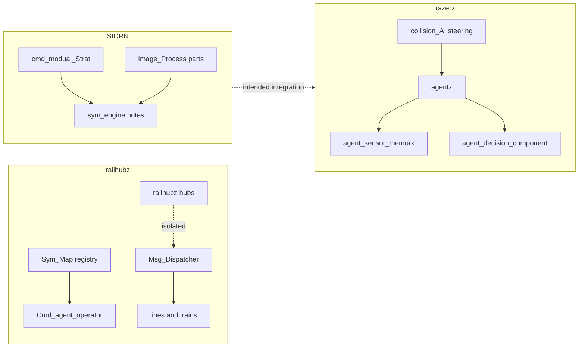

# Legacy C++ repos — agents, communication, maps (v1)

**Status:** reference archive + **behavioral extraction bridge** (read-only C++ trees → Stage-6/7 Rust architecture).  
**Scope:** `C:\dev\github\railhubz-master`, `C:\dev\github\razerz-master`, `C:\dev\github\SIDRN-master`.  
**Use:** Mine **behavioral architecture** (communication topology, belief divergence, utility masks, command layers) — not legacy implementation details or a line-by-line port checklist.

**Companions (this repo):** [`base_behav_a.md`](base_behav_a.md), [`base_ai_runbook_draft.md`](base_ai_runbook_draft.md), [`logistics_ai_runbook_v1.md`](logistics_ai_runbook_v1.md), [`strategic_fields_and_ai_orchestrator_v1.md`](strategic_fields_and_ai_orchestrator_v1.md), [`map_editor_runbook_v1.md`](map_editor_runbook_v1.md), [`ecs_systems_schedule_runbook_v1.md`](ecs_systems_schedule_runbook_v1.md), [`base_visual_world_representation_v1.md`](base_visual_world_representation_v1.md), [`backlog_serialization_preview_streaming_runbook_v1.md`](backlog_serialization_preview_streaming_runbook_v1.md).

---

## 1. How the three trees relate

| Repo | Primary simulation role | Strongest pull for Rust work |
|------|-------------------------|------------------------------|
| **railhubz** | Hub / line / train entities; **command agent** dispatch; **telegram** bus | Delayed messaging, hub isolation, registry + factory spawn, path tables |
| **razerz** | OpenGL **agent** loop: perception memory, decision tallies, collision steering | Belief/error metrics, encounter memory, steering as behavior output |
| **SIDRN** | Strategic **cmd** stack, sym-engine notes, **image** segmentation / utility maps | UI command taxonomy, hashed asset tables, color-keyed hit/role maps, UML sketches |

Only **SIDRN** READMEs name **razerz** explicitly (`sym_engine0.01_shirz/sub_sytemz/readME.md` points at the moved `razerz` repo). **railhubz** and **razerz** do not cross-reference each other in source.



---

## 2. railhubz-master

### 2.1 Files worth opening first

| Path | Role |
|------|------|
| `source/libs/system_org.hpp`, `system_org.cpp` | Singleton **Sym_Map**: hubs, rail entities, path vector, factories |
| `source/libs/Cmd_agent_v3Operaor.hpp`, `.cpp` | **Command agent**: priority queue of `(train*, line*, float)` dispatch candidates |
| `source/libs/msg_dispatcher.hpp`, `.cpp` | Global **telegram** queue; delayed send hook |
| `source/libs/telagram.h` | Message envelope: time, sender, receiver, priority, `msg_cmdz`, `void*` payload |
| `source/libs/msg_cmdz.h` | Small command enum for line/train protocol |
| `source/libs/Base_TSym_entity.hpp` | Entity base: `Handle_telagram`, `update`, typed id |
| `source/libs/factoryz.hpp` | `entity_factory` / `trainz_factory` / `R_line_factory` + controller |
| `source/libs/railhubz.hpp`, `.cpp` | Hub object (storage, lines; **not** on message bus by design) |
| `source/libs/Defined_train_path.hpp` | Hard-coded / registered path strings between hubs |
| `source/config_trainz.xml` | XML-driven load (paired with `parser.hpp`) |
| `etcz/otherstuff/Vrt_baseState.h` | SFML **state** interface (`handleEvent`, `update`, `render`) |
| `etcz/symlop.h`, `B_sTree.h`, `routing.h` | Design-adjacent routing / tree notes |
| `readme.md`, `OLDfilez/outline.txt` | Hub BST storage, security isolation narrative |
| `OLDfilez/base_class_and_functions_railHuhbz_v0.2/` | Earlier `Cmd_agent_v2`, `Sym_Map`, entity tests |

**Images / markup:** none found (no PNG/JPG/SVG/UML in tree). Design is headers + `etcz/` + `OLDfilez/outline.txt`.

### 2.2 Snippets (verified on disk)

**Telegram envelope and priority ordering** (`source/libs/telagram.h`):

```cpp
struct telagram {
  std::chrono::steady_clock::time_point trazmission_t;
  int sender;
  int receiver;
  float priority;
  msg_cmdz msg;
  void* Other_data;
};
// operator< breaks ties on priority, then transmission time
```

**Line/train command vocabulary** (`source/libs/msg_cmdz.h`):

```cpp
enum class msg_cmdz {
  NULLCMD, enter_line, exit_line, report_status, halt_cmd, move_cmd
};
```

**Dispatcher intent** (comment at top of `source/libs/msg_dispatcher.hpp`):

- Singleton today; author notes **separate bus instances** per domain (lines/trains vs hubs).
- **Delayed transmit** planned for signaling / staggered halt — not wired for trains yet.

**Entity handles messages** (`source/libs/Base_TSym_entity.hpp`):

```cpp
virtual bool Handle_telagram(const telagram& tela) { return false; }
```

**Command agent queue** (`source/libs/Cmd_agent_v3Operaor.hpp`):

```cpp
typedef std::tuple<trainz*, R_linez*, float> train_tuple;
using P_que_trainz = std::priority_queue<
  train_tuple, std::vector<train_tuple>, decltype(&train_tuple_comparor)>;
void scan_hubs_for_dispatch_cadiates();
void dispatchtrain();
```

**Registry surface** (`source/libs/system_org.hpp`):

```cpp
void Register_hubz(railhubz* newhubz);
void Register_rail_entity(Base_TSym_entity* newentity);
void registar_pathz(std::vector<std::string>& str_pathz);
void activate_factory(std::string to_make);
```

**Hub security / map storage idea** (`OLDfilez/outline.txt`):

- Hubs **do not trust** the shared message service — separate storage (BST for trains at station).
- Lines keep hub pointers; **Cmd_agent** must reach hub train queues for dispatch.

**Application state machine sketch** (`etcz/otherstuff/Vrt_baseState.h`):

```cpp
virtual void handleEvent(sf::Event e) = 0;
virtual void handleInput() = 0;
virtual void update(sf::Time deltaTime) = 0;
virtual void render(sf::RenderTarget& renderer);
```

### 2.3 Ideas to pull into Rust

- **Split comms planes:** strategic orders vs local physics vs hub inventory — match [`logistics_ai_runbook_v1.md`](logistics_ai_runbook_v1.md) corridor priority without one global event bus.
- **Telegram as ECS event:** map `sender`/`receiver` to entity ids; `priority` + scheduled `trazmission_t` → tick-stamped `MessageQueue` resource; replace `void*` with typed `enum` + small payload struct.
- **Command agent as system:** `scan_hubs` → collect candidates → `priority_queue` by ETA/cost → emit dispatch intents (fits strategic AI orchestrator, not render).
- **Factory registry:** `activate_factory("train")` parallels spawn templates / scenario loaders — keep [`world_assets_tools_rulebook_v1.md`](world_assets_tools_rulebook_v1.md) ownership rules.
- **Path table:** `Defined_train_path` + `construct_pathz` → named corridor keys in transport snapshot / map editor graphs.
- **FSM:** `Vrt_baseState` is UI/sim mode switching only; do not confuse with unit AI — use for app modes (editor vs run) if needed.

---

## 3. razerz-master

### 3.1 Files worth opening first

| Path | Role |
|------|------|
| `engine_openGL/source/modualz/agentz/agenz_lib.hpp` | **agentz** facade: vision scan, control list, board attachment |
| `engine_openGL/source/modualz/agentz/agent_decision_component.hpp` | Damage / intel error / control-list **decision memory** |
| `engine_openGL/source/modualz/agentz/agent_sensor_memorx.hpp`, `.cpp` | Per-target **memoryx_rec** (spotting times, comm range, comrade stats) |
| `engine_openGL/source/modualz/agentz/formaion_mangt.hpp` | Formation slot assignment (incomplete sketch) |
| `engine_openGL/source/modualz/phyziz/collision_AI.hpp`, `.cpp` | **Steering** obstacle avoidance (not strategic AI) |
| `engine_openGL/source/modualz/committee/simula_entity.hpp` | Simulation entity + physics mesh container |
| `engine_openGL/source/modualz/committee/telagraphie.hpp` | Naming suggests signaling (open for comm patterns) |
| `engine_openGL/source/MCP_cmd/*` | Engine command / resource listeners (`readme.md` lists écouterions, pipeline CMD) |
| `landingz_0.02/MCP_cmd/landingz_engine.hpp` | Parallel MCP stack for landingz tool |
| `landingz_0.02/graphicz/soild_state_data.hpp` | Solid-state **data** naming (not gameplay FSM) |
| `engine_openGL/source/ttestz/sysm_test.cpp` | System module test harness |
| `shaderzglsl/modelz/vertex_ai_model_A.glsl`, `frag_ai_model_A.glsl` | **Rendering** shaders for “ai_model” mesh — not behavior AI |

**Images / markup:** no design PNG/JPG/SVG; `data_extrn/` is mesh/material assets.

### 3.2 Snippets (verified on disk)

**Agent composition** (`agenz_lib.hpp`):

```cpp
agent_sensor_memorx<agentz*, double>* senz_memrx;
agent_decision_component<agentz*> agent_dis_comp;
void scan_proccedure_incomeing();
void update_agent_visionz();
void scan_other(agentz* other_ptr_agnztz);
```

**Intel vs known count** (`agent_decision_component.hpp`):

```cpp
size_t diffrence_in_user_known(size_t& total_shipz) {
  memorx.intel_eror = static_cast<double>(
    total_shipz - memorx.Usr_ship_count - get_unit_id_map_size() - get_ctl_list_size());
  return (total_shipz - memorx.Usr_ship_count - get_unit_id_map_size() - get_ctl_list_size());
}
```

**Encounter record** (`agent_sensor_memorx.hpp`):

```cpp
struct memoryx_rec {
  double last_time_spotted;
  double last_time_visible;
  int known_uint_count;
  double comm_range;
  bool visual_range;
  cmmrad_statuz comrad_statuz; // danger / ambivalent / like_ability
  std::vector<std::tuple<int*, rcd_dam, rcd_avg_cmradre>> prev_incouter_vec;
};
```

**Steering output** (`collision_AI.hpp`):

```cpp
class obstacle_avodance : public kinematic_variable_behav {
  steering_output get_steering() {
    glm::vec3 ray = glm::normalize(agent.velocity) * look_ahead;
    collision_enity collision = detector.get_collision(agent.staticz.pos, ray);
    // ...
  }
};
```

### 3.3 Ideas to pull into Rust

- **Belief gap metric:** `intel_eror` → fog-of-war / order uncertainty in [`base_behav_a.md`](base_behav_a.md) perception step (distorted view before decision scoring).
- **memoryx_rec map:** keyed by `Entity` or faction id; decay `last_time_visible`; feed overlay intel layers in [`strategic_overlay_runbook_v1.md`](strategic_overlay_runbook_v1.md).
- **Comrade triad** (`danger`, `like_ability`, `ambivalents`): lightweight relationship scalars instead of full diplomacy sim early on.
- **Separate steering from strategy:** port **collision_AI** ideas only to local movement / convoy pathing; keep strategic routing in logistics/transport systems.
- **MCP_cmd:** pattern of resource listeners + command pipeline → align with engine plugin stages in [`ecs_systems_schedule_runbook_v1.md`](ecs_systems_schedule_runbook_v1.md), not a second game loop.

---

## 4. SIDRN-master

### 4.1 Files worth opening first

| Path | Role |
|------|------|
| `README.md` | Top-level: sym_engine, image pipeline, **cmd_modual_Strat**, agent image cmd protocol notes |
| `sym_engine0.01_shirz/readME.md`, `sub_sytemz/readME.md` | Engine folder map; **razerz** moved out |
| `sym_engine0.01_shirz/sub_sytemz/libz_andNotez/enetiy_models_anddesign_cocnepts.h` | Long-form vehicle / ORBAT design notes |
| `sym_engine0.01_shirz/sub_sytemz/libz_andNotez/classmodelsforSIRNfriesymz` | RGB **role legend** + munitions/inventory sketches |
| `sym_engine0.01_shirz/sub_sytemz/libz_andNotez/sharz_engine_loop.h` | Engine loop notes |
| `sym_engine0.01_shirz/notez/noteagentz` | Stub: `agent_spc_awarness`, `set_path_storage()` |
| `sym_engine0.01_shirz/notez/img_scan_specs.rd` | Image scan specification notes |
| `cmd_modual_Strat_/source/cmd_managerz.hpp` | `dep_cmd` hierarchy, `hash_tablez`, texture/asset command nodes |
| `cmd_modual_Strat_/source/define_typedef_cmdz_.h` | DI message tags, **button_graphic_statez** enum |
| `cmd_modual_Strat_/source/cmd_buttonz.hpp`, `image_layar_cmd.hpp`, `path_rez.hpp` | UI command wiring |
| `Image_Process parts/Refc_vison/*` | Mean-shift segmentation, pixel features, scan tooling |
| `Image_Process parts/reforcor_image_PMG_PROCZ/read.md` | PGM filter/mask pipeline notes |
| `Image_Process parts/BInarY_imag_anlizer_G/*` | Binary image analyzer experiments |

### 4.2 Images and markup (verified)

| Path | Kind | Usefulness |
|------|------|------------|
| `cmd_modual_Strat_/GUI_cmd_sidrn_UML.mdj` | StarUML / UML JSON | **Cmd module** class relationships — open in UML tool |
| `cmd_modual_Strat_/Models/battleship_flower_rendermodelz.mdj` | StarUML | Render / model structure sketch |
| `Image_Process parts/Refc_vison/tools_for_imagescanz/gamebasicV0.1.mdj` | StarUML | Early game / scan flow diagram |
| `cmd_modual_Strat_/assents/MBT_hit_utility_map*.ppm` | PPM utility maps | **Hit / vulnerability** regions on vehicle silhouettes |
| `cmd_modual_Strat_/assents/apc_hit_mapuitly_top0.1.ppm` | PPM | APC top utility |
| `cmd_modual_Strat_/assents2_tarianz/smaspaceize.ppm`, `smaspaceize2.ppm` | PPM | Strategic **space** layout experiments |
| `cmd_modual_Strat_/assents2_tarianz/road__1EW.ppm` | PPM | Road mask / map fragment |
| `cmd_modual_Strat_/assents2_tarianz/refgl_rendeing` | Extensionless asset | Referenced render notes (open locally) |
| `cmd_modual_Strat_/loose image and bits/facotyII.ppm` | PPM | Factory / industrial layout bit |
| `Image_Process parts/Refc_vison/cmd_coven_text_01.ppm` | PPM | Command / convention text raster |
| `cmd_modual_Strat_/source/GUI/oklz/baz_o1.ppm`–`baz_o4.ppm` | PPM | UI workspace layers (likely not sim design) |
| `cmd_modual_Strat_/source/GUI/*_buttonz_*.ppm` | PPM | Button skins — **UI chrome only** |
| `cmd_modual_Strat_/assents/MBT_hit_utility_map*.png` (paired with `.ppm`) | PNG export | Same hit/utility masks as PPM siblings |
| `cmd_modual_Strat_/assents/apc_hit_mapuitly_top0.1.png` | PNG | APC top utility export |
| `cmd_modual_Strat_/assents2_tarianz/*.xcf` | GIMP source | Authoring masters for theater maps, roads, vehicles, `smaspaceize` |
| `Image_Process parts/Refc_vison/cmd_coven_text_01.png` | PNG | Convention text export (paired with `.ppm`) |
| `Image_Process parts/Refc_vison/output/*_outim.ppm` | PPM | Pipeline **outputs** — regression references, not source of truth |

**railhubz** and **razerz** have **no** project-authored PNG design sheets for behavior (razerz PNGs are mostly **textures**, **captures**, and **landingz** UI). **SIDRN** does ship **PNG exports** beside PPM for several hit/utility masks. **Hit-map / subsystem layout art** is primarily **PPM/PGM** plus **`.xcf`** sources — easy to misremember as PNG-only. Treat those rasters plus the RGB legend in `classmodelsforSIRNfriesymz` as the authoritative **mask vocabulary**, not runtime-loaded bitmaps.

#### Hit-map and subsystem-mask design (PPM, not PNG)

These assets encode **per-subsystem regions** on silhouettes or strategic layouts (damage, vulnerability, role channels). Pair with [`map_editor_runbook_v1.md`](map_editor_runbook_v1.md), [`strategic_overlay_runbook_v1.md`](strategic_overlay_runbook_v1.md), [`world_assets_tools_rulebook_v1.md`](world_assets_tools_rulebook_v1.md), and §8.6 below.

| Asset group | Paths | Subsystem / design concept |
|-------------|-------|----------------------------|
| Vehicle hit / utility | `cmd_modual_Strat_/assents/MBT_hit_utility_map0.1.ppm`, `MBT_hit_utility_map_side0.1.ppm`, `MBT_hit_utilitymap_top_0.1.ppm`, `MBT_hit_utility_map_front_0.1.ppm`, `apc_hit_mapuitly_top0.1.ppm` | **Orthographic utility masks** per facing; color regions imply subsystem class (see RGB legend) |
| Strategic space | `assents2_tarianz/smaspaceize.ppm`, `smaspaceize2.ppm` | Macro **layout / influence** experiments |
| Infrastructure | `assents2_tarianz/road__1EW.ppm`, `loose image and bits/facotyII.ppm` | **Corridor / industrial** mask fragments |
| Convention raster | `Image_Process parts/Refc_vison/cmd_coven_text_01.ppm` | Text-as-mask for **cmd naming** conventions (authoring only) |
| Pipeline fixtures | `reforcor_image_PMG_PROCZ/libs_modfied/*.pgm`, `Refc_vison/output/*_outim.ppm` | Filter/mask **test outputs** — not subsystem source of truth |

**Situation:** masks were authored offline; sim would **sample channel id at UV / grid cell**, not parse PPM at runtime in the legacy tree. **Syntax to preserve:** stable `UtilityChannel` or role enum + serialized legend (RON registry per `AGENTS.md`), not ad hoc RGB in gameplay code.

**Low value for behavior bridge:** `cmd_modual_Strat_/source/GUI/*_buttonz_*.ppm`, `oklz/baz_o*.ppm` — UI chrome only ([`gui_runbook_v1.md`](gui_runbook_v1.md)).

**DI / command tags** (`cmd_modual_Strat_/source/define_typedef_cmdz_.h`):

```cpp
#define DI_RESPONCE 'R'
#define DI_GREETINGS 'G'
#define DI_QUESTION 'Q'
#define DI_CMD_EXCUT 'x'

enum button_graphic_statez {
  BUTTON_MOUSE_OFF, BUTTON_MOUSE_HOVER, BUTTON_MOUSE_DOWN, BUTTON_MOUSE_POST_DOWN
};
```

**Command department base** (`cmd_managerz.hpp`):

```cpp
class dep_cmd {
 protected:
  dep_cmd* self_prt_department_cmd;
};
template<class type_hashed>
class hash_tablez {
  std::unordered_map<size_t, type_hashed*> map_hash_table;
  type_hashed* return_hashed_entity(int ID_entity);
};
```

**RGB role legend for maps / models** (`classmodelsforSIRNfriesymz`):

```text
{74,74,255} = Radio
{201,231,110} = Armor_med01
{255,255,0} = Engine
{255,43,0} = firepoint
{255,0,255} = tracks
```

**Agent awareness stub** (`sym_engine0.01_shirz/notez/noteagentz`):

```text
agent_spc_awarness::
void set_path_storage()
```

### 4.4 Ideas to pull into Rust

- **Color-keyed utility maps:** PPM legends → map editor **mask channels** (armor, engine, weapon) for damage / targeting sim — pair with [`map_editor_runbook_v1.md`](map_editor_runbook_v1.md) and hybrid snapshots (RON on disk per `AGENTS.md`).
- **UML `.mdj`:** extract class names and cmd hierarchy into designer briefs; do not runtime-load MDJ.
- **hash_tablez:** wstring/name → id maps for **asset cmd** tables; in Rust prefer stable string ids + `AssetServer` / registry crates.
- **button_graphic_statez:** UI FSM only — map to egui widget state in [`gui_runbook_v1.md`](gui_runbook_v1.md), not unit behavior.
- **Image_Process pipeline:** mean-shift / binary analyzer → offline tooling for **procedural mask authoring**, not hot-path gameplay unless budgeted in sim expansion orchestrator.
- **PostgreSQL / CLI security narrative** (`README.md`): inspiration for **privilege-separated** command APIs (read-only tuples vs write cmd) when exposing HTTP/CLI to sim state.

---

## 5. Consolidated porting lens (Rust engine)

| Legacy pattern | Suggested Rust home | Companion runbook |
|----------------|--------------------|--------------------|
| `Msg_Dispatcher` + `telagram` | `MessageBus` / `EventWriter` with delay queue + priority | `ecs_systems_schedule_runbook_v1.md` |
| Hub-isolated storage | Separate components: `HubInventory` vs `LineSignaling` | `logistics_ai_runbook_v1.md` |
| `Cmd_agent_operator` priority queue | Strategic dispatch system over transport graph | `strategic_fields_and_ai_orchestrator_v1.md` |
| `Sym_Map` + factories | World registry resource + typed spawn factories | `world_assets_tools_rulebook_v1.md` |
| `agent_sensor_memorx` | `AgentMemory` component map + decay | `base_behav_a.md` § perception |
| `agent_decision_component` intel error | Belief vs ground-truth delta before intent scoring | `base_ai_runbook_draft.md` |
| `collision_AI` steering | Local movement / physics layer only | transport / nav runbooks |
| PPM / RGB utility maps | Editor mask layers + serialized RON registries | `map_editor_runbook_v1.md`, `AGENTS.md` |
| `Vrt_baseState` | App state plugin (menu / sim / editor) | `gui_runbook_v1.md` |

**Do not port verbatim:** singleton globals (`instance()`), `void*` telegram payloads, unchecked `delete[]` in `hash_tablez::destory_entry`, incomplete formation header, conflating shader `ai_model` with AI logic.

---

## 6. Secondary mention files (grep / name hits)

Use when tracing evolution or duplicate experiments — not required reading for v1 ports.

- **railhubz:** `source/libs/msg_dispatcher.cpp`, `drivers.*`, `rail_trainz.hpp`, `OLDfilez/cmd_agent_sorce/*`, `OLDfilez/test/Sym_Map.*`, `etcz/otherstuff/test_nov12_msg_entiy.cpp`
- **razerz:** `engine_openGL/source/modualz/milieu/*`, `phyziz/pysic_lib.*`, `level_builder/smape_Ed.*`, `landingz_0.02/landingz_modual/landingz_sql_db_cmd.cpp`
- **SIDRN:** `sym_engine0.01_shirz/sub_sytemz/_outdated_build_workfolder/*`, `sym_engine0.01_shirz/test_modualz/*`, `cmd_modual_Strat_/source/di_testz_main.cpp`, `Image_Process parts/Refc_vison/Incmp_refrences etc/notezzz.h`

---

## 7. Verification note

Paths and snippets in §2–§4 were checked against the on-disk trees (May 2026). Re-verify before large ports; `OLDfilez/` and `_outdated_build_workfolder/` are **not** authoritative builds.

---

## 8. Behavioral extraction bridge → Stage-6 / Stage-7

**Product locks (MVP, gates, ownership):** [`stage7_behavioral_world_designer_brief_v1.md`](stage7_behavioral_world_designer_brief_v1.md) — **BQ-114+** in [`rulebook_backlog_designer_brief_v1.md`](rulebook_backlog_designer_brief_v1.md) §4.

This section records **how** legacy material feeds the Rust engine — independent of §2–§4 file inventory. Valuable assets are **topology and separation**, not singleton managers, raw pointers, or hard-coded global buses.

### 8.1 Missing layer in the current spine

The engine already locks **representation authority**, **GPU field authority**, **overlay authority**, **snapshot cadence**, and **extraction discipline** (see [`base_visual_world_representation_v1.md`](base_visual_world_representation_v1.md)). It does **not** yet unify a single **behavior / command / communications domain graph**.

§1–§7 are **source material** for that graph. The highest-value extraction is **separation of communication planes** (hub vs line vs command), not transliteration of C++ types.

### 8.2 Roadmap placement

| Phase | Relationship to this guide |
|-------|----------------------------|
| **Stage-5 exit** | Representation + GPU spine + VT discipline stable enough to attach behavioral consumers |
| **Wave S / P / C** | Serialization, preview, chunk streaming ([`backlog_serialization_preview_streaming_runbook_v1.md`](backlog_serialization_preview_streaming_runbook_v1.md)) — **prerequisites** for streamable comms and belief fields |
| **Stage-6 virtualization** | Chunk residency, stable representation graph, async domains — **host** for plane-scoped message routing and utility-field LOD |
| **Stage-7 behavioral world graph** | Full activation: comms, command hierarchy, belief, utility maps, strategic AI, delayed dispatch |

```text
Stage-5 exits
    → Wave S / P / C
    → Stage-6 virtualization
    → Stage-7 behavioral world graph
```

Stage-7 is the mega-phase where §8.3–§8.8 concepts **fully** activate; Stage-6 may carry **typed contracts and stubs** only.

### 8.3 Multi-plane communications (first-class runtime)

Legacy railhubz already treats **hub**, **line**, and **command** as distinct systems (hub storage isolated from `Msg_Dispatcher`; `Cmd_agent_operator` on `Sym_Map`). Promote that to a **first-class** model so comms are streamable and LOD-scalable like overlays.

**Recommended shape (contract, not implemented):**

```rust
#[derive(Debug, Clone, Copy, PartialEq, Eq, Hash)]
pub enum CommunicationPlane {
    TacticalLine,
    StrategicCommand,
    LogisticsHub,
    SensorRelay,
    Civilian,
}

pub struct CommunicationMessage {
    pub id: MessageId,
    pub plane: CommunicationPlane,
    pub priority: MessagePriority,
    pub source: Entity,
    pub target: Entity,
    pub dispatch_tick: SimStepStamp,
    pub payload: MessagePayload,
}
```

**Integrates with:** representation resolution, streaming, LOD, AI, fog of war, command delay, logistics — each plane can subscribe, filter, and degrade independently.

### 8.4 Telegram queue → ECS dispatch (highest-value pattern)

`Msg_Dispatcher` + `telagram` map cleanly to **resource-owned**, **typed**, **tick-stamped** queues — not a global singleton or `void*` payloads.

**Recommended shape:**

```rust
#[derive(Resource, Default)]
pub struct MessageDispatchQueue {
    pub immediate: VecDeque<DispatchMessage>,
    pub delayed: BinaryHeap<QueuedDispatch>,
}
```

**Rules:** domain routing per `CommunicationPlane`; `SimStepStamp` fences; no global dispatcher ownership.

**Backbone for:** command lag, radio disruption, signal interception, fog-of-war latency, delayed logistics, AI misunderstanding, sensor uncertainty — aligned with **belief-gap** metrics (§8.5) and [`base_behav_a.md`](base_behav_a.md) perception.

### 8.5 Belief-gap simulation (world truth ≠ belief ≠ command picture)

`agent_sensor_memorx`, encounter memory, and `intel_eror` must **not** collapse into a generic blackboard. Preserve three layers: **world truth**, **agent belief**, **shared command picture**.

**Recommended shape:**

```rust
pub struct AgentBeliefState {
    pub known_entities: HashMap<EntityId, BeliefRecord>,
    pub stale_after: SimStepStamp,
    pub confidence: f32,
}

pub struct StrategicIntelField {
    pub command_estimates: SparseGrid<IntelEstimate>,
}
```

**Yields:** uncertainty, misidentification, stale intel, communication lag — without fake randomness.

### 8.6 Utility / RGB map channels

SIDRN PPM masks and RGB role legends (§4.2–§4.3) are **authoring** inputs for editor and sim utility fields — threat, logistics, visibility, settlement weighting, road planning, resource desirability.

**Recommended shape:**

```rust
pub enum UtilityChannel {
    Threat,
    Logistics,
    Visibility,
    Moisture,
    Heat,
    Settlement,
}

pub struct UtilityFieldLayer {
    pub channel: UtilityChannel,
    pub texture: Handle<Image>,
}
```

**Fits:** existing GPU overlay field system ([`base_visual_world_representation_v1.md`](base_visual_world_representation_v1.md)), partial dirty uploads, multi-atlas future, representation graph — strengthens Stage-6 virtualization rather than a parallel paint path.

### 8.7 Tactical vs strategic AI (permanent separation)

`collision_AI` is **local steering**; `Cmd_agent_operator` is **strategic dispatch**. Never merge.

| Layer | Owns |
|-------|------|
| **Tactical / local** | Avoidance, crowd flow, formation spacing, local path correction, vehicle collision |
| **Strategic** | Goals, task assignment, command hierarchy, supply planning, threat analysis, territorial intent |

**Pipeline:** `MovementIntent` → `LocalSteeringSolver` → physics / movement. Strategic AI emits **intent**, not movement vectors.

### 8.8 `Vrt_baseState` → application mode only

Use for **runtime mode orchestration**, not unit gameplay AI: editor, sim pause, replay, debug overlays, loading, benchmark, streaming gates.

**Recommended shape:**

```rust
#[derive(States, Debug, Clone, Eq, PartialEq, Hash)]
pub enum RuntimeMode {
    MainMenu,
    LoadingWorld,
    Running,
    Paused,
    Editor,
    Replay,
}
```

Pair with [`gui_runbook_v1.md`](gui_runbook_v1.md) and [`ecs_systems_schedule_runbook_v1.md`](ecs_systems_schedule_runbook_v1.md).

### 8.9 Stage-7 candidate domains

When Stage-7 opens, track explicit domains (each with runbook or matrix row before wide implementation):

- Communications and plane routing
- Command hierarchy
- Belief simulation and intel fields
- Utility maps and mask authoring
- Strategic AI and faction planning
- Sensor fusion
- Delayed dispatch
- Regional influence
- Mission orchestration

### 8.10 Agent memory / recall (razerz contracts only)

No separate “memory simulator” binary in these repos. Runnable recall logic is largely **missing** (`agent_sensor_memorx.cpp` is a stub). Useful **concepts** for Stage-7 belief work:

| Legacy surface | Path | Concept | Runbook hook |
|----------------|------|---------|----------------|
| Per-contact record | `razerz-master/.../agent_sensor_memorx.hpp` — `memoryx_rec` | Staleness timestamps, `comm_range` / `visual_range`, `cmmrad_statuz`, `prev_incouter_vec` encounter history | [`base_behav_a.md`](base_behav_a.md), §8.5 |
| Recent detections | same — `list_recent_detected`, `make_new_rec_IFNOTPREZ` | Working-set recall vs full contact map | [`strategic_overlay_runbook_v1.md`](strategic_overlay_runbook_v1.md) |
| Belief gap | `.../agent_decision_component.hpp` — `intel_eror`, `memorx.lost_at_SEA` | Reported vs tracked force count; loss tallies | [`base_ai_runbook_draft.md`](base_ai_runbook_draft.md), [`ai_operational_warfare_runbook_v1.md`](ai_operational_warfare_runbook_v1.md) |
| Vision hooks | `.../agenz_lib.hpp` — `update_agent_visionz`, `scan_other` | Scan cadence placeholders | [`strategic_fields_and_ai_orchestrator_v1.md`](strategic_fields_and_ai_orchestrator_v1.md) |

**Draft only (do not treat as implemented):** `SIDRN-master/.../notez/noteagentz`, `Refc_vison/Incmp_refrences etc/notezzz.h` (`base_agent_0_03`), `img_scan_specs.rd` (spatial scan math, not encounter memory).

### 8.11 Extraction summary

| Pull forward | Leave behind |
|--------------|--------------|
| Communication topology, plane separation | Singleton `instance()` buses |
| Belief divergence, delayed dispatch | `void*` telegram payloads |
| Utility masks, command layers | Legacy inheritance trees |
| Tactical vs strategic separation | Hard-coded global ownership |
| Tick-stamped typed message queues | Shader `ai_model` as behavior AI |

---

## 9. Completeness audit (all paths, all depths)

§1–§8 prioritize **behavior / command / comms / maps**. This section records **every file** found on disk (May 2026) and what was **not** lifted into §2–§8.

### 9.1 Counts

| Repo | Files (recursive) | Full path list |
|------|-------------------|----------------|
| `railhubz-master` | 191 | [`_legacy_railhubz_file_inventory.txt`](_legacy_railhubz_file_inventory.txt) |
| `SIDRN-master` | 248 | [`_legacy_sidrn_file_inventory.txt`](_legacy_sidrn_file_inventory.txt) |
| `razerz-master` | 2038 | [`_legacy_razerz_file_inventory.txt`](_legacy_razerz_file_inventory.txt) (657 paths; excludes `3rd_party`, `CMakeFiles`, `buils2`/`build`, VMA HTML docs) |

**Total:** 2477 files. Companion lists are **one relative path per line** under `prompts/guides/`.

### 9.2 Extraction status legend

| Status | Meaning |
|--------|---------|
| **A** | Architectural idea captured in §2–§8 or linked runbooks |
| **I** | Inventoried only — open locally; no design extraction in this guide |
| **X** | Artifact — build output, cache, binary, lock file, coursework PDF, or duplicate legacy copy |

### 9.3 `railhubz-master` (191 files)

| Area | Paths (representative) | Status | Notes |
|------|------------------------|--------|-------|
| Canonical sim | `source/libs/*`, `source/main_test_01.cpp`, `source/config_trainz.xml` | **A** | §2 |
| Tests / profiling | `source/testz/**`, `source/testz/unit_tests/*` | **I** | Parser and gprof outputs |
| Design scratch | `etcz/**` (`routing.h`, `B_sTree.h`, `Lin_signal.h`, `vector_math.h`, `pathsuff.h`, `copystringexmpl.hpp`, `otherstuff/*`) | **I** | `Vrt_baseState.h`, `symlop.h` partially **A** (§2, §8.8); `monitor.cpp` is threading wrapper, not sim monitor |
| Legacy archives | `OLDfilez/**` | **I** / **X** | Parallel `Sym_Map`, `Cmd_agent`, entity tests; **`odlervs/sorces_oldbits/Map_graph.h`**, `graph_node_types.h`, `graph_funcz.h` — graph/path experiments not in §2 |
| Build / IDE | `obj/**`, `binaries/**`, `.cache/clangd/**`, `.vscode/**`, `Makefile`, `make_test.mk`, `compile_commands.json` | **X** | |
| Docs | `readme.md`, `OLDfilez/outline.txt` | **A** | §2 |

### 9.4 `SIDRN-master` (248 files)

| Area | Paths (representative) | Status | Notes |
|------|------------------------|--------|-------|
| Strategic cmd module | `cmd_modual_Strat_/source/**`, `exmaplz/car.cpp`, `GUI_cmd_sidrn_UML.mdj`, `Models/**` | **A** / **I** | §4; `image_layar_cmd.hpp`, `path_rez.hpp`, `Dialog.hpp`, `UI_kontrolUNIT.hpp` inventoried, not extracted |
| Hit / map art | `cmd_modual_Strat_/assents/**`, `assents2_tarianz/**`, `loose image and bits/**` | **A** | §4.2 — **PNG + PPM + XCF** |
| Image pipeline | `Image_Process parts/BInarY_imag_anlizer_G/**`, `Refc_vison/**`, `reforcor_image_PMG_PROCZ/**` | **I** | Mean-shift, PGM filters, histogram refs; `Assignment #02 CS.pdf` is **X** |
| Sym engine | `sym_engine0.01_shirz/sub_sytemz/**`, `notez/**`, `test_modualz/**`, `binary_tests/**` | **I** | USB/curve/clock tests; `modelz/*.png`, `Images of tests/*.png`, `SIDRN_HUD_Overview_0_2.png` — HUD / framework sketches |
| Root loose | `README.md`, `disociruz_en_condiallaughi_.hpp`, `tabz.hpp`, `img141.jpg`, `loc_map_cmd`, `preformnacre scrtipingz`, `sda` | **I** | |

### 9.5 `razerz-master` (2038 files)

| Top area | ~Files | Status | Notes |
|----------|--------|--------|-------|
| `landingz_0.02/` | 968 | **I** | GUI, SQLite, MMF, MCP; mostly tooling + vendored GL/STB |
| `engine_openGL/` | 400 | **A** / **I** | §3 — `modualz/agentz`, `committee`, `phyziz`, `MCP_cmd`; `oubaoun_razzwer/**` is older mirror |
| `vulkan_modual_01.01/` | 342 | **I** / **X** | Renderer spike + VMA docs |
| `Images_captures_&old_data/` | 108 | **I** | Screenshots / captures, not sim specs |
| `3rd_party/` | 70 | **X** | Taskflow, etc. |
| `data_extrn/` | 68 | **I** | OBJ/PLY/Blend/texture lists — art pipeline, not behavior |
| `shaderzglsl/` | 32 | **I** | Includes `*ai_model*` shaders (rendering) |
| `engine_SDL_opengl/`, `vulkan_modual_01.02/`, `level_builder/` | 42 | **I** | Alternate entry points / editor bits |

### 9.6 Gaps vs §2–§8 (worth opening if scope widens)

- **railhubz:** `drivers.*` (init loop), `R_linez.cpp` / `trainz.cpp` / `railhubz.cpp` line physics, `parser.*` + XML, `mathz.hpp`, OLD **graph** headers (`Map_graph.h`, …).
- **razerz:** `simula_entity.hpp` contact flags, `milieu/*` particles, `committee/shadowz.hpp`, `formaion_mangt.hpp` (broken), `geometry/terrain.hpp`, `landingz` SQL/MMF, `level_builder/*`.
- **SIDRN:** full **Mean_shifts** / binary analyzer sources, `enetiy_models_anddesign_cocnepts.h` ORBAT prose, `sym_engine` **modelz** PNG framework diagrams, `reorz_img/2d_colourplane_map.png`, root HUD PNG.

### 9.7 Maintenance

Re-run a recursive file listing after large pulls from upstream; diff against the three `_*_file_inventory.txt` companions. Do not treat **X** rows or vendored trees as migration sources without a new extraction pass.
