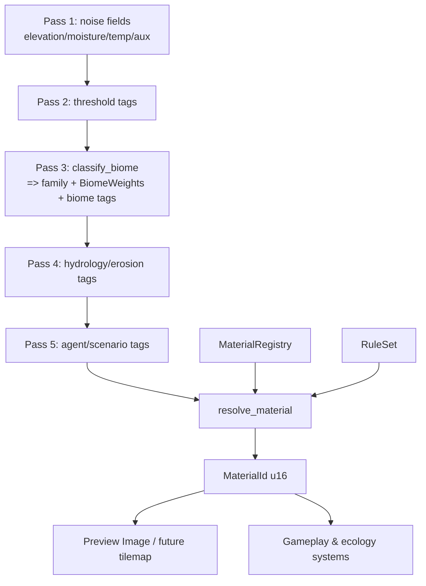

# Material registry, tag set, and rule resolver — unified terrain data model `v1`

**Audience:** designers + engineers unifying the proposed material/tag/rule system with the existing biome / world-gen stack so there is **one** canonical chain from noise to render/sim — no parallel data models.

**Paired implementation matrix:** [`../../matrix/terrain_biome/material_unification_matrix_v1.md`](../../matrix/terrain_biome/material_unification_matrix_v1.md)
**Pair with:** [`composite_style_worldgen_v1.md`](composite_style_worldgen_v1.md) (layered fields + preview), [`chunks_streaming_v1.md`](chunks_streaming_v1.md), [`hydrology_v1.md`](hydrology_v1.md), [`tile_sprites_v1.md`](tile_sprites_v1.md), **[`ontology/README.md`](ontology/README.md)** (facts vs interpretations — vocabulary, mobility matrix, derived metrics).

**Code touchpoints (verify with `rg`):**

- [`src/terrain/biome.rs`](../../../src/terrain/biome.rs) — `TerrainClass` (16 variants), `BiomeId`, `BiomeWeights`, `TerrainSurfaceMix`, `TileEnvironmentProfile`, `BiomeClassification`, `BiomeTuning`, `classify_biome`
- [`src/terrain/ecology.rs`](../../../src/terrain/ecology.rs) — `FloraType`, `CropType`, `FlowerType`, `EcologicalSuitability`
- [`src/terrain/generation/world_generator_enhanced.rs`](../../../src/terrain/generation/world_generator_enhanced.rs) — `WorldGenParams`, `Height`, `Moisture`, `Temperature`, `TerrainType`, `WORLD_GEN_TUNING_JSON_PATH`
- [`src/terrain/generation/tuning_io.rs`](../../../src/terrain/generation/tuning_io.rs) — `WorldGenTuningOverlay`
- [`src/gui/editor/world_preview.rs`](../../../src/gui/editor/world_preview.rs) — `WorldPreviewTexture`, `update_world_preview_texture`

---

## 1. Goal & non-goals

**Goal.** A single expandable + reliable + performant chain:

```
noise fields  →  ChunkCellMatrix (SoA)  →  multi-pass tagging  →  resolver  →  MaterialId  →  preview / sim
```

with all designer-tunable knobs in versioned, hot-reloadable files and **no hardcoded gameplay constants in code**.

**Non-goals (this doc).**

- Replacing the existing `TerrainClass` enum — kept verbatim as the **family** label.
- Replacing `WorldGenTuningOverlay` JSON — sits beside the new files.
- Adopting `bevy_ecs_tilemap` — captured as deferred decision in the matrix.

---

## 2. Concept map (no duplicates)

| Concept | Type today | Role in unified design |
|:---|:---|:---|
| **Material family** (gameplay-relevant macro class) | `TerrainClass` (16 variants) — kept | Compile-time exhaustive enum; aliased as `MaterialFamily` |
| **Material variant** (specific tile look/behavior) | *(new)* `MaterialId(u16)` | Runtime id assigned by `MaterialRegistry`; many per family |
| **Soft biome blend** | `BiomeWeights`, `BiomeId` — kept | Soft input to resolver |
| **Per-tile soil/eco profile** | `TileEnvironmentProfile`, `EcologicalSuitability` — kept | Soft input + downstream gameplay |
| **Threshold tuning** | `BiomeTuning` (in `world_gen_tuning.json`) — kept | Drives pass-2 tag derivation |
| **Tag** (semantic descriptor) | *(new)* `TagId(u16)` | Interned via `TagRegistry`; `TagSet` bitset per cell |
| **Rule** (tag-driven material pick) | *(new)* `MaterialRule` | Loaded from `material_rules.ron` |
| **Per-chunk grid** | *(new)* `ChunkCellMatrix` (SoA) | Replaces ad-hoc per-tile `Vec`s; one struct per chunk |
| **Materialized chunk** | *(new)* `MaterializedChunk { materials: Vec<MaterialId> }` | Component on chunk entity |

> Naming guard: the user-proposed name "MigrationMatrix" collides with `prompts/matrix/` (engine migration matrices). The unified type is **`ChunkCellMatrix`**.

---

## 3. Pipeline (multi-pass)

1. **Pass 1 — Fields:** existing `generate_world` writes `elevation/moisture/temperature` + warp/detail noise into a `ChunkCellMatrix` (SoA: `Vec<f32>` per channel + tag bitset slab).
2. **Pass 2 — Threshold tags:** designer-tuned thresholds from `world_gen_tuning.json` (`biome_tuning` + new `tag_tuning` section 📎) push tags such as `lowland`, `wet`, `hot`, `dry`, `cold`, `coastal`. **No magic numbers in code.**
3. **Pass 3 — Biome / family:** call existing [`classify_biome`](../../../src/terrain/biome.rs) → writes `BiomeWeights` + `MaterialFamily` (= `TerrainClass`) **and** adds the canonical biome tags (`marine`, `coastal`, `boreal`, `arid`, `temperate`, `wetland`, `alpine`).
4. **Pass 4 — Hydrology / erosion (later):** when [`hydrology_v1.md`](hydrology_v1.md) lands, push `flooded`, `eroded`, `silted`. Pass exists as a stub now so callers don't reshuffle later.
5. **Pass 5 — Agent / scenario overlay:** scenario authors and LLM agents can stamp tags (`spawn_zone`, `protected`, `noise_dampened`) — agent-write authority **📎 §47**.
6. **Materialize:** for each cell, `resolve_material(family, weights, tag_set, &rules, &registry) → MaterialId`; written to `MaterializedChunk.materials`. The existing `WorldPreviewTexture` (and any future tilemap / GPU path) reads this.



---

## 4. Anchor types (proposed for follow-up implementation)

> No code is added in this doc; types listed so designers and the matrix can refer to consistent names.

```rust
// Compile-time family, kept = TerrainClass (16 variants in src/terrain/biome.rs).
pub type MaterialFamily = crate::terrain::biome::TerrainClass;

// Runtime variant id; loaded from material_registry.json.
#[derive(Clone, Copy, Eq, PartialEq, Hash, Serialize, Deserialize)]
pub struct MaterialId(pub u16);

#[derive(Clone, Debug, Serialize, Deserialize)]
pub struct MaterialDef {
    pub name: String,                // stable across saves
    pub family: MaterialFamily,      // referenced as TerrainClass enum string
    pub tags: Vec<String>,           // resolved to TagId at load
    pub properties: MaterialProperties,
    pub preview_color: [u8; 4],
}

pub struct MaterialRegistry { /* name → MaterialId, schema_version: u32 */ }

#[derive(Clone, Copy, Eq, PartialEq, Hash, Serialize, Deserialize)]
pub struct TagId(pub u16);

pub struct TagRegistry { /* name → TagId, categories */ }
pub type TagSet = /* bitset, width = N rounded to power of two, capped */;

#[derive(Clone, Debug, Deserialize)]
pub struct MaterialRule {
    pub required: Vec<String>,
    pub forbidden: Vec<String>,
    pub family_filter: Option<MaterialFamily>,
    pub weight_predicate: Option<BiomeWeightFilter>,
    pub result: String,              // MaterialDef.name
    pub priority: u32,
    // implicit `rule_index` from file order for deterministic tie-break
}

pub struct ChunkCellMatrix {
    pub coord: ChunkCoord,
    // SoA — one Vec per field, length = CHUNK_SIZE * CHUNK_SIZE
    pub elevation: Vec<f32>,
    pub moisture: Vec<f32>,
    pub temperature: Vec<f32>,
    pub aux: Vec<f32>,
    pub weights: Vec<BiomeWeights>,
    pub family: Vec<MaterialFamily>,
    pub tags: Vec<TagSet>,
    pub materials: Vec<MaterialId>,  // empty until Materialize pass
}
```

**Resolver contract:**

```rust
pub fn resolve_material(
    family: MaterialFamily,
    weights: &BiomeWeights,
    tags: TagSet,
    rules: &RuleSet,
    registry: &MaterialRegistry,
) -> MaterialId
```

- O(rules) per cell with rules pre-sorted (priority desc, file-index asc).
- Optional memoization key `(family, tag_set, quantize8(weights))` for hot loops.
- Fallback: registry-declared **family default**, never a silent `MaterialId(0)`.

### 4.1 `properties` — namespaces (schema v2+)

`MaterialDef.properties` is **opaque JSON** in code (`serde_json::Value`). **`material_registry.example.json` uses `schema_version: 2`** and **dot-separated namespaces** so mods, AI context, and migrations stay unambiguous.

**Required namespace prefixes (v1 convention):**

| Prefix | Meaning | Example keys |
|:---|:---|:---|
| `facts.*` | Stable substrate / material facts (strings or numbers) | `facts.surface`, `facts.hydrology`, `facts.rock_hardness` |
| `sim.*` | Numeric knobs for simulation interpretation (not verdicts) | `sim.traction_mod`, `sim.water_retention`, `sim.erosion_rate` |
| `render.*` | Presentation-only hints | *(reserved — e.g. tint weight)* |
| `gen.*` | Generator / procedural authoring | *(reserved)* |
| `mobility.*` | Authoring hints consumed by mobility profiles / cost assembly | *(reserved — prefer facts + rules first)* |
| `build.*` | Structural / bearing hints for construction systems | `build.support_capacity` |
| `warfare.*` | Exposure / cover hints for combat / recon | `warfare.concealment` |

| Avoid | Instead |
|:---|:---|
| Unprefixed keys (`friction`, `hardness`, …) in **new** authoring | Prefer the table above; keep legacy only until migrated. |
| `buildable`, `mineable` | **Interpretations**. Use fact **tags** (`mineral_rich`, `hard_surface`, …) and let systems decide. See [`ontology/fact_vocabulary_rulebook_v1.md`](ontology/fact_vocabulary_rulebook_v1.md). |

**Code access (recommended):** Prefer **small `MaterialDef` helpers** (`sim_f32`, `facts_str`, `build_f32`, …) that **prefix the namespace** internally — avoid scattering raw `properties["sim.traction_mod"]` lookups (typo risk, migration pain, ambiguous AI context). Prompt examples in chat/docs are **illustrative**; evolve toward **typed / enum keys** when the schema stabilizes.

**Derived metrics (not in `properties`):** chunk-local [`ChunkDerivedMetrics`](../../../src/terrain/generation/derived.rs) (`slope_grade`, …) — see [`ontology/derived_metric_pipeline_v1.md`](ontology/derived_metric_pipeline_v1.md).

---

## 5. On-disk layout (hybrid format, hot-reloadable)

| File | Format | Purpose |
|:---|:---|:---|
| `assets/config/terrain/material_registry.json` | JSON | List of `MaterialDef` (designer table) |
| `assets/config/terrain/tag_registry.json` | JSON | Interned tag table + categories (soil / water / structural / agent) |
| `assets/config/terrain/material_rules.ron` | RON | DSL: required / forbidden / family_filter / weight_predicate / result / priority |
| `assets/config/world_gen_tuning.json` (existing) | JSON | `noise_sampling` + `biome_tuning`; will gain `tag_tuning` section 📎 |
| `*.example.*` siblings | committed | Editor seeds (per asset-tools workflow `06`/`07`) |

Format choice rationale (see [bevy_asset_config_migration_matrix_v1.md](../../matrix/assets/bevy_asset_config_migration_matrix_v1.md) and [serialization_hybrid_migration_matrix_v1.md](../../matrix/serialization/serialization_hybrid_migration_matrix_v1.md)):

- **JSON** for flat designer-edited tables (Materials, Tags) — matches asset editor habits and `world_gen_tuning.json`.
- **RON** for the rule DSL — supports comments, tagged enums, nested predicates, and aligns with the locked direction "move away from pure JSON for hand-edited heavy data".
- **One canonical chain:** Bevy `AssetServer` watches all three; F8 panel + asset editor only **edit files** (no parallel reload buttons that desync).

---

## 6. Determinism, saves & versioning

- **Deterministic chunk hash:** `hash(world_seed, chunk_xy, registry_version, rules_version, tuning_version)`. Pair [`implementation_questions_v1.md`](implementation_questions_v1.md) **§33–§34**.
- **Saves store names, not ids.** `MaterialDef.name` and `TagRegistry` names are the wire format; remap to `MaterialId` / `TagId` on load. Registry edits cannot alias old saves.
- **Schema version field** on each file (`schema_version: u32`) — bump on breaking edits; loader rejects unknown versions and points at a migration. Pair [`serialization_hybrid_migration_matrix_v1.md`](../../matrix/serialization/serialization_hybrid_migration_matrix_v1.md).
- **Rule tie-break:** strict — priority desc, then file-index asc. Document in matrix.

---

## 7. Preview & UI integration

- **Existing preview** ([`world_preview.rs`](../../../src/gui/editor/world_preview.rs)) reads ECS tile components. With `MaterializedChunk`, the color path becomes `MaterialId → MaterialDef.preview_color` — no per-class hardcoded RGBA in code.
- **Tag overlay mode** (new `PreviewMode::Tag(TagId)`) — single-tag mask for designer / agent debugging.
- **Field overlay modes** (existing `Height`/`Moisture`/`Temperature`/`Biome`/`Regions`) — unchanged.
- **Direct-sample preview** (matrix `composite_style_preview_integration_matrix_v1.md` **P3**) reads `ChunkCellMatrix` directly without spawning entities.

---

## 8. Hot reload story

- One asset chain via Bevy `AssetServer`:
  - `Assets<MaterialRegistry>`
  - `Assets<TagRegistry>`
  - `Assets<RuleSet>`
  - existing `Assets<WorldGenTuning>` (overlay)
- On file change → registry/tags/rules versions bump → all chunks marked dirty → next frame reruns **Materialize** (not regeneration of fields). Cheap because the cell matrix is preserved.
- F8 egui panel and the asset editor only **read/write files**. The "Reload tuning" button stays as a manual fallback for sandboxes without a watcher.

---

## 9. Asset editor coupling

[`tools_ui/spec/08_world_gen_desktop_tool_v1.md`](../tools_ui/spec/08_world_gen_desktop_tool_v1.md) documents **Materials**, **Tags**, and **Rules** as separate sidebar pages: `src/utils/asset_tools/src/pages/terrain_registry_pages.py` (committed; engine `AssetLoader` still **Pending** per matrix **U3**).

---

## 10. Open designer questions (📎)

Feed answers back into [`implementation_questions_v1.md`](implementation_questions_v1.md) **§ Material / tag / rule unification** (items **42–78**) and the non-binding brainstorm [`procedural_world_pipeline_reference_outline_v1.md`](procedural_world_pipeline_reference_outline_v1.md).

| # | Topic |
|:---:|:---|
| 42 | **Registry size cap** — max materials, max tags (drives `TagSet` width and `MaterialId` reservation strategy). |
| 43 | **`TagSet` representation** — fixed-size bitset (`u128` / `[u64; N]`) vs `SmallVec<TagId>`. Trade-off: O(1) set ops vs flexible cap. |
| 44 | **Rule cache** — quantize `BiomeWeights` to 8-bit buckets for memo? Acceptable error vs cache hit rate. |
| 45 | **Save policy** — name-only on wire (recommended) vs name + id pair for fast load. |
| 46 | **`family_filter`** — required on every rule, or optional with implicit "any family"? |
| 47 | **Agent write authority** — which tags can the LLM/scenario layer add or remove at runtime; which are read-only outputs of pass 3? |
| 48 | **`weight_predicate` schema** — JSON-able subset (e.g. `{biome: "Boreal", min: 0.6}`) vs full expression DSL. |

---

## Cross-links

- Layer-stack narrative: [`composite_style_worldgen_v1.md`](composite_style_worldgen_v1.md)
- Preview integration: [`../../matrix/terrain_biome/composite_style_preview_integration_matrix_v1.md`](../../matrix/terrain_biome/composite_style_preview_integration_matrix_v1.md)
- Primary biome matrix: [`../../matrix/terrain_biome/terrain_biome_migration_matrix_v1.md`](../../matrix/terrain_biome/terrain_biome_migration_matrix_v1.md)
- Pipeline stub: [`spec/01_world_generation_pipeline.md`](spec/01_world_generation_pipeline.md)
- Asset format direction: [`../../matrix/assets/bevy_asset_config_migration_matrix_v1.md`](../../matrix/assets/bevy_asset_config_migration_matrix_v1.md)
- Save format direction: [`../../matrix/serialization/serialization_hybrid_migration_matrix_v1.md`](../../matrix/serialization/serialization_hybrid_migration_matrix_v1.md)
- Asset editor world-gen page: [`../tools_ui/spec/08_world_gen_desktop_tool_v1.md`](../tools_ui/spec/08_world_gen_desktop_tool_v1.md)
- Outline brainstorm (non-authoritative): [`procedural_world_pipeline_reference_outline_v1.md`](procedural_world_pipeline_reference_outline_v1.md)
- **Rust execution runbook (U3–U7):** [`../../guides/terrain_unification_runbook_v1.md`](../../guides/terrain_unification_runbook_v1.md) + step packs at [`../../matrix/terrain_biome/runbook/`](../../matrix/terrain_biome/runbook/README.md)
- **Paired Bevy asset runbook (terrain registries):** [`../../guides/bevy_asset_terrain_runbook_v1.md`](../../guides/bevy_asset_terrain_runbook_v1.md) + [`../../matrix/assets/runbook/`](../../matrix/assets/runbook/README.md)
- **On-disk index:** [`../../../assets/config/terrain/README.md`](../../../assets/config/terrain/README.md)
