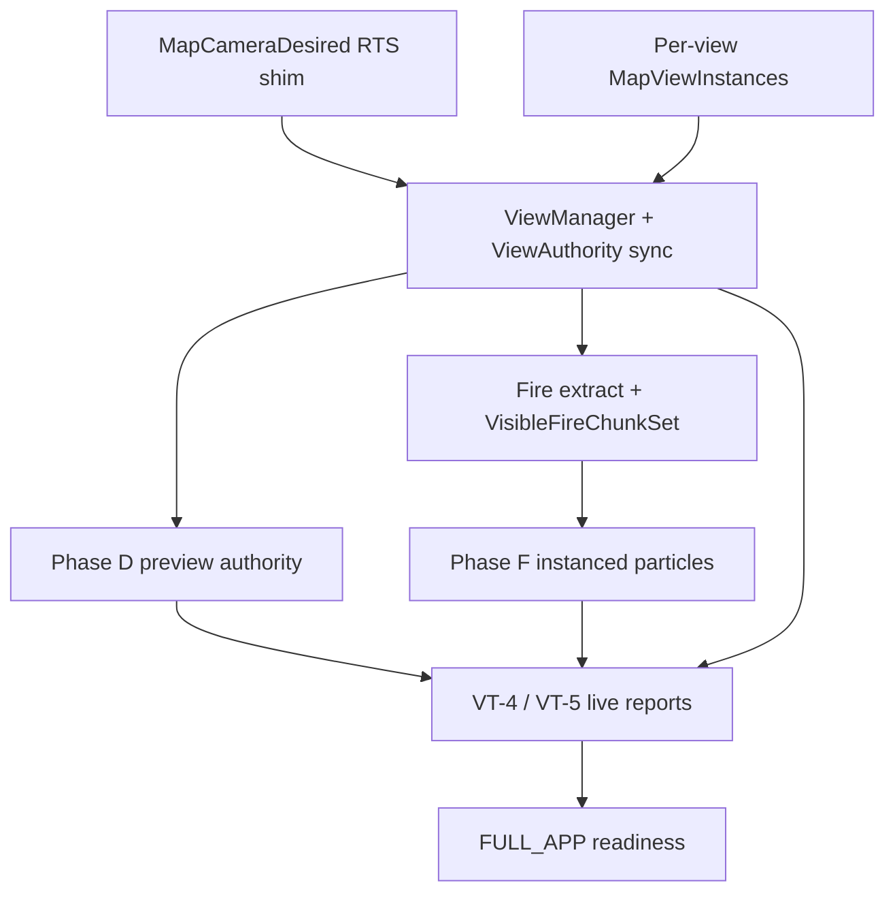

# STAGE 5 EXIT COMPLETION DIRECTIVE — NO NEW PARALLEL SYSTEMS

> **Gate split (2026-05-22):** Operational closure = [`docs/archive/2026-06-src-dev/plans/stage5_close_checklist.md`](../../docs/archive/2026-06-src-dev/plans/stage5_close_checklist.md) only. Items in this doc that are VM / fire-streaming / GPU-tile / deep parity are **deferred** to [`src/dev/stage5_triage_backlog.md`](../../src/dev/stage5_triage_backlog.md) unless they regress FULL_APP.

You are working inside the proc_A_dine01 Stage 5 convergence architecture.

READ FIRST:
- AGENTS.md
- base_visual_dev01_plan_status.md
- base_visual_dev01_roadmap_next.md
- representation_governance.rs
- stage5_readiness.rs

The project already has:
- Representation spine
- Projection graph scaffolding
- GPU registry/upload paths
- Fire simulation extraction split
- Partial ViewManager migration
- GPU tile debug upload path
- Stage5 readiness reporting
- VT harness infrastructure

The project does NOT yet satisfy the actual Stage 5 exit condition.

The ONLY success criteria is:

```rust
Stage5ReadinessProfile::FULL_APP

remaining green in the running app with:

stable projections
isolated views
preview parity
minimap correctness
GPU draw path
LOD transitions
fire visibility
no duplicate authority systems
no fallback CPU rebuild dependency where prohibited

DO NOT:

add parallel representation systems
add second fire extraction paths
add alternative camera truth
add temporary “hack” overlays
add new global camera resources
add duplicate minimap authority
add per-subsystem LOD logic

ALL NEW WORK MUST:

attach to RepresentationResult
attach to RenderProjectionGraph
attach to ViewManager/ViewId authority
attach to existing GPU registry paths
preserve Stage 5 convergence
========================================================
PRIMARY OBJECTIVE

Create and complete the remaining TODOS required to exit Stage 5 FULL_APP readiness.

The work must focus ONLY on convergence and finalization.

Use:

AppStage5ReadinessReport
stage5_readiness_passes
FULL_APP diagnostics
as the authoritative backlog ordering.
========================================================
CURRENT KNOWN MAJOR GAPS
1. VIEW ISOLATION / VIEW AUTHORITY

Current issue:

minimap still bleeds into main world
preview still shares semantics
filters affect unrelated views
projections still partially infer from globals

Required final state:

ALL camera/input/projection/filter state keyed by ViewId
NO remaining global MapCameraDesired authority
NO shared minimap/main-world semantics unless explicitly linked
ALL world_to_screen / screen_to_world routed through ViewProjectionAuthority
ALL viewport rects sourced from ViewInstance.viewport_rect
ALL overlays/filter state isolated per-view

Required TODOs:

vm-06
vm-07
vm-08
vm-09
vm-10
vm-11
proj-viewport-authority final audit

Add diagnostics proving:

minimap projection independent
preview projection independent
filter isolation
per-view zoom isolation
no cross-view mutation

========================================================

2. GPU TILE DEBUG FINALIZATION

========================================================

Current state:

storage buffer upload exists
CPU mesh expansion still active

This is NOT considered complete.

Required final state:

one instanced GPU draw
storage-buffer driven
no CPU-expanded debug mesh generation
true ViewId-aware overlay rendering

Required architecture:

SpecializedRenderPipeline
RenderCommand
custom render phase OR ViewNode
TILE_DEBUG_INSTANCES_BUFFER authoritative

Required TODO:

gpu-tile-wgpu-instance-final

WGSL must read:

@group(1) @binding(0)
var<storage, read> instances

Debug visualization MUST include distinct colors:

focused chunk
active chunk
visible chunk
sleeping chunk
streamed chunk
fire-active chunk
neighbor/rim activated chunk
stale projection chunk

Overlay MUST align with:

map projection
viewport rect
render scaling
world bounds

No giant incorrect debug squares.
No screen-space drift.
No fallback projection assumptions.

========================================================

3. FIRE VISIBILITY + CHUNK RUNTIME

========================================================

Current state:

FireChunkRuntime exists
ActiveFireChunkSet exists
VisibleFireChunkSet partially stubbed
CPU simulation still authoritative

Required final state BEFORE full GPU sim:

per-view visible fire extraction
chunk streaming runtime
proper LOD policy
no full-world fire scans

Required TODOs:

fire-view-extract-final
fire-active-chunk-runtime-final
fire-visible-lod-policy
fire-streaming-policy
fire-overlay-debug

VisibleFireChunkSet must derive ONLY from:

ViewProjectionAuthority
frustum/world bounds
ViewId policy
LOD radius

NO camera-global shortcuts.

========================================================

4. FIRE LOD POLICY

========================================================

Implement explicit visual tiers:

Strategic:

heat haze only

Operational:

smoke only

Tactical:

smoke + low flame

Local:

full flame particles

Cinematic:

turbulence + embers

LOD MUST ONLY affect:

visual extraction
particle density
update cadence
shader complexity

LOD MUST NOT affect:

simulation correctness
heat propagation
fuel state

========================================================

5. FIRE STREAMING / ACTIVE CHUNK MODEL

========================================================

Clarification:
“chunk-based fire streaming” means:

DO NOT simulate the entire world continuously.

Chunks become ACTIVE when:

visible
recently visible
burning
neighbor burning
wind-threatened
scripted active
event active

Inactive chunks:

sleep
stop dispatch
stop upload
stop particle generation

Required TODOs:

fire-active-neighbor-wake
fire-wind-activation
fire-sleep-transition
fire-active-budget
fire-streaming-diagnostics

Diagnostics must expose:

active chunk count
sleeping chunk count
visible chunk count
simulated chunk count
GPU dispatch count
chunk wake/sleep transitions

========================================================

6. PHASE D — PREVIEW PARITY

========================================================

Current issue:

preview/minimap/main-world parity incomplete
overlays diverge
projection drift exists

Required final state:

preview world pixels authoritative
overlay parity
shared representation source
independent view projection

Required TODOs:

phase-d-preview-parity
phase-d-overlay-parity
phase-d-projection-consistency
phase-d-minimap-isolation

========================================================

7. PHASE F — REAL GPU PARTICLE DRAW

========================================================

Current issue:

upload path exists
real instanced dispatch not complete

Required final state:

true instanced GPU dispatch
shared particle registry
view-aware particle culling
readiness proof in app

Required TODOs:

phase-f-instanced-dispatch
phase-f-view-culling
phase-f-particle-lod
phase-f-readiness-proof

========================================================

8. VT-4 / VT-5 APP READINESS

========================================================

Required:

real app validation
not fixture-only proof

Required TODOs:

vt4-full-app-pass
vt5-full-app-pass
vt4-camera-isolation-proof
vt5-particle-proof
vt5-fire-lod-proof
vt5-preview-parity-proof

========================================================

REQUIRED EXECUTION STYLE

========================================================

For EACH TODO:

define authoritative owner
define systems touched
define readiness flags affected
define diagnostics added
define migration/removal of obsolete paths
define fallback behavior
define acceptance criteria

DO NOT leave:

duplicate authority systems
temporary globals
“TODO later” camera assumptions
hidden fallback logic
duplicate projection code
duplicate fire extraction
duplicate overlay generation

========================================================

REQUIRED FINAL DELIVERABLE

========================================================

Produce:

ordered implementation backlog
dependency graph
readiness flag mapping
obsolete systems removal list
per-phase acceptance criteria
explicit Stage 5 exit checklist

The backlog must be ordered to minimize:

architecture churn
duplicate migration work
temporary compatibility layers

Priority order MUST be:

View isolation
Projection authority convergence
GPU tile instanced draw
Fire visibility extraction finalization
Fire streaming runtime
Preview parity
Phase F GPU particle draw
VT-4 / VT-5 full app proof
FULL_APP readiness green

========================================================
APPENDIX — STAGE 5 EXIT PACKAGE (implementation backlog + checklist)
========================================================

This appendix satisfies **REQUIRED FINAL DELIVERABLE** (ordered backlog, dependency graph,
readiness mapping, obsolete list, acceptance, exit checklist). Engineering items below are
**tracked** here; resolve by driving `Stage5ReadinessProfile::FULL_APP` green in the **running app**
and removing rows from the “Open” column.

### 1) Ordered implementation backlog

Priority order matches §408–418 above. Status is editorial snapshot; code wins on conflict.

| Pri | ID | Work item | Depends on | Open / partial / done |
|:---:|----|-----------|------------|------------------------|
| 1 | vm-09b | `MapCameraDesired` remains the RTS **compatibility write surface**; every writer calls [`mirror_map_camera_desired_to_world_main`]; bridge resolves world-main camera from [`ViewManager`] when present | vm-06..08, schedule edges | **Partial (v1 shipped)** — optional v2: invert so input writes [`ViewManager`] only and derives `MapCameraDesired` |
| 1 | vm-10 | Minimap vs main: no accidental lockstep (follow vs free); diagnostics | ViewManager, MapViewInstances | **Partial** — `ViewIsolationDiagnostics` + `apply_minimap_camera_intent` ordering; keep exercising in FULL_APP |
| 1 | vm-11 | Preview vs main semantics audit; no silent shared projection | D-1 contract, preview GPU | **Partial** — preview owned in `MapViewInstances::world_preview` + `preview_render_contract`; parity proofs in VT |
| 2 | proj-2 | Any remaining `world_to_screen` / globals not routed via `view_projection_authority` | ViewManager | Sweep as violations appear in diagnostics |
| 3 | gpu-tile | Tile LOD debug: **default** path is instanced storage + WGSL (`gpu_tile_debug_draw`); legacy **gizmo** path only when `TileGpuDebugSettings::use_batched_mesh_overlay == false` | GPU buffer registry | **Partial** — remove gizmo fallback only if product wants zero CPU overlay |
| 4 | fire-extract | Per-view visible fire + single extract spine | ViewManager, `ActiveFireChunkSet` | **Partial** — `fire_view_extract.rs` + `VisibleFireChunkSet`; widen tests / FULL_APP |
| 4 | fire-stream | Streaming + sleep/wake/budget semantics | fire-extract, sim | **Open** — policy rows below |
| 5 | phase-d | GPU preview authoritative | preview pipeline | Flags in `AppStage5ReadinessReport::phase_d_ok` |
| 6 | phase-f | Instanced particle dispatch vs policy | `WorldFireParticleDrawDispatch`, indirect spine | `instanced_dispatch_ok`, `phase_f_ok` |
| 7 | vt | VT-4 / VT-5 prove isolation + parity in **running app** | phase-d, phase-f | `vt4_ok`, `vt5_ok` |
| 8 | exit | All `stage5_readiness_passes` + no violations | vt, view, fire | **Stage 5 DONE** |

Rows marked **Open** are not “optional”; they are remaining convergence work. Rows **Partial** mean scaffolding exists — prove under FULL_APP and tighten.

### 2) Dependency graph (high level)



### 3) Readiness flag mapping (`AppStage5ReadinessReport` ↔ code)

| Report field | Evaluator / resource |
|--------------|----------------------|
| `single_fire_extract` | `fire_visual_producer_count() == 1` (`stage5_readiness.rs`) |
| `gpu_field_authoritative` | `P2H_GPU_PARTIAL_WRITES_AUTHORITATIVE` atmosphere constant |
| `overlay_from_shared_buffers_only` | `SharedOverlayFieldBuffers` resource present |
| `particle_lod_scales` | `GpuRepresentationMetrics` vs `RepresentationResult` band |
| `phase_f_lod_proof_ok` | `PhaseFLodProofReport` ordering |
| `instanced_dispatch_ok` | `GpuIndirectDrawSpine` vs `WorldFireParticleDrawDispatch` when `instanced_draw` |
| `phase_d_ok` | `preview_authoritative_surface` for GPU render target |
| `vt4_ok` / `vt5_ok` | `VtCiMatrixLiveReport` |
| `violations` | Any failed invariant above (non-empty fails `stage5_readiness_passes`) |

Profile gates: `Stage5ReadinessProfile::FULL_APP` (`stage5_readiness.rs`).

### 4) Obsolete systems removal list (candidates)

Do **not** remove until FULL_APP green and a replacement spine owns the behavior:

| Candidate | Replacement | Gate |
|-----------|-------------|------|
| `MapCameraDesired` as **authority** | `ViewManager` + `ViewCameraState` per `ViewId` | vm-09b + no regression in RTS input |
| Tile debug **gizmo** fallback (`tile_debug_use_gizmos_instead`) | Always instanced OR explicit dev-only crate feature | Product / perf decision |
| Ad hoc `MapCameraDesired` **readers** | `camera_translation` / `camera_zoom` + `ViewId` | proj-2 sweep |

### 5) Per-phase acceptance (short)

- **View / vm:** No `ViewManager` consumers observe stale main pose after RTS input in the same frame (`SyncViewManager` after `MapCameraSystemSet::ApplyInput`); minimap shell intent runs after ApplyInput and before sync; isolation diagnostics quiet in expected modes.
- **GPU tile debug:** With default settings, one instanced pass; storage upload registered in `gpu_buffer_registry` / `TILE_DEBUG_INSTANCES_BUFFER`. **Retire CPU fallback** when: (1) `TILE_DEBUG_INSTANCES_BUFFER` upload stable under FULL_APP, (2) construction phase flags consumed via `RepresentationResult` overlay channel (see [`view_runtime_architecture_v1.md`](../../docs/archive/2026-06-src-dev/plans/view_runtime_architecture_v1.md) §16), (3) no duplicate extract in `footprint_tile_instances` / `phase_visual` egui path.
- **Fire view:** `VisibleFireChunkSet` keyed by `ViewId`; extraction consumes `ViewInstance::visible_world_rect` — no invisible fallback to “all chunks”.
- **Phase D:** GPU preview path reported authoritative when requested by mode.
- **Phase F:** Indirect dispatch count aligns with policy caps when instancing on.
- **VT:** Live matrix reports pass under running app config.

### 6) Explicit Stage 5 exit checklist

- [ ] Run `cargo test -p proc_A_dine01 --lib` on the release candidate (includes `headless_full_app_readiness_fixture_is_green` for FULL_APP readiness under the CI fixture).
- [ ] Launch **running app** with `Stage5ReadinessProfile::FULL_APP` (or equivalent dev toggle) for the interactive pass not covered by headless fixtures.
- [ ] Confirm `stage5_readiness_passes(&report)` is true (HUD / log / breakpoint).
- [ ] Spot-check: main tactical projection, world preview, minimap follow vs free, LOD transition, fire chunk visibility at least two bands, GPU tile debug default path.
- [ ] File issues for any **Open** backlog row still failing acceptance; attach `full_render_diagnostic` / readiness dump if available.
- [ ] Only then declare **Stage 5 exit** and start removing rows from §4 obsolete list.