# Developer reflective brief — review & input template `v1`

> **Purpose:** When the team picks **next course of action**, engineers use this **one file** for **short, structured feedback**: what they see, what is unclear, and what must be decided before more runbook work. It complements [`rulebook_backlog_designer_brief_v1.md`](rulebook_backlog_designer_brief_v1.md) (designer/lead) and [`gui_runbook_v1.md`](gui_runbook_v1.md) (GUI policy).

> **Where Mermaid renders (two different viewers)**  
> - **Cursor Plan UI:** Plans opened from **`%USERPROFILE%\.cursor\plans\`** (e.g. `C:\Users\<you>\.cursor\plans\*.plan.md`) use Cursor’s **plan viewer**, which **does render** triple-backtick **mermaid** fences as flowcharts — the behavior you see on plans like “Backlog and GUI runbooks.”  
> - **Workspace file + Markdown preview:** A **`prompts/guides/*.plan.md`** opened as a normal tab uses **Open Preview** (VS Code–style). That preview **often shows Mermaid as source only** unless you install something like **Markdown Preview Mermaid Support** — this is **not** the same engine as the Plan UI.  
> **Troubleshooting:** If a tool shows *No diagram type detected* with an **empty** snippet, it often parsed **YAML frontmatter** or the **whole markdown file** as Mermaid — copy **only** the lines between a **mermaid** code fence and its closing backticks, or use [mermaid.live](https://mermaid.live). This doc uses **`graph`** keywords for broad parser compatibility.

**Canonical copy:** this **`*.plan.md`** in the repo. Stub pointer: [`developer_reflective_brief_v1.md`](developer_reflective_brief_v1.md).

**Audience:** Developers reviewing architecture, UI surfaces, and system boundaries.  
**Diagram style:** **`graph TB`** / **`graph LR`** (same as `flowchart` in modern Mermaid; **`graph`** parses on older bundled parsers that otherwise return *No diagram type detected*). **`subgraph`** bands; avoid **subgraph-to-subgraph** arrows; connect **node to node**. Avoid **backticks** inside `ID[...]`; use `ID["label"]` when needed.

Version: `v1.0.5`

---

## 0. How this brief sits in the doc stack

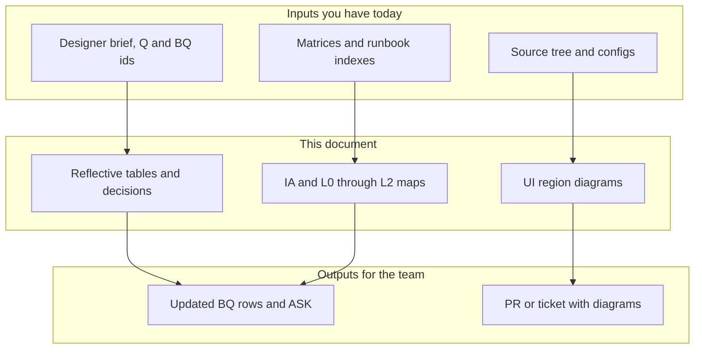

---

## 1. Scope of this review (check one or more)

| Track | Yes | Notes |
|:---|:---:|:---|
| Gap remediation (G3 / G2–G5) | ☐ | |
| Terrain / materials / worldgen | ☐ | |
| Serialization / save (wave S) | ☐ | |
| Preview / composite UI (wave P) | ☐ | |
| Streaming / chunks (wave C) | ☐ | |
| Other: ___ | ☐ | |

**Timebox:** ___ (e.g. 30 min skim / 2 h deep dive)

---

## 2. Executive snapshot (max 5 bullets)

Fill with **your** read of the codebase + docs — not a repeat of the runbooks.

1. 
2. 
3. 
4. 
5. 

---

## 3. Decisions or clarifications needed (engineering)

| Topic | Current understanding | Open question | Proposed default (optional) | Owner |
|:---|:---|:---|:---|:---|
| | | | | |
| | | | | |
| | | | | |

**Link to backlog ids** if using the designer brief: `BQ-###` / `ASK:` row / matrix §.

---

## 4. Information architecture (IA)

*IA = how information is **grouped**, **named**, **found**, and **traversed** (screens, panels, configs, docs — not only UI).*

### 4.1 Doc / config map (where truth lives)

| Kind | Canonical path or doc | Drift / duplicate risk? |
|:---|:---|:---|
| Runtime UI entrypoints | | |
| Desktop / asset tools | | |
| Terrain registries | | |
| Save / DTO boundary | | |

### 4.2 User-facing surface map (optional table)

| Surface | Primary user goal | Owning crate / module | Data authority |
|:---|:---|:---|:---|
| | | | |

### 4.3 IA — documentation & runtime (replace node labels)

*Mirrors the cleanup-plan pattern: **bands** for active surfaces, core engine, and authoring/tools.*

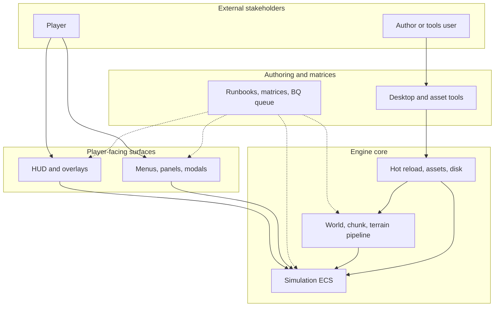

*Solid arrows: **runtime data / control**. Dotted: **governance / doc truth**. Edit labels to match your slice (e.g. add `wave S` save boundary).*

---

## 5. Engine & system map (multi-level)

Use **one diagram per subsection**. Keep each **legible when pasted into a PR comment**.

### 5.1 Level 0 — System context

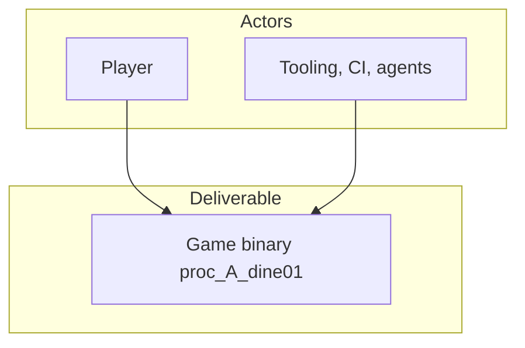

### 5.2 Level 1 — Runtime pillars (replace names)

*Think “cleanup plan” **phase bands**: several sibling nodes under one app root.*

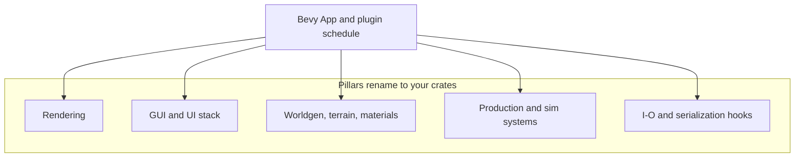

### 5.3 Level 2 — One vertical slice (template)

*Pick **one** track (e.g. production HUD, terrain p4, save load). Rename inner node labels to match.*

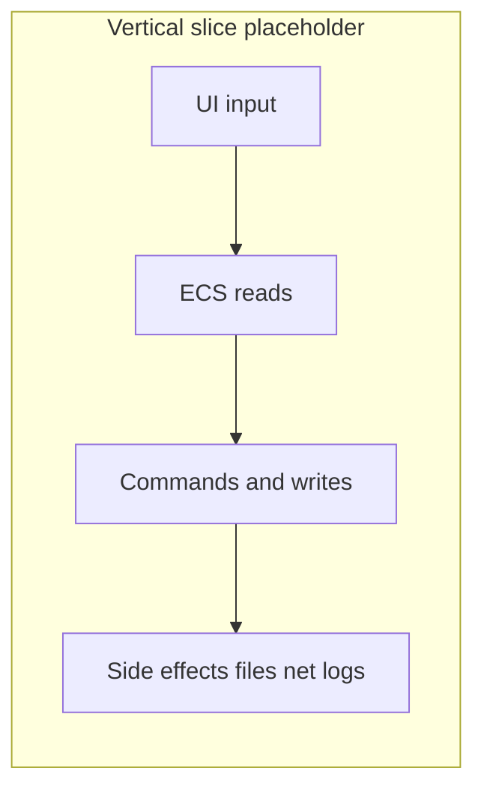

**Slice chosen for L2:** ___

### 5.4 Optional — state or dependency emphasis

*Use when “who calls whom” matters more than containment.*

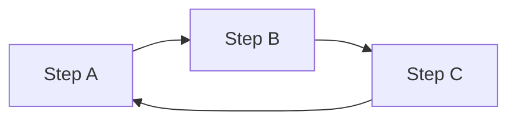

---

## 6. UI & interaction — Mermaid mockups (no ASCII)

Goal: **layout, hierarchy, and chrome** (regions), not pixel-perfect visuals. Duplicate the diagram, rename nodes, and attach a **Figma / Excalidraw** link in **§6.5** if you need pixels.

### 6.1 HUD strip — region wireframe (stacked bands)

*Same idea as a structured mockup: **A = context**, **B = metrics row**, **C = chrome**. Expand **B** with more sibling nodes if you have more rows.*

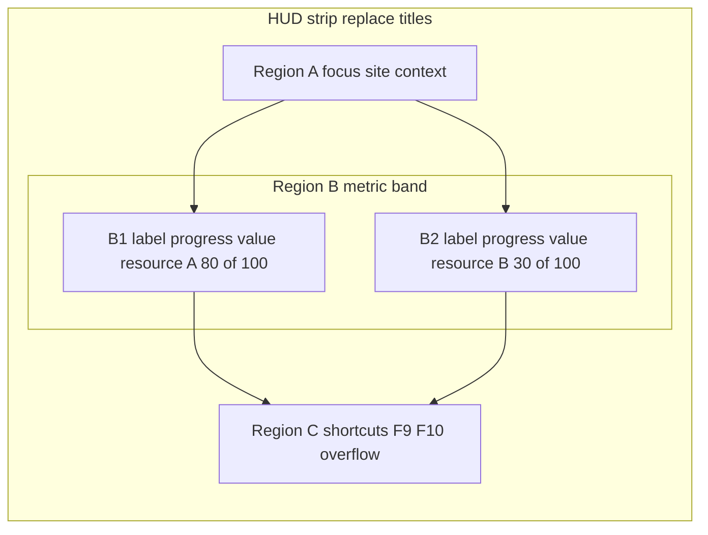

**Optional — denser grid (two band rows):** duplicate **Region B** as `R_B_prime` below, or add `R_B3` / `R_B4` nodes in the same subgraph with `direction TB` wrapping multiple `LR` rows.

**Your notes:** focus model · density · Bevy vs `TEMP-EGUI` · refresh cadence · **BQ-###**.

### 6.2 Panel / screen — subgraph wireframe

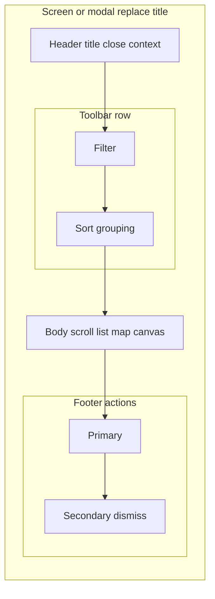

**Your notes:** authority (read-only vs mutate) · tests needed · **BQ-###** if gated.

### 6.3 Panel — secondary pattern (sidebar + main)

*Use for editor-style layouts (nav left, detail right).*

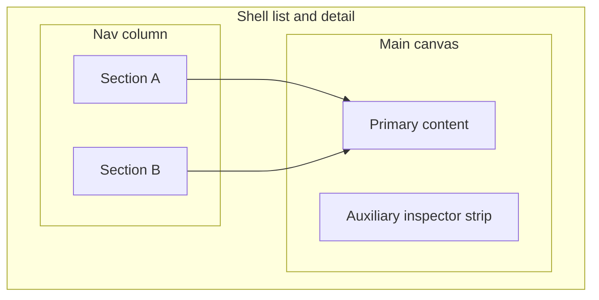

### 6.4 Desktop tool vs in-game — boundary (two lanes)

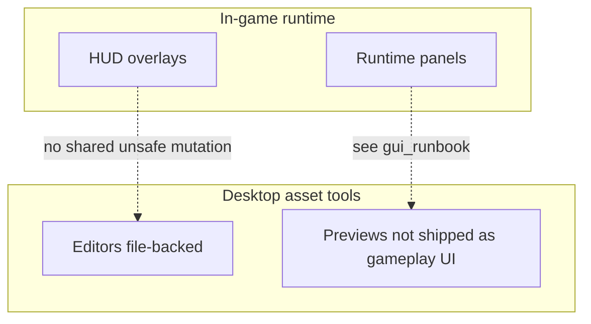

**Table (fill concrete widgets):**

| Element | Allowed in-game? | Allowed in desktop tool? | Same code path? |
|:---|:---:|:---:|:---|
| Example: registry table | | | |
| Example: world gen sliders | | | |

*Align with [`gui_runbook_v1.md`](gui_runbook_v1.md) §1 invariants.*

### 6.5 High-fidelity mockups (optional)

| Artifact | Link | Notes |
|:---|:---|:---|
| Figma | | Frames named by **region** (A/B/C above) |
| PNG / SVG export | | Store under `docs/` or ticket; **keep Mermaid as source of truth for layout** |

---

## 7. Data & flow — sequence (optional)

*Use when UI ↔ ECS ↔ disk ordering is disputed. Expand participants to real types/modules.*

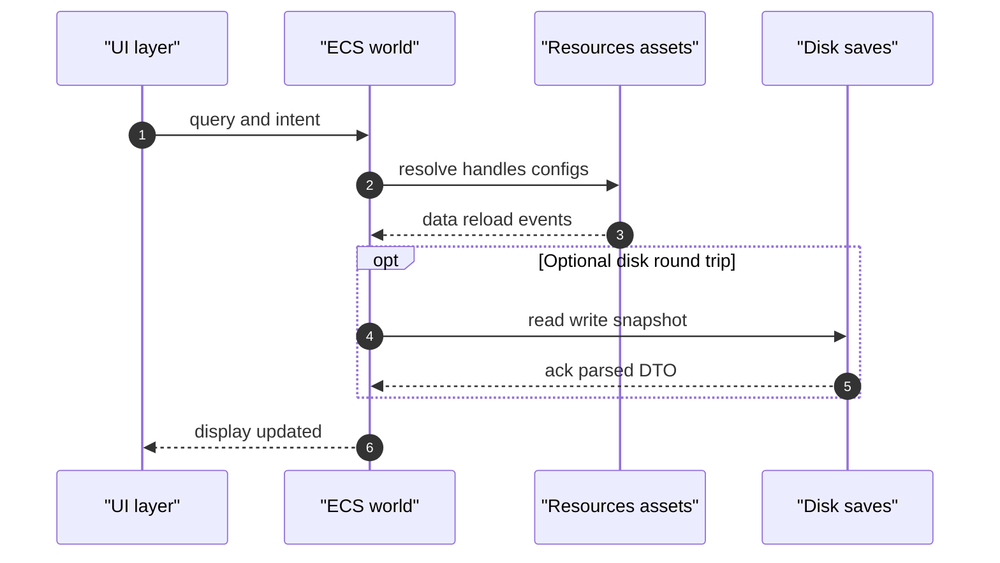

**Scenario described:** ___

---

## 8. Risks, constraints, unknowns

| Item | Severity (L/M/H) | Mitigation or question |
|:---|:---:|:---|
| | | |

---

## 9. Recommended next actions (engineering-owned)

| # | Action | Depends on | Estimate |
|:---:|:---|:---|:---|
| 1 | | | |
| 2 | | | |

**Sign-off (optional):** Name · Date

---

## 10. Cross-links (read-only anchors)

| Doc | Use when |
|:---|:---|
| [`rulebook_backlog_designer_brief_v1.md`](rulebook_backlog_designer_brief_v1.md) | Product queue **BQ-###**, Q1–Q6 |
| [`gap_remediation_runbook_v1.md`](gap_remediation_runbook_v1.md) | G1–G5 phase routing |
| [`terrain_unification_runbook_v1.md`](terrain_unification_runbook_v1.md) | U3–U7 terrain |
| [`legacy_runbooks/README.md`](../legacy_runbooks/README.md) | Applied packs / maintenance capsules |
| [`material_unification_matrix_v1.md`](../matrix/terrain_biome/material_unification_matrix_v1.md) §19 | Terrain “open rows” shortcut |
| [`engine_architecture_human_map_v1.md`](engine_architecture_human_map_v1.md) | Human plugin/path map, window and camera notes, parking-lot TODOs |

---

*Per review cycle: duplicate this **`.plan.md`** (e.g. `developer_reflective_brief_2026-05_engineering.plan.md`) or branch in git; keep Mermaid **editable** in version control.*
