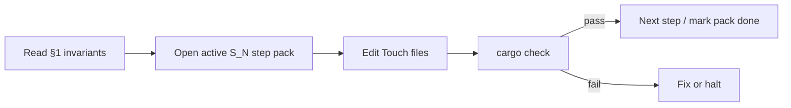

# ECS / systems schedule refactor runbook `v1`

> **STATUS:** Active documentation harness for **inventory + ordering** of Bevy **0.18** plugins and `SystemSet`s. Pair with [`../matrix/engine_bevy/bevy_0_18_migration_plan.md`](../matrix/engine_bevy/bevy_0_18_migration_plan.md) and [`../designer_questions/tools_ui/spec/01_plugin_schedule_patterns.md`](../designer_questions/tools_ui/spec/01_plugin_schedule_patterns.md). **Execution:** step packs under [`../matrix/engine_bevy/runbook/`](../matrix/engine_bevy/runbook/README.md).

Version: `v1.0.1`  
Audience: agents refactoring how systems are registered and ordered **before** transport **W1–W3** (bake → topology → R8/R7).

**Authoring compliance:** Structure mirrors [`map_editor_runbook_v1.md`](map_editor_runbook_v1.md) and [`system_runbook_authoring_meta_v1.md`](system_runbook_authoring_meta_v1.md).

---

## How to use (loop protocol)

Entry step packs: [`../matrix/engine_bevy/runbook/README.md`](../matrix/engine_bevy/runbook/README.md).



**Gate:** Complete **S0 + S1** (inventory + cross-plugin schedule baseline) before transport [`transport_code_implementation_plan_v1.md`](../designer_questions/transport/transport_code_implementation_plan_v1.md) **W1**.

---

## 1. Invariants

1. **Bevy 0.18 API:** `add_systems(ScheduleLabel, …)`, `configure_sets`, `in_set`, `.after()` / `.before()` on sets — not legacy `add_system_set` / `OnUpdate` (see migration plan §1.1).
2. **Plugin order in `EnginePlugin`** matters only until all cross-plugin ordering is expressed as **explicit set edges**; prefer **named `SystemSet`s** over “registration order magic.”
3. **Sim before gameplay:** `SimTick` / `SimControlState` updates that affect `dt_scale()` must run **before** systems that consume them in the same frame (transport field integrate, future nav ticks) — enforce with **`SimControlSystemSet::AdvanceSimTick`** edges.
4. **egui / input:** UI pass ordering remains per [`gui_runbook_v1.md`](gui_runbook_v1.md); this runbook does not redefine `EguiPrimaryContextPass` without GUI runbook alignment.
5. **No big-bang:** One step pack at a time; do not re-thread every plugin into a global enum in a single commit unless the pack explicitly says so.
6. **`ASK:`** if a domain needs a new top-level schedule (`FixedPostUpdate`, etc.) — default stays **`Update`** until justified.

---

## 2. Anchor file set (per step)

1. This runbook §§1, 4, 5.  
2. [`bevy_0_18_migration_plan.md`](../matrix/engine_bevy/bevy_0_18_migration_plan.md) — schedule / set notes.  
3. Active step pack in `matrix/engine_bevy/runbook/`.  
4. **`src/engine/engine_with_worldgen.rs`** — plugin registration order.  
5. **Touch** path(s) from the step only.

---

## 3. Atomic step schema (packs must match)

```
### S<phase>-S<NN> <slug>

**Goal:** one sentence.

**Anchor reads:** ≤5 paths (§2).

**Touch:** 1–3 paths.

**Verify:** cargo check; optional cargo test.

**Matrix / doc update:** e.g. runbook README phase table.

**Definition of done:** [ ] builds; [ ] ordering documented; [ ] invariants held.
```

---

## 4. Phase index

| Phase | Step pack | Focus |
|:---:|:---|:---|
| **S0** | [`runbook/s0_inventory_steps_v1.md`](../matrix/engine_bevy/runbook/s0_inventory_steps_v1.md) | Plugin + `SystemSet` inventory; legacy `sets.rs` / nav naming |
| **S1** | [`runbook/s1_schedule_cross_plugin_steps_v1.md`](../matrix/engine_bevy/runbook/s1_schedule_cross_plugin_steps_v1.md) | `SimControlSystemSet`, transport **after** sim tick |
| **S2** | [`../matrix/engine_bevy/runbook/s2_schedule_navigation_steps_v1.md`](../matrix/engine_bevy/runbook/s2_schedule_navigation_steps_v1.md) | `NavSets` after `TransportSchedule::CostCache`; **`DamageSystem`** registered |

Update the table in `runbook/README.md` when a phase completes.

---

## 5. Bevy 0.18 reminders (systems)

- **`SystemSet`:** `#[derive(SystemSet, …)]` on an enum; register with `app.configure_sets(Update, (A, B.after(A)))`.  
- **Cross-plugin edges:** later plugin’s `configure_sets` may reference sets registered by an earlier plugin on the same schedule.  
- **`.chain()`:** tuple of systems runs in sequence **within** one `add_systems` call; still composable with `in_set`.  
- **Docs:** [Bevy 0.18 migration guide](https://bevy.org/news/bevy-0-18/) (project website) — verify current URLs when citing.

---

## 6. Cross-links

| Doc | Role |
|:---|:---|
| [`transport_code_implementation_plan_v1.md`](../designer_questions/transport/transport_code_implementation_plan_v1.md) | **W1–W5** after **S1** |
| [`rulebook_drafts.md`](../designer_questions/transport/rulebook_drafts.md) | Logical sim schedule (topology → field → cost) |
| [`../matrix/transport/road_rail_migration_matrix_v1.md`](../matrix/transport/road_rail_migration_matrix_v1.md) | R1–R10 gates |
