# Engine architecture — human orientation map `v1`

> **Purpose:** For **people** (not runbook agents): plugin stack, modules, **hot vs cold** code, **frame schedules**, terrain and GUI flows, and **window / camera / display** truth. When code and this file disagree, **code wins**.

**Diagrams:** Mermaid **`graph`** / **`sequenceDiagram`** only (broad parser support).  
**Troubleshooting:** If you see *No diagram type detected* with **empty** text, the preview fed **whole markdown** into Mermaid. Copy **only** the lines between **one** opening `mermaid` fence and its closing backticks into [mermaid.live](https://mermaid.live), or use **Markdown Preview Mermaid Support**. Never paste this entire `.md` file into Mermaid.

Version: `v1.1.0`

---

## 1. What this is not

- Not execution steps (see [`gap_remediation_runbook_v1.md`](gap_remediation_runbook_v1.md), terrain runbooks).
- Not a full API listing — anchors point at **directories / plugins**, not every `fn`.
- **§15 Parking lot** is deliberately outside “current shipped stack.”

---

## 2. Binary entry

| Path | Role |
|:---|:---|
| [`src/main.rs`](../../src/main.rs) | `App::new()` → `ClearColor` → **`EnginePlugin`**. |
| [`src/bin/world_generator.rs`](../../src/bin/world_generator.rs) | Separate slim app; **`Camera2d`** spawn; parity / experiments. |

### 2.1 Overview

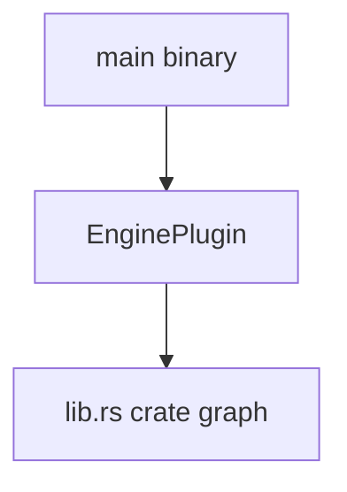

---

## 3. Plugin registration order (canonical chain)

Source: [`src/engine/engine_with_worldgen.rs`](../../src/engine/engine_with_worldgen.rs). This is **insertion order**, not necessarily data dependency order.

| # | Plugin |
|:---:|:---|
| 1 | `DefaultPlugins` |
| 2 | `EguiPlugin` |
| 3 | `SimControlPlugin` |
| 4 | `MaterialUnificationPlugin` |
| 5 | `TilemapAdapterPlugin` — **only** with feature `bevy_tilemap_adapter` |
| 6 | `KeybindingsOptionsPlugin` |
| 7 | `DiagnosticsUiPlugin` |
| 8 | `FactionToolsUiPlugin` |
| 9 | `InGameHudPlugin` |
| 10 | `LogisticsTargetsPanelPlugin` |
| 11 | `WorldGenToolsPlugin` |
| 12 | `HudQuickMenuPlugin` |
| 13 | `ProductionRuntimePlugin` |
| 14 | `ManufacturingCorePlugin` |
| 15 | `ProductionSerializationPlugin` |
| 16 | `ProductionToolsUiPlugin` |
| 17 | `RoadVehicleToolsUiPlugin` |

### 3.1 Same order as a single flow (compact)

```mermaid
graph LR
  P0["EnginePlugin"] --> P1["DefaultPlugins"]
  P1 --> P2["EguiPlugin"]
  P2 --> P3["SimControl"]
  P3 --> P4["MaterialUnification"]
  P4 --> P5["Keybindings"]
  P5 --> P6["Diagnostics"]
  P6 --> P7["FactionTools"]
  P7 --> P8["InGameHud"]
  P8 --> P9["LogisticsPanel"]
  P9 --> P10["WorldGenTools"]
  P10 --> P11["HudQuickMenu"]
  P11 --> P12["ProductionRuntime"]
  P12 --> P13["ManufacturingCore"]
  P13 --> P14["ProductionSerialization"]
  P14 --> P15["ProductionToolsUi"]
  P15 --> P16["RoadVehicleToolsUi"]
  P4 -.-> TMAP["TilemapAdapter feature gated"]
```

*The linear chain omits the tilemap branch between MaterialUnification and Keybindings; see the numbered table for the exact `cfg` position.*

### 3.2 Grouped view (foundation vs GUI vs production)

Every group node below is a **summary**; open the table above for exact names.

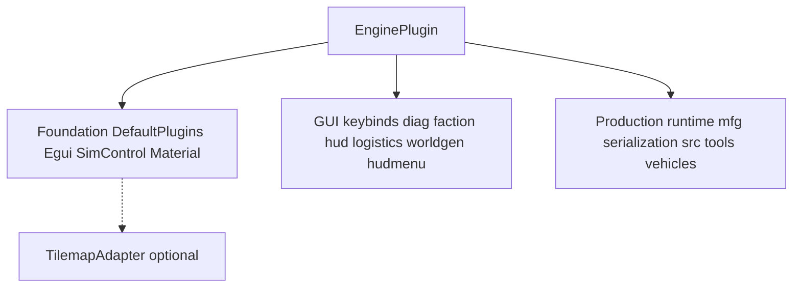

---

## 4. Library modules (`lib.rs`)

Single crate; modules are **sibling** roots unless you add finer import graphs in Rust.

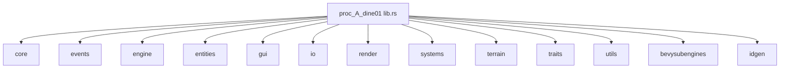

### 4.1 Typical runtime dependency direction (conceptual, not `use` exhaustive)

Heavier arrows = “many systems query or spawn.”

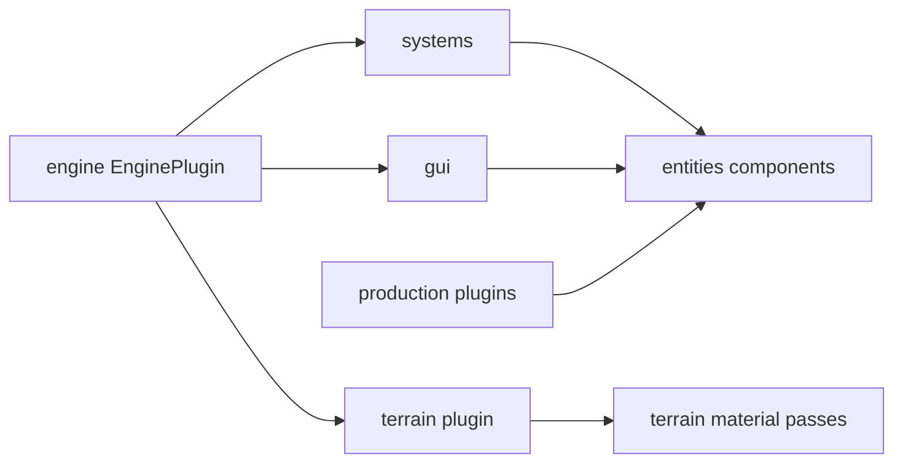

---

## 5. Heat map — where work actually lands

| Band | Meaning | Examples |
|:---|:---|:---|
| **Hot** | On critical path / active product | `MaterialUnificationPlugin`, `InGameHudPlugin`, `ProductionRuntimePlugin`, `SimControlPlugin`, [`terrain/generation/passes/`](../../src/terrain/generation/passes/) |
| **Warm** | Real code, less churn | `navigation`, `damage`, `agents`, serialization stubs, power placeholders |
| **Cold** | Stub, empty, or legacy entry | [`engine/engine.rs`](../../src/engine/engine.rs), [`render/base_cam.rs`](../../src/render/base_cam.rs), [`render/light.rs`](../../src/render/light.rs) |
| **Bench** | Compiled but **not** in `EnginePlugin` | `SplashPlugin`, `BaseMenuPlugin`; `WorldGeneratorSubenginePlugin` via `world_generator` bin |

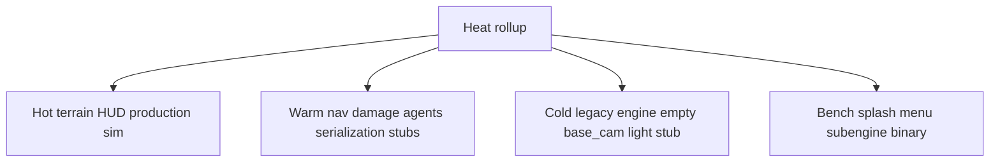

---

## 6. Subsystems — path cheat sheet

| Subsystem | Paths | Notes |
|:---|:---|:---|
| Terrain | `src/terrain/`, `src/systems/terrain/` | Chunk matrix, passes, [`world_generator_enhanced.rs`](../../src/terrain/generation/world_generator_enhanced.rs) |
| Hydrology | `src/terrain/generation/hydrology/` | G1 Applied |
| GUI Bevy UI | `src/gui/in_game_hud.rs` | Native `Node` HUD |
| GUI egui | `src/gui/*_ui.rs`, `src/gui/editor/` | Tool windows |
| Production | `src/entities/production/`, `src/systems/production/` | Includes `serialization.rs` registration |
| Agents | `src/systems/agents/` | |
| Navigation | `src/systems/navigation/` | G5 gap hooks |
| Damage | `src/systems/damage/` | |
| Render | `src/render/` | Tilemap adapter feature; light stub |
| IO | `src/io/` | Deserializers etc. |
| Logical IDs | [`src/idgen.rs`](../../src/idgen.rs) | `EntityId(u32)` **not** Bevy `Entity` |

---

## 7. Simulation control loop

| Resource / plugin | File |
|:---|:---|
| `SimControlState`, `SimTick` | [`systems/sim_control.rs`](../../src/systems/sim_control.rs) |
| Default keys | [`gui/input_bindings.rs`](../../src/gui/input_bindings.rs) — F3 diag, F4 faction, P pause, F9/F10 logistics, F8 world gen |

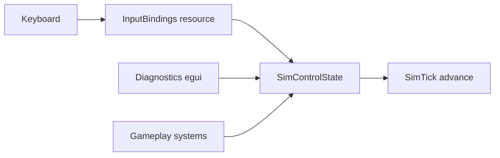

---

## 8. Bevy schedule — `MaterialUnificationPlugin` in detail

From [`systems/terrain/material_plugin.rs`](../../src/systems/terrain/material_plugin.rs):

| Schedule | Systems |
|:---|:---|
| **Startup** | `terrain_registries_startup` — loads example JSON/RON into `Assets` |
| **Update** | `materialize_chunks` |
| **PostUpdate** | `mark_chunks_dirty_on_asset_change` → `mark_chunks_dirty_on_world_gen_params_change` → `rebuild_dirty_chunks` **chained**, **after** `AssetEventSystems` |

### 8.1 Sequence (assets → dirty → rebuild)

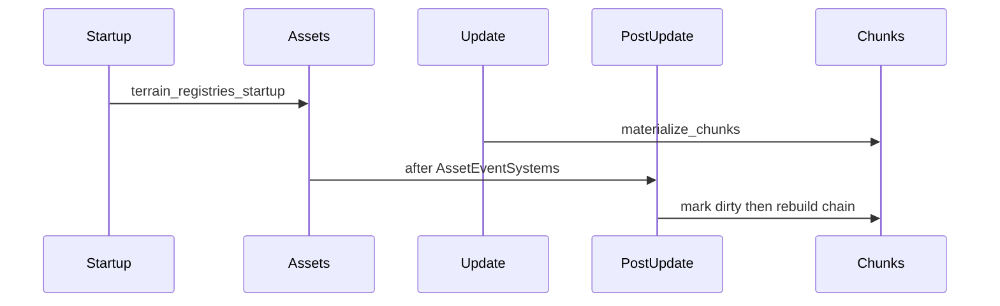

### 8.2 Pass chain inside rebuild (logical)

Maps to `terrain/generation/passes/` and hydrology helpers.

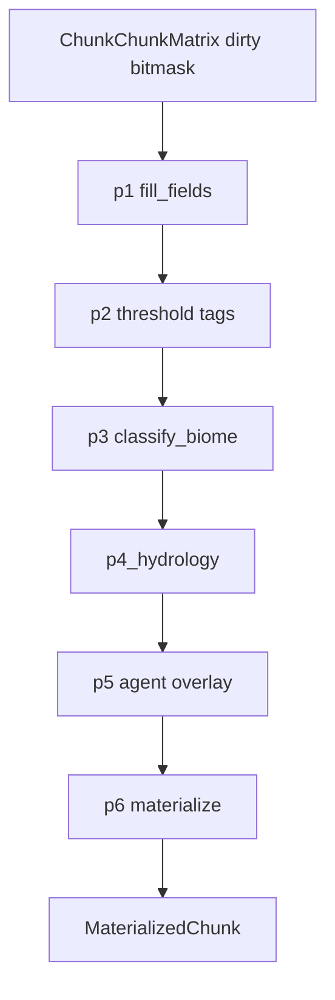

---

## 9. `WorldGenToolsPlugin` decomposition

Source: [`src/terrain/generation/world_generation_plugin.rs`](../../src/terrain/generation/world_generation_plugin.rs).

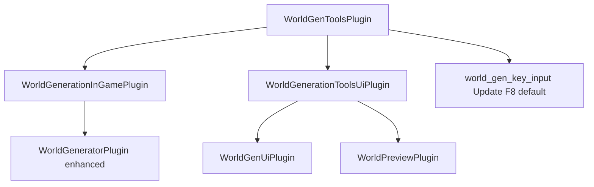

### 9.1 World creation vs load/save (stub and implementation plan)

**Shipped today:** [`MainMenuState::Load`](../../src/gui/main_menu.rs) shows an egui **Load World** panel (`load_menu_ui_system`): editable path (default `saves/slot_0.ron`), **Cancel** returns to the main menu bar and clears [`WorldGenFlowState`](../../src/engine/states.rs) to **`Idle`**. **Load into game (stub)** despawns any procedural [`WorldMarker`](../../src/terrain/generation/world_generator_enhanced.rs) hierarchy, logs the path, sets **`WorldGenFlowState::Idle`**, **`BaseState::Simulation`**, and returns **`MainMenuState::MainMenu`** — **no file I/O or deserialization yet**.

**Procedural vs load:** [`WorldGenFlowState::LoadingSave`](../../src/engine/states.rs) is entered when choosing **Load World** from the top bar; [`GenerateWorldEvent`](../../src/terrain/generation/world_generator_enhanced.rs) is rejected while that flow is active so saves never accidentally trigger world generation.

**Basic plan to implement real loads**

1. **Schema** — Define a versioned save root (RON/JSON) listing world identity, serialized ECS snapshot or registries to rebuild (align with `ProductionSerializationPlugin` / `g4` stubs).
2. **Picker** — Replace the text field with a platform file dialog (or `std::fs::read_dir` + list for dev), resolve to `PathBuf`, validate extension and magic/header.
3. **Deserialize** — One system or plugin command: `load_save(path) -> Result<SaveBundle, LoadError>`; map failures to user-visible egui error + stay on Load screen.
4. **Apply** — Despawn procedural `WorldMarker` trees (reuse `despawn_generated_world_entities`); spawn/load entities from save; set [`SimControlState`](../../src/systems/sim_control.rs) as needed; transition **`Simulation` + `WorldGenFlowState::Idle`** only after a successful apply.
5. **Testing** — Round-trip minimal world, corrupt file, wrong version, missing assets; keep **stub button** behind `#[cfg(feature = "dev_tools")]` if you want one-click fake loads in QA.

---

## 10. GUI — default bindings to surfaces

Configurable via RON; defaults from [`input_bindings.rs`](../../src/gui/input_bindings.rs).

| Default key | Binding field | Typical surface |
|:---:|:---|:---|
| F1 | `toggle_keybindings_options` | Options |
| F3 | `toggle_diagnostics` | Diagnostics egui |
| F4 | `toggle_faction_tools` | Faction tools |
| F7 | `toggle_agent_permissions` | Agent permissions |
| F8 | `toggle_world_generator` | World gen UI |
| F9 | `cycle_logistics_focus` | HUD logistics |
| F10 | `toggle_logistics_targets_panel` | Logistics list |
| P | `toggle_simulation_pause` | Sim |
| / | `toggle_egui_ui_scale` | UI scale |

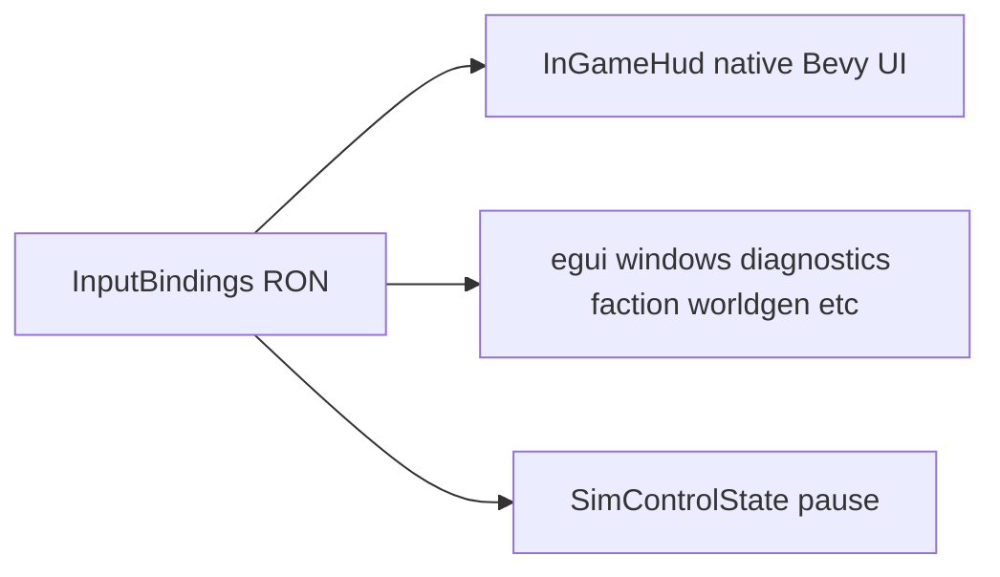

---

## 11. Display — window, layers, camera gap

| Fact | Detail |
|:---|:---|
| Window | `DefaultPlugins` creates **`PrimaryWindow`**. |
| Clear | [`main.rs`](../../src/main.rs) **`ClearColor`**. |
| Layers today | **Bevy UI** (HUD) + **egui** on top of cleared swapchain. |
| World camera | `Camera2d` is spawned on **Startup** in [`engine_with_worldgen.rs`](../../src/engine/engine_with_worldgen.rs) (`spawn_primary_ui_camera`) so **Bevy UI** (splash, HUD) renders. World geometry / tilemap still needs a follow-up camera if you add a 3D or separate 2D world view. |
| Render stubs | [`render/light.rs`](../../src/render/light.rs) empty plugin build; [`base_cam.rs`](../../src/render/base_cam.rs) empty. |

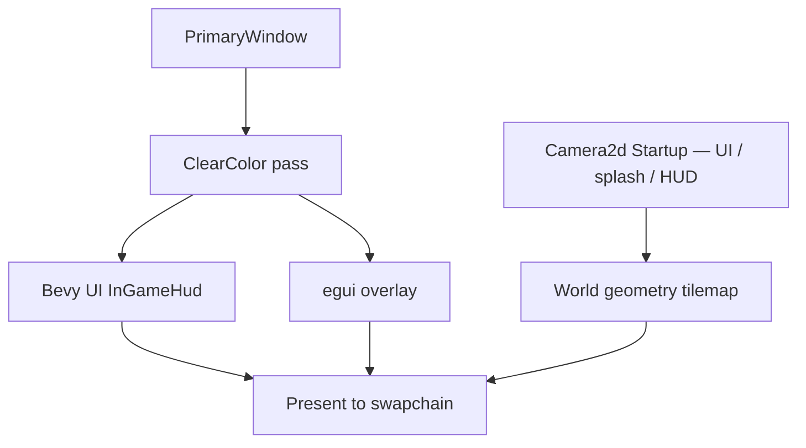

*Splash uses `BackgroundColor` so the screen is not black while `splash/splash_01.png` loads or if that file is missing from `assets/`.*

---

## 12. Production plugin cluster (conceptual wiring)

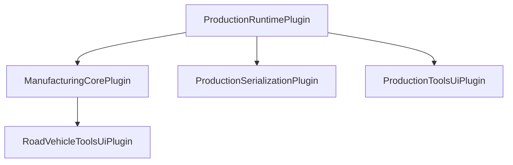

*Illustrative registration neighborhood from `EnginePlugin`, not a Rust dependency graph.*

---

## 13. Cross-links

| Doc | Use |
|:---|:---|
| [`gui_runbook_v1.md`](gui_runbook_v1.md) | UI invariants |
| [`world_assets_tools_rulebook_v1.md`](world_assets_tools_rulebook_v1.md) | Binary parity |
| [`terrain_unification_runbook_v1.md`](terrain_unification_runbook_v1.md) | U3–U7 |
| [`developer_reflective_brief_v1.plan.md`](developer_reflective_brief_v1.plan.md) | Engineer reflection |
| [`rulebook_backlog_designer_brief_v1.md`](rulebook_backlog_designer_brief_v1.md) | BQ queue |

---

## 14. File-level anchors (jump list)

| Concern | Start here |
|:---|:---|
| Plugin order | [`engine_with_worldgen.rs`](../../src/engine/engine_with_worldgen.rs) |
| Terrain schedules | [`material_plugin.rs`](../../src/systems/terrain/material_plugin.rs) |
| World gen composition | [`world_generation_plugin.rs`](../../src/terrain/generation/world_generation_plugin.rs) |
| Pass implementations | [`terrain/generation/passes/`](../../src/terrain/generation/passes/) |
| HUD | [`in_game_hud.rs`](../../src/gui/in_game_hud.rs) |
| Keys | [`input_bindings.rs`](../../src/gui/input_bindings.rs) |
| Sim | [`sim_control.rs`](../../src/systems/sim_control.rs) |
| Logical IDs | [`idgen.rs`](../../src/idgen.rs) |
| Tilemap feature | [`render/tilemap_adapter.rs`](../../src/render/tilemap_adapter.rs) |

---

## 15. Parking lot (not owned by one runbook)

| # | Topic |
|:---:|:---|
| U1 | Spawn and order **world camera** vs UI in main app |
| U2 | Wire or delete **Splash** / **BaseMenu** |
| U3 | **`render/`** — implement camera/light or delete stubs |
| U4 | Document **Entity** vs **EntityId** for saves and UI |
| U5 | Display policy fullscreen DPI |
| U6 | **Subengine** vs **WorldGenTools** product boundary |

---

*Bump version when `EnginePlugin` registration or camera strategy changes.*
