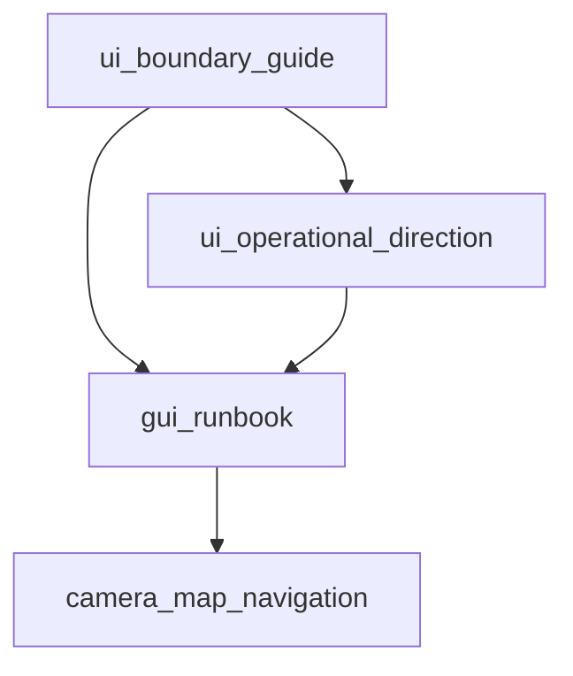

# Experience layer orchestrator `v1`

> **STATUS:** Draft **v1** — indexes **player-facing UI/UX** for strategic operations; child of [`simulation_expansion_orchestrator_v1.md`](simulation_expansion_orchestrator_v1.md).

Version: `v1.0.0`  
Audience: agents implementing HUD, overlays, camera, and inspector patterns without violating sim ownership.

**Visual/IA direction:** [`ui_operational_direction_runbook_v1.md`](ui_operational_direction_runbook_v1.md)  
**Hard boundary:** [`ui_boundary_guide_v1.md`](ui_boundary_guide_v1.md)

---

## 1. Purpose

Keep **one coherent experience stack**:

- **Bevy UI** — gameplay shell, overlays, inspectors, notifications (map-primary).
- **egui** — dev tools, tuning, editors (gated).
- **Input** — [`InputBindings`](../../src/gui/input_bindings.rs) and navigation per camera runbook.

---

## 2. Runbooks in this layer

| Runbook | Role |
|:---|:---|
| [`ui_operational_direction_runbook_v1.md`](ui_operational_direction_runbook_v1.md) | Mockup-derived epics: command table, planner, war overlay, minimal HUD |
| [`ui_boundary_guide_v1.md`](ui_boundary_guide_v1.md) | Authoritative Bevy vs egui split |
| [`gui_runbook_v1.md`](gui_runbook_v1.md) | GUI integration harness |
| [`camera_map_navigation_runbook_v1.md`](camera_map_navigation_runbook_v1.md) | Pan/zoom/rotate; respects egui capture |

---

## 3. Dependency sketch

---

## 4. Invariants

1. **Overlay-first, window-second** — avoid permanent floating panels for core play; prefer trays and toggles (see operational direction runbook).
2. **No gameplay mutation from dev panels** — dev egui writes diagnostics/tuning only.
3. **Strategic overlays** owned by sim systems; UI **toggles views** and **selects policy**, per expansion orchestrator §7.
