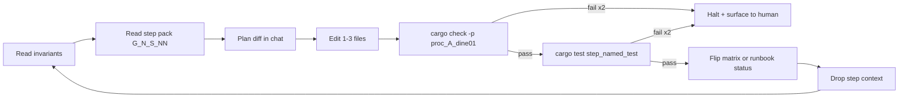

# Gap remediation runbook `v1`

> **STATUS:** Documentation harness for executing **Rust phases G1-G5** of implementation-gap remediation. **G1 (hydrology) is Applied** in code (`terrain::generation::hydrology`, p4, `world_generator_enhanced`); **G3 (GUI)** is the next active phase by sequence (letters unchanged). G2/G4/G5 remain parked behind their promotion blockers. **Closed pack history:** [`../legacy_runbooks/README.md`](../legacy_runbooks/README.md) (G1 full steps, terrain U maintenance capsule).

Version: `v1.0.0`
Audience: agents (and humans) replacing stubs, placeholders, and TODO-backed no-op code with real behavior.

---

## How to use this doc (loop protocol)

This file is the **entrypoint**. Per-phase atomic step packs live at [`../matrix/gap_remediation/runbook/`](../matrix/gap_remediation/runbook/README.md).

The agent runs **one step at a time**, then drops the step context and re-reads the **Invariants** + **Anchor file set** before the next step. This keeps gap remediation stable across small-model runs.



---

## 1. Invariants (re-read every loop)

These are **non-negotiable**. Violating any of them ends the loop and surfaces a halt to the human.

1. **Single source of truth per concept.** No parallel enum/struct/system; reuse existing canonical types from the owning matrix or runbook.
2. **No second classifier / resolver.** If the system has a canonical decision function, call it; do not write a parallel one.
3. **Determinism contract:** same seed + same committed config ⇒ identical output for generation paths touched by a step.
4. **Save = names, not ids** unless an owning serialization matrix explicitly says otherwise.
5. **Hot-reload via `Assets<T>`** where assets are involved. F8/asset-editor edits files; engine does not get a second mutation path.
6. **Schema on disk:** JSON for flat designer-edited tables; RON for DSL-style rules/predicates. If neither exists yet, default to JSON and mark `ASK:` if the human wants RON.
7. **`ASK:` instead of inventing** numbers, paths, types, gameplay behavior, or save policy.
8. **Replace stubs with behavior.** Do not merely rename a placeholder. If removal breaks a public API, leave a short `#[deprecated]` shim and route it to the canonical implementation.
9. **One canonical implementation per concept.** For G1 hydrology, that means one flow/hydrology module consumed by ECS visuals and p4 chunk tags rather than separate lake/river loops.
10. **Atomic step size:** each step touches 1-3 files. A fourth touched file means split the step.

---

## 2. Anchor file set (≤5 paths per step)

Every step pre-reads exactly this set, plus the one source file the step touches:

1. **This runbook** — sections 1, 2, 3, 5.
2. [`implementation_gap_hunt_runbook_v1.md`](implementation_gap_hunt_runbook_v1.md) §§1-4 (gap definition, hunt, triage, routing).
3. The owning matrix or designer doc for the active phase:
   - G1: [`../matrix/terrain_biome/material_unification_matrix_v1.md`](../matrix/terrain_biome/material_unification_matrix_v1.md) §§1, 3, 10 and [`../designer_questions/terrain_world/implementation_questions_v1.md`](../designer_questions/terrain_world/implementation_questions_v1.md) Q55-Q58.
   - G2-G5: active placeholder pack anchor list until promoted.
4. The **current step pack** under [`../matrix/gap_remediation/runbook/`](../matrix/gap_remediation/runbook/README.md).
5. The single `src/...rs` (or asset / markdown) the step is editing.

If a step needs more than this, **stop and ask**. It is too large and needs splitting.

---

## 3. Atomic step schema

Every step in every pack uses this exact shape:

```
### G<phase>-S<NN> <slug>

**Goal:** one sentence, present tense.

**Anchor reads:** ≤5 paths (see §2 above).

**Touch:** 1-3 paths with the symbol/name being added or modified.

**Verify:**
- `cargo check -p proc_A_dine01`
- `cargo test -p proc_A_dine01 <named_test> -- --nocapture`

**Matrix / routing update:** which row(s) or runbook status flips.

**Definition of done:**
- [ ] Build passes.
- [ ] Named test passes, or the step is explicitly doc-only.
- [ ] Matrix/routing status updated.
- [ ] No invariant from §1 broken.
```

A step that cannot fit this shape is too big. Split it before executing.

---

## 4. Phase index

Mirrors the routing table in [`implementation_gap_hunt_runbook_v1.md`](implementation_gap_hunt_runbook_v1.md) §4.5. Update **here and in the owning matrix/runbook** when a phase completes. **G1** step history (pre-capsule): [`../legacy_runbooks/gap_remediation/g1_hydrology_steps_v1_FULL.md`](../legacy_runbooks/gap_remediation/g1_hydrology_steps_v1_FULL.md).

| Phase | Step pack | Focus | Status |
|:---:|:---|:---|:---:|
| **G1** | [`runbook/g1_hydrology_steps_v1.md`](../matrix/gap_remediation/runbook/g1_hydrology_steps_v1.md) | Hydrology: unify legacy ECS, `world_generator_plugin` stubs, and p4 chunk pipeline; upgrade flow algorithm | **Applied** |
| **G2** | [`runbook/g2_power_placeholders_steps_v1.md`](../matrix/gap_remediation/runbook/g2_power_placeholders_steps_v1.md) | Power placeholders / failure modes | Parked - placeholder pack |
| **G3** | [`runbook/g3_gui_todos_steps_v1.md`](../matrix/gap_remediation/runbook/g3_gui_todos_steps_v1.md) | GUI gaps surfaced by gap hunt | **Active - next** |
| **G4** | [`runbook/g4_serialization_stubs_steps_v1.md`](../matrix/gap_remediation/runbook/g4_serialization_stubs_steps_v1.md) | Serialization stubs and paired-save gaps | Pending - placeholder pack |
| **G5** | [`runbook/g5_nav_damage_steps_v1.md`](../matrix/gap_remediation/runbook/g5_nav_damage_steps_v1.md) | Navigation, damage, manufacturing placeholders | Pending - placeholder pack |

**Sequencing rule:** **G1** is complete. Active sequence is **G3 (GUI)** → backlog wave **S > P > C**. **G2**, **G4**, and **G5** remain parked until their promotion blockers and gap-hunt §5 answers are recorded.

---

## 5. Loop protocol (per-step)

1. **Anchor:** read §1 invariants and §2 anchor set in this file.
2. **Step:** open the active step in its `g<N>_*_steps_v1.md` pack.
3. **Plan:** in chat, list the diff you intend to make. Do **not** open more files than the anchor set.
4. **Edit:** modify only the `Touch` paths.
5. **Verify (build):** run `cargo check -p proc_A_dine01`. If it fails twice, **halt** (see §6).
6. **Verify (test):** run the named test. If it fails twice, **halt**.
7. **Matrix / routing:** flip the Status row(s) listed in the step.
8. **Commit hint:** suggest a one-line commit message in chat (do **not** auto-commit unless the human confirms).
9. **Drop context:** discard step-specific reading; loop back to §1.

---

## 6. Backout / halt rules

- Two consecutive build/test failures on a single step ⇒ stop, surface diff + error, do not advance phase.
- A step that requires editing more than the Touch list ⇒ stop, surface for split.
- Any invariant in §1 violated ⇒ stop, revert, surface for human review.
- If a matrix row to flip does not yet exist ⇒ stop, do NOT invent a new row without explicit `ASK:`.
- If the per-system matrix does not exist yet ⇒ author orchestrator only, point all step-pack `Matrix update` lines at `ASK:`, and stop.

---

## 7. Glossary

| Term | Canonical symbol / file |
|:---|:---|
| Gap | Placeholder, TODO, empty stub, or no-op behavior matching [`implementation_gap_hunt_runbook_v1.md`](implementation_gap_hunt_runbook_v1.md) §1 |
| Gap routing | Phase mapping in [`implementation_gap_hunt_runbook_v1.md`](implementation_gap_hunt_runbook_v1.md) §4.5 |
| Per-chunk terrain grid | `ChunkCellMatrix` in [`../../src/terrain/generation/cell_matrix.rs`](../../src/terrain/generation/cell_matrix.rs) |
| Hydrology pass | `apply_hydrology` in [`../../src/terrain/generation/passes/p4_hydrology.rs`](../../src/terrain/generation/passes/p4_hydrology.rs) |
| Legacy ECS generator | [`../../src/terrain/generation/world_generator_enhanced.rs`](../../src/terrain/generation/world_generator_enhanced.rs) |
| Legacy subengine generator | [`../../src/bevysubengines/world_generator_plugin.rs`](../../src/bevysubengines/world_generator_plugin.rs) |
| Terrain tags | `TagSet`, `TagRegistry`, `TagId` in [`../../src/terrain/material/`](../../src/terrain/material/) |

---

## 8. Cross-links

| Doc | Purpose |
|:---|:---|
| [`implementation_gap_hunt_runbook_v1.md`](implementation_gap_hunt_runbook_v1.md) | Finds gaps and routes them to G1-G5 |
| [`rulebook_backlog_designer_brief_v1.md`](rulebook_backlog_designer_brief_v1.md) | Designer / lead answers before promoting placeholder phases |
| [`system_runbook_authoring_meta_v1.md`](system_runbook_authoring_meta_v1.md) | Structural model for this orchestrator and packs |
| [`../matrix/gap_remediation/runbook/README.md`](../matrix/gap_remediation/runbook/README.md) | Step-pack index |
| [`../matrix/terrain_biome/material_unification_matrix_v1.md`](../matrix/terrain_biome/material_unification_matrix_v1.md) | G1 source of truth for p4 hydrology row |
| [`world_assets_tools_rulebook_v1.md`](world_assets_tools_rulebook_v1.md) | World-generator canonical stack / legacy subengine boundary |
| [`terrain_unification_runbook_v1.md`](terrain_unification_runbook_v1.md) | Terrain U3-U7 context; G1 must not reopen closed U-phases except via explicit matrix rows |

---

## 9. Prompt fragment for the executing agent

> Read [`prompts/guides/gap_remediation_runbook_v1.md`](gap_remediation_runbook_v1.md) §§1-6 first. **G1 (hydrology) is Applied** — use [`g1_hydrology_steps_v1.md`](../matrix/gap_remediation/runbook/g1_hydrology_steps_v1.md) only for audits. Start **G3** with [`g3_execution_cycle_v1.md`](../matrix/gap_remediation/runbook/g3_execution_cycle_v1.md) (GUI ↔ backlog alternation), [`g3_gui_todos_steps_v1.md`](../matrix/gap_remediation/runbook/g3_gui_todos_steps_v1.md), and [`gui_runbook_v1.md`](gui_runbook_v1.md); pair backlog micro-passes through [`backlog_serialization_preview_streaming_runbook_v1.md`](backlog_serialization_preview_streaming_runbook_v1.md). For parked **G2/G4/G5**, open phase packs only after **§10** promotion criteria and the pack’s blockers are satisfied. On any halt condition (§6), stop and surface to the human.

---

## 10. After G1 (active queue)

**G1** is closed in code and in [`material_unification_matrix_v1.md`](../matrix/terrain_biome/material_unification_matrix_v1.md) §3 (pass 4). Phase letters are **not** swapped; active sequence is run-order only.

| Queue item | Next action | Blocker / owner |
|:---|:---|:---|
| **G3 GUI** | Run [`g3_execution_cycle_v1.md`](../matrix/gap_remediation/runbook/g3_execution_cycle_v1.md); [`gui_runbook_v1.md`](gui_runbook_v1.md) + [`g3_gui_todos_steps_v1.md`](../matrix/gap_remediation/runbook/g3_gui_todos_steps_v1.md) | Each **slice**: sub-pack **§3 living map** + **per-action tests** where applicable; **BQ-102–105** only for unresolved `ASK:`; **BQ-108** = invariant sign-off; **results** via [`g3_cycle_results_TEMPLATE.md`](../matrix/gap_remediation/runbook/g3_cycle_results_TEMPLATE.md) |
| **Backlog wave S > P > C** | Use [`backlog_serialization_preview_streaming_runbook_v1.md`](backlog_serialization_preview_streaming_runbook_v1.md) | S = serialization, P = preview / composite UI, C = chunk streaming / neighbors |
| **G2 Power** | Parked; **G2-S00** traceability remains valid | Needs [`g2_power_placeholders_steps_v1.md`](../matrix/gap_remediation/runbook/g2_power_placeholders_steps_v1.md) blockers + gap-hunt §5 |
| **G4 Serialization stubs** | Parked unless owned by backlog wave **S** | Align with [`serialization_hybrid_migration_matrix_v1.md`](../matrix/serialization/serialization_hybrid_migration_matrix_v1.md) |
| **G5 Nav / damage / mfg** | Parked | Owner + matrix row per [`g5_nav_damage_steps_v1.md`](../matrix/gap_remediation/runbook/g5_nav_damage_steps_v1.md) |

Human prep remains [`rulebook_backlog_designer_brief_v1.md`](rulebook_backlog_designer_brief_v1.md) §4 **BQ-###**; agents should record cycle outcomes in **`results/g3*_cycle_results_v1.md`** and update brief rows — not informal open-work lists outside those anchors.
