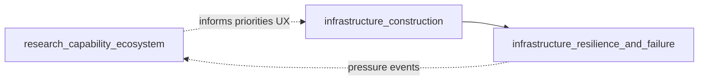

# Infrastructure and research orchestrator `v1`

> **STATUS:** Draft **v1** — indexes **research-as-capability** and **physical infrastructure** runbooks; child of [`simulation_expansion_orchestrator_v1.md`](simulation_expansion_orchestrator_v1.md).

Version: `v1.0.0`  
Audience: agents ordering construction, failure/resilience, and emergent research systems.

**Parallel AI/fields track:** [`strategic_fields_and_ai_orchestrator_v1.md`](strategic_fields_and_ai_orchestrator_v1.md)  
**Execution order:** [`strategic_program_execution_plan_v1.md`](strategic_program_execution_plan_v1.md)

---

## 1. Purpose

Sequence work so that:

1. **Infrastructure is planned and built** with explicit graphs and construction states.
2. **Degradation, failure, and repair** extend that base (not a parallel fiction).
3. **Research** is modeled as institutions + capability dimensions that **consume** industry/logistics/terrain reality — not a disconnected tech tree UI.

---

## 2. Child runbooks (this orchestrator)

| Phase | Runbook | Role |
|:---|:---|:---|
| R0 | [`research_capability_ecosystem_runbook_v1.md`](research_capability_ecosystem_runbook_v1.md) | Knowledge domains, discovery graph, maturity, doctrine coupling *(may start as design-only; see execution plan)* |
| I1 | [`infrastructure_construction_runbook_v1.md`](infrastructure_construction_runbook_v1.md) | Networks, construction workflow, terrain/weather coupling, fortifications |
| I2 | [`infrastructure_resilience_and_failure_runbook_v1.md`](infrastructure_resilience_and_failure_runbook_v1.md) | Damage, maintenance crews, cascades, rerouting, ecological feedback |

**Hard rule:** **`infrastructure_resilience_and_failure`** lists **parent** [`infrastructure_construction_runbook_v1.md`](infrastructure_construction_runbook_v1.md) — do not implement resilience as global stubs that ignore construction ownership.

---

## 3. Dependency sketch

---

## 4. Cross-links

| Domain | Existing guides |
|:---|:---|
| Terrain / hydrology | [`terrain_unification_runbook_v1.md`](terrain_unification_runbook_v1.md), [`gap_remediation_runbook_v1.md`](gap_remediation_runbook_v1.md) (G1 hydrology) |
| Weather / fire | [`weather_simulation_runbook_v1.md`](weather_simulation_runbook_v1.md), [`fire_ecology_simulation_runbook_v1.md`](fire_ecology_simulation_runbook_v1.md) |
| Industry anchors | [`concrete_industry_sim_runbook_v1.md`](concrete_industry_sim_runbook_v1.md), [`petroleum_industry_simulation_runbook_v1.md`](petroleum_industry_simulation_runbook_v1.md) |
| UI | [`ui_boundary_guide_v1.md`](ui_boundary_guide_v1.md), [`ui_operational_direction_runbook_v1.md`](ui_operational_direction_runbook_v1.md) |
| Source drafts (archive) | [`base_reserch_draft.md`](base_reserch_draft.md) *(filename historical)* |

---

## 5. Invariants

1. **Construction before catastrophic failure semantics** — collapse/blackout behavior attaches to **real** network elements from construction.
2. **Research unlocks are emergent** — gate on capability vectors + institutions, not a single `tech_id` button unless legacy bridge is explicit.
3. **UI policy only** — gameplay panels set policy/resources per [`ui_boundary_guide_v1.md`](ui_boundary_guide_v1.md); they do not become a second mutation path for graphs.
