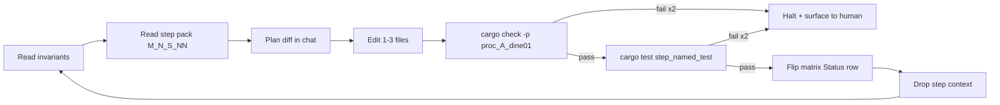

# World map editor runbook `v1`

> **STATUS:** Documentation harness for **Rust phases M1–M5** — post-procedural **map editing** (routing, editor shell, brushes, roads, save/load). Pair with [`../matrix/map_editor/map_editor_matrix_v1.md`](../matrix/map_editor/map_editor_matrix_v1.md). **Execution:** one step pack at a time under [`../matrix/map_editor/runbook/`](../matrix/map_editor/runbook/README.md).

Version: `v1.0.0`
Audience: agents (and humans) implementing the **alpha** world-map editor after [`world_generator_enhanced`](../../src/terrain/generation/world_generator_enhanced.rs) full generation.

**Authoring compliance:** This orchestrator was created per [`system_runbook_authoring_meta_v1.md`](system_runbook_authoring_meta_v1.md) (structure mirrors [`terrain_unification_runbook_v1.md`](terrain_unification_runbook_v1.md)).

---

## How to use this doc (loop protocol)

This file is the **entrypoint**. Per-phase atomic step packs live at [`../matrix/map_editor/runbook/`](../matrix/map_editor/runbook/README.md).

The agent runs **one step at a time**, then drops the step context and re-reads **Invariants** + **Anchor file set** before the next step.



---

## 1. Invariants (re-read every lift)

These lift **meta-runbook §5** defaults, plus **map-editor-specific** rows from [`map_editor_matrix_v1.md`](../matrix/map_editor/map_editor_matrix_v1.md) §2.

1. **Single source of truth per concept.** Reuse **`TerrainClass`**, existing tile components, and **`classify_biome`** only where **regeneration** is intended — manual repaint must not silently fork a second classifier (see step packs for override policy).
2. **No second material resolver** for editor preview — if materials are shown, use the same path as terrain unification (U3–); **`ASK:`** if a step would duplicate `resolve_material`.
3. **Determinism contract:** same committed snapshot file + same registry configs ⇒ same hydrated ECS (once **M5** defines snapshot schema).
4. **Saves use names, not raw runtime ids** (meta §4). Snapshot DTOs use **material/biome names** or stable string keys agreed with [`serialization_hybrid_migration_matrix_v1.md`](../matrix/serialization/serialization_hybrid_migration_matrix_v1.md).
5. **Hot-reload:** designer-edited **assets** still flow through `Assets<T>`; editor **does not** add a second file-watcher mutation path for tile height.
6. **`ASK:` instead of inventing** paths, numeric tuning, or new states when the matrix marks a dependency unresolved.
7. **egui in editor:** runtime panels are **`TEMP-EGUI`** until [`gui_runbook_v1.md`](gui_runbook_v1.md) signs off Bevy UI replacement — label new panels in code/comments per GUI runbook §1.

---

## 2. Anchor file set (≤5 paths per step)

Every step pre-reads this set, plus the **single** primary file under **Touch**:

1. This runbook §§1, 2, 3, 5.
2. [`../matrix/map_editor/map_editor_matrix_v1.md`](../matrix/map_editor/map_editor_matrix_v1.md) §§2–3.
3. [`engine_architecture_human_map_v1.md`](engine_architecture_human_map_v1.md) — states and plugin boundaries.
4. The **active step pack** under [`../matrix/map_editor/runbook/`](../matrix/map_editor/runbook/README.md).
5. The **Touch** `src/...rs` (or `Cargo.toml`) for that step only.

---

## 3. Atomic step schema

Every step in every pack uses this exact shape:

```
### M<phase>-S<NN> <slug>

**Goal:** one sentence, present tense.

**Anchor reads:** ≤5 paths (see §2 above).

**Touch:** 1–3 paths with the symbol/name being added or modified.

**Verify:**
- `cargo check -p proc_A_dine01`
- `cargo test -p proc_A_dine01 <named_test> -- --nocapture`

**Matrix update:** which row(s) of `map_editor_matrix_v1.md` §3 flip Status.

**Definition of done:**
- [ ] Build passes.
- [ ] Named test passes.
- [ ] Matrix Status row updated.
- [ ] No invariant from §1 broken.
```

---

## 4. Phase index

Mirrors [`map_editor_matrix_v1.md`](../matrix/map_editor/map_editor_matrix_v1.md) §3. Update **here and in the matrix** when a phase completes.

| Phase | Step pack | Status |
|:---:|:---|:---:|
| **M1** | [`runbook/m1_steps_v1.md`](../matrix/map_editor/runbook/m1_steps_v1.md) | Applied |
| **M2** | [`runbook/m2_steps_v1.md`](../matrix/map_editor/runbook/m2_steps_v1.md) | Pending |
| **M3** | [`runbook/m3_steps_v1.md`](../matrix/map_editor/runbook/m3_steps_v1.md) | Pending |
| **M4** | [`runbook/m4_steps_v1.md`](../matrix/map_editor/runbook/m4_steps_v1.md) | Pending |
| **M5** | [`runbook/m5_steps_v1.md`](../matrix/map_editor/runbook/m5_steps_v1.md) | Pending |

**Sequencing rule:** finish **M*N*** before starting **M*N+1***.

---

## 5. Loop protocol (per-step)

1. **Anchor:** read §1 invariants and §2 anchor set in this file.
2. **Step:** open the active step in its `m<N>_steps_v1.md` pack.
3. **Plan:** in chat, list the diff you intend to make. Do **not** open more files than the anchor set.
4. **Edit:** modify only the **Touch** paths.
5. **Verify (build):** run `cargo check -p proc_A_dine01`. If it fails twice, **halt** (see §6).
6. **Verify (test):** run the named test. If it fails twice, **halt**.
7. **Matrix:** flip the Status row(s) listed in the step (§3 phase column).
8. **Commit hint:** suggest a one-line commit message in chat (do **not** auto-commit unless the human confirms).
9. **Drop context:** discard step-specific reading; loop back to §1.

---

## 6. Backout / halt rules

- **Two consecutive failures** of `cargo check` *or* the named test on a single step ⇒ stop, surface the failing diff and error to the human, do not advance the phase. **Capture blocking questions** in [`../designer_questions/map_editor/m1_execution_questions_v1.md`](../designer_questions/map_editor/m1_execution_questions_v1.md) (extend or add sibling `m<N>_execution_questions_v1.md` per phase as needed).
- A step that requires editing more than the **Touch** list ⇒ stop, surface for split.
- Any invariant in §1 violated ⇒ stop, revert the offending hunk, surface for human review.
- If the matrix row to flip does not yet exist ⇒ stop, do not invent a new row without explicit **`ASK:`**.

---

## 7. Glossary

| Term | Canonical symbol / file |
|:---|:---|
| World root | `WorldMarker` |
| Tile entity | `TileMarker`, `Transform`, `Height`, `TerrainType`, … |
| Simulation play | `BaseState::Simulation` |
| Editor shell | `BaseState::Editor` |
| Gen UI flow | `WorldGenFlowState` (`FullReady`, …) |
| Editor modes | `InGameEditorState` (Terrain, Road, …) |
| Snapshot (M5) | DTO TBD in step pack — must align serialization matrix |

---

## 8. Cross-links

| Doc | Purpose |
|:---|:---|
| [`../matrix/map_editor/map_editor_matrix_v1.md`](../matrix/map_editor/map_editor_matrix_v1.md) | Phase status, concept table |
| [`../matrix/map_editor/runbook/README.md`](../matrix/map_editor/runbook/README.md) | Step-pack index |
| [`system_runbook_authoring_meta_v1.md`](system_runbook_authoring_meta_v1.md) | Meta-runbook — §3 row **World map editor** |
| [`gui_runbook_v1.md`](gui_runbook_v1.md) | `TEMP-EGUI` + GUI invariants |
| [`terrain_unification_runbook_v1.md`](terrain_unification_runbook_v1.md) §8b | Paired **World map editor** row |
| [`engine_architecture_human_map_v1.md`](engine_architecture_human_map_v1.md) | Human map of engine layers |
| [`gap_remediation_runbook_v1.md`](gap_remediation_runbook_v1.md) | G4 serialization when **M5** touches saves |
| [`../designer_questions/map_editor/m1_execution_questions_v1.md`](../designer_questions/map_editor/m1_execution_questions_v1.md) | Human `ASK:` queue for halts (M1 seed doc; add M2+ siblings as phases run) |

### 8b. Paired terrain note

Editor reads/writes **ECS tiles** produced by **world gen**. Any step that also mutates **chunk materialization** or **registry ids** must list a **sync gate** in [`map_editor_matrix_v1.md`](../matrix/map_editor/map_editor_matrix_v1.md) §5 and halt until the terrain matrix row exists.

---

## 9. Prompt fragment for the executing agent

> Read [`prompts/guides/map_editor_runbook_v1.md`](map_editor_runbook_v1.md) §§1–6 first. Then open the **active** step pack under `prompts/matrix/map_editor/runbook/m<N>_steps_v1.md` and execute **exactly one** step at a time, following the loop in §5. Do not advance phases until the previous phase is **Applied** in [`map_editor_matrix_v1.md`](../matrix/map_editor/map_editor_matrix_v1.md) §3. On any halt condition (§6), stop and surface to the human. For GUI, obey [`gui_runbook_v1.md`](gui_runbook_v1.md) §1 (`TEMP-EGUI`).
