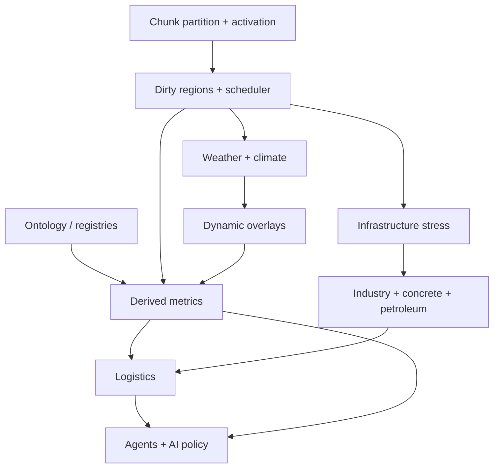

# Simulation expansion orchestrator `v1`

> **STATUS:** Draft **v1** — **scaffolding only**. Defines layers, ownership, and cross-links. Per-domain matrices and atomic step packs are **Pending** until anchored (see [`system_runbook_authoring_meta_v1.md`](system_runbook_authoring_meta_v1.md)).

Version: `v1.0.0`  
Audience: agents and leads wiring **ontology → simulation execution**.

**Entry index:** [`new_propsal_guide_may202608.md`](new_propsal_guide_may202608.md)

---

## 1. Purpose

Formalize **simulation ownership**, **system layering**, **execution ordering**, **migration strategy**, **runbook generation**, and hooks for **future AI interpretation** — without hardcoding gameplay in assets or buildings.

---

## 2. Core architectural rule

| Rule | Meaning |
|:---|:---|
| **Assets** | Define **capabilities and semantics** (what something *can* be / *means*). |
| **Systems** | **Interpret and execute** (state change, integration, emergent outcomes). |

**Anti-pattern:** buildings or JSON that encode fixed gameplay without a owning sim system.

---

## 3. Required simulation layers

| Layer | Purpose | Typical write surface |
|:---|:---|:---|
| **Ontology** | World facts (authoritative definitions) | Registries, stable names |
| **Derived metrics** | Computed interpretation | Chunk fields, ECS cache |
| **Dynamic overlay** | Temporary / fast-moving sim state | Overlays (mud, flood, smoke), not base terrain class |
| **Infrastructure** | Roads, power, pipes, rails | Graphs, components, stress |
| **Industry** | Production + consumption | Recipes, throughput, batches |
| **Logistics** | Movement + throughput | Convoys, queues, capacity |
| **Agent layer** | Local incidents + events | ECS agents, incident messages |
| **Strategic field** | Large-scale pressure / flow | Statistical fields, LOD2 |
| **Damage / decay** | Degradation | Integrity, maintenance |
| **Weather / climate** | Environmental forcing | Climate → regional → chunk weather |
| **AI interpretation** | Planning + adaptation | Reads fields/policies; writes intents |

---

## 4. Dependency sketch (high level)

**Rule:** **Weather** (and similar) must **not** directly mutate terrain ontology. Path: **weather → overlays / derived metrics → systems** (mobility, power, ecology, etc.).

---

## 5. Execution & scale (see chunk scheduler)

For **100k+ field entities** and **large worlds**, chunk-local **FixedUpdate** scheduling, **dirty propagation**, and **LOD tiers** are mandatory. Canonical detail: [`chunk_scheduler_runbook_v1.md`](chunk_scheduler_runbook_v1.md).

---

## 6. Domain runbooks (implementations)

| Domain | Runbook |
|:---|:---|
| Weather | [`weather_simulation_runbook_v1.md`](weather_simulation_runbook_v1.md) |
| Flora / ecology | [`flora_ecology_runbook_v1.md`](flora_ecology_runbook_v1.md) |
| Fire / ecology + VFX split | [`fire_ecology_simulation_runbook_v1.md`](fire_ecology_simulation_runbook_v1.md) |
| Chunk scheduler + persistence | [`chunk_scheduler_runbook_v1.md`](chunk_scheduler_runbook_v1.md) |
| Infrastructure + environment | [`infrastructure_environment_integration_v1.md`](infrastructure_environment_integration_v1.md) |
| Concrete | [`concrete_industry_sim_runbook_v1.md`](concrete_industry_sim_runbook_v1.md) |
| Asset audit | [`asset_system_audit_runbook_v1.md`](asset_system_audit_runbook_v1.md) |
| Petroleum | [`petroleum_industry_simulation_runbook_v1.md`](petroleum_industry_simulation_runbook_v1.md) |
| Petroleum UI | [`ui/petroleum_industry_ui_snippet_v1.md`](ui/petroleum_industry_ui_snippet_v1.md) |
| Python asset tools | [`python_asset_tools_alignment_runbook_v1.md`](python_asset_tools_alignment_runbook_v1.md) |

---

## 7. Invariants (program-wide)

1. **Single owner per interpretation** — each asset type maps to **one** primary runtime owner (audit runbook).  
2. **Determinism default** — same seed + same committed configs ⇒ same sim outcome for scoped tests.  
3. **UI boundary** — panels write **policy / settings resources**; they do not mutate routing graphs or agent internals directly (see [`ui_boundary_guide_v1.md`](ui_boundary_guide_v1.md)).  
4. **Persistence policy** — explicit per layer: what saves vs recomputes (chunk runbook).  

---

## 8. Step packs

Umbrella index: [`../matrix/simulation_expansion/runbook/README.md`](../matrix/simulation_expansion/runbook/README.md) — **S0** [`s0_steps_v1.md`](../matrix/simulation_expansion/runbook/s0_steps_v1.md), **S1** [`s1_steps_v1.md`](../matrix/simulation_expansion/runbook/s1_steps_v1.md), **S2** [`s2_steps_v1.md`](../matrix/simulation_expansion/runbook/s2_steps_v1.md).

**Sequencing:** **S0** (asset audit) before **broad S8** (Python asset tools) so editor taxonomies mirror **declared** engine ownership. **S0** and **S1** (chunk scheduler) may run **in parallel**; **S2** (weather) and **S8** may also run **in parallel** — see [`new_propsal_guide_may202608.md`](new_propsal_guide_may202608.md) §5.

When a domain gains a matrix, add phased step packs per [`system_runbook_authoring_meta_v1.md`](system_runbook_authoring_meta_v1.md).

---

## 9. Master direction

Target: **semantic world model** + **infrastructure simulation** + **field economics** + **hybrid agent simulation** + **environmental systems** + **chunked LOD ECS** — not a traditional RTS-only unit simulator.
