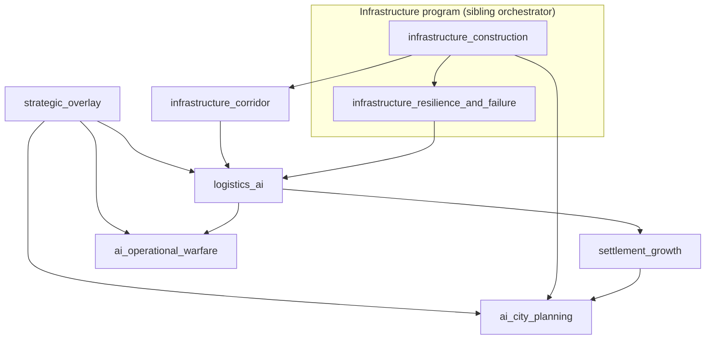

# Strategic fields and AI orchestrator `v1`

> **STATUS:** Draft **v1** — indexes **field-driven strategy** and **AI planning** runbooks; child of [`simulation_expansion_orchestrator_v1.md`](simulation_expansion_orchestrator_v1.md).

Version: `v1.0.0`  
Audience: agents sequencing overlays, corridors, logistics AI, settlement/city AI, and operational warfare AI.

**Execution order** (detail + UI/research parallel tracks): [`strategic_program_execution_plan_v1.md`](strategic_program_execution_plan_v1.md)  
**Design doctrine (checklist):** [`doctrine_simulation_alignment_runbook_v1.md`](doctrine_simulation_alignment_runbook_v1.md)

---

## 1. Purpose

Provide a **single dependency graph** for runbooks that share:

- chunk/GPU **strategic overlays**
- **corridor** and network abstractions
- **logistics** reasoning
- **settlement** and **city** emergence
- **operational** (non-micro) **warfare AI**

So implementers do not start city AI before overlay + graph prerequisites exist.

---

## 2. Child runbooks (this orchestrator)

| Order hint | Runbook | Role |
|:---|:---|:---|
| 1 | [`strategic_overlay_runbook_v1.md`](strategic_overlay_runbook_v1.md) | Dynamic operational fields (recon, EW, logistics stress, etc.) |
| 2 | [`infrastructure_corridor_runbook_v1.md`](infrastructure_corridor_runbook_v1.md) | Corridor planning, costs, redundancy, degradation |
| 3 | [`logistics_ai_runbook_v1.md`](logistics_ai_runbook_v1.md) | AI routing, stockpiles, reroute, forecasting |
| 4 | [`settlement_growth_runbook_v1.md`](settlement_growth_runbook_v1.md) | Lifecycle, migration, sprawl, decline |
| 5 | [`ai_city_planning_runbook_v1.md`](ai_city_planning_runbook_v1.md) | Districts, utilities, defensive urbanism (consumes overlays) |
| 6 | [`ai_operational_warfare_runbook_v1.md`](ai_operational_warfare_runbook_v1.md) | Fronts as gradients, strikes, attrition (consumes overlays + logistics) |

**Note:** [`infrastructure_construction_runbook_v1.md`](infrastructure_construction_runbook_v1.md) and [`infrastructure_resilience_and_failure_runbook_v1.md`](infrastructure_resilience_and_failure_runbook_v1.md) are owned by [`infrastructure_and_research_orchestrator_v1.md`](infrastructure_and_research_orchestrator_v1.md); this orchestrator **depends** on them for real edges/nodes AI and overlays attach to.

---

## 3. Dependency sketch

---

## 4. Cross-cutting references

| Doc | Use |
|:---|:---|
| [`simulation_expansion_orchestrator_v1.md`](simulation_expansion_orchestrator_v1.md) | Parent: layers, invariants, domain index |
| [`doctrine_simulation_alignment_runbook_v1.md`](doctrine_simulation_alignment_runbook_v1.md) | Phased realism targets and anti-patterns |
| [`chunk_scheduler_runbook_v1.md`](chunk_scheduler_runbook_v1.md) | Scale / dirty-region scheduling for fields |
| [`ui_boundary_guide_v1.md`](ui_boundary_guide_v1.md) | Gameplay UI vs dev egui |
| [`experience_layer_orchestrator_v1.md`](experience_layer_orchestrator_v1.md) | HUD, overlays UX, camera |
| Source draft (archive) | [`base_ai_runbook_draft.md`](base_ai_runbook_draft.md) |

---

## 5. Invariants (summary)

1. **Single owner per field meaning** — align overlay semantics with [`simulation_expansion_orchestrator_v1.md`](simulation_expansion_orchestrator_v1.md) §3.
2. **AI reads fields/graphs; writes intents** — not direct ad-hoc mutation of unrelated components.
3. **No micro-only AI in operational runbook** — unit micro stays out of scope unless a separate runbook says otherwise.
4. **`ASK:`** per [`system_runbook_authoring_meta_v1.md`](system_runbook_authoring_meta_v1.md) when anchors or matrices are missing.
