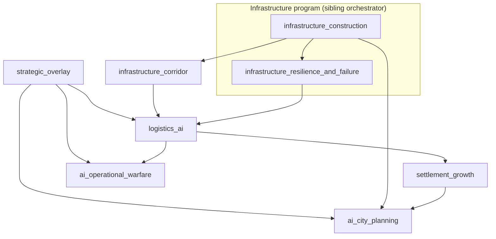

# Strategic fields and AI orchestrator `v1`

> **STATUS:** Draft **v1** — indexes **field-driven strategy** and **AI planning** runbooks; child of [`simulation_expansion_orchestrator_v1.md`](simulation_expansion_orchestrator_v1.md).

Version: `v1.0.0`  
Audience: agents sequencing overlays, corridors, logistics AI, settlement/city AI, and operational warfare AI.

**Bundled plugin (engine):** [`StrategicFieldsAndAiPlugin`](../../src/strategic/program.rs) = [`StrategicFieldsPlugin`](../../src/strategic/plugin.rs) (overlays, `StrategicFieldPipeline` ordering, transport→overlay inject) + [`InfrastructureGraphBridgePlugin`](../../src/strategic/infrastructure_graph.rs) (mirror of [`LogisticsGraph`](../../src/strategic/mod.rs) for construction/resilience consumers) + [`StrategicSimulationPlugin`](../../src/strategic/sim.rs) (coupling incl. `ChunkSimLod` dormant path + optional `ChunkWeather` recon factor, settlement, corridor wear, aggregates). Full engine: [`StrategicFieldPipeline::GraphSync`](../../src/strategic/plugin.rs) runs **after** [`TransportSchedule::CostCache`](../../src/systems/transport/mod.rs) ([`engine_with_worldgen.rs`](../../src/engine/engine_with_worldgen.rs)). Wired from [`EnginePlugin`](../../src/engine/engine_with_worldgen.rs) and [`world_generator`](../../src/bin/world_generator.rs).

---

## 1. Purpose

Provide a **single dependency graph** for runbooks that share:

- chunk/GPU **strategic overlays**
- **corridor** and network abstractions
- **logistics** reasoning
- **settlement** and **city** emergence
- **operational** (non-micro) **warfare AI**

So implementers do not start city AI before overlay + graph prerequisites exist.

---

## 2. Child runbooks (this orchestrator)

| Order hint | Runbook | Role |
|:---|:---|:---|
| 1 | [`strategic_overlay_runbook_v1.md`](strategic_overlay_runbook_v1.md) | Dynamic operational fields (recon, EW, logistics stress, etc.) |
| 2 | [`infrastructure_corridor_runbook_v1.md`](infrastructure_corridor_runbook_v1.md) | Corridor planning, costs, redundancy, degradation |
| 3 | [`logistics_ai_runbook_v1.md`](logistics_ai_runbook_v1.md) | AI routing, stockpiles, reroute, forecasting |
| 4 | [`settlement_growth_runbook_v1.md`](settlement_growth_runbook_v1.md) | Lifecycle, migration, sprawl, decline |
| 5 | [`ai_city_planning_runbook_v1.md`](ai_city_planning_runbook_v1.md) | Districts, utilities, defensive urbanism (consumes overlays) |
| 6 | [`ai_operational_warfare_runbook_v1.md`](ai_operational_warfare_runbook_v1.md) | Fronts as gradients, strikes, attrition (consumes overlays + logistics) |

**Note:** [`infrastructure_construction_runbook_v1.md`](infrastructure_construction_runbook_v1.md) and [`infrastructure_resilience_and_failure_runbook_v1.md`](infrastructure_resilience_and_failure_runbook_v1.md) are owned by [`infrastructure_and_research_orchestrator_v1.md`](infrastructure_and_research_orchestrator_v1.md); this orchestrator **depends** on them for real edges/nodes AI and overlays attach to.

---

## 3. Dependency sketch

```mermaid
flowchart TB
  subgraph infra_prog["Infrastructure program (sibling orchestrator)"]
    IC[infrastructure_construction]
    IR[infrastructure_resilience_and_failure]
    IC --> IR
  end

  SO[strategic_overlay]
  COR[infrastructure_corridor]
  LAI[logistics_ai]
  SG[settlement_growth]
  CITY[ai_city_planning]
  WAR[ai_operational_warfare]

  IC --> COR
  SO --> LAI
  COR --> LAI
  IR --> LAI
  LAI --> SG
  SO --> CITY
  IC --> CITY
  SG --> CITY
  SO --> WAR
  LAI --> WAR
```

---

## 4. Cross-cutting references

| Doc | Use |
|:---|:---|
| [`simulation_expansion_orchestrator_v1.md`](simulation_expansion_orchestrator_v1.md) | Parent: layers, invariants, domain index |
| [`doctrine_simulation_alignment_runbook_v1.md`](doctrine_simulation_alignment_runbook_v1.md) | Phased realism targets and anti-patterns |
| [`chunk_scheduler_runbook_v1.md`](chunk_scheduler_runbook_v1.md) | Scale / dirty-region scheduling for fields |
| [`ui_boundary_guide_v1.md`](ui_boundary_guide_v1.md) | Gameplay UI vs dev egui |
| [`experience_layer_orchestrator_v1.md`](experience_layer_orchestrator_v1.md) | HUD, overlays UX, camera |
| Source draft (archive) | [`base_ai_runbook_draft.md`](base_ai_runbook_draft.md) |

---

## 5. Invariants (summary)

1. **Single owner per field meaning** — align overlay semantics with [`simulation_expansion_orchestrator_v1.md`](simulation_expansion_orchestrator_v1.md) §3.
2. **AI reads fields/graphs; writes intents** — not direct ad-hoc mutation of unrelated components.
3. **No micro-only AI in operational runbook** — unit micro stays out of scope unless a separate runbook says otherwise.
4. **`ASK:`** per [`system_runbook_authoring_meta_v1.md`](system_runbook_authoring_meta_v1.md) when anchors or matrices are missing.

---

## 6. Reconciling “6 + orchestrator” vs “2 orchestrators / 8 runbooks”

- **This orchestrator lists 6 child runbooks** because [`base_ai_runbook_draft.md`](base_ai_runbook_draft.md) (archival) contained **six topical bundles**: city, operational warfare, logistics, strategic overlays, corridors, settlements. Each bundle became **one** `*_runbook_v1.md` above.
- **A second program orchestrator** already exists beside this one: [`infrastructure_and_research_orchestrator_v1.md`](infrastructure_and_research_orchestrator_v1.md) (construction, resilience, research capability). Strategic AI **depends** on it for real nodes/edges; it is not duplicated inside the 6.
- **“8”** is best read as **6 (strategic stack) + 2 (construction + resilience)** under the **infra/research** parent, *or* as **6 + research + construction** as three “pillars”—not as “two missing strategic runbooks.” If you had a different 8 in mind, add it explicitly here as `ASK:` once named.

---

## 7. Base “four docs” — where authority lives and what still gaps

| Source draft | Canonical authority today | Coverage vs the 6 runbooks |
|:---|:---|:---|
| [`base_ai_runbook_draft.md`](base_ai_runbook_draft.md) | **§2 table** — these 6 runbooks | Intended full coverage of the pasted bundles; **§8** maps headings → runbook. |
| [`base_doctrine_thoery.md`](base_doctrine_thoery.md) | [`doctrine_simulation_alignment_runbook_v1.md`](doctrine_simulation_alignment_runbook_v1.md) + [**`ai_operational_warfare_runbook_v1.md`**](ai_operational_warfare_runbook_v1.md) | **Deep** drone roles, EW effects chain, detection chain, “population stability / info war” — only **partly** reflected in code (round tests + stubs). **Gap:** explicit overlay channels + systems for EW and richer drone ecosystem unless folded into [`strategic_overlay_runbook_v1.md`](strategic_overlay_runbook_v1.md) **R5+**. |
| [`base_reserch_draft.md`](base_reserch_draft.md) | [`infrastructure_and_research_orchestrator_v1.md`](infrastructure_and_research_orchestrator_v1.md) → [`research_capability_ecosystem_runbook_v1.md`](research_capability_ecosystem_runbook_v1.md) | **Out of scope** for the 6 — belongs to infra/research program, not this orchestrator. |
| [`base_ui_direction_principls.md`](base_ui_direction_principls.md) | [`experience_layer_orchestrator_v1.md`](experience_layer_orchestrator_v1.md), [`ui_operational_direction_runbook_v1.md`](ui_operational_direction_runbook_v1.md) | **Gap:** command-table layout + rich bottom context tray. **Progress (2026-05-10):** simulation HUD — strategic strip compact mode + **overlay policy toggles** (routing congestion / EW proxy scalars) wired to [`StrategicOverlayDisplayPolicy`](../../src/strategic/schedule.rs). |

**Cross-runbook gaps from the archived AI draft (not yet own runbook rounds):** GPU overlay **UX** knobs (draft “Overlay UX”); **adaptive rebuilding** — *partial:* [`CityPlanningHints::adaptive_rebuild_pressure`](../../src/strategic/sim.rs) + settlement `adaptation_reserve` drift (§9); still open: district-scale rebuild intents and construction book coupling; **logistics forecasting** hooked to real production/stockpile ECS; **informal settlements** / **dynamic adaptation** scalars on `SettlementSite` or successors.

---

## 8. `base_ai_runbook_draft.md` bundle → runbook map (traceability)

Rough order in the archive file ≈ six pasted specs:

| Archive block (headings) | Runbook |
|:---|:---|
| City formation, districts, utilities, defensive urbanism, overlay inputs | [`ai_city_planning_runbook_v1.md`](ai_city_planning_runbook_v1.md) |
| Warfare layers, fronts, strikes, attrition, drone doctrine | [`ai_operational_warfare_runbook_v1.md`](ai_operational_warfare_runbook_v1.md) |
| Logistics priorities, routing, stockpiles, forecasting | [`logistics_ai_runbook_v1.md`](logistics_ai_runbook_v1.md) |
| Overlay categories, composition, GPU/UX | [`strategic_overlay_runbook_v1.md`](strategic_overlay_runbook_v1.md) |
| Corridor types, scoring, redundancy, degradation | [`infrastructure_corridor_runbook_v1.md`](infrastructure_corridor_runbook_v1.md) |
| Lifecycle, sprawl, migration, informal settlements, ecology | [`settlement_growth_runbook_v1.md`](settlement_growth_runbook_v1.md) |

---

## 9. Open wiring / implementation backlog (engineering)

Check off as code catches up to the runbooks. **Owning code:** [`StrategicFieldsAndAiPlugin`](../../src/strategic/program.rs), [`strategic/sim.rs`](../../src/strategic/sim.rs), [`strategic/plugin.rs`](../../src/strategic/plugin.rs), [`strategic/logistics_net.rs`](../../src/strategic/logistics_net.rs), [`strategic/transport_bridge.rs`](../../src/strategic/transport_bridge.rs), [`strategic/infrastructure_graph.rs`](../../src/strategic/infrastructure_graph.rs).

- [x] **Corridors (partial):** [`CorridorConstructionBook`](../../src/strategic/construction_book.rs) + per-entity [`CorridorConstructionStatus`](../../src/strategic/construction_book.rs) scale **logistics capacity**, **transport splat**, and **wear** by phase (`Planned` / `InProgress` / `Completed`). Still open: **authoritative corridor spans** from construction authoring / bake beyond transport directory stubs.
- [x] **Overlays (partial — R5+ direction):** Transport endpoint splat + [`StrategicOverlayDisplayPolicy`](../../src/strategic/schedule.rs); HUD toggles; **dormant** [`ChunkSimLod`](../../src/systems/chunk_sim_lod.rs) + dirty-chunk coupling (`StrategicOverlayCouplingScratch`); **`ChunkWeather` → recon** damp in [`strategic_fields_coupling_tick`](../../src/strategic/sim.rs). Still open: morale/instability channel, diffusion, GPU overlay UX knobs.
- [x] **Logistics AI (partial):** [`LogisticsAiRuntime`](../../src/strategic/sim.rs) aggregates transport congestion, edge damage, [`ResourceStorage`](../../src/entities/production/core/resources.rs) fill, [`ResourceProducer`](../../src/entities/production/core/resources.rs) output, and **`ProductionManifest` domain coverage** (resource from [`ManufacturingCorePlugin`](../../src/entities/production/core/manufacturing_plugin.rs)). Still open: SKU-level manifests, production/consumption **forecasting** beyond proxies, stockpile coupling to [`LogisticsGraph`](../../src/strategic/mod.rs).
- [x] **Settlements (partial):** [`settlement_and_corridor_tick`](../../src/strategic/sim.rs) applies [`CityPlanningHints::adaptive_rebuild_pressure`](../../src/strategic/sim.rs) to `adaptation_reserve` drift + informal-settlement pressure; socio signals still use overlay/producer aggregates in [`refresh_settlement_socio_signals`](../../src/strategic/sim.rs). Full **jobs/housing** ECS components remain future work.
- [x] **City planning (partial):** [`strategic_city_planning_hints_tick`](../../src/strategic/sim.rs) aggregates **multi-slot** overlay logistics/threat for [`site_score`](../../src/strategic/runbook_rounds/city_planning.rs) and boosts [`utility_redundancy_hint`](../../src/strategic/sim.rs) from [`InfrastructureCorridor`](../../src/strategic/sim.rs) count. District/utility graph from construction runbook still future.
- [x] **Operational (partial):** Theater means already span all slots in [`strategic_fields_coupling_tick`](../../src/strategic/sim.rs); city **adaptive rebuild** now uses **peak** mean threat across active faction slots. Multi-slot strike queue remains future.
- [x] **Experience layer (partial):** In-game HUD — strategic ops line, **compact strip**, congestion/EW overlay toggles ([`in_game_hud.rs`](../../src/gui/in_game_hud.rs), keybindings). Still open: command-table shell, inspector tray, corridor-centric context panel.

When a row closes, reference the **runbook round** or **integration test** name in the PR / commit message.
