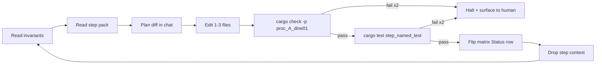
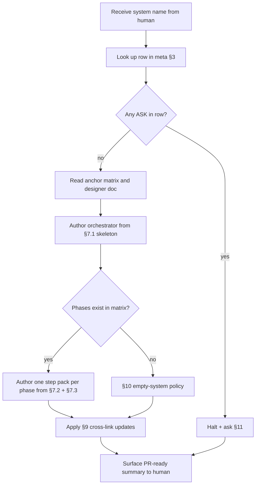

# System runbook authoring (meta-runbook) `v1`

> **STATUS:** **Authoring harness for lower-power agents.** Use this doc to spawn a per-system execution runbook **modeled after** [`terrain_unification_runbook_v1.md`](terrain_unification_runbook_v1.md) (the canonical example). Audience is intentionally an agent with a **small context window and limited reasoning depth** — every choice that the agent could get wrong is **decided up front here**.

Version: `v1.1.0`
Audience: agents producing `<system>_runbook_v1.md` + `runbook/` step packs for one of the **target systems** in §3, including **paired** terrain-adjacent runbooks ([`terrain_paired_runbooks_queue_v1.md`](terrain_paired_runbooks_queue_v1.md)).

---

## Reasoning-aid stance (read first)

This meta-runbook follows three rules to make a low-power agent reliable:

1. **Front-load decisions.** Filename, folder, schema, frontmatter, halt conditions, verify command, phase letters — **all decided in §§4–6 below**. The agent does **not** invent any of them.
2. **Copy, don't synthesize.** §7 ships a fill-in-the-blank skeleton. The agent fills variables only; structure is fixed.
3. **`ASK:` instead of guess.** Any field not pre-decided here is `ASK:` and surfaces to the human. Never inferred.

If a step in this meta-runbook would require the agent to **invent a new architectural decision**, halt and ask the human — see §11.

---

## 1. What you are producing

For one **target system** (chosen from §3) the agent produces **markdown only**:

1. **Orchestrator** at `prompts/guides/<system>_runbook_v1.md` (mirrors [`terrain_unification_runbook_v1.md`](terrain_unification_runbook_v1.md)).
2. **Step-pack folder** at `prompts/matrix/<area>/runbook/` containing:
   - `README.md` (index)
   - One `<phase>_steps_v1.md` file **per implementation phase** the system actually has. If the system has no Pending phases yet, write **only the orchestrator + an empty step-pack folder with a placeholder README** — see §10 *Empty-system policy*.
3. Cross-link updates in the system's existing matrix and designer README — see §9.

**No Rust touched.** No new Rust types proposed. No `Cargo.toml` edits. The orchestrator only **prescribes** Rust edits for a later, separate pass (just like the terrain runbook does).

---

## 2. Canonical model to copy

The **only** acceptable structural model is:

| Doc | Path | Role |
|:---|:---|:---|
| Orchestrator | [`prompts/guides/terrain_unification_runbook_v1.md`](terrain_unification_runbook_v1.md) | §§1 invariants · 2 anchor set · 3 step schema · 4 phase index · 5 loop · 6 halt · 7 glossary · 8 cross-links · 9 prompt fragment |
| Step-pack README | [`prompts/matrix/terrain_biome/runbook/README.md`](../matrix/terrain_biome/runbook/README.md) | Index + sequencing + invariants reminder |
| Step pack | [`prompts/matrix/terrain_biome/runbook/u3_steps_v1.md`](../matrix/terrain_biome/runbook/u3_steps_v1.md) | Atomic step shape: Goal · Anchor reads · Touch · Verify · Matrix update · DoD · Open carries |

**Do not innovate on this shape.** Copy it section-for-section. Section numbering and headings stay identical so future agents can find anchors by their stable position.

---

## 3. Target systems and pre-filled paths

When the human picks a system, copy the row's values into the variables in §7. **Do not invent paths.** If a row has `ASK:`, surface to human before authoring.

| System | Phase letter | Anchor matrix | Anchor designer doc(s) | Output orchestrator | Output step-pack folder |
|:---|:---:|:---|:---|:---|:---|
| **Power** | **P** | [`prompts/matrix/production/power_legacy_functional_parity_v1.md`](../matrix/production/power_legacy_functional_parity_v1.md), [`production_migration_matrix_v1.md`](../matrix/production/production_migration_matrix_v1.md) | [`production_economy/spec/04_power_damage_repair.md`](../designer_questions/production_economy/spec/04_power_damage_repair.md), [`spec/06_power_plants_data_scripting_v1.md`](../designer_questions/production_economy/spec/06_power_plants_data_scripting_v1.md), [`power_damage_ui_persistence_v1.md`](../designer_questions/production_economy/power_damage_ui_persistence_v1.md) | `prompts/guides/power_runbook_v1.md` | `prompts/matrix/production/runbook/` |
| **Weapons / munitions** | **W** | `ASK:` (no dedicated weapons matrix yet — confirm whether to use `strategic_platforms/` matrix or create one) | [`strategic_platforms/spec/03_munitions_weapons.md`](../designer_questions/strategic_platforms/spec/03_munitions_weapons.md), [`platforms_ew_munitions_v1.md`](../designer_questions/strategic_platforms/platforms_ew_munitions_v1.md) | `prompts/guides/weapons_runbook_v1.md` | `prompts/matrix/strategic_platforms/runbook/` *(folder ASK: confirm)* |
| **Buildings** | **B** | `ASK:` (no dedicated matrix; building types index lives in `assets/configs/buildings/_building_types_index.json`) | [`production_economy/spec/01_data_model_manifest.md`](../designer_questions/production_economy/spec/01_data_model_manifest.md), [`production_economy/spec/02_tools_ui_production.md`](../designer_questions/production_economy/spec/02_tools_ui_production.md) | `prompts/guides/buildings_runbook_v1.md` | `prompts/matrix/production/runbook/` *(shared with Power — verify with human)* |
| **Construction** | **C** | `ASK:` | `ASK:` (no dedicated designer doc found — surface to human; do not author until anchor exists) | `prompts/guides/construction_runbook_v1.md` | `ASK:` |
| **Navigation** | **N** | `ASK:` (no dedicated navigation matrix yet) | [`navigation/spec/README.md`](../designer_questions/navigation/spec/README.md), [`pathfinding_hierarchical_v1.md`](../designer_questions/navigation/pathfinding_hierarchical_v1.md), [`implementation_questions_v1.md`](../designer_questions/navigation/implementation_questions_v1.md) | `prompts/guides/navigation_runbook_v1.md` | `prompts/matrix/navigation/runbook/` *(create folder; matrix folder ASK: needs nav matrix first)* |
| **Factions** | **F** | [`faction_editor_tooling_matrix_v1.md`](../designer_questions/factions/faction_editor_tooling_matrix_v1.md) (lives in designer dir; **do not move it**, link from runbook) | [`factions/faction_editor/README.md`](../designer_questions/factions/faction_editor/README.md) and `00`–`05` siblings, [`implementation_questions_v1.md`](../designer_questions/factions/implementation_questions_v1.md) | `prompts/guides/factions_runbook_v1.md` | `prompts/matrix/factions/runbook/` *(create folder)* |
| **Diplomacy / bargaining** | **D** | `ASK:` (no matrix yet) | [`factions/diplomacy_bargaining_reference_outline_v1.md`](../designer_questions/factions/diplomacy_bargaining_reference_outline_v1.md) **(non-authoritative)** + factions data-model docs | `prompts/guides/diplomacy_runbook_v1.md` | `ASK:` (system not yet specced — see §10 empty-system policy) |

If a system row has any `ASK:` that the runbook **cannot** be authored without, **halt and surface** before producing any file.

---

## 4. Front-loaded decisions (no agent reasoning required)

Use these **verbatim** unless the system row in §3 overrides them.

| Decision | Value |
|:---|:---|
| Doc style | Markdown, GFM tables, mermaid for one diagram in orchestrator §5 only |
| Filename — orchestrator | `<system>_runbook_v1.md` (snake_case, version suffix `_v1`) |
| Filename — step packs | `<phase_letter><N>_steps_v1.md` (e.g. `p3_steps_v1.md`) |
| Filename — step-pack README | `README.md` |
| Phase letter | First letter of system name (see §3 column) |
| Step IDs | `<phase_letter><N>-S<NN>` zero-padded (e.g. `P3-S01`, `F3-S07`) |
| Atomic step size | 1–3 file Touch list. Never more. |
| Anchor reads cap | **5 paths per step.** Sixth path ⇒ split the step. |
| Verify command (default) | `cargo check -p proc_A_dine01` + one named `cargo test ... -- --nocapture` |
| Halt-on-fail rule | Two consecutive failures of build OR test on a single step ⇒ halt. |
| Status vocabulary | `Pending`, `Partial`, `Applied` (matches matrices) |
| Determinism contract | Same seed + same committed config ⇒ identical output. Default for all systems. |
| Save policy | **Names not raw ids.** Default for all systems. Override only with `ASK:`. |
| Hot-reload | `Assets<T>` watcher only. F8/asset-editor edits files; engine does not have a second mutation path. |
| Hard upper bound on phases | **5 phases per system** for v1 (numbered after the system's matrix phase letters when one exists; otherwise 1..N). More phases ⇒ split the system. |

---

## 5. Invariants every per-system runbook MUST include (orchestrator §1)

Lift these as-is into the new orchestrator's §1, then add system-specific ones below them. The agent does **not** rewrite these:

1. **Single source of truth per concept.** No parallel enum/struct; reuse existing canonical types from the system's matrix (e.g. `TerrainClass`, `BuildingTypeId`, `FactionId`).
2. **No second classifier / resolver.** If the system has a canonical decision function, call it; do not write a parallel one.
3. **Determinism contract** — see §4.
4. **Save = names, not ids** — see §4.
5. **Hot-reload via `Assets<T>`** — see §4.
6. **Schema on disk:** JSON for flat designer-edited tables; RON for DSL-style (rules, predicates). If the system has neither, **default to JSON** and `ASK:` if the human wants RON.
7. **`ASK:` instead of inventing** numbers, paths, or types.

System-specific invariants the agent **may** add to §1: any **already written down** in the anchor matrix or designer doc. The agent **must not** invent new invariants.

---

## 6. Halt rules (orchestrator §6 — copy verbatim)

```
- Two consecutive build/test failures on a single step ⇒ stop, surface diff + error, do not advance phase.
- A step that requires editing more than the Touch list ⇒ stop, surface for split.
- Any invariant in §1 violated ⇒ stop, revert, surface for human review.
- If a matrix row to flip does not yet exist ⇒ stop, do NOT invent a new row without explicit `ASK:`.
- If the per-system matrix does not exist yet ⇒ author orchestrator only, point all step-pack `Matrix update` lines at `ASK:`, and stop.
```

---

## 7. Skeletons (fill variables only)

### 7.1 Orchestrator skeleton

Copy this file structure literally into the new `<system>_runbook_v1.md`. **Variables in `{{double_braces}}`** are the only fields the agent fills.

```markdown
# {{system_title}} runbook `v1`

> **STATUS:** Documentation harness for executing **Rust phases {{phase_letter}}{{first_phase}}–{{phase_letter}}{{last_phase}}** of the {{system_title}} system. **No Rust touched yet.** Designed for a small-context-window agent looping atomic steps with verification at each one.

Version: `v1.0.0`
Audience: agents (and humans) implementing the engine side of {{system_title}}.

---

## How to use this doc (loop protocol)

This file is the **entrypoint**. Per-phase atomic step packs live at [`{{step_pack_folder_relative}}`]({{step_pack_folder_relative}}/README.md).



## 1. Invariants (re-read every loop)

(Lift §5 of the meta-runbook verbatim, then append system-specific invariants from {{anchor_matrix}} only.)

## 2. Anchor file set (≤5 paths per step)

1. This runbook §§1, 2, 3, 5.
2. {{anchor_matrix}} relevant sections.
3. {{anchor_designer_doc}} (designer narrative).
4. The current step pack under [`{{step_pack_folder_relative}}/`]({{step_pack_folder_relative}}/README.md).
5. The single `src/...rs` (or `Cargo.toml` / asset) the step is editing.

## 3. Atomic step schema

(Identical to terrain runbook §3 — copy verbatim.)

## 4. Phase index

| Phase | Step pack | Status |
|:---:|:---|:---:|
| **{{phase_letter}}{{first_phase}}** | [`{{step_pack_folder_relative}}/{{phase_letter_lower}}{{first_phase}}_steps_v1.md`]({{step_pack_folder_relative}}/{{phase_letter_lower}}{{first_phase}}_steps_v1.md) | Pending |
| ... | ... | ... |

## 5. Loop protocol (per-step)

(Copy terrain runbook §5 verbatim.)

## 6. Backout / halt rules

(Copy meta-runbook §6 verbatim.)

## 7. Glossary

| Term | Canonical symbol / file |
|:---|:---|
| ... | (lift from {{anchor_matrix}} §1 / Concept↔symbol matrix) |

## 8. Cross-links

| Doc | Purpose |
|:---|:---|
| {{anchor_matrix}} | Source of truth for phase status |
| {{step_pack_folder_relative}}/README.md | Step-pack index |
| {{anchor_designer_doc}} | Designer narrative + open Qs |
| (any reference outlines) | Non-authoritative brainstorms |

## 9. Prompt fragment for the executing agent

> Read [`prompts/guides/{{system}}_runbook_v1.md`]({{system}}_runbook_v1.md) §§1–6 first. Then open the active step pack and execute **one step at a time**, following the loop in §5. Do not advance phases until the previous phase is **Applied** in {{anchor_matrix}}. On any halt condition (§6), stop and surface to the human.
```

### 7.2 Step-pack README skeleton

```markdown
# {{system_title}} runbook — step packs

> **STATUS:** Index of atomic-step packs for **Rust phases {{phase_letter}}{{first_phase}}–{{phase_letter}}{{last_phase}}** of {{system_title}}. Pair with the orchestrator at [`../../../guides/{{system}}_runbook_v1.md`](../../../guides/{{system}}_runbook_v1.md) and the matrix at [`../{{anchor_matrix_basename}}`](../{{anchor_matrix_basename}}).

Version: `v1.0.0`

## Step packs

| Phase | Pack | Scope |
|:---:|:---|:---|
| **{{phase_letter}}{{first_phase}}** | [`{{phase_letter_lower}}{{first_phase}}_steps_v1.md`]({{phase_letter_lower}}{{first_phase}}_steps_v1.md) | (one-line scope from matrix phase row) |
| ... | ... | ... |

## Invariants reminder (full list in orchestrator §1)

(Bullet list of 6–8 invariants, copied from §5 of the meta-runbook, plus any system-specific ones.)

## Sequencing

Finish phase `{{phase_letter}}N` (matrix status **Applied**) before starting `{{phase_letter}}N+1`.
```

### 7.3 Step skeleton

```markdown
### {{phase_letter}}{{N}}-S{{NN}} {{slug}}

**Goal:** one sentence, present tense.

**Anchor reads:** ≤5 paths.

**Touch:**
- (1–3 paths with the symbol/name being added or modified)

**Verify:**
- `cargo check -p proc_A_dine01`
- `cargo test -p proc_A_dine01 {{named_test}} -- --nocapture`

**Matrix update:** which row of `{{anchor_matrix_basename}}` flips Status.

**Definition of done:**
- [ ] Build passes.
- [ ] Named test passes.
- [ ] Matrix Status row updated.
- [ ] No invariant from §1 broken.
```

---

## 8. Step-pack scoping rules

Use these guardrails to size each phase's step pack. **Do not invent steps** — derive each step from a single matrix row or a single canonical type.

| Rule | Resolution |
|:---|:---|
| One step = one canonical type / function / asset | Multi-symbol steps must be split. |
| Adding a Bevy `AssetLoader` | Always its **own** step (see U3-S04 in terrain). |
| Adding a Bevy `Plugin` | Always its **own** step (see U5-S02 in terrain). |
| Phase-close step | **Always last step of the phase**, named `{{phase_letter}}{{N}}-S{{NN}} phase close — matrix flip`. Touches matrix + orchestrator phase index. |
| Stub steps (no-op functions) | Allowed; each is its own step; `Matrix update` row flips to **Partial**, never **Applied**. |
| Optional/feature-gated content | Always behind a Cargo feature; phase-close marks **Partial**. |

---

## 9. Cross-link updates the agent must perform

After authoring orchestrator + step packs, the agent **must** add back-pointers in:

1. The system's anchor matrix — append a row to its cross-doc / cross-link table pointing at the new orchestrator and step-pack README.
2. The system's designer README — append a "Rust execution runbook" line.
3. [`prompts/matrix/README.md`](../matrix/README.md) — append `runbook/` mention to the system's row (only if the system has a row; if not, **do not invent one**).
4. **Paired** with terrain: add the partner row to [`terrain_unification_runbook_v1.md`](terrain_unification_runbook_v1.md) §8b and add a reciprocal link in the partner orchestrator §8. **Unpaired** systems do not link terrain unless promoted to §8b (see §12).

If any of the four targets does not exist for the system, skip that link and note it as `📎 ASK:` at the bottom of the orchestrator §8.

---

## 10. Empty-system policy (no Pending phases yet)

When the system in §3 has **no implementable phases** (e.g. Diplomacy with no matrix or types):

1. Author the **orchestrator only** — sections §§1, 2, 3, 5, 6 still apply.
2. §4 phase index becomes a single row: **`Pending — awaiting matrix authoring`**.
3. Create the step-pack folder containing only `README.md` with the line **"No step packs yet. Phase authoring is blocked on `<missing matrix>`. See `ASK:` items in the orchestrator §8."**.
4. The orchestrator §8 lists every blocking `ASK:` (matrix to author, designer doc to author, types to define).
5. Surface to human and halt. Do **not** speculatively author Rust steps for systems without a matrix.

---

## 11. Halt-and-ask protocol

A low-power agent should **prefer asking** over inventing. Use this template (markdown, surfaced to chat) any time §3 has `ASK:` or §10 conditions trigger:

```
HALT — runbook authoring blocked.

System: <name>
Missing anchor: <matrix path or designer doc path>
Reason: <one sentence>
Decision needed:
- Option A: <concrete>
- Option B: <concrete>

Default I will pick if unanswered after one prompt: <one of the options, or "stop and produce nothing">.
```

The agent does **not** advance until the human picks. It does not pick on its own.

---

## 12. Paired runbooks (terrain and siblings)

A **paired** runbook is one whose execution phases must stay in sync with another (typically [`terrain_unification_runbook_v1.md`](terrain_unification_runbook_v1.md) U3–U7). Inventory and discrete authoring steps: [`terrain_paired_runbooks_queue_v1.md`](terrain_paired_runbooks_queue_v1.md).

**Best practice (short):**

- Both orchestrators §8 list each other; one small **sync gate** table per pair (which terrain phase blocks which partner phase).
- Do not copy long invariants into both files — link to the single source (terrain §1 or the partner matrix).
- Bubble coupling questions to the **paired** matrix row or checklist item; use `ASK:` instead of silent drift.
- Author the paired orchestrator + step packs in **separate sessions** if needed; the queue Q0–Q6 is resumable.

**Quality gate add-on (with §14):** if the new book is listed in [`terrain_unification_runbook_v1.md`](terrain_unification_runbook_v1.md) §8b, the partner §8 **must** link back to terrain. Other systems (not paired) still avoid one-way terrain links unless the human adds them to §8b.

---

## 13. Reference-outline policy (non-authoritative dumps)

When the human supplies a long external prompt (e.g. game-theory primary directive, LLM rule-evolution memory tiers), park it as a **reference outline** under the relevant designer area, **not** in the runbook itself. Pattern is established by [`procedural_world_pipeline_reference_outline_v1.md`](../designer_questions/terrain_world/procedural_world_pipeline_reference_outline_v1.md).

| Outline | Path | Purpose |
|:---|:---|:---|
| LLM world evolution / memory tiers | [`../designer_questions/terrain_world/llm_world_evolution_reference_outline_v1.md`](../designer_questions/terrain_world/llm_world_evolution_reference_outline_v1.md) | Brainstorm for autonomous rule-edit loops on worldgen |
| Diplomacy / bargaining (Spaniel-style) | [`../designer_questions/factions/diplomacy_bargaining_reference_outline_v1.md`](../designer_questions/factions/diplomacy_bargaining_reference_outline_v1.md) | Bayesian beliefs, signaling, equilibrium reasoning, bargaining-failure causes |

Each outline:

- Opens with **"Non-authoritative. Brainstorm."**
- Maps external phrases to canonical repo names (or marks them `ASK:`).
- Spawns implementation questions and matrix rows in the proper authoritative docs — does **not** declare anything binding by itself.

When authoring a per-system runbook, the agent **may cite outlines under "non-authoritative"** but **must not** copy outline values into invariants or step `Touch` lists.

---

## 14. Per-system authoring workflow (the agent's loop)



---

## 15. Quality gate (self-check before surfacing)

Before declaring the runbook authored, the agent **must** verify each item below by reading the produced files. Failure on any item ⇒ revise before surfacing.

- [ ] Orchestrator has §§1–9 with the same headings as the terrain runbook.
- [ ] All step IDs match `<phase_letter><N>-S<NN>`.
- [ ] Every step has Goal · Anchor reads ≤5 · Touch ≤3 files · Verify · Matrix update · DoD checklist.
- [ ] No step `Touch` list exceeds 3 paths.
- [ ] No `Matrix update` invents a row.
- [ ] Phase-close step exists and is the **last** step of every phase.
- [ ] No Rust files in any `Touch` list invented by the agent (must come from anchor docs).
- [ ] No emojis.
- [ ] **Paired** (terrain §8b): partner §8 links back to terrain; **unpaired** systems do not add terrain links unless promoted in §8b.

---

## 16. Cross-links

| Doc | Purpose |
|:---|:---|
| [`terrain_unification_runbook_v1.md`](terrain_unification_runbook_v1.md) | **Canonical example** to model new runbooks after |
| [`bevy_asset_terrain_runbook_v1.md`](bevy_asset_terrain_runbook_v1.md) | **Paired example** (granular A1–A3 packs) |
| [`../matrix/terrain_biome/runbook/README.md`](../matrix/terrain_biome/runbook/README.md) | Reference step-pack index |
| [`../matrix/terrain_biome/runbook/u3_steps_v1.md`](../matrix/terrain_biome/runbook/u3_steps_v1.md) | Reference step pack (atomic step shape) |
| [`../designer_questions/terrain_world/llm_world_evolution_reference_outline_v1.md`](../designer_questions/terrain_world/llm_world_evolution_reference_outline_v1.md) | Non-authoritative LLM rule-evolution dump (worldgen) |
| [`../designer_questions/factions/diplomacy_bargaining_reference_outline_v1.md`](../designer_questions/factions/diplomacy_bargaining_reference_outline_v1.md) | Non-authoritative Spaniel/bargaining dump (factions/diplomacy) |
| [`../matrix/README.md`](../matrix/README.md) | Index of matrices (for `ASK:` resolutions about anchor matrices) |
| [`terrain_paired_runbooks_queue_v1.md`](terrain_paired_runbooks_queue_v1.md) | Paired terrain-adjacent runbooks: Q0–Q6 authoring steps + sync gates |

---

## 17. Prompt fragment for the executing agent

> Read [`system_runbook_authoring_meta_v1.md`](system_runbook_authoring_meta_v1.md) §§3, 4, 5, 6, 7, 9, 11, 12, 15 first. For terrain **paired** books, read [`terrain_paired_runbooks_queue_v1.md`](terrain_paired_runbooks_queue_v1.md) and run Q0–Q6. If §3 has `ASK:`, halt and use §11. Otherwise author orchestrator (§7.1) → step packs (§7.2 + §7.3 per phase) → cross-links (§9). Run the §15 self-check before surfacing. **Do not invent paths, types, or matrix rows.** When in doubt, halt and ask.
