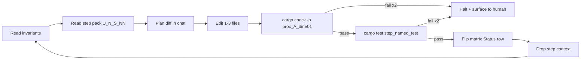

# Terrain unification runbook `v1`

> **STATUS:** Documentation harness for executing **Rust phases U3–U7** of the material / tag / rule unification. **U3** scaffolding lives in [`src/terrain/material/`](../../src/terrain/material/). Designed for a small-context-window agent looping atomic steps with verification at each one.

Version: `v1.0.2`
Audience: agents (and humans) implementing the engine side of the terrain-unification stack.

---

## How to use this doc (loop protocol)

This file is the **entrypoint**. It is intentionally short so it fits one context window. Per-phase atomic step packs live next to the matrix at [`../matrix/terrain_biome/runbook/`](../matrix/terrain_biome/runbook/README.md).

The agent runs **one step at a time**, then drops the step context and re-reads the **Invariants** + **Anchor file set** before the next step. This keeps quality stable across long runs on smaller models.



---

## 1. Invariants (re-read every loop)

These are **non-negotiable**. Violating any of them ends the loop and surfaces a halt to the human.

1. The per-chunk grid is **`ChunkCellMatrix`** — never `MigrationMatrix` (that name belongs to `prompts/matrix/`).
2. **`TerrainClass`** in [`src/terrain/biome.rs`](../../src/terrain/biome.rs) is reused as **`MaterialFamily`**. Do **not** create a parallel enum; alias if needed.
3. **`classify_biome(...)`** in [`src/terrain/biome.rs`](../../src/terrain/biome.rs) is the **only** biome classifier. Pipeline pass 3 must call it. No second classifier.
4. On disk:
   - `assets/config/terrain/material_registry.json` — JSON
   - `assets/config/terrain/tag_registry.json` — JSON
   - `assets/config/terrain/material_rules.ron` — RON
   Format **locked** in matrix §2; do not flip RON↔JSON without an `ASK:`.
5. **Saves use `MaterialDef.name` strings**, not raw `MaterialId(u16)`. Runtime ids are not stable across registry reloads.
6. F8 egui panel and `src/utils/asset_tools/` only **edit files**. The engine reloads via `Assets<T>` watchers. No second mutation path.
7. Determinism contract: `seed + committed registry/tags/rules/tuning files` ⇒ same `ChunkCellMatrix` and same materialize output.

---

## 2. Anchor file set (≤5 paths per step)

Every step pre-reads exactly this set, plus the one source file the step touches:

1. **This runbook** — sections 1, 2, 3, 5.
2. [`prompts/matrix/terrain_biome/material_unification_matrix_v1.md`](../matrix/terrain_biome/material_unification_matrix_v1.md) §§1, 3, 10 (concept↔symbol, pipeline, U-phase status).
3. [`prompts/designer_questions/terrain_world/material_tag_rule_system_v1.md`](../designer_questions/terrain_world/material_tag_rule_system_v1.md) (designer narrative).
4. The **current step pack** under [`runbook/`](../matrix/terrain_biome/runbook/README.md): one of `u3_steps_v1.md` … `u7_steps_v1.md`.
5. The single `src/...rs` (or `Cargo.toml` / asset) the step is editing.

If a step needs more than this, **stop and ask** — it is too large and needs splitting.

---

## 3. Atomic step schema

Every step in every pack uses this exact shape:

```
### U<phase>-S<NN> <slug>

**Goal:** one sentence, present tense.

**Anchor reads:** ≤5 paths (see §2 above).

**Touch:** 1–3 paths with the symbol/name being added or modified.

**Verify:**
- `cargo check -p proc_A_dine01`
- `cargo test -p proc_A_dine01 <named_test> -- --nocapture`

**Matrix update:** which row(s) of `material_unification_matrix_v1.md` flip Status.

**Definition of done:**
- [ ] Build passes.
- [ ] Named test passes.
- [ ] Matrix Status row updated.
- [ ] No invariant from §1 broken.
```

A step that cannot fit this shape is too big — split it before executing.

---

## 4. Phase index

Mirrors [`material_unification_matrix_v1.md`](../matrix/terrain_biome/material_unification_matrix_v1.md) §10. Update **here and in the matrix** when a phase completes.

| Phase | Step pack | Status (mirror of matrix §10) |
|:---:|:---|:---:|
| **U0** | n/a (markdown only) | Applied |
| **U1** | n/a (committed example assets) | Applied |
| **U2** | n/a (Python asset-editor pages) | Applied |
| **U3** | [`runbook/u3_steps_v1.md`](../matrix/terrain_biome/runbook/u3_steps_v1.md) | **Applied** |
| **U4** | [`runbook/u4_steps_v1.md`](../matrix/terrain_biome/runbook/u4_steps_v1.md) | Pending |
| **U5** | [`runbook/u5_steps_v1.md`](../matrix/terrain_biome/runbook/u5_steps_v1.md) | Pending |
| **U6** | [`runbook/u6_steps_v1.md`](../matrix/terrain_biome/runbook/u6_steps_v1.md) | Pending |
| **U7** | [`runbook/u7_steps_v1.md`](../matrix/terrain_biome/runbook/u7_steps_v1.md) | Pending |

**Sequencing rule:** finish U*N* before starting U*N+1*. U6 is **optional**; U7 only begins once U5 is fully Applied.

---

## 5. Loop protocol (per-step)

1. **Anchor:** read §1 invariants and §2 anchor set in this file.
2. **Step:** open the active step in its `u<N>_steps_v1.md` pack.
3. **Plan:** in chat, list the diff you intend to make. Do **not** open more files than the anchor set.
4. **Edit:** modify only the `Touch` paths.
5. **Verify (build):** run `cargo check -p proc_A_dine01`. If it fails twice, **halt** (see §6).
6. **Verify (test):** run the named test. If it fails twice, **halt**.
7. **Matrix:** flip the Status row(s) listed in the step.
8. **Commit hint:** suggest a one-line commit message in chat (do **not** auto-commit unless the human confirms).
9. **Drop context:** discard step-specific reading; loop back to §1.

---

## 6. Backout / halt rules

- **Two consecutive failures** of `cargo check` *or* the named test on a single step ⇒ stop, surface the failing diff and error to the human, do not advance the phase.
- A step that requires editing more than the `Touch` list ⇒ stop, surface for split.
- Any invariant in §1 violated ⇒ stop, revert the offending hunk, surface for human review.
- If the matrix row to flip does not yet exist ⇒ stop, do not invent a new row without explicit `ASK:`.

---

## 7. Glossary (canonical names)

| Term | Canonical symbol / file |
|:---|:---|
| Material family (compile-time enum) | `TerrainClass` in [`src/terrain/biome.rs`](../../src/terrain/biome.rs) |
| Soft biome blend | `BiomeWeights`, `BiomeId` in [`src/terrain/biome.rs`](../../src/terrain/biome.rs) |
| Classifier | `classify_biome(height, moisture, temperature)` |
| Threshold tuning | `BiomeTuning` + [`assets/config/world_gen_tuning.json`](../../assets/config/world_gen_tuning.json) |
| Runtime material variant | `MaterialId(u16)` *(introduced in U3)* |
| Material definition | `MaterialDef` *(U3)* |
| Material registry | `MaterialRegistry` (`Asset` + JSON) *(U3)* |
| Tag id / set | `TagId(u16)`, `TagSet`, `TagRegistry` *(U3)* |
| Rule | `MaterialRule`, `RuleSet` (RON) *(U3)* |
| Resolver | `resolve_material(...)` *(U3)* |
| Per-chunk grid | `ChunkCellMatrix` *(U4)* |
| Materialized output | `MaterializedChunk { materials: Vec<MaterialId> }` *(U5)* |
| Plugin | `MaterialUnificationPlugin` *(U5)* |

---

## 8. Cross-links

| Doc | Purpose |
|:---|:---|
| [`../matrix/terrain_biome/material_unification_matrix_v1.md`](../matrix/terrain_biome/material_unification_matrix_v1.md) | Source of truth for U-phase status, §§13–18 invalidation/layers/perf/LLM/packs |
| [`../matrix/terrain_biome/runbook/README.md`](../matrix/terrain_biome/runbook/README.md) | Step-pack index |
| [`../designer_questions/terrain_world/material_tag_rule_system_v1.md`](../designer_questions/terrain_world/material_tag_rule_system_v1.md) | Designer narrative + open Qs **42–48** |
| [`../designer_questions/terrain_world/implementation_questions_v1.md`](../designer_questions/terrain_world/implementation_questions_v1.md) | Engineering checklist (items **42–78**) |
| [`../designer_questions/terrain_world/procedural_world_pipeline_reference_outline_v1.md`](../designer_questions/terrain_world/procedural_world_pipeline_reference_outline_v1.md) | Non-authoritative outline → questions/rows |
| [`../matrix/terrain_biome/terrain_biome_migration_matrix_v1.md`](../matrix/terrain_biome/terrain_biome_migration_matrix_v1.md) | Canonical `TerrainClass` / `BiomeWeights` boundary |
| [`system_runbook_authoring_meta_v1.md`](system_runbook_authoring_meta_v1.md) | **Meta-runbook** — how to author similar runbooks for power, weapons, buildings, navigation, factions, diplomacy |
| [`../designer_questions/terrain_world/llm_world_evolution_reference_outline_v1.md`](../designer_questions/terrain_world/llm_world_evolution_reference_outline_v1.md) | Non-authoritative outline (LLM rule-evolution, memory tiers, metric system) |
| [`terrain_paired_runbooks_queue_v1.md`](terrain_paired_runbooks_queue_v1.md) | **Paired runbooks:** planned partners, authoring order (Q0–Q6), sync gates |

### 8b. Paired runbooks (planned)

Work that must stay aligned with U3–U7 gets its **own** execution orchestrator + `runbook/` (same shape as this doc). This table is **status only**; creation steps live in [`terrain_paired_runbooks_queue_v1.md`](terrain_paired_runbooks_queue_v1.md).

| Pair | Planned orchestrator | Primary matrix | Sync with terrain |
|:---|:---|:---|:---|
| **Serialization / hybrid wire** | `prompts/guides/serialization_terrain_runbook_v1.md` | [`../matrix/serialization/serialization_hybrid_migration_matrix_v1.md`](../matrix/serialization/serialization_hybrid_migration_matrix_v1.md) | When `MaterialDef.name` / chunk fields hit saves (from U3 onward) |
| **Bevy assets & hot-reload** | [`bevy_asset_terrain_runbook_v1.md`](bevy_asset_terrain_runbook_v1.md) (A1–A3 packs) | [`../matrix/assets/bevy_asset_config_migration_matrix_v1.md`](../matrix/assets/bevy_asset_config_migration_matrix_v1.md) | Loaders + versioning with U3; hashes with U7 |
| **Preview / composite UI** | `prompts/guides/world_preview_runbook_v1.md` | [`../matrix/terrain_biome/composite_style_preview_integration_matrix_v1.md`](../matrix/terrain_biome/composite_style_preview_integration_matrix_v1.md) | Same release train as **U5** (`world_preview`, `PreviewMode::Tag`) |
| **Chunk streaming / neighbors** | `prompts/guides/chunk_streaming_terrain_runbook_v1.md` | Designer [`chunks_streaming_v1.md`](../designer_questions/terrain_world/chunks_streaming_v1.md) + material matrix §§13–16 | Spatial passes **U4+** when cross-chunk reads matter |

**Rule:** each paired orchestrator §8 lists this file; unresolved coupling is `ASK:` in the paired matrix or terrain checklist — do not invent shared types in prose only.

---

## 9. Prompt fragment for the executing agent

> Read [`prompts/guides/terrain_unification_runbook_v1.md`](terrain_unification_runbook_v1.md) §§1–6 first. For **paired** authoring (serialization, assets, preview, streaming), see §8b and [`terrain_paired_runbooks_queue_v1.md`](terrain_paired_runbooks_queue_v1.md). Then open the active step pack under `prompts/matrix/terrain_biome/runbook/u<N>_steps_v1.md` and execute exactly one step at a time, following the loop in §5. Do not advance phases until the previous phase's matrix row in [`material_unification_matrix_v1.md`](../matrix/terrain_biome/material_unification_matrix_v1.md) §10 is **Applied**. On any halt condition (§6), stop and surface to the human.
