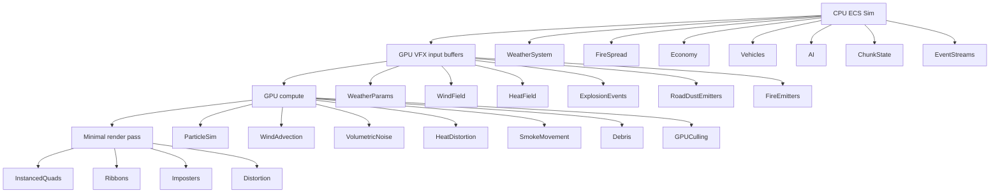

# VFX architecture — Bevy 0.18 + wgpu (Hanabi + custom compute)

**Status:** Engine design reference (v1)  
**Aligned with:** simulation-heavy CPU budget, GPU for visuals and parallel fields  
**Note:** Before adding **bevy_hanabi**, confirm a release matches **Bevy 0.18.x** (pin with bevy_egui / wgpu stack).

---

## Core principle

- **CPU / ECS** owns **authoritative** simulation.
- **GPU** owns **visual field simulation** and **high-count** effects.
- **Thin sync boundary** (params, event rings, occasional readbacks—never implicit).
- **Derived GPU state must not drive gameplay** unless you **explicitly** define sampling / readback contracts.



---

## Layers (recommended split)

| Layer | Owner | Contents |
|--------|--------|----------|
| **1 — Gameplay ECS** | CPU | Fire spread rules, weather *logic*, vehicles, AI, economy, chunks, terrain metadata, road conditions |
| **2 — GPU world fields** | Custom compute | Wind, heat, fog, dust/smoke/rain *density*, cloud coverage — **storage textures / SSBO grids / clipmaps / chunk tiles** |
| **3 — Event VFX** | **bevy_hanabi** (when adopted) | Explosions, debris, sparks, ember bursts, local smoke puffs, impacts, tunable artist effects |
| **4 — Composites** | Custom passes | Fullscreen fog, heat distortion, volumetrics, cloud comp, dust comp, particle lighting |

---

## Where to use Hanabi vs custom GPU

### Use **bevy_hanabi** for

- **Event-style** effects: clear start/end, local emitters, moderate gameplay coupling.
- **Artist-tunable** curves (gradients, lifetime, forces, drag, trails) without custom tooling.
- **Medium-scale** GPU particles (roughly **1k–100k** per effect, many concurrent effects) where you want **less pipeline boilerplate**.

Examples: explosions, muzzle flashes, impact sparks, debris bursts, dust **puffs**, chimney smoke (local), ember **bursts**, shell casings, magic/fantasy hits. **Rain streaks / snow** *may* start here for iteration, then move to fields if world-scale.

### Use **custom compute** for

- **Global / persistent fields**: wind evolution, humidity/pressure, temperature diffusion, wildfire **visualization** fields, sandstorm/fog density, pollution — **emitter-centric VFX is the wrong abstraction**.
- **Massive persistent** or **streamed** simulations: huge snow/ash counts, atmospheric dust, ocean foam **fields**, battlefield smoke **volumes** — needs tiling, LOD, residency, sparse updates.
- **Terrain-continuous** dust: vehicle writes impulses → GPU **advects a density field** → render raymarched sprites / imposters — not eternal per-particle ECS entities.
- **Wind**: treat as **first-class GPU field** sampled uniformly by foliage, particles, clouds, rain, audio probes (with optional CPU mirror for gameplay when needed).
- **Fire + smoke at scale**: **hybrid** — heat/fuel/playable spread on CPU (or explicit compute **only** if you define determinism); **smoke volume** on custom GPU; **ember bursts** in Hanabi.

### Do **not**

- Use Hanabi as the **backbone of world environmental simulation** (Niagara-style rule: great **local FX layer**, not authoritative world sim).

---

## Practical Rust hooks (targets)

### GPU field manager (future)

```rust
// Design target — not implemented in repo yet.
pub struct GpuFieldManager {
    // wind_fields: HashMap<FieldId, WindFieldGpu>,
    // density_fields: HashMap<FieldId, DensityFieldGpu>,
    // heat_fields: HashMap<FieldId, HeatFieldGpu>,
}
```

### Shared GPU event buffer (future)

CPU writes once per frame (or ring buffer); GPU consumes for particles, distortion, debris **without** CPU re-walking events.

```rust
#[repr(C)]
pub struct ExplosionEvent {
    pub pos: Vec3,
    pub radius: f32,
    pub force: f32,
    pub heat: f32,
}
```

### Unified wind sampling (WGSL target)

Everything samples the same field (custom compute, foliage, Hanabi **modifiers** if supported, clouds):

```wgsl
fn sample_wind(pos: vec2<f32>) -> vec2<f32> {
    return textureSampleLevel(wind_tex, wind_sampler, pos * wind_scale, 0.0).xy;
}
```

---

## Immediate strategy for *this* project

1. **Keep** rapid **Hanabi** adoption for **local FX** *once* a compatible crate version is pinned — prioritise explosions/sparks/debris/embers.
2. **Start** custom infrastructure **early**: compute pipeline skeleton, storage allocation, **GPU event ring**, field slots (even one **wind** + one **density** texture proves the path).
3. **Do not** overcommit Hanabi for world-scale weather; **CPU `ChunkWeather`** + optional GPU **visual** fields remain the split (see repo hooks below).

---

## Long-term stack (summary)

**CPU ECS → GPU field compute → Hanabi event FX → custom composites → lighting/post**

Scales for: sim-heavy games, large worlds, 2D/2.5D/light 3D, streaming, deterministic gameplay, GPU-heavy visuals — while preserving CPU for the actual simulation.

---

## Repo anchors (today)

| Area | Location |
|------|----------|
| Chunk-local weather (CPU sim) | `src/systems/weather/chunk_weather.rs`, `ChunkWeather` |
| Surface fire proxy per chunk (CPU) | `src/systems/fire/chunk_surface_fire.rs`, `ChunkSurfaceFire`, `FirePlugin` |
| GPU weather+fire **field** (ping-pong compute, visual) | `src/render/gpu_weather_fire_field.rs`, `assets/shaders/weather_fire_field.wgsl`, `GpuWeatherFireFieldPlugin` |
| Mean-weather **mesh** overlay (CPU camera child) | `src/systems/weather/weather_visual.rs`, Diagnostics |
| Dynamic terrain overlay (mud/snow **sim** state, not VFX) | `src/terrain/dynamic_overlay.rs`, `MaterialUnificationPlugin` |
| Sim tick boundary | `SimControlState`, `SimControlSystemSet` |

When GPU fields land, treat **`ChunkWeather` / overlay** as **inputs** to `WeatherParams` uploads — not as replacements for gameplay logic unless you add an explicit readback contract.

---

## Revision history

- **v1.0** — Initial capture of CPU/GPU/Hanabi split and layer model for this engine template.
