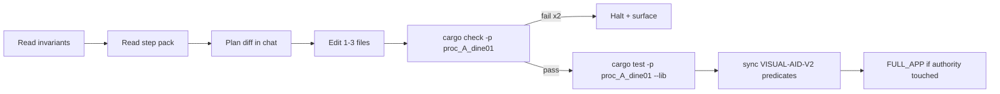

# Visual Aid v2 runbook `v1`

> **STATUS:** Documentation harness for **VA0–VA6** — HUD panel state, construction footprint GPU tiles, tile readability clamp, band-driven building visuals, zoom visual bias, strategic icons. **Parallel to Stage 5 FULL_APP exit** — does not replace [`stage5_convergence_directive_v1.md`](stage5_convergence_directive_v1.md). Design: [`../../src/dev/visual_aidv2.md`](../../src/dev/visual_aidv2.md).

Version: `v1.0.0`
Audience: agents (and humans) implementing experience-layer readability per [`system_runbook_authoring_meta_v1.md`](system_runbook_authoring_meta_v1.md).

**Authoring compliance:** Structure mirrors [`map_editor_runbook_v1.md`](map_editor_runbook_v1.md).

---

## How to use this doc (loop protocol)

Per-phase atomic step packs: [`../matrix/experience/runbook/`](../matrix/experience/runbook/README.md).



---

## 1. Invariants (re-read every lift)

Lifts **meta-runbook §5** plus Visual Aid v2 governance:

1. **Single footprint producer:** [`ConstructionVisualRequests`](../../src/construction/visual_authority.rs) → [`footprint_tile_instances`](../../src/construction/footprint_tile_instances.rs) → [`TileDebugInstanceMap`](../../src/gui/gpu_tile_debug.rs) / [`RenderProjectionGraph`](../../src/render/extraction/render_projection_graph.rs). No second ECS scan for placement validity.
2. **HUD state is enum-backed** — [`HudPanelState`](../../src/gui/hud/panel_state.rs); no new `expanded: bool` on shell resources.
3. **`TileReadabilityConfig`** biases camera LOD inputs only via existing [`LodInputs`](../../src/gui/world_representation.rs) — no parallel resolver.
4. **Simulation tile size never changes** — 1 tile = 1 world unit always.
5. **Construction overlays are view-only** — [`construction_invariants.md`](../../src/dev/construction_invariants.md); commit stays in `src/construction/`.
6. **Transitional scaffolds** require [`ScaffoldContract`](../../src/gui/representation_governance.rs) + orchestrator tags ([`tools/orchestrator/README.md`](../../tools/orchestrator/README.md)).
7. **`ASK:` instead of inventing** paths, thresholds, or duplicate `WorldLod` enums.
8. **FULL_APP authority first** — if readiness regresses, fix per [`STAGE5_FIX_PRIORITY_ORDER`](../../src/gui/representation_governance.rs) before Visual Aid rows.

**Forbidden:** gizmo-only footprint in shipping path; duplicate `WorldLod` enum; construction-owned camera/hole latch; parallel fire/placement extractors.

---

## 2. Anchor file set (≤5 paths per step)

1. This runbook §§1, 2, 3, 5.
2. [`../../src/dev/visual_aidv2.md`](../../src/dev/visual_aidv2.md).
3. [`../../src/dev/visual_aidv2_live_todos.rs`](../../src/dev/visual_aidv2_live_todos.rs).
4. Active step pack under [`../matrix/experience/runbook/`](../matrix/experience/runbook/README.md).
5. Touch `src/...rs` only.

Also: [`stage5_convergence_directive_v1.md`](stage5_convergence_directive_v1.md), [`base_visual_world_representation_v1.md`](base_visual_world_representation_v1.md) §2–3, [`operational_readiness_vs_infrastructure_perf_v1.md`](operational_readiness_vs_infrastructure_perf_v1.md).

---

## 3. Atomic step schema

Same as map editor §3: Goal · Anchor reads · Touch · Verify · Matrix/board update · DoD.

**Board update:** flip `VISUAL-AID-V2-0N` via [`sync_visual_aidv2_todo_board_predicates`](../../src/dev/visual_aidv2_live_todos.rs); witness `debug_runs/visual_aidv2_live.json`.

---

## 4. Phase index

| Phase | Step pack | Live row | Agent routing |
|:---:|:---|:---:|:---|
| **VA0** | (bootstrap — this doc + board) | — | `runbook_sync_agent` |
| **VA1** | [`v1_hud_steps_v1.md`](../matrix/experience/runbook/v1_hud_steps_v1.md) | VISUAL-AID-V2-01 | `ui_layout_agent` + [`ui_pipeline.md`](../../tools/orchestrator/runbooks/ui_pipeline.md) |
| **VA2** | [`v2_footprint_steps_v1.md`](../matrix/experience/runbook/v2_footprint_steps_v1.md) | VISUAL-AID-V2-02 | `ui_layout_agent` + construction visual authority |
| **VA3** | [`v3_readability_steps_v1.md`](../matrix/experience/runbook/v3_readability_steps_v1.md) | VISUAL-AID-V2-03 | `render_pipeline_agent` + `stage5_readiness_agent` |
| **VA4** | [`v4_lod_scale_steps_v1.md`](../matrix/experience/runbook/v4_lod_scale_steps_v1.md) | VISUAL-AID-V2-04 | `render_pipeline_agent` |
| **VA5** | [`v5_camera_steps_v1.md`](../matrix/experience/runbook/v5_camera_steps_v1.md) | VISUAL-AID-V2-05 | `render_pipeline_agent` |
| **VA6** | [`v6_icons_steps_v1.md`](../matrix/experience/runbook/v6_icons_steps_v1.md) | VISUAL-AID-V2-06 | `render_pipeline_agent` |

**Sequencing:** VA0 → VA1 ∥ VA2 (disjoint files) → VA3 → VA4 → VA5 → VA6.

---

## 5. Autonomous cycle (every step)

```powershell
cargo test -p proc_A_dine01 --lib
cargo check -p proc_A_dine01
cargo orchestrate -- --skip-clippy --skip-test
$env:STAGE5_VERBOSE=1; cargo run -p proc_A_dine01 -- --test visual
```

**Decision order after FULL_APP JSON:**

1. FULL_APP **regressed** → Stage 5 fix priority (authority before Visual Aid).
2. Else highest-priority open `VISUAL-AID-V2-*` whose phase pre-req is green.
3. On step done → update board predicate + orchestrator knowledge [`visual_aidv2.json`](../../tools/orchestrator/knowledge/visual_aidv2.json).

---

## 6. Backout / halt rules

- Two consecutive build/test failures on one step ⇒ stop.
- Touch list >3 files ⇒ stop, split step.
- Invariant §1 violated ⇒ stop, revert.
- FULL_APP authority regression without declared scaffold ⇒ stop.

**Defer VA4–VA6:** if session-bound, scaffold with `ScaffoldContract` + `ASK:` in this §6; leave rows `InProgress` with witness fields documented.

---

## 7. Cross-links

| Doc | Role |
|:---|:---|
| [`visual_aidv2.md`](../../src/dev/visual_aidv2.md) | Product design |
| [`visual_aidv2_live_todos.rs`](../../src/dev/visual_aidv2_live_todos.rs) | `VISUAL-AID-V2-*` board |
| [`gui_runbook_v1.md`](gui_runbook_v1.md) | HUD / egui lane |
| [`stage5_convergence.md`](../../tools/orchestrator/runbooks/stage5_convergence.md) | Authority spine |
| [`experience_layer_orchestrator_v1.md`](experience_layer_orchestrator_v1.md) | UX program index |

---

## 8. Prompt fragment (paste for agents)

> Read [`visual_aidv2_runbook_v1.md`](visual_aidv2_runbook_v1.md) §§1–2 and [`visual_aidv2.md`](../../src/dev/visual_aidv2.md). Run one step from [`../matrix/experience/runbook/`](../matrix/experience/runbook/README.md). Verify with `cargo test -p proc_A_dine01 --lib` + autonomous cycle §5. Do not duplicate LOD/fire extract. Halt on §6.
