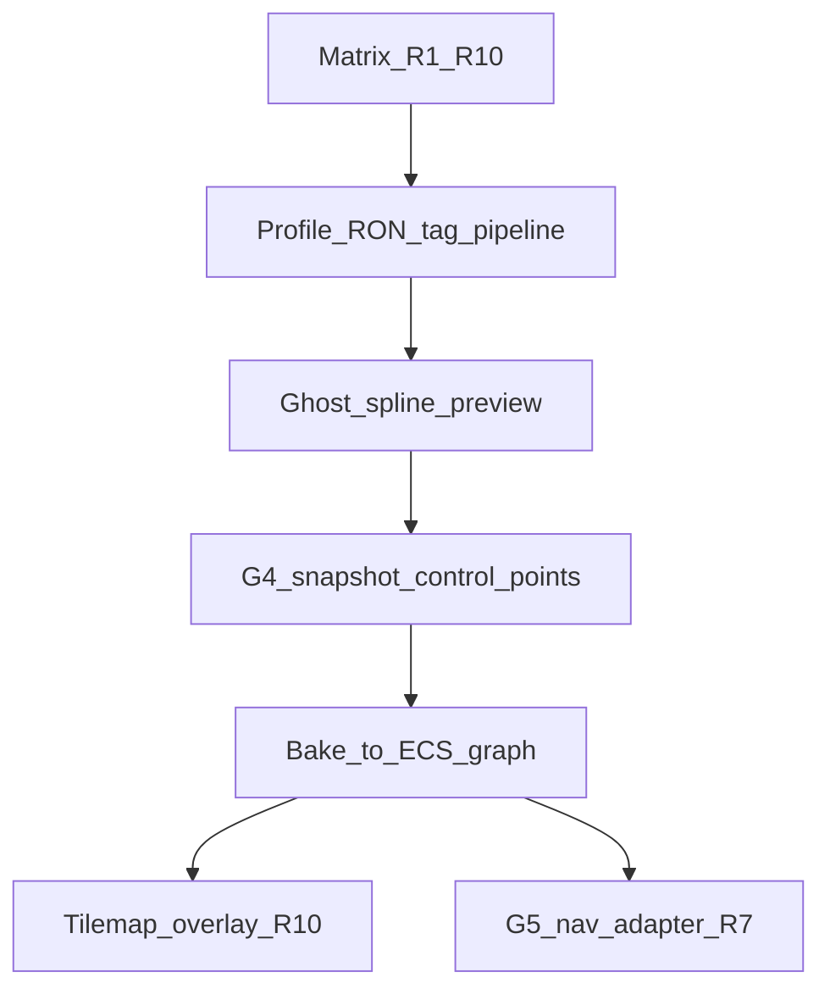

# Road / rail network — migration / boundary matrix `v1`

> **STATUS:** Anchor matrix for **network-based transportation** (roads + rails): spline authoring, **data-driven** profiles (no hardcoded surface logic), ECS graph, tilemap overlays, **G4** save, **G5** nav. **Rust execution:** gated on this matrix + gap remediation BQ rows; orchestrator TBD (see [`../../guides/system_runbook_authoring_meta_v1.md`](../../guides/system_runbook_authoring_meta_v1.md) §3 placeholder).
>
> **Halt (authoritative):** **R9** (editor spline tool) cannot reach **Applied** until **R8** (snapshot schema + deterministic hydrate story) is at least **Partial**. Prototype code may exist in branches; **status** reflects merge-ready truth.

Version: `v1.0.2`

---

## 1. Scope

| In | Out (this matrix wave) |
|:---|:---|
| Migration **R1–R10** + sync gates + JSON machine view | Full junction combinatorics (Phase II) |
| Cross-links to **G2–G5**, serialization, terrain, map editor | Implementing spline bake, nav, or tilemap in this doc |
| User-input / UX risk inventory | Lane reservation sim, intersection mesh, lane-level A* (see **Post-foundation track**) |

---

## 1b. Brainstorming inputs under `prompts/guides/` (not specification)

The following files are **rough concept notes** from earlier ideation. They **do not override** this matrix, G4/G5 packs, or terrain matrices. Use them only as **vocabulary and hypotheses** when authoring runbooks and when filling [`reference_post_foundation_track_v1.md`](reference_post_foundation_track_v1.md). Anything adopted must be re-validated against repo anchors and phased here.

| Guide (path) | Themes (summary) | Touches (this doc) |
|:---|:---|:---|
| [`hybred_road_stats.md`](../../guides/hybred_road_stats.md) | **Hybrid traffic:** continuous **field** on edges (capacity, demand, congestion, damage, danger) + sparse **agents** as deltas; routing uses field-informed cost; debug overlays | Post-foundation **R7** cost model; **G5** economy coupling; debug UX (see UX risk) |
| [`lan level traffic.idea.md`](../../guides/lan%20level%20traffic.idea.md) | **Lane graph** + discrete **reservations** (Factorio-style), lookahead, deadlock handling | Post-foundation **Option A**; **Phase II** connectivity; strong coupling to **R2/R3** lane topology |
| [`basic_nav_outline.md`](../../guides/basic_nav_outline.md) | **A\*** on **lane edges** with **field-driven** edge cost, junction topology, reservation penalty, dynamic re-route | **R7** export shape vs lane-level graph; thrashing limits for re-route |
| [`intersection_road.md`](../../guides/intersection_road.md) | **Mesh:** extruded splines, multi-lane offsets, intersection as **filled polygon**, triangulation, UV/elevation/markings hard problems | Post-foundation **Option B**; **R10** tiles vs mesh; **Phase II** geometry |
| [`ref_buildout_roads.md`](../../guides/ref_buildout_roads.md) | End-to-end **sketch** (spline → graph, tags, tilemap, snapshot, nav export) — overlaps this matrix; treat as **redundant draft**, not second source of truth | Cross-check blockers only; **R8/R9** ghost + cost preview ideas |

**Designer digest:** extracted tensions and UX implications → [`../../designer_questions/transport/README.md`](../../designer_questions/transport/README.md).

---

## 1c. Designer transport artifacts (orchestrator + run plan)

| Doc | Role |
|:---|:---|
| [`../../designer_questions/transport/rulebook_drafts.md`](../../designer_questions/transport/rulebook_drafts.md) | **Orchestrator** (P0–P3), **logical simulation schedule** §0.2, Rulebooks **A–C** (field, cost cache, junction blocks) |
| [`../../designer_questions/transport/transport_sim_runplan_v1.md`](../../designer_questions/transport/transport_sim_runplan_v1.md) | **Run plan** + tracked todos (**T-SCHED-001**, **T-LANE-001**, **T-GHOST-001**, **T-LOD-001**) |
| [`../../designer_questions/transport/lane_graph_model_idea.md`](../../designer_questions/transport/lane_graph_model_idea.md) | Module layers; **authoring vs runtime** ghost; stubs honest until Phase II |
| [`../../designer_questions/transport/sysem_desitions.md`](../../designer_questions/transport/sysem_desitions.md) | Hybrid tension spec (draft); **LOD as budget bands** |
| [`../../designer_questions/transport/transport_editor_ux_risk_v1.md`](../../designer_questions/transport/transport_editor_ux_risk_v1.md) | UX; **R9** authoring ghost semantics |

These **do not** change **R1–R10** status without matrix edits.

---

## 2. Target architecture (authoritative direction)

**Invalid long-term (legacy):** private `Road { lanes, surface }`, empty `RoadSegment` / `RoadConnection` in `src/entities/structure/components.rs` — not spawned, not serialized.

**Target (conceptual):**

- **NetworkGraph** — registry of nodes + edges (+ layers: road / rail / overlay).
- **Nodes** — junctions / endpoints (replaces ad-hoc “connection” stubs).
- **Edges** — logical way links with **profile id** (string), lane metadata from data, not enum-locked surfaces.
- **Control points** — editor spline input; **persistence stores control points**, not only baked segments.
- **Profiles** — `RoadProfile` / `RailProfile` in RON or JSON under `assets/`; **tags** feed material rules (align [`material_unification_matrix_v1.md`](../terrain_biome/material_unification_matrix_v1.md)).
- **Bake** — Catmull-Rom or cubic Bezier sampling → subdivided **EdgeSegment** entities only **after** confirm step.

---

## 3. Phase gating (documentation + implementation order)



---

## 4. Migration index (R1–R10)

| Row | Legacy | Target | Status | Owner | Blockers (summary) |
|:---:|:---|:---|:---:|:---|:---|
| **R1** | Private `Road` | `NetworkEdge` (concept + ECS) | pending | transport | No spline system; no profile registry; no graph id scheme |
| **R2** | `RoadSegment` (stub) | `EdgeSegment` / subdivided polyline | pending | transport | No subdivision + curvature policy; depends R1 profile `turn_radius` |
| **R3** | `RoadConnection` (stub) | `NetworkNode` + junction lifecycle | pending | ecs-core | No graph registry; no degree-based junction detection |
| **R4** | `RoadSurfaceType` (`s_flagz.rs`) | Material **tags** + rules → `MaterialId` | blocked | terrain | Tag resolver parity with terrain U3–U7; **no new hardcoded asphalt/dirt enums** |
| **R5** | `GaugeType` + rail stub | `RailProfile` (data-driven id) | pending | transport | Schema not externalized; rail stricter curvature vs road (policy) |
| **R6** | `Tree` + terrain overlap | Terrain interaction rules | pending | terrain | Rules: clear / tag; bridge / water **future**; alignment with tile ECS |
| **R7** | Ad-hoc nav assumptions | Cost field + `allowed_agents` export *(may later align with lane graph + dynamic field costs — guides only)* | pending | nav | **G5** pack unpromoted; depends R1–R3 export shape; post-foundation choice (reservation / lane A* / field hybrid) per **§1b** + §9 |
| **R8** | No road network save | Snapshot: nodes, edges, **control_points**, **profile names** | blocked | save | **G4** wave S + hybrid matrix row for transport DTO |
| **R9** | `MapEditorRoadMarkerV1` (M4 tile marker) | Spline tool + **authoring ghost** + confirm bake | pending | editor | **Authoring ghost** only until bake (**T-GHOST-001**); **cannot mark Applied until R8 ≥ Partial**; snapping; optional cost preview `ASK:` |
| **R10** | Terrain-only / single stack | Multi-layer tilemap (road / rail / debug); **or** mesh overlay track (Option B) | pending | transport | Feature `bevy_tilemap_adapter`; U6/U7 layer priority; **tiles vs extruded mesh** is post-foundation (§9 **B**); intersection fill = Phase II geometry |

---

## 5. Cross-links

| Doc | Role |
|:---|:---|
| [`../serialization/serialization_hybrid_migration_matrix_v1.md`](../serialization/serialization_hybrid_migration_matrix_v1.md) | **R8** — names not opaque runtime ids; deterministic hydrate |
| [`../gap_remediation/runbook/g4_serialization_stubs_steps_v1.md`](../gap_remediation/runbook/g4_serialization_stubs_steps_v1.md) | **G4** execution gate (BQ-110) |
| [`../gap_remediation/runbook/g5_nav_damage_steps_v1.md`](../gap_remediation/runbook/g5_nav_damage_steps_v1.md) | **G5** / **R7** (BQ-111) |
| [`../map_editor/map_editor_matrix_v1.md`](../map_editor/map_editor_matrix_v1.md) | **M4/M5**; **R9** replaces or migrates `MapEditorRoadMarkerV1` |
| [`../../guides/gui_runbook_v1.md`](../../guides/gui_runbook_v1.md) | Editor tooling = **TEMP-EGUI** until Bevy UI parity |
| [`../terrain_biome/material_unification_matrix_v1.md`](../terrain_biome/material_unification_matrix_v1.md) | **R4** tags + rules pipeline |
| [`../../guides/gap_remediation_runbook_v1.md`](../../guides/gap_remediation_runbook_v1.md) | Gap remediation orchestrator |
| [`../../guides/rulebook_backlog_designer_brief_v1.md`](../../guides/rulebook_backlog_designer_brief_v1.md) | BQ rows before G4/G5 promotion |
| [`../../designer_questions/transport/transport_editor_ux_risk_v1.md`](../../designer_questions/transport/transport_editor_ux_risk_v1.md) | User-input / UX risk detail |
| [`reference_post_foundation_track_v1.md`](reference_post_foundation_track_v1.md) | **§9** — lock Options A/B/C; then reprioritize **R7/R9/R10** per checklist |
| [`../../designer_questions/transport/rulebook_drafts.md`](../../designer_questions/transport/rulebook_drafts.md) | Orchestrator + simulation schedule + Rulebooks A–C |
| [`../../designer_questions/transport/transport_sim_runplan_v1.md`](../../designer_questions/transport/transport_sim_runplan_v1.md) | Forward run plan + **T-*** todos |
| [`../../designer_questions/transport/lane_graph_model_idea.md`](../../designer_questions/transport/lane_graph_model_idea.md) | Lane modules + ghost classes |
| [`../../designer_questions/transport/sysem_desitions.md`](../../designer_questions/transport/sysem_desitions.md) | Tension spec (draft) |
| [`hybred_road_stats.md`](../../guides/hybred_road_stats.md) · [`lan level traffic.idea.md`](../../guides/lan%20level%20traffic.idea.md) · [`basic_nav_outline.md`](../../guides/basic_nav_outline.md) · [`intersection_road.md`](../../guides/intersection_road.md) · [`ref_buildout_roads.md`](../../guides/ref_buildout_roads.md) | **§1b** brainstorming only |

---

## 6. Sync gates

| Partner | Gate |
|:---|:---|
| **Serialization wave S / G4** | **R8** DTO must store **control_points** + **profile** string keys; round-trip deterministic; no baked-only segments as sole source |
| **Terrain U3–U7** | **R4/R6** use tag + material rules; roads **overlay** terrain, do not replace base tile semantics without explicit invalidation row |
| **G5 nav** | **R7** exports edges with `cost` + `allowed_agents` (e.g. vehicle vs train); blocked until nav matrix + G5 steps promoted |
| **Map editor** | **R9** coordinates with **M5** world snapshot — network slice ownership explicit in save schema |
| **Tilemap** | **R10** respects `bevy_tilemap_adapter` feature gate + [`tilemap_adapter.rs`](../../../src/render/tilemap_adapter.rs) layering notes |
| **TEMP-EGUI** | Spline editor panels follow [`gui_runbook_v1.md`](../../guides/gui_runbook_v1.md) §1 |

---

## 7. User-input and UX risk (summary)

| Risk | Mitigation (default until product `ASK:`) |
|:---|:---|
| Accidental commit | **Authoring ghost** only until **Confirm / Enter** bake; no durable transport entities in serializable slice (**R8**) from preview alone (**T-GHOST-001**) |
| Curvature violation | **Reject + message + highlight** offending span; **auto-smooth** only if reference doc mandates |
| Road vs rail mode confusion | Distinct tool / layer state; clear HUD label (align map editor `MapEditorToolKind` pattern) |
| Undo/redo | **Blocker** on **R9 Applied** until stack spec exists — list under R9 blockers |
| Multi-segment partial bake | Define atomic “session” vs world commit in designer doc |
| **Debug / sim overlays** (congestion, damage, reservations) | If shipped: toggleable layers; **no** clutter in default authoring mode (`hybred_road_stats` idea) |
| **Dynamic re-route** (field spikes) | Cap thrash + cooldown so UX does not “flicker” (`basic_nav_outline` idea) |

**Detail:** [`../../designer_questions/transport/transport_editor_ux_risk_v1.md`](../../designer_questions/transport/transport_editor_ux_risk_v1.md).

---

## 8. Phase II — Junction hard problems (blocked)

**Tracked todo:** **T-LANE-001** — replace all **lane-graph stubs** (`LaneEdge` minimal shape, hand-waved junction sync) with an explicit Phase II **data model + algorithms**; until then implementations must not pretend lane connectivity is solved. See [`../../designer_questions/transport/transport_sim_runplan_v1.md`](../../designer_questions/transport/transport_sim_runplan_v1.md).

**Not part of R1–R10 Applied scope** until explicit rows are added:

- Lane-level topology at nodes; incoming/outgoing **LaneConnection** sets.
- Turn splines (straight / left / right / optional U); rejection rules (angle, radius, lane mismatch).
- Rail switches (`RailSwitch` conceptual); stricter curvature / grade.
- Combinatorial explosion when degree ≥ 5 — prune / design-time `ASK:`.
- **Renderable junction mesh** (`intersection_road.md` ideas): robust polygon clip vs fan triangulation, **UV** continuity on curves, **elevation/bridges** (height sample), **lane markings** (mesh vs decal).

Track as future **R11+** or subtree under **R3** when specced.

---

## 9. Post-foundation track (reference file gate)

Engineering priority after **profiles + ghost + R8 + bake** is **TBD** until product locks priority in [`reference_post_foundation_track_v1.md`](reference_post_foundation_track_v1.md) (stub today — replace “Selected option” when A/B/C is chosen).

**Candidates (affect blockers):**

| Option | Emphasizes | Touches rows |
|:---|:---|:---|
| **A** — Lane reservation (Factorio-style) | **R7**, manufacturing hooks, confirm/cancel UX; see `lan level traffic.idea.md` | R7, R9 |
| **B** — Intersection mesh | **R10**, render / assets; see `intersection_road.md` | R10, R2, Phase II |
| **C** — Lane-level A* + field costs | **Graph shape** early (lane graph vs centerline); dynamic costs; see `basic_nav_outline.md` + `hybred_road_stats.md` | R2, R3, R7 |

**When the reference file is filled (not stub):**

1. Revise **§4** rows **R7**, **R9**, **R10** — blockers, `Owner`, and short notes to match the locked option and any new matrix rows (e.g. lane graph).
2. Update matching objects in **§10** for `row_id` **R7**, **R9**, **R10** (`blockers`, `owner`, `cross_links`) so the JSON appendix stays the machine view of §4.
3. If ownership shifts (e.g. **R7** primary → `transport` under option C), document one line in §9 table above under *Rationale* in the reference file.

Do not edit the plan file in `.cursor/plans/`.

---

## 10. Appendix — machine-readable rows (JSON)

```json
{
  "row_id": "R1",
  "legacy": "Road (private, components.rs)",
  "target": "NetworkEdge",
  "status": "pending",
  "blockers": ["no spline system", "no profile registry", "no graph id scheme"],
  "owner": "transport",
  "g2_g5": ["G2 placeholder profiles TBD", "G5 R7 export"],
  "cross_links": ["map_editor_matrix M4", "material_unification R4"]
}
```

```json
{
  "row_id": "R2",
  "legacy": "RoadSegment (stub)",
  "target": "EdgeSegment",
  "status": "pending",
  "blockers": ["no subdivision logic", "curvature_threshold policy", "depends R1"],
  "owner": "transport",
  "g2_g5": [],
  "cross_links": ["R1", "R5 turn_radius"]
}
```

```json
{
  "row_id": "R3",
  "legacy": "RoadConnection (stub)",
  "target": "NetworkNode",
  "status": "pending",
  "blockers": ["no graph registry", "junction Phase II deferred"],
  "owner": "ecs-core",
  "g2_g5": ["G5 nav graph adapter"],
  "cross_links": ["R1", "R2", "Phase II junction"]
}
```

```json
{
  "row_id": "R4",
  "legacy": "RoadSurfaceType enum",
  "target": "MaterialTag[] + MaterialRule resolution",
  "status": "blocked",
  "blockers": ["terrain tag resolver U3–U7", "no hardcoded new surfaces"],
  "owner": "terrain",
  "g2_g5": [],
  "cross_links": ["material_unification_matrix", "serialization names"]
}
```

```json
{
  "row_id": "R5",
  "legacy": "GaugeType enum + Rrails stub",
  "target": "RailProfile (data-driven)",
  "status": "pending",
  "blockers": ["schema externalized", "stricter curvature than road"],
  "owner": "transport",
  "g2_g5": [],
  "cross_links": ["R1", "R4 tags"]
}
```

```json
{
  "row_id": "R6",
  "legacy": "Tree + terrain features",
  "target": "Terrain interaction rules (clear / tag / bridge future)",
  "status": "pending",
  "blockers": ["designer rules for road-over-tree", "water/bridge out of scope v1"],
  "owner": "terrain",
  "g2_g5": [],
  "cross_links": ["map_editor tiles", "R10 overlay"]
}
```

```json
{
  "row_id": "R7",
  "legacy": "Nav grid / ad-hoc",
  "target": "Cost field + allowed_agents export (lane graph / field costs TBD post-foundation)",
  "status": "pending",
  "blockers": ["G5 pack promotion", "depends R1–R3 graph", "post-foundation track TBD", "re-route thrash policy if dynamic costs"],
  "owner": "nav",
  "g2_g5": ["G5"],
  "cross_links": ["navigation designer spec", "manufacturing G5", "guides/basic_nav_outline.md ideas", "guides/hybred_road_stats.md ideas"]
}
```

```json
{
  "row_id": "R8",
  "legacy": "No road network persistence",
  "target": "Snapshot: nodes, edges, control_points[], profile string ids",
  "status": "blocked",
  "blockers": ["G4 wave S", "hybrid matrix transport row", "deterministic hydrate tests"],
  "owner": "save",
  "g2_g5": ["G4"],
  "cross_links": ["serialization_hybrid_migration_matrix", "map_editor M5"]
}
```

```json
{
  "row_id": "R9",
  "legacy": "MapEditorRoadMarkerV1 (M4)",
  "target": "SplineTool + authoring ghost + confirm bake",
  "status": "pending",
  "blockers": ["authoring ghost preview", "snapping", "undo stack spec", "T-GHOST-001 semantics", "cannot Apply until R8 Partial"],
  "owner": "editor",
  "g2_g5": ["G3 GUI policy TEMP-EGUI"],
  "cross_links": ["map_editor runbook", "gui_runbook", "transport_sim_runplan_v1 T-GHOST-001"]
}
```

```json
{
  "row_id": "R10",
  "legacy": "Single-layer terrain visual",
  "target": "Multi-layer tilemap and/or extruded road mesh overlays",
  "status": "pending",
  "blockers": ["bevy_tilemap_adapter feature", "layer priority + shader doc", "post-foundation mesh vs tiles", "intersection mesh Phase II"],
  "owner": "transport",
  "g2_g5": [],
  "cross_links": ["tilemap_adapter.rs", "terrain U6 U7", "guides/intersection_road.md ideas"]
}
```

---

## 11. Completion criteria (matrix wave)

- [x] **R1–R10** documented with owners, blockers, and JSON appendix.
- [x] Sync gates + **R9 vs R8** halt rule explicit.
- [x] Phase II junction scope fenced.
- [x] Post-foundation track placeholder + reference-file gate.
- [ ] **Applied** rows: none until Rust + tests + designer sign-off per future runbook.
