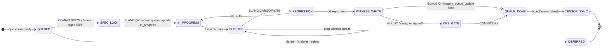
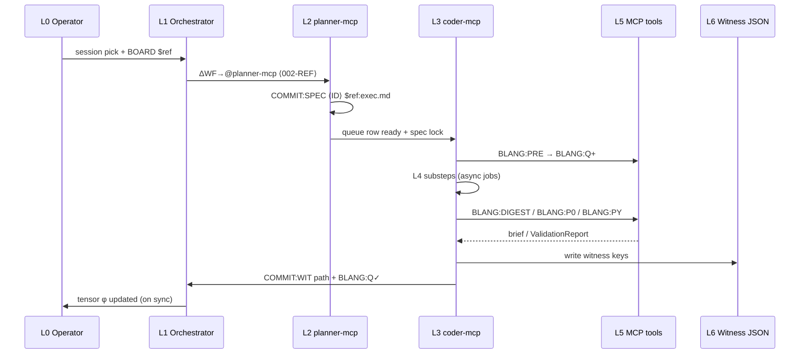

# A2C commit flow — multi-level state machine `v1`

| Field | Value |
|:---|:---|
| **ID** | **A2C-COMMIT-FLOW-001** |
| **Parent** | [`master_chain_board_4d_v1.md`](master_chain_board_4d_v1.md) |
| **Lang** | [`agent_lang_v1.md`](agent_lang_v1.md) |
| **Status** | **NORMATIVE** — replaces single-box “mark done” |
| **Date** | 2026-06-03 |

**Rule:** A slice is **not** φ=2 (🟢) until **all mandatory transitions** below fire. `agent_queue_update(..., "done")` is **one step near the end**, not the definition of done.

---

## Level map (L0–L6)

| Level | Name | Owner | Persistent artifact |
|:---:|:---|:---|:---|
| **L0** | Session pick | Operator / orchestrator | Paste block |
| **L1** | Route | Orchestrator | `ΔWF→@agent ⟨ID⟩` |
| **L2** | Spec commit | @planner / @planner-mcp | `$ref:*exec*.md`, queue `ready→` |
| **L3** | Implementation | @coder / @coder-mcp / @designer | code + tests |
| **L4** | Sub-steps | Implementer | per-step log / job strip |
| **L5** | Tool proof | BLANG / MCP | validator reports, briefs |
| **L6** | Witness keys | CI / lib test writer | `debug_runs/*_live.json` |

---

## State machine — slice lifecycle

---

## A2C three-commit protocol (between agents)

---

## Sub-level example — ⟨APS-UX-ASYNC-001⟩

**Not** one “done”. Minimum L4 substeps:

| Step | φ | Witness / proof |
|:---:|:---:|:---|
| `job_controller.py` unit tests | 0→1 | `test_aps_ux_async_001.py` |
| `job_strip.py` visible <100ms | 0→1 | manual / smoke note |
| `atlas_panel` threaded pack | 0→1 | no UI freeze |
| `variants_panel` threaded bake | 0→1 | no UI freeze |
| Full status log (no 240 trunc) | 0→1 | UI check |
| Slice witness | 1→2 | `aps_ux_async_001_live.json` |
| Queue update | 2 | `grammar_continuation_queue` done |
| R_ux tensor | 2 | `chains.F.r_ux: 1.0` |

---

## Sub-level example — ⟨INFRA-E5-002⟩

| Step | φ | Witness key |
|:---:|:---:|:---|
| Read COMMIT:SPEC | — | `$ref:plan_construction_p7_logistics_exec_001_v1.md` |
| graph-only `path_open` | 0→1 | lib test |
| `routes_blocked → 0` | 1→2 | `logistics_throughput_live.json` |
| `graph_only_paths: true` | 2 | new key |
| P7 hook witness (optional) | 1 | `construction_p7_logistics_hook_001` |
| BLANG:Q✓ | 2 | queue + run_events |

---

## Sub-level example — ⟨MCP-SPINE-CHAIN-001⟩ (deferred)

| Step | φ | Note |
|:---:|:---:|:---|
| Tier-0 BLANG ritual ×2 sessions | gate | blocked in queue |
| `tile_spine_run` per-step witnesses | 0→1 | each step own JSON |
| `tile_promotion_honest_check` | 1→2 | rejects headless-as-ship |
| ATL○ → ATL★ | 2 | $ref:plan_dsm_wrk_atl_closure_v1.md |

---

## What “mark done” must mean (checklist)

Before `agent_queue_update(id, "done")`:

| ☐ | Check |
|:---:|:---|
| ☐ | COMMIT:SPEC exists for implementer slices |
| ☐ | L5 regression command ran (BLANG:CARGO / PY / S5 as applicable) |
| ☐ | L6 witness file exists on disk |
| ☐ | Mandatory keys in witness are true (not top-level green alone) |
| ☐ | `agent_run_append` or run_events line (when MCP-DOC-READ-002 wired) |
| ☐ | No defer_registry conflict |
| ☐ | Operator gates (G-PLAY) **not** confused with slice done |

---

## Anti-patterns

| Bad | Why |
|:---|:---|
| Chat says “done” without witness | Board lies |
| `green: true` only at root | Nested keys may be red |
| Planner marks coder slice done | Wrong agent — SPEC only |
| One mermaid box “complete” | Hides L4–L6 |
| Tensor updated every message | Token burn; use queue sync |

---

## Changelog

| Version | Date | Notes |
|:---|:---|:---|
| v1.0.0 | 2026-06-03 | Full A2C state machine — response to user feedback |
