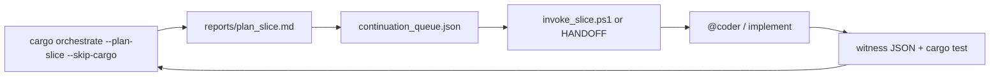

# Development plan index

Single map of **planning → proof → implementation** for this repo. Use with orchestrator tooling so markdown boards, runtime todo boards, and witnesses stay aligned.

---

## Daily loop (recommended)

| Step | Command / artifact |
|------|-------------------|
| 1. Pick slice | `cargo orchestrate --plan-slice --skip-cargo` |
| 2. Read plan | [`tools/orchestrator/reports/plan_slice.md`](../../tools/orchestrator/reports/plan_slice.md) |
| 3. Hand off | `.\tools\orchestrator\scripts\invoke_slice.ps1 -SliceId SLICE-TRIAGE-VM-06` |
| 4. Implement | Playbook under `tools/orchestrator/agents/` + agent from plan |
| 5. Prove | Lane-specific `debug_runs/*_live.json` |
| 6. Close row | Runtime board predicate **or** triage/markdown checkbox |

---

## Stage tracks (2026-05-24 — active execution)

**Hub:** [`stage_tracks_execution_index_v1.md`](stage_tracks_execution_index_v1.md) — seven parallel tracks.

**Sign-off (2026-05-25):** [`stage_tracks_signoff_ledger_v1.md`](stage_tracks_signoff_ledger_v1.md) v1.2.5 · **Planner batch (closed):** [`planner_queue_todos_v1.md`](planner_queue_todos_v1.md) · **Designer todos:** [`stage_designer_todos_v1.md`](stage_designer_todos_v1.md) · **Orchestrator registry:** [`designer_signoff_registry.json`](../tools/orchestrator/queues/designer_signoff_registry.json) · workboards: planner / designer / coder / steward

**Witness specs:** [`wave_p_witness_spec_v1.md`](wave_p_witness_spec_v1.md) · [`ui_shell_witness_spec_v1.md`](ui_shell_witness_spec_v1.md) · [`industrial_activation_board_reconcile_v1.md`](industrial_activation_board_reconcile_v1.md)

**Machine queues (003):** [`planner_active_queue.json`](../tools/orchestrator/queues/planner_active_queue.json) · [`coder_active_queue.json`](../tools/orchestrator/queues/coder_active_queue.json) · [`planner_status_audit_v5.md`](planner_status_audit_v5.md)

| Track | Plan |
|-------|------|
| Stage 7 Play | [`stages/stage7_play_plan_v1.md`](stages/stage7_play_plan_v1.md) |
| VFX Phase 2 closure | [`stages/vfx_phase2_closure_plan_v1.md`](stages/vfx_phase2_closure_plan_v1.md) |
| UI Phase 4 | [`stages/ui_phase4_execution_plan_v1.md`](stages/ui_phase4_execution_plan_v1.md) |
| UI Phase 5 pause menu | [`ui_phase5_pause_menu_plan_v1.md`](../prompts/guides/ui/ui_phase5_pause_menu_plan_v1.md) (**PLAN-UI-P5-PAUSE-001**) · [`plan_ui_p5_pause_menu_index_v1.md`](plan_ui_p5_pause_menu_index_v1.md) |
| UI batch v2 (2026-05-25) | [`planner_queue_ui_batch_v2.md`](planner_queue_ui_batch_v2.md) |
| UI Phase 6 shell / multiview | [`ui_phase6_shell_perf_multiview_plan_v1.md`](ui_phase6_shell_perf_multiview_plan_v1.md) (**PLAN-UI-PHASE6-001**) |
| UI Phase 2C left rail | [`ui_phase2c_left_command_rail_plan_v1.md`](ui_phase2c_left_command_rail_plan_v1.md) (**PLAN-UI-2C-001**) |
| UI theme merge spec | [`ui_theme_merge_impl_spec_v1.md`](ui_theme_merge_impl_spec_v1.md) (**PLAN-UI-THEME-MERGE-001**) |
| UI P3 M3 operational + S7 | [`plan_ui_p3_m3_operational_stage7_plan_v1.md`](plan_ui_p3_m3_operational_stage7_plan_v1.md) (**PLAN-UI-P3-M3-001**) |
| VM-09 invert bridge (v2) | [`triage_vm09_v2_invert_bridge_plan_v1.md`](triage_vm09_v2_invert_bridge_plan_v1.md) — blocks **S7B-M2+** |
| Fire sim Phase 7 arch | [`fire_sim_phase7_architecture_v1.md`](fire_sim_phase7_architecture_v1.md) (**FIRE7-PLAN-001**) |
| S7B post-M3 closure | [`s7b_closure_plan_v1.md`](s7b_closure_plan_v1.md) |
| LOG-E01 witness spec | [`log_e01_full_app_witness_spec_v1.md`](log_e01_full_app_witness_spec_v1.md) |
| Planner cycle board | [`planner_queue_cycle_20260525_v1.md`](planner_queue_cycle_20260525_v1.md) |
| Infra 5.5+ | [`stages/infra_55_execution_plan_v1.md`](stages/infra_55_execution_plan_v1.md) |
| Wave C depth | [`stages/wave_c_depth_plan_v1.md`](stages/wave_c_depth_plan_v1.md) |
| Fire sim Phase 7 | [`stages/fire_sim_phase7_plan_v1.md`](stages/fire_sim_phase7_plan_v1.md) |
| Stage 7 Behavioral | [`stages/stage7_behavioral_plan_v1.md`](stages/stage7_behavioral_plan_v1.md) · impl [`stage7_behavioral_implementation_plan_v1.md`](stage7_behavioral_implementation_plan_v1.md) |

---

## Planning systems (what to trust)

| Layer | Authority | Paths |
|-------|-----------|--------|
| **Operational gate** | Runtime + visual test | `STAGE5_TODOS` in [`stage5_live_todos.rs`](stage5_live_todos.rs), `stage5_full_app_live.json` |
| **Infrastructure (5.5)** | Human track + infra witnesses | [`stage5_5_open.md`](stage5_5_open.md), [`stage5_triage_backlog.md`](stage5_triage_backlog.md) |
| **Product lanes** | Green flags + live boards | construction / industrial / logistics `*_todos.rs` |
| **Terminal blockers** | Active board | [`visual_run_blockers.md`](visual_run_blockers.md) |
| **Fire sim (F1+)** | Ecology witness | [`fire_ecology_f1_todos.md`](fire_ecology_f1_todos.md), `fire_ecology_live.json` |
| **Archived** | Do not use as active queue | [`next_action_todos.md`](next_action_todos.md) (signed off 2026-05-22) |

**Rule:** If markdown and `debug_runs/*.json` disagree, **witness JSON wins** for green/red; refresh markdown or run reconciler (future).

---

## Runtime todo boards (code)

| Board | Resource | Closes when |
|-------|----------|-------------|
| Stage 5 spine | `Stage5LiveTodoBoard` | `sync_stage5_todo_board_predicates` |
| Stage 5 finish UX | `Stage5FinishTodoBoard` | `sync_stage5_finish_todo_board` |
| Construction | `ConstructionLiveTodoBoard` + finish/phase2/round* | `ConstructionStageWitness` |
| Industrial | `IndustrialActivationTodoBoard` | witness flags |
| Logistics throughput | `LogisticsThroughputTodoBoard` | `LOGISTICS_THROUGHPUT_GREEN` |
| Logistics **visual** (`log_rows`) | [`logistics_visual_todos.md`](logistics_visual_todos.md) | projection graph signature |
| Visual Aid v2 | `VisualAidV2TodoBoard` | `VisualAidV2Witness` |

---

## Agents and playbooks

| Cursor agent | Repo playbook |
|--------------|---------------|
| `@planner` | Architecture + [`stage5_5_open.md`](stage5_5_open.md) |
| `@coder` | `tools/orchestrator/agents/*_agent.md` by lane |
| `@sim-steward` | stage5 + viewport + witness triage |
| `@designer` | `ui_layout_agent` |
| `@main-thread-orchestrator` | `--main-thread-shift` when Task pool dry |

See [`AGENTS.md`](../../AGENTS.md) and [`tools/orchestrator/queues/agent_queue.md`](../../tools/orchestrator/queues/agent_queue.md).

---

## Witness index

Refreshed on write: [`debug_runs/agent_debug_index.json`](../../debug_runs/agent_debug_index.json).  
Envelope: [`debug_run_envelope.rs`](debug_run_envelope.rs) `KNOWN_LIVE_PROOF_PATHS`.

---

## Tooling (orchestrator crate)

| Tool | Purpose |
|------|---------|
| `cargo orchestrate` | Build diagnostics + reports |
| `cargo orchestrate --plan-slice --skip-cargo` | **Pick next implementation slices** |
| `cargo orchestrate --main-thread-shift --skip-cargo` | Witness digest + authority scan |
| `invoke_handoff.ps1` | Session `HANDOFF.md` |
| `invoke_slice.ps1` | HANDOFF from `continuation_queue.json` row |
| `visual_full_app.ps1` | Stage 5 proof refresh |

---

## Current default track

**Stage 6 virtualization** — [`stage6_active_todos.md`](stage6_active_todos.md) · strategy [`stage6_plan_open.md`](stage6_plan_open.md) · start **S6-0** (live witness JSON).

**Completed:** Stage 5 operational · Stage 5.5 all tracks — [`stage5_5_active_todos.md`](stage5_5_active_todos.md).
