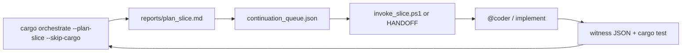

# Development plan index

Single map of **planning → proof → implementation** for this repo. Use with orchestrator tooling so markdown boards, runtime todo boards, and witnesses stay aligned.

**Multi-parallel dispatch (2026-06-20):** [`plan_multi_parallel_tracks_v1.md`](plan_multi_parallel_tracks_v1.md) — **8 parallel tracks** · [`multi_parallel_agent_prompts_v1.md`](multi_parallel_agent_prompts_v1.md) · home [`multi_parallel_home_queues_v1.json`](../tools/orchestrator/queues/multi_parallel_home_queues_v1.json)

**Live status (2026-06-18):** [`status_overview_20260613_v1.md`](status_overview_20260613_v1.md) · **Sim HUD Phase 2:** [`plan_sim_hud_professional_polish_v1.md`](plan_sim_hud_professional_polish_v1.md) · [`design_sim_hud_reflection_audit_v1.md`](design_sim_hud_reflection_audit_v1.md) · [`designer_sim_hud_prompt_v1.md`](designer_sim_hud_prompt_v1.md) · **Designer backlog:** [`plan_designer_work_202606_v1.md`](plan_designer_work_202606_v1.md) · **Industrial facility grammar:** [`plan_industrial_facility_grammar_suite_v1.md`](plan_industrial_facility_grammar_suite_v1.md) · **APS design system:** [`aps_design_system_v1.md`](aps_design_system_v1.md)

**GPU terrain / sim perf (ACTIVE — 2026-07-02):** [`plan_gpu_terrain_production_exec_001_v1.md`](plan_gpu_terrain_production_exec_001_v1.md) — **PERF-GPU-TERRAIN-001..004** · retire CPU `tile_world_fallback` default · strip dead render passes · **no partial sign-off** · parent [`plan_visual_perf_production_exec_001_v1.md`](plan_visual_perf_production_exec_001_v1.md)

---

## Designer art MCP + Blender (2026-06-02)

**Design:** [`prompts/designer_questions/art_design.md`](../prompts/designer_questions/art_design.md) · [`prompts/art_desgin_inbound.md`](../prompts/art_desgin_inbound.md)  
**Art alignment:** [`plan_art_design_inbound_alignment_v1.md`](plan_art_design_inbound_alignment_v1.md) · **Exec:** [`plan_designer_mcp_art_toolchain_exec_001_v1.md`](plan_designer_mcp_art_toolchain_exec_001_v1.md) · **Tools:** [`tools/mcp/README.md`](../tools/mcp/README.md)

**Start:** [`designer_mcp_onboarding_v1.md`](designer_mcp_onboarding_v1.md) · run [`tools/mcp/install_designer_mcp.ps1`](../../tools/mcp/install_designer_mcp.ps1) · restart Cursor for MCP

**Feeds:** procedural module kit (50 greybox), construction Phase 4 placeholder art, `assets/configs/buildings/`.

**APS grammar evolution (ACTIVE):** [`plan_aps_grammar_evolution_v1.md`](plan_aps_grammar_evolution_v1.md) — tier-gated UI + preview ladder as grammar set matures · parent [`plan_building_grammar_evolution_v1.md`](plan_building_grammar_evolution_v1.md).

**APS presence correction (P1 — 2026-06):** [`aps_presence_correction_todos_v1.md`](aps_presence_correction_todos_v1.md) — brief/coverage/parity parity · live tier witnesses · session dump · queue [`aps_presence_correction_queue.json`](../tools/orchestrator/queues/aps_presence_correction_queue.json) · routing [`planner_routing_aps_presence_v1.md`](planner_routing_aps_presence_v1.md).

**Finish backlog (why plans stall):** [`plan_finish_execution_backlog_v1.md`](plan_finish_execution_backlog_v1.md) — Tier 0–3 implementation picks; no new plans until Tier 0 witnesses green.

**Designer backlog (2026-06):** [`plan_designer_work_202606_v1.md`](plan_designer_work_202606_v1.md) — APS polish · art · style bibles · sim UX · prompt [`designer_work_prompt_202606_v1.md`](designer_work_prompt_202606_v1.md) · queue [`designer_active_queue.json`](../tools/orchestrator/queues/designer_active_queue.json).

**Industrial facility grammar (2026-06):** [`plan_industrial_facility_grammar_suite_v1.md`](plan_industrial_facility_grammar_suite_v1.md) — power/process/site binding · APS iterate tools · prompts [`industrial_facility_grammar_prompts_v1.md`](industrial_facility_grammar_prompts_v1.md) · authority [`industrial_supply_chains.json`](../assets/configs/industrial_supply_chains.json).

**Sim HUD Phase 2 (2026-06):** [`plan_sim_hud_professional_polish_v1.md`](plan_sim_hud_professional_polish_v1.md) — build picker · tray · popup discipline · audit [`design_sim_hud_reflection_audit_v1.md`](design_sim_hud_reflection_audit_v1.md) · prompt [`designer_sim_hud_prompt_v1.md`](designer_sim_hud_prompt_v1.md). Prior close: [`design_sim_hud_product_signoff_v1.md`](../docs/archive/2026-06-src-dev/plans/design_sim_hud_product_signoff_v1.md).

**Power grid construction (2026-06):** [`plan_power_grid_construction_ux_v1.md`](plan_power_grid_construction_ux_v1.md) — line draw curved/90° · voltage classes · **grid islanding** (electrical) · targeting/repair · charter [`design_power_line_construction_ux_v1.md`](design_power_line_construction_ux_v1.md) · prompt [`designer_power_grid_prompt_v1.md`](designer_power_grid_prompt_v1.md).

**Nuclear failure / meltdown (2026-06):** [`plan_nuclear_power_failure_meltdown_v1.md`](plan_nuclear_power_failure_meltdown_v1.md) — offsite power loss · SCRAM · decay heat · meltdown (type-specific) · [`design_nuclear_containment_failure_v1.md`](design_nuclear_containment_failure_v1.md).

**Power grid art & assets (2026-06):** [`plan_power_grid_art_assets_v1.md`](plan_power_grid_art_assets_v1.md) — modules · lines · VFX · HUD · prompts [`designer_mcp_power_grid_art_prompt_v1.md`](designer_mcp_power_grid_art_prompt_v1.md).

**Production iso tiles (ACTIVE):** [`plan_procedural_building_tiles_production_v1.md`](plan_procedural_building_tiles_production_v1.md) — sim→variant, `kit_production_*`, fire frames; witness [`procedural_tiles_production_witness_v1.md`](procedural_tiles_production_witness_v1.md). **Bake spine (mandatory):** [`design_tile_bake_spine_convergence_v1.md`](design_tile_bake_spine_convergence_v1.md) — keyframe → tilemapgen; ortho stub CI-only.

---

## Planner alignment (read first)

**Hub:** [`planner_program_alignment_v1.md`](planner_program_alignment_v1.md) — construction **1→11** vs infrastructure **E0–E6** vs PHASE-STABLE; **dual track** (no single primary).

| Track | Start here |
|:---|:---|
| **Construction P3 (now)** | [`plan_construction_scaling_audit_exec_003_v1.md`](plan_construction_scaling_audit_exec_003_v1.md) — **A: CON-P3-S1..S3 + WIT** · **B: S4–S6 done** |
| **Settlement P5** | [`plan_settlement_hierarchy_exec_005_v1.md`](plan_settlement_hierarchy_exec_005_v1.md) — **SET-P5-001..003 done on disk** |
| **Coder workload** | [`fleet_coder_workload_queue_20260602_v1.md`](fleet_coder_workload_queue_20260602_v1.md) — machine queue `v5.4.0` |
| **Procedural + organic (after P2)** | [`construction_procedural_growth_index_v1.md`](construction_procedural_growth_index_v1.md) · **Growth actors:** [`plan_econ_growth_actors_exec_001_v1.md`](plan_econ_growth_actors_exec_001_v1.md) |
| **Landscape / vegetation grammar** | [`guide_landscape_grammar_v1.md`](guide_landscape_grammar_v1.md) · [`plan_landscape_grammar_exec_001_v1.md`](plan_landscape_grammar_exec_001_v1.md) · **Lexicon v1.4.0:** [`landscape_grammar_lexicon_v1.md`](../prompts/guides/landscape_grammar_lexicon_v1.md) · **Schema:** [`landscape_grammar_v0.schema.json`](../tools/mcp/schemas/landscape_grammar_v0.schema.json) · **Example:** [`landscape_dna_agri_riparian_v0.json`](../tools/mcp/schemas/examples/landscape_dna_agri_riparian_v0.json) · **SYMLANG:** [`SYMBOLIC_LANGUAGE.meta.md`](../prompts/SYMBOLIC_LANGUAGE.meta.md) §2.13 |
| **Infrastructure (parallel E0, gated)** | [`plan_infrastructure_world_layers_exec_001_v1.md`](plan_infrastructure_world_layers_exec_001_v1.md) |
| **Proof / cfg (P1 done)** | [`plan_fleet_stability_integrity_exec_002_v1.md`](plan_fleet_stability_integrity_exec_002_v1.md) |

**Dual track:** both programs advance — [`coder_unified_backlog_v1.md`](coder_unified_backlog_v1.md) (Coder A / B columns + § Horizon proc/growth).

**Fleet snapshot (2026-06-02):** [`fleet_snapshot_20260602_v3.md`](fleet_snapshot_20260602_v3.md) · **Coder workload:** [`fleet_coder_workload_queue_20260602_v1.md`](fleet_coder_workload_queue_20260602_v1.md)  
**Planner / designer prompts (post long-run):** [`fleet_planner_designer_prompts_20260602_v2.md`](fleet_planner_designer_prompts_20260602_v2.md) · coders: [`fleet_longrun_prompts_20260602_v1.md`](fleet_longrun_prompts_20260602_v1.md) `v1.2`  
**MCP consumers:** [`agent_mcp_consumer_guide_v1.md`](agent_mcp_consumer_guide_v1.md) · **Economy vision:** [`construction_economy_growth_vision_v1.md`](construction_economy_growth_vision_v1.md)  
**Coder orders (econ growth):** [`fleet_coder_orders_econ_growth_20260602_v1.md`](fleet_coder_orders_econ_growth_20260602_v1.md) · exec [`plan_econ_growth_actors_exec_001_v1.md`](plan_econ_growth_actors_exec_001_v1.md)

---

## Infrastructure program (2026-06-02 — full coder workboard)

**Design:** [`world_layer_infrastructure_model_v1.md`](world_layer_infrastructure_model_v1.md) — tiles = terrain only; corridors + utilities = graphs.

**Exec:** [`plan_infrastructure_world_layers_exec_001_v1.md`](plan_infrastructure_world_layers_exec_001_v1.md) — **6 epics, 25 PRs, ~12–14 weeks**. Start **Epic 0** (`INFRA-E0-001` profile registry + `INFRA-E0-002` tile deprecation).

**Matrix:** [`prompts/matrix/transport/road_rail_migration_matrix_v1.md`](../../prompts/matrix/transport/road_rail_migration_matrix_v1.md) (R1–R10 traceability in exec doc).

**Not the same lane as** PHASE-STABLE DEHACK (`plan_fleet_stability_integrity_exec_002_v1.md`) — run infrastructure on a dedicated branch/train when possible.

---

## Fleet snapshot (2026-05-28)

**Phase index (authoritative):** [`plan_fleet_stability_integrity_001_v1.md`](plan_fleet_stability_integrity_001_v1.md) · **PHASE-STABLE-2026-06** — **P2 signed**  
**Exec P1 (closed):** [`plan_fleet_stability_integrity_exec_002_v1.md`](plan_fleet_stability_integrity_exec_002_v1.md) · **Dispatch P2 (signed):** [`fleet_stability_phase2_dispatch_v1.md`](fleet_stability_phase2_dispatch_v1.md) · P1: [`fleet_stability_coder_dispatch_v1.md`](fleet_stability_coder_dispatch_v1.md)  
**G-PLAY runbook:** [`play_scenario_acceptance_runbook_v1.md`](play_scenario_acceptance_runbook_v1.md) · **Split model:** [`plan_g_play_split_v1.md`](plan_g_play_split_v1.md)  
**Sweep:** [`production_jank_sweep_20260602_v1.md`](production_jank_sweep_20260602_v1.md) · **Env:** [`runtime_env_policy_registry_v1.md`](runtime_env_policy_registry_v1.md)  
**Audit:** [`planner_status_audit_v18.md`](planner_status_audit_v18.md) · checklist [`plan_ledger_refresh_018_checklist_v1.md`](plan_ledger_refresh_018_checklist_v1.md)  
**Prior audit:** [`planner_status_audit_v17.md`](planner_status_audit_v17.md) · [`plan_ledger_refresh_017_checklist_v1.md`](plan_ledger_refresh_017_checklist_v1.md)
**Prior phase (closed):** [`plan_fleet_phase_next_001_v1.md`](plan_fleet_phase_next_001_v1.md) · audit v16 · [`fleet_coder_workboard_20260528_v3.md`](fleet_coder_workboard_20260528_v3.md)

**New gates:** G-PLAY-01 (10 min default sim) · G-PROOF-01 (no witness shortcuts in visual capture). Lib fixture green ≠ ship sign-off. **P1 cfg rule:** DEHACK slices close on compile boundary, not runtime guard alone.

## Coder fleet (active now)

**PHASE-STABLE dispatch (signed):** [`fleet_stability_phase2_dispatch_v1.md`](fleet_stability_phase2_dispatch_v1.md) · [`coder_active_queue.json`](../tools/orchestrator/queues/coder_active_queue.json) v5.3 · [`HANDOFF.md`](../tools/orchestrator/queues/HANDOFF.md)

**Implement next (construction + infra):** A → **CON-P2-001** · B → **CON-P2-002** (then unified backlog rows). **P2 stability tails** remain in `active[]` when not blocked.

**Archive / matrix:** [`coder_unblock_dispatch_v1.md`](coder_unblock_dispatch_v1.md) · [`coder_fleet_multistage_matrix_v1.md`](coder_fleet_multistage_matrix_v1.md) · [`coder_dual_queue_multistage_v1.md`](coder_dual_queue_multistage_v1.md) · parallel boards [`planner_parallel_workboard_v1.md`](planner_parallel_workboard_v1.md) · [`designer_parallel_workboard_v1.md`](designer_parallel_workboard_v1.md)

---

## Daily loop (recommended)

| Step | Command / artifact |
|------|-------------------|
| 1. Pick slice | `cargo orchestrate --plan-slice --skip-cargo` |
| 2. Read plan | [`tools/orchestrator/reports/plan_slice.md`](../../tools/orchestrator/reports/plan_slice.md) |
| 3. Hand off | `.\tools\orchestrator\scripts\invoke_slice.ps1 -SliceId SLICE-TRIAGE-VM-06` |
| 4. Implement | Playbook under `tools/orchestrator/agents/` + agent from plan |
| 5. Prove | Lane-specific `debug_runs/*_live.json` |
| 6. Close row | Runtime board predicate **or** triage/markdown checkbox |

---

## Stage tracks (2026-05-24 — active execution)

**Hub:** [`stage_tracks_execution_index_v1.md`](stage_tracks_execution_index_v1.md) — seven parallel tracks.

**Sign-off (2026-05-26):** [`orchestrator_signoff_snapshot_20260526_v1.md`](orchestrator_signoff_snapshot_20260526_v1.md) · ledger [`stage_tracks_signoff_ledger_v1.md`](stage_tracks_signoff_ledger_v1.md) v1.2.6 · [`HANDOFF.md`](../tools/orchestrator/queues/HANDOFF.md) · **Planner batch (closed):** [`planner_queue_todos_v1.md`](planner_queue_todos_v1.md) · **Designer todos:** [`stage_designer_todos_v1.md`](stage_designer_todos_v1.md) · **Orchestrator registry:** [`designer_signoff_registry.json`](../tools/orchestrator/queues/designer_signoff_registry.json) · workboards: planner / designer / coder / steward

**Witness specs:** [`wave_p_witness_spec_v1.md`](wave_p_witness_spec_v1.md) · [`ui_shell_witness_spec_v1.md`](ui_shell_witness_spec_v1.md) · [`industrial_activation_board_reconcile_v1.md`](industrial_activation_board_reconcile_v1.md)

**Machine queues (003):** [`planner_active_queue.json`](../tools/orchestrator/queues/planner_active_queue.json) · [`coder_active_queue.json`](../tools/orchestrator/queues/coder_active_queue.json) · [`planner_status_audit_v16.md`](planner_status_audit_v16.md) (**PLAN-LEDGER-REFRESH-016**)

| Track | Plan |
|-------|------|
| Stage 7 Play | [`stages/stage7_play_plan_v1.md`](stages/stage7_play_plan_v1.md) |
| VFX Phase 2 closure | [`stages/vfx_phase2_closure_plan_v1.md`](stages/vfx_phase2_closure_plan_v1.md) |
| UI Phase 4 | [`stages/ui_phase4_execution_plan_v1.md`](stages/ui_phase4_execution_plan_v1.md) |
| UI Phase 5 pause menu | [`ui_phase5_pause_menu_plan_v1.md`](../prompts/guides/ui/ui_phase5_pause_menu_plan_v1.md) (**PLAN-UI-P5-PAUSE-001**) · [`plan_ui_p5_pause_menu_index_v1.md`](plan_ui_p5_pause_menu_index_v1.md) |
| UI batch v2 (2026-05-25) | [`planner_queue_ui_batch_v2.md`](planner_queue_ui_batch_v2.md) |
| UI Phase 6 shell / multiview | [`ui_phase6_shell_perf_multiview_plan_v1.md`](ui_phase6_shell_perf_multiview_plan_v1.md) (**PLAN-UI-PHASE6-001**) |
| UI Phase 2C left rail | [`ui_phase2c_left_command_rail_plan_v1.md`](ui_phase2c_left_command_rail_plan_v1.md) (**PLAN-UI-2C-001**) |
| UI theme merge spec | [`ui_theme_merge_impl_spec_v1.md`](ui_theme_merge_impl_spec_v1.md) (**PLAN-UI-THEME-MERGE-001**) |
| UI P3 M3 operational + S7 | [`plan_ui_p3_m3_operational_stage7_plan_v1.md`](plan_ui_p3_m3_operational_stage7_plan_v1.md) (**PLAN-UI-P3-M3-001**) |
| VM-09 invert bridge (v2) | [`triage_vm09_v2_invert_bridge_plan_v1.md`](triage_vm09_v2_invert_bridge_plan_v1.md) — blocks **S7B-M2+** |
| Fire sim Phase 7 arch | [`fire_sim_phase7_architecture_v1.md`](fire_sim_phase7_architecture_v1.md) (**FIRE7-PLAN-001**) |
| S7B post-M3 closure | [`s7b_closure_plan_v1.md`](s7b_closure_plan_v1.md) |
| LOG-E01 witness spec | [`log_e01_full_app_witness_spec_v1.md`](log_e01_full_app_witness_spec_v1.md) |
| Planner cycle board | [`planner_queue_cycle_20260525_v1.md`](planner_queue_cycle_20260525_v1.md) |
| Construction MV sim | [`construction_multiview_sim_spec_v1.md`](construction_multiview_sim_spec_v1.md) |
| IND-E02 default play | [`ind_e02_default_play_spec_v1.md`](ind_e02_default_play_spec_v1.md) |
| Visual run acceptance | [`visual_run_acceptance_matrix_v1.md`](visual_run_acceptance_matrix_v1.md) (**PLAN-VISUAL-RUN-GATE-001**) |
| Minimap M3 units + replay | [`minimap_m3_units_replay_impl_plan_v1.md`](minimap_m3_units_replay_impl_plan_v1.md) (**PLAN-M3-MINMAP-001**) |
| F7-B streaming signoff | [`fire7_f7_b_streaming_impl_plan_v1.md`](fire7_f7_b_streaming_impl_plan_v1.md) |
| F7-C LOD signoff | [`fire7_f7_c_lod_impl_plan_v1.md`](fire7_f7_c_lod_impl_plan_v1.md) |
| LOG-E01 visual confirm | [`log_e01_visual_acceptance_v1.md`](log_e01_visual_acceptance_v1.md) |
| Replay editor parity | [`replay_editor_parity_impl_plan_v1.md`](replay_editor_parity_impl_plan_v1.md) |
| S7B M4 sim playtest | [`s7b_m4_sim_playtest_spec_v1.md`](s7b_m4_sim_playtest_spec_v1.md) · exec [`plan_stage7_m4_play_001_v1.md`](plan_stage7_m4_play_001_v1.md) |
| VM-08 overlay parity stress | [`overlay_parity_stress_plan_v1.md`](overlay_parity_stress_plan_v1.md) |
| Planner audit (fleet) | [`planner_status_audit_v14.md`](planner_status_audit_v14.md) (**PLAN-LEDGER-REFRESH-010**) |
| Elemental nav index | [`plan_elemental_wave2_index_001_v1.md`](plan_elemental_wave2_index_001_v1.md) v1.1 |
| WSS PR-5 smoke prod exec | [`plan_wss_pr5_smoke_prod_001_v1.md`](plan_wss_pr5_smoke_prod_001_v1.md) |
| Hanabi H-A2 exec | [`plan_hanabi_h_a2_exec_001_v1.md`](plan_hanabi_h_a2_exec_001_v1.md) |
| WSS PR-4 exec | [`plan_wss_pr4_exec_001_v1.md`](plan_wss_pr4_exec_001_v1.md) |
| IND-E02 play exec | [`plan_ind_e02_play_exec_001_v1.md`](plan_ind_e02_play_exec_001_v1.md) |
| Procedural buildings | [`construction_procedural_buildings_plan_v1.md`](construction_procedural_buildings_plan_v1.md) |
| Organic growth exec | [`plan_organic_growth_exec_001_v1.md`](plan_organic_growth_exec_001_v1.md) |
| WSS hybrid retire (criteria) | [`plan_wss_hybrid_retire_pr4_001_v1.md`](plan_wss_hybrid_retire_pr4_001_v1.md) |
| Infra 5.5+ | [`stages/infra_55_execution_plan_v1.md`](stages/infra_55_execution_plan_v1.md) |
| Wave C depth | [`stages/wave_c_depth_plan_v1.md`](stages/wave_c_depth_plan_v1.md) |
| Fire sim Phase 7 | [`stages/fire_sim_phase7_plan_v1.md`](stages/fire_sim_phase7_plan_v1.md) |
| Stage 7 Behavioral | [`stages/stage7_behavioral_plan_v1.md`](stages/stage7_behavioral_plan_v1.md) · impl [`stage7_behavioral_implementation_plan_v1.md`](stage7_behavioral_implementation_plan_v1.md) |

---

## Planning systems (what to trust)

| Layer | Authority | Paths |
|-------|-----------|--------|
| **Operational gate** | Runtime + visual test | `STAGE5_TODOS` in [`stage5_live_todos.rs`](stage5_live_todos.rs), `stage5_full_app_live.json` |
| **Infrastructure (5.5)** | Human track + infra witnesses | [`stage5_5_open.md`](stage5_5_open.md), [`stage5_triage_backlog.md`](stage5_triage_backlog.md) |
| **Product lanes** | Green flags + live boards | construction / industrial / logistics `*_todos.rs` |
| **Terminal blockers** | Active board | [`visual_run_blockers.md`](visual_run_blockers.md) |
| **Fire sim (F1+)** | Ecology witness | [`fire_ecology_f1_todos.md`](fire_ecology_f1_todos.md), `fire_ecology_live.json` |
| **Archived** | Do not use as active queue | [`next_action_todos.md`](next_action_todos.md) (signed off 2026-05-22) |

**Rule:** If markdown and `debug_runs/*.json` disagree, **witness JSON wins** for green/red; refresh markdown or run reconciler (future).

---

## Runtime todo boards (code)

| Board | Resource | Closes when |
|-------|----------|-------------|
| Stage 5 spine | `Stage5LiveTodoBoard` | `sync_stage5_todo_board_predicates` |
| Stage 5 finish UX | `Stage5FinishTodoBoard` | `sync_stage5_finish_todo_board` |
| Construction | `ConstructionLiveTodoBoard` + finish/phase2/round* | `ConstructionStageWitness` |
| Industrial | `IndustrialActivationTodoBoard` | witness flags |
| Logistics throughput | `LogisticsThroughputTodoBoard` | `LOGISTICS_THROUGHPUT_GREEN` |
| Logistics **visual** (`log_rows`) | [`logistics_visual_todos.md`](logistics_visual_todos.md) | projection graph signature |
| Visual Aid v2 | `VisualAidV2TodoBoard` | `VisualAidV2Witness` |

---

## Agents and playbooks

| Cursor agent | Repo playbook |
|--------------|---------------|
| `@planner` | Architecture + [`stage5_5_open.md`](stage5_5_open.md) |
| `@coder` | `tools/orchestrator/agents/*_agent.md` by lane |
| `@sim-steward` | stage5 + viewport + witness triage |
| `@designer` | `ui_layout_agent` |
| `@main-thread-orchestrator` | `--main-thread-shift` when Task pool dry |

See [`AGENTS.md`](../../AGENTS.md) and [`tools/orchestrator/queues/agent_queue.md`](../../tools/orchestrator/queues/agent_queue.md).

---

## Witness index

Refreshed on write: [`debug_runs/agent_debug_index.json`](../../debug_runs/agent_debug_index.json).  
Envelope: [`debug_run_envelope.rs`](debug_run_envelope.rs) `KNOWN_LIVE_PROOF_PATHS`.

---

## Tooling (orchestrator crate)

| Tool | Purpose |
|------|---------|
| `cargo orchestrate` | Build diagnostics + reports |
| `cargo orchestrate --plan-slice --skip-cargo` | **Pick next implementation slices** |
| `cargo orchestrate --main-thread-shift --skip-cargo` | Witness digest + authority scan |
| `invoke_handoff.ps1` | Session `HANDOFF.md` |
| `invoke_slice.ps1` | HANDOFF from `continuation_queue.json` row |
| `visual_full_app.ps1` | Stage 5 proof refresh |

---

## Current default track

**Stage 6 virtualization** — [`stage6_active_todos.md`](stage6_active_todos.md) · strategy [`stage6_plan_open.md`](stage6_plan_open.md) · start **S6-0** (live witness JSON).

**Completed:** Stage 5 operational · Stage 5.5 all tracks — [`stage5_5_active_todos.md`](stage5_5_active_todos.md).
