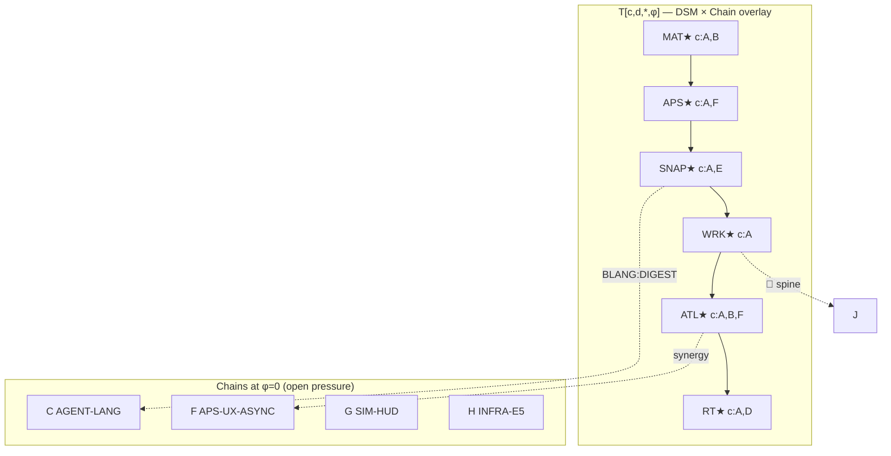

# MASTER-CHAIN-BOARD-4D — orchestration lattice `v1`

| Field | Value |
|:---|:---|
| **ID** | **MASTER-CHAIN-BOARD-4D** |
| **Status** | **ACTIVE** — single operator view |
| **Date** | 2026-06-03 |
| **Lang** | [`agent_lang_v1.md`](agent_lang_v1.md) · BLANG · `$ref` |
| **Queues** | [`grammar_continuation_queue.json`](../tools/orchestrator/queues/grammar_continuation_queue.json) · [`defer_registry.json`](../tools/orchestrator/queues/defer_registry.json) · [`planner_status_audit_v19.md`](planner_status_audit_v19.md) |
| **Tensor index** | [`master_chain_tensor_v1.json`](../tools/orchestrator/queues/master_chain_tensor_v1.json) |

**Purpose:** One board for humans **and** agents — merges parallel chains (A–J), DSM AUTH spine, AGENT-LANG / BLANG ritual, and a **4D lattice** you can overlay on MCP productivity + APS UX + art engine synergy.

**Commit flow (normative):** [`a2c_commit_flow_v1.md`](a2c_commit_flow_v1.md) — **not** a single “mark done”.  
**User feedback:** [`user_feedback_orchestration_layer_v1.md`](user_feedback_orchestration_layer_v1.md)

---

## 0. Orchestration levels (L0–L6)

```text
L0 Operator     → session pick, G-PLAY, defer veto
L1 Orchestrator → BOARD + DRAIN paste
L2 Planner      → COMMIT:SPEC  (⟨ID⟩ + $ref:exec.md)
L3 Implementer  → code/tests   (@coder / @coder-mcp / @designer)
L4 Sub-steps    → per-step φ inside slice (job strip, spine steps, infra keys)
L5 BLANG/MCP    → preflight, digest, validate, pytest, cargo
L6 Witness keys → debug_runs/*.json atomic fields
```

**Between agents:** L2 must land before L3 starts. L6 must land before `BLANG:Q✓`. See sequence diagram in `a2c_commit_flow_v1.md`.

---

## 1. Master chain board (human scan)

**Ten parallel chains** — status after audit v19 + planner A0–A2 + queue sync:

```text
AUTH: MAT★ ⇢ APS★ ⇢ SNAP★ ⇢ WRK★ ⇢ ATL★ ⇢ RT★
```

| Chain | Domain | Status | Next slice | Owner |
|:---|:---|:---:|:---|:---|
| **A — AUTH spine** | MAT→RT product truth | ATL★ RT★ | maintain | @coder-mcp |
| **B — MCP productivity** | P0–P3 briefs | P0/P1 🟢 | ⟨MCP-MAT-BRIEF-001⟩ · ⟨MCP-ATLAS-BRIEF-001⟩ | @coder-mcp |
| **C — AGENT-LANG** | 001–005 symbolic comms | 004 🟢 | ⟨AGENT-LANG-002-REF⟩ → ⟨003-BLANG⟩ → ⟨005-HANDOFF⟩ | @planner-mcp |
| **D — Rowhouse prod** | MCP-PROD-* | Week 1 ready | ⟨MCP-PROD-B2⟩ → ⟨MCP-PROD-C-PILOT⟩ | @coder-mcp / @designer-mcp |
| **E — Grammar iter** | GRAMMAR-ITER | 🟢 closed | maintain witnesses | — |
| **F — APS UX** | APS-UX-* polish | ○ async | ⟨APS-UX-ASYNC-001⟩ ⚡P0 | @coder-mcp |
| **G — Bevy HUD** | SIM-HUD slices | ○ | PLAY01 → DOCK → OPS → MINIMAP → BUILD | @coder |
| **H — Con/Infra** | INFRA-E* + P7 | ○ | ⟨INFRA-E4-002⟩ → ⟨INFRA-E5-002⟩ | @coder A |
| **I — Weather** | WEATHER-* | ○ | ⟨WEATHER-WITNESS-001⟩ | @coder C |
| **J — Defer** | explicit 🧊 | frozen | $ref:defer_registry.json | — |

**Gates (audit v19):** G-CONTAIN 🟢 · G-STAB 🟢 · G-PLAY 💬 OPEN → $ref:plan_g_play_close_001_checklist_v1.md

---

## 2. Four-dimensional lattice (tensor model)

Treat orchestration state as a **sparse 4D tensor** `T[c, d, a, φ]` — overlay, not a database.

| Axis | Symbol | Range | Meaning |
|:---|:---|:---|:---|
| **c** | Chain | A…J (10) | Parallel program lane |
| **d** | DSM | MAT, APS, SNAP, WRK, ATL, RT (6) | Art/engine authority node |
| **a** | Agent | orchestrator, planner, planner-mcp, coder, coder-mcp, designer, operator (7) | Who may write this cell |
| **φ** | Phase | −1, 0, 1, 2 | Lifecycle phase (see below) |

### Phase φ (lifecycle)

| φ | Glyph | Name | Agent commit |
|:---:|:---:|:---|:---|
| **−1** | 🧊 | DEFER | planner sign — $ref:defer_registry.json |
| **0** | ○ | OPEN | no witness |
| **1** | 🟡 | QUALIFIED | witness partial / pass with notes |
| **2** | 🟢 | GREEN | witness `ok` + queue `done` |

**Synergy overlay:** For art engine cells, multiply by **UX responsiveness** layer (APS-UX phases) when `d ∈ {APS, ATL}`:

```text
T_synergy[c,d,a,φ] = T[c,d,a,φ] × R_ux[responsiveness]
```

| R_ux | Condition |
|:---|:---|
| **0.5** | Sync MCP on UI thread (freeze) |
| **1.0** | APS-UX-ASYNC-001 shipped |
| **1.2** | ASYNC + NONBLOCK (no routine modals) |

---

## 3. Lattice graphic (projection 2D)

Collapse **agent a** → primary owner; color = max φ on DSM diagonal:



**Reading the lattice:** Moving **right** along DSM is product authority flow. Moving **down** into parallel chains is **non-blocking** work that must not violate single-writer rules per `d`.

---

## 4. A2C — agent-to-agent commit (full machine)

**Summary only.** State diagram + sequence + per-slice substeps: [`a2c_commit_flow_v1.md`](a2c_commit_flow_v1.md).

```text
PHASE-1 SPEC-COMMIT   L2  @planner|@planner-mcp  →  ⟨ID⟩ + $ref:exec.md
PHASE-2 SUBSTEPS      L4  implementer             →  per-step φ (NOT optional for long slices)
PHASE-3 TOOL PROOF    L5  BLANG / MCP            →  cargo / pytest / briefs
PHASE-4 WIT-COMMIT    L6  @coder|@coder-mcp      →  witness keys green
PHASE-5 QUEUE DONE    L3  BLANG:Q✓               →  agent_queue_update (near end, not start)
PHASE-6 OPS-COMMIT    L0  operator|@designer     →  G-PLAY / sign-off registry
```

| Message | Form | Example |
|:---|:---|:---|
| Route | `ΔWF→@agent ⟨ID⟩` | `ΔWF→@coder A ⟨INFRA-E5-002⟩` |
| Spec lock | `COMMIT:SPEC ⟨ID⟩ $ref:…` | `COMMIT:SPEC ⟨INFRA-E5-002⟩ $ref:plan_construction_p7_logistics_exec_001_v1.md` |
| Substep | `φ:0→1 ⟨ID⟩/step-N` | `φ:0→1 APS-UX-ASYNC/job_controller` |
| Impl lock | `COMMIT:WIT debug_runs/…json` | `COMMIT:WIT logistics_throughput_live.json` |
| Block | `🔴 ⟨ID⟩ 🧩⟨dep⟩` | `🔴 ⟨MCP-SPINE-CHAIN-001⟩ 🧩 Tier-0 BLANG×2` |
| Defer | `🧊 ⟨ID⟩ $ref:defer_registry.json` | `🧊 ⟨MCP-PILOT-GRAMMAR-001⟩` |

**BLANG wraps L5–L5** — every session:

```text
BLANG:PRE → BLANG:Q+ → L4 work → L5 tools → L6 WIT → BLANG:Q✓
```

Agent files: $ref:.cursor/agents/coder-mcp.md§BLANG

---

## 5. Command overlay (sustainable paste block)

**One paste per session** — orchestrator copies this; agents expand via `$ref` only:

```text
BOARD: master_chain_board_4d_v1.md
AUTH: MAT★ ⇢ APS★ ⇢ SNAP★ ⇢ WRK★ ⇢ ATL★ ⇢ RT★

DRAIN:
  @planner-mcp  ⟨AGENT-LANG-002-REF⟩ → ⟨005-HANDOFF⟩
  @coder-mcp    ⟨MCP-PROD-B2⟩ + ⟨MCP-PROD-C-PILOT⟩  |  ⟨APS-UX-ASYNC-001⟩ ⚡P0
  @coder A      ⟨INFRA-E5-002⟩ $ref:plan_construction_p7_logistics_exec_001_v1.md
  @coder        ⟨SIM-HUD-DOCK⟩ $ref:design_sim_hud_dock_v1.md
  Operator      G-PLAY 💬 $ref:plan_g_play_close_001_checklist_v1.md

DEFER: $ref:tools/orchestrator/queues/defer_registry.json
RITUAL: BLANG:PRE → BLANG:Q+ → … → BLANG:Q✓
```

---

## 6. MCP ↔ UX ↔ engine synergy map

| DSM | MCP tool (Tier) | APS UX phase | Engine consumer |
|:---|:---|:---|:---|
| **MAT** | `material_profile_brief` (P2) | Materials tree | `material_profile` on snapshot |
| **APS** | `pipeline_preflight` (P0) | APS-UX-ASYNC-001 job strip | — |
| **SNAP** | `snapshot_digest` · `validate_p0_gate_plain` (P0) | inline P0 panel | `assembly_snapshot` authority |
| **WRK** | `assembly_build_run` | worker status line | BUILD-WORKER-001 |
| **ATL** | `atlas_meta_brief` · `runtime_lookup_brief` | **★ signed** | maintain registry |
| **RT** | `tile-atlas-register` · `rt_eng_001` | **★ signed** | Bevy tile lookup maintain |

**Rule:** UX polish (Chain F) **raises R_ux** but does not change φ on WRK/ATL until witness keys in $ref:plan_dsm_wrk_atl_closure_v1.md pass.

---

## 7. Chain ↔ tensor coordinates (index)

| Chain | Primary `c` | DSM `d` focus | φ today |
|:---|:---:|:---|:---:|
| A | A | WRK★, ATL○ | 1–2 |
| B | B | SNAP, ATL | 2 (P0/P1) |
| C | C | — (meta) | 1–2 |
| D | D | MAT, WRK | 0 |
| E | E | SNAP | 2 |
| F | F | APS, ATL | 0 |
| G | G | — (Bevy HUD) | 0 |
| H | H | — (sim logistics) | 0 |
| I | I | — (weather) | 0 |
| J | J | RT | −1 |

Machine-readable: [`master_chain_tensor_v1.json`](../tools/orchestrator/queues/master_chain_tensor_v1.json)

---

## 8. Recommended drain (next session)

| Pick | Why |
|:---|:---|
| **⟨AGENT-LANG-002-REF⟩** | Unblocks HANDOFF ⟨⟩ syntax — all chains read same overlay |
| **⟨MCP-PROD-B2⟩** | Chain D week 1 — independent of ATL○ |
| **⟨APS-UX-ASYNC-001⟩** | Highest **R_ux** — changes how APS feels |
| **⟨INFRA-E5-002⟩** | Chain H — exec signed, no planner wait |

**Do not pick until BLANG×2 sessions:** ⟨MCP-SPINE-CHAIN-001⟩ (Chain A ATL○ close)

---

## 9. Anti-patterns (overlay discipline)

| Don't | Do |
|:---|:---|
| Rebuild board in chat every turn | `BLANG:HO` + `$ref:master_chain_board_4d_v1.md` |
| Promote 🧊 rows from agent enthusiasm | `defer_registry.json` only |
| Collapse chains into one serial gate | Ten chains — **parallel** per $ref:planner_program_alignment_v1.md |
| Tensor in prose every message | Update JSON index on queue sync only |

---

## Changelog

| Version | Date | Notes |
|:---|:---|:---|
| v1.0.0 | 2026-06-03 | Unified board + 4D tensor + A2C + synergy overlay |
