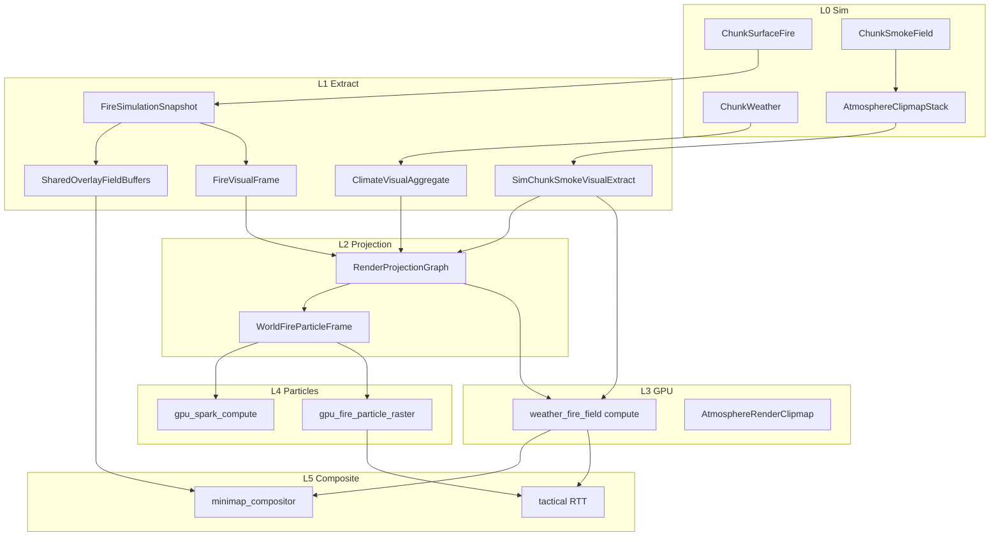

# PLAN-EFFECTS-SYSTEM-ARCH-001 — Unified VFX / atmosphere / particle architecture `v1`

| Field | Value |
|:---|:---|
| **Queue ID** | **PLAN-EFFECTS-SYSTEM-ARCH-001** |
| **Program ID** | **EFFECTS-SYSTEM-UNIFY-001** |
| **Version** | `1.0.0` |
| **Date** | 2026-08-26 |
| **Owner** | `@planner` → `@orchestrator` → tiered subagents |
| **Status** | **ACTIVE** — architecture + execution router (no Rust in this deliverable) |
| **Parent index** | [`development_plan_index.md`](development_plan_index.md) |
| **Tier routing** | [`agent-flow-tiers.mdc`](../../.cursor/rules/agent-flow-tiers.mdc) · MCP `agent_flow_route` |

**Rule:** Witness JSON wins over queue rows. **One visual path per effect class.** Delete stubs before adding parallel paths. Sim truth stays CPU; presentation stays GPU.

---

## Executive verdict

The effects stack is **not one system** — it is **four half-built stacks** pretending to be one:

1. **Fire GPU spine** (mostly correct) — sim extract → projection graph → instanced quads + spark compute  
2. **Atmosphere field** (hybrid, transitional) — fixed 128² CPU grid + GPU ping-pong, clipmap plan unsigned on disk  
3. **Atmosphere particles** (dead stub) — counter-only controller, WGSL never wired  
4. **Weather precip** (CPU mesh scaffold) — Bevy mesh children acting like world-scale rain authority  

**Target:** One **Effects System** with explicit layers, single writers, and a **deletion registry** that retires every stub/scaffold/duplicate before new work lands.

```text
┌─────────────────────────────────────────────────────────────────────────┐
│  EFFECTS SYSTEM (target)                                                 │
├─────────────────────────────────────────────────────────────────────────┤
│  L0 SIM        Chunk fire/smoke/weather · clipmap atmosphere · contam   │
│  L1 EXTRACT    One scan per domain → committed visual frames            │
│  L2 PROJECTION RenderProjectionGraph → per-view GPU upload params       │
│  L3 GPU FIELD  weather_fire_field compute · partial clipmap uploads     │
│  L4 PARTICLES  gpu_instanced_quad spine (fire · ash · precip streaks)   │
│  L5 COMPOSITE  minimap · tactical RTT · post haze/distortion            │
│  L6 EMBELLISH  Hanabi event puffs only (feature-gated, never authority) │
└─────────────────────────────────────────────────────────────────────────┘
```

**Non-goals:** Reopen Stage 5 gate · merge SimEffect spine into render · Hanabi as weather sim · GPU→sim readback without contract.

---

## Related plans (cite, do not re-sign)

| Doc | Role in this program |
|:---|:---|
| [`planner_elemental_vfx_domain_charter_v1.md`](planner_elemental_vfx_domain_charter_v1.md) | Domain authority baseline |
| [`plan_gpu_particle_backend_split_v1.md`](plan_gpu_particle_backend_split_v1.md) | Fire frontend/backend split — **preserve** |
| [`wssr_plan_004_atmosphere_unification_v1.md`](wssr_plan_004_atmosphere_unification_v1.md) | Clipmap + contamination target |
| [`plan_wss_smoke_bridge_exec_001_v1.md`](plan_wss_smoke_bridge_exec_001_v1.md) | Smoke Layer A→B bridge |
| [`plan_wss_atmos_clipmap_exec_001_v1.md`](plan_wss_atmos_clipmap_exec_001_v1.md) | Clipmap implementation exec |
| [`design_fire_overlay_debug_v1.md`](design_fire_overlay_debug_v1.md) | F7O diagnostics contract |
| [`hanabi_event_vfx_style_bounds_v1.md`](hanabi_event_vfx_style_bounds_v1.md) | L6 embellishment bounds |
| [`guide_sim_effect_spine_v1.md`](guide_sim_effect_spine_v1.md) | Sim cause→effect (orthogonal lane) |
| [`plan_render_production_cleanup_v1.md`](plan_render_production_cleanup_v1.md) | Zoom/pose authority (RPC-2) — parallel, not blocked |

Archived reference: [`docs/archive/2026-06-prompts-guides/runbooks/guides/vfx_architecture_bevy_wgpu_v1.md`](../docs/archive/2026-06-prompts-guides/runbooks/guides/vfx_architecture_bevy_wgpu_v1.md)

---

## Current state — debt registry (2026-08-26 audit)

### Production spine — **KEEP** (do not delete)

| Module | Path | Role |
|:---|:---|:---|
| Fire sim | `src/systems/fire/` | ChunkSurfaceFire, ChunkSmokeField, overlay |
| Fire extract | `src/render/extraction/fire_visual_extract.rs` | Sole ECS fire scan |
| Fire projection | `src/render/extraction/render_projection_graph.rs` | Instance + field params |
| Fire particles | `src/render/fire_vfx/` + `gpu_particle_draw` + `gpu_fire_particle_raster` | GPU sparks |
| Fire streaming | `src/render/fx_spine/fire_streaming.rs` | F7-B sleep/wake |
| GPU weather/fire field | `src/render/pipelines/gpu_weather_fire_field.rs` | Ping-pong field compute |
| Overlay authority | `src/render/pipelines/overlay_field_buffers.rs` | SharedOverlayFieldBuffers |
| Zoom authority | `src/gui/world_representation.rs` | ZoomFrame sole writer |
| Spark compute | `src/render/pipelines/gpu_spark_compute.rs` | Advection on GPU frame |
| Water VFX | `src/render/pipelines/gpu_water_*` | Parallel domain — same spine pattern |

### Half-built — **COMPLETE or DELETE** (no third option)

| ID | Module | Evidence | Action |
|:---|:---|:---|:---|
| **DEBT-001** | `atmosphere_particle_controller` | `particles.rs:48` — stub, no GPU | **DELETE** after ES-PR-2 or wire to instancing |
| **DEBT-002** | `atmosphere_render_prep_placeholder` | `render_layers.rs:53` — diag increment only | **DELETE** when ES-PR-4 lands |
| **DEBT-003** | `AtmosphereRenderLayers` toggles | all default false, no pipeline bind | **COMPLETE** → real pass table or delete |
| **DEBT-004** | Atmosphere WGSL (6 files) | `assets/shaders/atmosphere/*` — no render pass | **COMPLETE** ES-PR-4 or move to `experiments/` |
| **DEBT-005** | `WeatherVisualPlugin` mesh precip | CPU entity spawn | **DELETE** after ES-PR-5 GPU streaks |
| **DEBT-006** | `legacy_atmosphere_bridge_system` | L1↔128² roundtrip | **DELETE** when clipmap L0 green |
| **DEBT-007** | `render/mod.rs` path shims (~30) | RENDER-DIR re-exports | **DELETE** incrementally per caller migration |
| **DEBT-008** | `gpu_particles.rs` duplicate facade | re-exports `fire_vfx` | **CONSOLIDATE** imports → `fire_vfx` only |
| **DEBT-009** | `smoke_volume.wgsl` loaded, unwired | `fire_smoke_shader_handles.rs` | **COMPLETE** ES-PR-3 or stop loading |
| **DEBT-010** | Fixed 128² `AtmosphereField` | `field.rs` — won't scale | **REPLACE** via W4-B clipmap (ES-PR-6) |
| **DEBT-011** | Triple smoke authority | ChunkSmoke + AtmosphereField + GPU field | **UNIFY** extract → single bridge (ES-PR-3) |
| **DEBT-012** | `HanabiEmbellishmentPlugin` empty | feature gate, no emitters | **COMPLETE** ES-PR-7 or keep gated off |
| **DEBT-013** | CPU minimap fire heat raster | `tile_world_fallback.rs` | **KEEP** as fallback until GPU compositor sole path proven |
| **DEBT-014** | `weather/mod.rs` "scaffold" | simulation partial | **COMPLETE** weather sim v2 separately — not VFX blocker |

### Closed tracks — **do not re-pick**

FIRE7-PLAN-001 · F7-A/B/C exit · VFX-P2 closure · FX-WATER W1/W2 · spark track closure · MIG-A core

---

## Target architecture

### Layer model (mandatory — do not collapse)

```text
L0 SIM (CPU ECS, deterministic)
  systems::fire          → ChunkSurfaceFire, ChunkSmokeField, ChunkFireOverlay
  systems::weather       → ChunkWeather, ChunkWeatherLocal (future)
  systems::atmosphere    → AtmosphereClipmapStack (replaces fixed 128²)
  substrate::atmosphere  → ContaminationState (separate domain per WSS-004)
  compute::              → HeatDiffusionFieldBuffers (sim visualization, NOT render field)

L1 EXTRACT (CPU snapshots, one scan per domain)
  extract_fire_simulation_snapshot     → FireSimulationSnapshot (SOLE fire ECS read)
  build_fire_visual_frames_by_view     → FireVisualFrame / FireVisualFramesByView
  build_smoke_visual_extract           → SimChunkSmokeVisualExtract
  publish_climate_visual_aggregate     → ClimateVisualAggregate
  sync_shared_overlay_from_simulation  → SharedOverlayFieldBuffers

L2 PROJECTION (graph, no ECS queries)
  run_render_projection_graph          → fire node + smoke node + climate hints
  emit_world_fire_particles_from_projection → WorldFireParticleFrame

L3 GPU FIELD (representation only)
  sync_gpu_weather_fire_uniforms_from_extract
  GpuWeatherFireFieldPlugin ping-pong (weather_fire_field.wgsl)
  atmosphere_partial_gpu partial uploads
  AtmosphereRenderClipmap (derives from sim clipmap — different res/cadence)

L4 PARTICLES (instanced quad spine — generic backend, domain frontends)
  Backend: gpu_instanced_quad, gpu_particle_draw, gpu_indirect_draw
  Fire frontend: fire_vfx (emit, pack, witness)
  Future: atmosphere_frontend (ash/dust quads from field samples)
  Future: weather_frontend (precip streaks from ClimateVisualAggregate)

L5 COMPOSITE
  minimap_compositor (reads SharedOverlayFieldBuffers + GPU field)
  tactical RTT (ExtractedCameraMetrics + ZoomFrame)
  ground_haze / heat_distortion fullscreen passes

L6 EMBELLISH (optional)
  Hanabi: explosion puffs, local ember wisps, debris — NEVER world weather/smoke authority
```

### Authority map — single writers

| Resource | Single writer | Readers |
|:---|:---|:---|
| `ChunkSurfaceFire` / `ChunkSmokeField` | fire tick systems | atmosphere fill, extract only |
| `AtmosphereClipmapStack` | advect set (target) · today: `AtmosphereField` fill+advect | smoke pull, GPU bridge |
| `FireSimulationSnapshot` | `extract_fire_simulation_snapshot` | overlay, projection, streaming |
| `FireVisualFrame` | `build_fire_visual_frames_by_view` | legacy callers → migrate off |
| `SimChunkSmokeVisualExtract` | `build_smoke_visual_extract` | GPU uniforms, witness |
| `RenderProjectionGraph` | `run_render_projection_graph` | particle emit, field upload |
| `WorldFireParticleFrame` | `emit_world_fire_particles_from_projection` | spark compute, raster |
| `SharedOverlayFieldBuffers` | `sync_shared_overlay_from_simulation` | minimap, tile fallback, diagnostics |
| `WeatherFireFieldUniforms` | `sync_gpu_weather_fire_uniforms_from_extract` | render-world compute |
| `ZoomFrame` | `sync_zoom_frame` | cull, diagnostics, extract metrics |
| `WorldFireParticleDrawDispatch` | indirect spine / policy sync | GPU draw |

### Data flow (target — one path)



### Invariants (hard — subagents must not violate)

```text
⛔ Second ECS fire scan in render/extraction
⛔ GPU weather_fire_field writeback to ChunkSmokeField without readback contract
⛔ MapCameraDesired as fire cull authority (use ZoomFrame)
⛔ CPU atmosphere_particle_controller as "particles wired" witness
⛔ WeatherVisualPlugin mesh count as precip authority at world scale
⛔ Hanabi instances driving gameplay state
⛔ Renaming FIRE_* buffer IDs before second instanced-quad consumer ships
⛔ mark_all_dirty on every zoom tick (use viewport-ring dirty — RPC-2)
⛔ Merging ContaminationState into AtmosphereCell
```

---

## Execution program — phased slices

Each phase includes **tier routing** for subagent dispatch. Parent must call `agent_flow_route(goal, domain=render)` before spawning Tasks.

### Phase ES-0 — Hygiene purge (P0, ~1 session)

**Goal:** Stop lying witnesses; remove no-op systems from live schedule.

| Slice | Owner | Files | Exit |
|:---|:---|:---|:---|
| ES-0-1 | @coder | `systems/atmosphere/particles.rs`, `pipeline.rs` | Remove `atmosphere_particle_controller` from schedule OR gate behind `EFFECTS_STUBS=1` |
| ES-0-2 | @coder | `systems/atmosphere/render_layers.rs` | Remove `atmosphere_render_prep_placeholder` from schedule |
| ES-0-3 | @coder | `systems/atmosphere/diagnostics.rs` | Diagnostics must not increment "particles_alive" from stub |
| ES-0-4 | @coder | witness refresh | `debug_runs/stage5_full_app_live.json` → `effects_stub_schedule_clean: true` |

**Regression:** `cargo test -p proc_A_dine01 --lib atmosphere fire_streaming gpu_particles stage5`

#### Subagent packet — ES-0

```yaml
goal: "Remove atmosphere particle/render-prep stubs from live schedule"
domain: render
L0_CHEAP:
  tools: [file_digest('src/systems/atmosphere/pipeline.rs'), witness_brief('debug_runs/stage5_full_app_live.json')]
  output: paths + schedule registration sites
L1_HARD:
  question: "Delete stub systems vs gate env — prefer delete if no callers"
  owner: @debug-intelligence
L2_EXEC:
  owner: @coder
  max_files: 4
  validate: validate_cargo_report(compress=4)
  witness: debug_runs/stage5_full_app_live.json
```

---

### Phase ES-1 — Fire spine hardening (P0, parallel OK)

**Goal:** Lock fire as reference implementation for all particle domains.

| Slice | Owner | Files | Exit |
|:---|:---|:---|:---|
| ES-1-1 | @coder | `fire_vfx/`, `gpu_particle_draw.rs` | Consolidate imports on `fire_vfx`; deprecate duplicate paths in docs only |
| ES-1-2 | @coder | `world_representation.rs`, consumers | All hot paths require `ZoomFrame` — no `map_zoom_alpha` fallback |
| ES-1-3 | @coder | `visual_perf_budget.rs`, `gpu_fire_particle_raster.rs` | Fire extract cadence + draw diagnostics stable |
| ES-1-4 | @designer | `diagnostics_ui.rs` | F7O section reads live `FireDrawDiagnostics` |
| ES-1-5 | operator | `--test vfx` | Sparks visible; tactical_vfx_witness green |

**Status note:** Much of ES-1 landed in prior session (ZoomFrame, cadence, F7O). **Verify operator lane**, then close ES-1.

#### Subagent packet — ES-1 verify

```yaml
goal: "Verify fire GPU spine operator-green after ZoomFrame migration"
domain: render
L0_CHEAP:
  tools: [witness_brief('debug_runs/stage5_full_app_live.json'), file_digest('src/gui/world_representation.rs', max_lines=80)]
L2_EXEC:
  owner: @sim-steward
  command: cargo run -p proc_A_dine01 --release -- --test vfx
  witness: refresh stage5_full_app_live.json + vfx_fire_test_highlight_live.json
```

---

### Phase ES-2 — Generic particle backend generalization (P1)

**Goal:** Extract reusable instanced-quad spine so atmosphere/weather particles don't fork fire.

| Slice | Owner | Files | Exit |
|:---|:---|:---|:---|
| ES-2-1 | @planner | this doc §L4 | Sign `ParticleDomainFrontend` trait pattern (doc-only OK) |
| ES-2-2 | @coder | `gpu_instanced_quad.rs`, `gpu_particle_draw.rs` | `ParticleViewGlobals` from `ExtractedCameraMetrics` only |
| ES-2-3 | @coder | new `render/particle_domains/mod.rs` | Register fire as domain 0; buffer IDs unchanged |
| ES-2-4 | @coder | tests | `policy_scale_partitions`, RTT view uniform tests green |

**Gate:** ES-1 operator verify green.

**Ref:** [`plan_gpu_particle_backend_split_v1.md`](plan_gpu_particle_backend_split_v1.md) phases 1–6, RTT-B5-* items.

#### Subagent packet — ES-2

```yaml
goal: "Generalize gpu_instanced_quad for second domain without renaming FIRE_* IDs"
domain: render
hard_gate: true
L0_CHEAP:
  tools: [file_digest('src/render/pipelines/gpu_instanced_quad.rs'), file_digest('src/dev/plan_gpu_particle_backend_split_v1.md')]
L1_HARD:
  owner: @planner
  output: decision_packet — trait vs enum domain id; reject big-bang rename
L2_EXEC:
  owner: @coder
  max_files: 6
  forbidden: [rename BufferId(3), second fire extract]
```

---

### Phase ES-3 — Smoke Layer A→B completion (P1)

**Goal:** Single smoke path: sim → extract → projection → GPU field. No stub, no triple authority confusion.

| Slice | Owner | Files | Exit |
|:---|:---|:---|:---|
| ES-3-1 | @coder | `smoke_visual_extract.rs`, `fire_visual_extract.rs` | `build_smoke_visual_extract` scheduled before ProjectGpu |
| ES-3-2 | @coder | `render_projection_graph.rs` | Smoke projection node feeds field uniforms |
| ES-3-3 | @coder | `gpu_field_bridge.rs`, `gpu_weather_fire_field.rs` | Smoke channel from bridge only |
| ES-3-4 | @coder | `smoke_volume.wgsl` OR stop load | Wire volume pass **or** remove handle until ES-PR-4 |
| ES-3-5 | witness | `debug_runs/stage5_full_app_live.json` | `smoke_extract_wired: true`, `smoke_stub_removed: true` |

**Ref:** [`plan_wss_smoke_bridge_exec_001_v1.md`](plan_wss_smoke_bridge_exec_001_v1.md) SM-PR-1..4

#### Subagent packet — ES-3

```yaml
goal: "Complete smoke Layer B bridge without GPU writeback to ChunkSmokeField"
domain: render
hard_gate: true
L0_CHEAP:
  tools: [file_digest('src/render/extraction/smoke_visual_extract.rs'), witness_brief('debug_runs/stage5_full_app_live.json')]
L1_HARD:
  owner: @debug-intelligence
  question: "Is smoke extract non-zero when field ticked? Any second ECS smoke scan?"
L2_EXEC:
  owner: @coder
  max_files_per_pr: 3
  tests: cargo test -p proc_A_dine01 --lib smoke fire_streaming
```

---

### Phase ES-4 — Atmosphere composite passes (P2)

**Goal:** Wire the 6 atmosphere WGSL shaders OR delete them from production assets.

| Slice | Owner | Files | Exit |
|:---|:---|:---|:---|
| ES-4-1 | @designer | player-read spec | Ground haze + heat distortion readability at zoom bands |
| ES-4-2 | @coder | `render_layers.rs` → real pass table | `AtmosphereRenderLayers` binds pipelines |
| ES-4-3 | @coder | `assets/shaders/atmosphere/*.wgsl` | Pass nodes in render graph |
| ES-4-4 | @coder | compositor integration | Haze/distortion reads GPU field texture, not CPU mesh |
| ES-4-5 | witness | stage5 + `--test vfx` | `atmosphere_composite_wired: true` |

**Alternative (if EV/Cx fails):** Move unwired WGSL to `assets/shaders/experiments/atmosphere/` and delete DEBT-004 from production tree.

#### Subagent packet — ES-4

```yaml
goal: "Wire atmosphere composite WGSL or quarantine experiments"
domain: render
L0_CHEAP:
  tools: [file_digest('src/systems/atmosphere/gpu_paths.rs'), file_digest('src/render/pipelines/atmosphere_partial_gpu.rs')]
L1_HARD:
  owner: @planner + @designer
  question: "Which passes are P2 required vs defer to clipmap?"
L2_EXEC:
  owner: @coder
  designer_gate: DESIGN-SMOKE-AB-001 player-read
```

---

### Phase ES-5 — Weather precip GPU migration (P2)

**Goal:** Retire `WeatherVisualPlugin` CPU mesh authority; precip from field + instanced streaks.

| Slice | Owner | Files | Exit |
|:---|:---|:---|:---|
| ES-5-1 | @coder | new `render/weather_vfx/` frontend | ClimateVisualAggregate → streak instances |
| ES-5-2 | @coder | `gpu_particle_draw` domain 1 | Precip uses generic backend (after ES-2) |
| ES-5-3 | @coder | `weather_visual.rs` | Delete mesh spawn path |
| ES-5-4 | @designer | zoom band spec | Precip density vs `ZoomFrame.lod_band` |
| ES-5-5 | witness | stage5 | `cpu_weather_precip_retired: true` |

**Gate:** ES-2 complete (generic backend).

#### Subagent packet — ES-5

```yaml
goal: "Replace WeatherVisualPlugin CPU meshes with GPU instanced precip streaks"
domain: render
hard_gate: true
L1_HARD:
  owner: @planner
  reject: Hanabi world-scale rain
L2_EXEC:
  owner: @coder
  preserve: ClimateVisualAggregate single scan
```

---

### Phase ES-6 — Atmosphere clipmap migration (P2–P3)

**Goal:** Replace fixed 128² `AtmosphereField` with `AtmosphereClipmapStack`; delete legacy bridge.

| Slice | Owner | Files | Exit |
|:---|:---|:---|:---|
| ES-6-1 | @coder | `substrate/atmosphere/` | L0–L3 clip levels per WSS-004 |
| ES-6-2 | @coder | `systems/atmosphere/field.rs` | Migration shim reads clipmap L0 at tactical |
| ES-6-3 | @coder | `bridge_legacy.rs` | **DELETE** DEBT-006 |
| ES-6-4 | @coder | save/load | Clipmap snapshot contract |
| ES-6-5 | witness | `debug_runs/*atmos*` | `clipmap_l0_authoritative: true` |

**Ref:** [`plan_wss_atmos_clipmap_exec_001_v1.md`](plan_wss_atmos_clipmap_exec_001_v1.md)

**Status 2026-08-27 (ES-6-001):** **DEFERRED** — `clipmap_l0_authoritative: false` in [`debug_runs/effects_system_es6_live.json`](../../debug_runs/effects_system_es6_live.json). ES-6-1 stack exists; ES-6-2/3/4 not ready. DEBT-006 `bridge_legacy` **retained** (cleanup class B transitional — no half-delete). Next: land ES-6-2 L0 tactical shim before deleting bridge.

**Not blocked by:** ES-3 smoke bridge (can run in parallel after ES-0).

---

### Phase ES-7 — Hanabi L6 embellishment (P3, optional)

**Goal:** Event puffs only; never authority.

| Slice | Owner | Exit |
|:---|:---|:---|
| ES-7-1 | @coder | H-A spike report green |
| ES-7-2 | @coder | Burst emitters wired to `fx_burst_request` |
| ES-7-3 | witness | No minimap bleed; no sim writeback |

**Ref:** [`hanabi_event_vfx_style_bounds_v1.md`](hanabi_event_vfx_style_bounds_v1.md)

---

### Phase ES-8 — Shim purge + import consolidation (P3)

**Goal:** Delete `render/mod.rs` re-export shims; single canonical import paths.

| Slice | Owner | Exit |
|:---|:---|:---|
| ES-8-1 | @coder | grep-zero `crate::render::fire_chunk_runtime` shim imports |
| ES-8-2 | @coder | All callers use `crate::render::fx_spine::*` or domain modules |
| ES-8-3 | @cleanup-intelligence | Pre-delete packet for each shim |

**Gate:** ES-1..5 witnesses green.

---

## Tier model — parent orchestration

```text
Parent (Auto / @orchestrator)
  │
  ├─ agent_flow_route(goal, domain=render)
  │
  ├─ L0 CHEAP (composer-2.5-fast / explore)
  │    file_digest · witness_brief · terrain_honesty_lint (if terrain overlap)
  │    → research_packet.yaml (≤5 open questions)
  │
  ├─ L1 HARD (claude-opus-5-thinking-high) — ONLY if hard_gate
  │    @debug-intelligence or @planner
  │    → decision_packet.yaml (authority, reject_alts)
  │
  └─ L2 EXEC (inherit / @coder / @sim-steward)
       implement ≤6 files · validate_cargo_report · WIT-HON · Q✓
```

**Parallel lanes OK:**

| Lane | Phases | Conflict |
|:---|:---|:---|
| Primary | ES-0 → ES-1 verify → ES-3 | — |
| Secondary A | ES-2 (after ES-1) | COORDINATE on `gpu_particle_draw` |
| Secondary B | ES-6 clipmap | PARALLEL OK vs ES-3 |
| Secondary C | RPC-2 zoom (render cleanup) | COORDINATE on `ZoomFrame` ownership |

**Task quota empty:** Foreground `@coder` with phase packet — do not retry Task.

---

## Witness matrix

| Phase | Witness path | Key fields |
|:---|:---|:---|
| ES-0 | `debug_runs/stage5_full_app_live.json` | `effects_stub_schedule_clean` |
| ES-1 | `debug_runs/stage5_full_app_live.json` | `tactical_vfx_witness`, `fire_draw_diagnostics` |
| ES-1 | `debug_runs/vfx_fire_test_highlight_live.json` | highlight + spark counts |
| ES-2 | `debug_runs/stage5_full_app_live.json` | `particle_domain_registry` |
| ES-3 | `debug_runs/stage5_full_app_live.json` | `smoke_extract_wired`, `smoke_stub_removed` |
| ES-4 | `debug_runs/stage5_full_app_live.json` | `atmosphere_composite_wired` |
| ES-5 | `debug_runs/stage5_full_app_live.json` | `cpu_weather_precip_retired` |
| ES-6 | `debug_runs/effects_system_es6_live.json` | `clipmap_l0_authoritative` (false = deferred 2026-08-27) |
| ES-7 | Hanabi witness | `hanabi_no_sim_writeback` |
| ES-8 | `cargo test stage5` | shim import grep zero |

**Operator verify (all phases):**

```powershell
cargo test -p proc_A_dine01 --lib fire_streaming gpu_particles stage5 atmosphere
cargo run -p proc_A_dine01 --release -- --test vfx
```

---

## File ownership map (subagent routing)

| Agent | Owns | Must not touch |
|:---|:---|:---|
| **@coder** | `src/render/`, `src/systems/atmosphere/`, `src/systems/fire/` extract hooks | `tools/mcp/`, construction |
| **@designer** | Player-read specs, diagnostics UI copy, zoom band tables | WGSL, schedule registration |
| **@planner** | This doc, phase packets, authority decisions | Production Rust |
| **@debug-intelligence** | Drift triage when witnesses disagree | Implementation |
| **@cleanup-intelligence** | Pre-delete classification for ES-8 shims | Deletes |
| **@sim-steward** | Foreground continuity when Task fails | Multi-domain greenfield |

---

## Pick order (start here)

```text
1. ES-0  Hygiene purge          ← immediate, low risk
2. ES-1  Fire spine verify      ← operator --test vfx
3. ES-3  Smoke bridge           ← highest visual impact after fire
4. ES-2  Generic particle backend
5. ES-5  Weather GPU precip
6. ES-4  Atmosphere composites
7. ES-6  Clipmap migration
8. ES-8  Shim purge
9. ES-7  Hanabi (optional)
```

**Session rule:** One primary phase per session unless slices are file-disjoint and authority-safe.

---

## Machine queue seed (orchestrator)

Add rows to [`tools/orchestrator/queues/render_production_cleanup_queue.json`](../tools/orchestrator/queues/render_production_cleanup_queue.json) or new `effects_system_queue_v1.json`:

```json
[
  {"id": "ES-0-001", "phase": "ES-0", "title": "Remove atmosphere stub systems from schedule", "owner": "coder", "status": "ready"},
  {"id": "ES-1-005", "phase": "ES-1", "title": "Operator verify --test vfx after ZoomFrame", "owner": "operator", "status": "ready"},
  {"id": "ES-3-001", "phase": "ES-3", "title": "Smoke Layer B projection node", "owner": "coder", "status": "ready", "blocked_by": ["ES-1-005"]},
  {"id": "ES-2-002", "phase": "ES-2", "title": "Particle domain registry without FIRE_* rename", "owner": "coder", "status": "ready", "blocked_by": ["ES-1-005"]}
]
```

---

## Changelog

| Version | Date | Notes |
|:---|:---|:---|
| v1.0.0 | 2026-08-26 | Initial architecture + tiered subagent router from full codebase audit |
