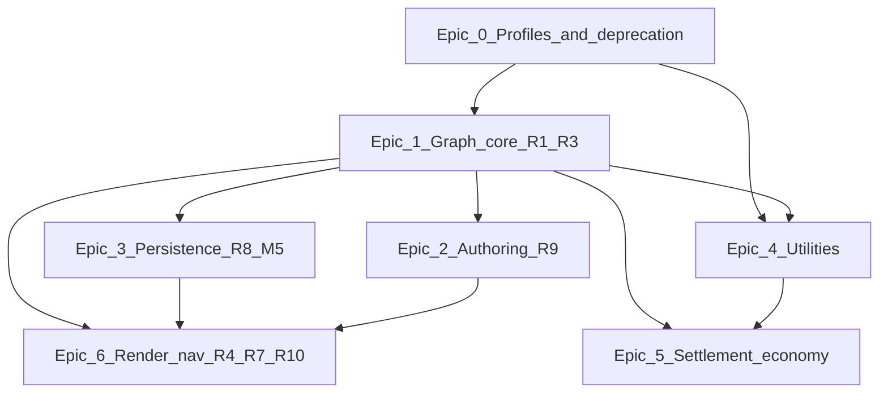

# PLAN-INFRA-WORLD-LAYERS-EXEC-001 — Full infrastructure program (coder workboard)

| Field | Value |
|:---|:---|
| **Program ID** | **PLAN-INFRA-WORLD-LAYERS-001** |
| **Design** | [`world_layer_infrastructure_model_v1.md`](world_layer_infrastructure_model_v1.md) |
| **Matrix** | [`prompts/matrix/transport/road_rail_migration_matrix_v1.md`](../../prompts/matrix/transport/road_rail_migration_matrix_v1.md) (R1–R10) |
| **Transport spine** | [`prompts/designer_questions/transport/transport_code_implementation_plan_v1.md`](../../prompts/designer_questions/transport/transport_code_implementation_plan_v1.md) |
| **Version** | `1.0.0` |
| **Date** | 2026-06-02 |
| **Owner** | `@planner` |
| **Status** | **SIGNED — ACTIVE** |
| **Horizon** | **~12–14 weeks** (6 epics, parallel tracks) |
| **Rule** | **One epic milestone per merge train** where noted; **no** tile `road: bool` for sim; **no** mixing utility + transport in one PR unless Epic 4 explicitly |

This is the **full realizable program** — not incremental hacks. Coders pick the next **ready** row from §6; do not invent parallel “small fixes” outside this board.

**Cross-program alignment:** [`planner_program_alignment_v1.md`](planner_program_alignment_v1.md). **Construction product order 1→11** is **primary** for weeks 1–6 unless product sets `primary_program` to B. Do **not** add `ConstructionStage`; site lifecycle stays [`SiteConstructionPhase`](../../src/strategic/site/resources.rs). Phase 2 staged sites: [`plan_construction_stage_pipeline_exec_002_v1.md`](plan_construction_stage_pipeline_exec_002_v1.md).

| Construction phase | Infrastructure epic | Gate |
|:---:|:---|:---|
| P1 placement validation | — | Before INFRA-E2-003 |
| P2 stage pipeline | — | **Primary** — blocks instant Operational |
| P3 scaling audit | — | Parallel with INFRA E0 |
| P5 town hierarchy | E5-001 | **One** Town book schema (CON leads) |
| P7 logistics & trade | E1–E3, E5-002 | **G-INFRA-07** — graph hydrate before graph-only logistics |

---

## 1. What “done” means for the program

| # | Outcome | Proof |
|:---:|:---|:---|
| 1 | **Terrain tiles carry terrain only** | No sim reads `TerrainFeatures.road/track`; grep gate + migration of `map_snapshot` |
| 2 | **All movement & logistics use transport graph** | `LogisticsGraph` / path queries use `TransportTopology` + `TransportNavExport`; no tile booleans |
| 3 | **Authoring → R8 snapshot → hydrate → sim** | Spline or polyline confirm writes `control_points` + `profile`; round-trip JSON + hybrid save slice |
| 4 | **Profiles are data-driven** | `assets/config/infrastructure/profiles/*.ron` — road, rail, pipeline, footpath |
| 5 | **Utilities are a second graph** | `UtilityNetworkSnapshot` + `UtilityConnection` on buildings; power activation reads network |
| 6 | **Settlement layer links to graphs** | `SettlementNode` ids reference transport/utility nodes (town → port chain works in test scenario) |
| 7 | **Render shows networks without lying** | Overlay from graph bake (R10); optional tile index for picking only |
| 8 | **Construction uses same funnel** | Road/rail build → corridor record → graph edge (not orphan tile markers) |

**Not required for program close (Phase II backlog):** lane reservations (W5), intersection mesh (Option B), hyperloop sim.

---

## 2. Target module layout (create in order)

```
src/infrastructure/           # NEW crate module tree (under proc_A_dine01)
  mod.rs                      # InfrastructurePlugin (registries + load)
  corridor.rs                 # CorridorType, CorridorClass mapping
  profiles/
    mod.rs                    # ProfileRegistry resource, load RON
    road.rs                   # RoadProfile, RoadType, SurfaceType
    rail.rs                   # RailProfile, RailGauge, Electrification
    pipeline.rs               # PipelineProfile (stub v1)
  transport/
    mod.rs                    # Re-export or wrap systems/transport (migration shim)
    graph.rs                  # TransportGraphResource (nodes, edges, typed payload)
    spline.rs                 # Catmull-Rom / Bezier subdivide, curvature reject
    junction.rs                 # Node degree, junction id assignment (R3)
  utility/
    mod.rs                    # UtilityGraphResource
    types.rs                  # UtilityLink, PowerLine, VoltageClass, …
    snapshot.rs               # UtilityNetworkSnapshot serde
  settlement/
    mod.rs                    # SettlementNode, district, building attachment
  tile_index.rs               # TileInfrastructureIndex (ids only, no sim)
  deprecation.rs              # migrate_from_legacy_terrain_features

assets/config/infrastructure/
  profiles/
    road_local_street.ron
    road_highway.ron
    rail_standard_1435.ron
    …
  registry.ron                # index of profile ids → file

src/systems/transport/        # EXISTING — thin over time
  (keep TransportSimulationPlugin schedule; delegate types to infrastructure::)
```

**Migration policy:** Week 1–4 add `src/infrastructure/*` without breaking imports. Week 5–8 move types from `transport/types.rs` behind `infrastructure::transport`. Week 9+ delete legacy stubs.

---

## 3. Epic map (dependencies)



| Epic | Weeks | Theme | Matrix rows |
|:---:|:---:|:---|:---|
| **0** | 1–2 | Profiles + kill tile lies | R4 prep, R5 prep |
| **1** | 2–4 | Graph registry + spline bake | R1, R2, R3 |
| **2** | 3–6 | Editor + construction authoring | R9 |
| **3** | 4–7 | Save/load + world slice | R8, M5 |
| **4** | 5–8 | Utility networks | new + `NetworkType` |
| **5** | 7–10 | Settlement + building connections | G-PLAY logistics chain |
| **6** | 8–12 | Materials, nav, overlays | R4, R7, R10 |

Epics **2** and **3** overlap Epic **1** once `TransportGraphResource` exists.

---

## 4. Epic 0 — Profiles & deprecation (weeks 1–2)

**Goal:** Data-driven corridor vocabulary; stop new legacy usage.

### INFRA-E0-001 — Profile registry (Coder A)

| Item | Detail |
|:---|:---|
| **Files** | `src/infrastructure/profiles/*`, `assets/config/infrastructure/**`, `src/infrastructure/mod.rs` |
| **Deliver** | `ProfileRegistry` resource loaded at startup; `resolve(profile_id) -> CorridorProfileMeta` |
| **RON schema** | `RoadProfile { id, road_type, lanes, speed_limit, surface_tags, turn_radius, cost, allowed_agents }`, `RailProfile { gauge, electrification, tracks, max_speed, … }` |
| **Tests** | `cargo test -p proc_A_dine01 --lib infrastructure::profiles` — load all example RONs |
| **Exit** | Replace `corridor_class_from_profile` string hacks in `transport_bridge.rs` with registry lookup |

### INFRA-E0-002 — Deprecate tile transport flags (Coder B)

| Item | Detail |
|:---|:---|
| **Files** | `src/terrain/bevy_terrain.rs`, `src/terrain/editor/map_snapshot.rs`, `src/terrain/tiles.rs` (if any) |
| **Deliver** | `#[deprecated]` on `TerrainFeatures::road/track`; `TerrainFeatures` → empty or terrain-only replacement struct |
| **Deliver** | `migrate_map_snapshot_v1_to_v2` — strip road bool on load; log once |
| **Tests** | Grep gate test: `rg '\\.road\\b|\\.track\\b' src/` excludes allowlist (tests, migration) |
| **Exit** | CI fails on new `.road` / `.track` in `src/` outside allowlist |

### INFRA-E0-003 — Delete legacy ECS transport stubs (Coder A)

| Item | Detail |
|:---|:---|
| **Files** | Remove or gate `src/entities/structure/legacy_transport_stubs.rs` |
| **Exit** | No `pub struct Road` / `Rrails` in default build; doc pointer to `infrastructure::` |

**Epic 0 milestone:** `cargo check` + profile tests + deprecation gate green.

---

## 5. Epic 1 — Transport graph core (weeks 2–4) — R1, R2, R3

**Goal:** Authoritative in-memory graph with real nodes, subdivided edges, junction detection.

### INFRA-E1-001 — Graph resources (Coder A)

| Item | Detail |
|:---|:---|
| **Files** | `src/infrastructure/transport/graph.rs`, extend `src/systems/transport/types.rs` |
| **Types** | `TransportNodeId`, `TransportEdgeId` (keep u64), `TransportNode { position, junction_kind }`, `TransportEdge { head, tail, profile_id, control_points, corridor: CorridorType, allowed_agents }` |
| **Resource** | `TransportGraph` — `nodes: HashMap<_,_>`, `edges: HashMap<_,_>`, `adjacency` |
| **Wire** | `transport_topology_tick` reads `TransportGraph` → fills `TransportTopology` |
| **Tests** | Insert 3-node line graph; adjacency round-trip |

### INFRA-E1-002 — Spline subdivision (Coder A)

| Item | Detail |
|:---|:---|
| **Files** | `src/infrastructure/transport/spline.rs` |
| **Deliver** | Catmull-Rom sample; max curvature from `RoadProfile.turn_radius`; **reject** or return `SplineError::RadiusViolation` |
| **Deliver** | `subdivide_edge(control_points, profile) -> Vec<SubEdgeSample>` |
| **Tests** | Sharp corner rejected; gentle curve produces N samples |

### INFRA-E1-003 — Junction detection (Coder B)

| Item | Detail |
|:---|:---|
| **Files** | `src/infrastructure/transport/junction.rs` |
| **Deliver** | On edge insert: merge endpoints within epsilon → `TransportNodeId`; `JunctionKind::Endpoint \| PassThrough \| Junction { degree }` |
| **Deliver** | `rebuild_junction_metadata(graph)` after bulk load |
| **Tests** | Two roads sharing point → degree 3 node |

### INFRA-E1-004 — Snapshot hydrate v2 (Coder B)

| Item | Detail |
|:---|:---|
| **Files** | `src/systems/transport/snapshot.rs`, `src/infrastructure/transport/graph.rs` |
| **Deliver** | `hydrate_transport_from_snapshot` builds `TransportGraph` then topology (schema v2 optional field `corridor_type`) |
| **Deliver** | `snapshot_from_transport_graph(&TransportGraph) -> TransportNetworkSnapshot` |
| **Tests** | Round-trip: snapshot → graph → snapshot equals (deterministic ordering) |

**Epic 1 milestone:** In-memory graph drives `TransportTopology` + field store keys; unit tests without editor.

---

## 6. Epic 2 — Authoring & construction (weeks 3–6) — R9

**Goal:** Designers draw corridors; confirm bakes graph; construction spine writes same records.

### INFRA-E2-001 — Spline authoring tool (Coder A + designer UX)

| Item | Detail |
|:---|:---|
| **Files** | `src/gui/editor/map_editor/` (new tool), `src/infrastructure/authoring/` (ghost state) |
| **Deliver** | `CorridorAuthoringTool` — polyline control points, preview mesh/line, profile picker from registry |
| **Deliver** | **Ghost only** until Confirm — no `TransportNetworkSnapshot` mutation (T-GHOST-001) |
| **Deliver** | Cost preview stub from `CorridorCost` (strategic runbook) |
| **Tests** | Lib test: confirm writes N edges with control points preserved |

### INFRA-E2-002 — Map editor bake pipeline v2 (Coder A)

| Item | Detail |
|:---|:---|
| **Files** | `src/systems/transport/bake.rs`, `map_editor/mod.rs` |
| **Deliver** | Replace tile-marker-only bake with: markers OR spline session → `TransportGraph` → snapshot → hydrate |
| **Deliver** | Keep `placement_seq` ordering for legacy marker path during transition |
| **Exit** | “Bake roads → transport graph” uses `TransportGraph`, not ad-hoc edge ids |

### INFRA-E2-003 — Construction corridor confirm (Coder B)

**Gate:** [`planner_program_alignment_v1.md`](planner_program_alignment_v1.md) **G-CON-INFRA** — after CON P1 placement validation green; **after** [`plan_construction_stage_pipeline_exec_002_v1.md`](plan_construction_stage_pipeline_exec_002_v1.md) CON-P2-001 (commit → `Planned`, not instant Operational). Does **not** own site phase ticks.

| Item | Detail |
|:---|:---|
| **Files** | `src/construction/construction_pipeline.rs`, `src/construction/roads/`, `src/strategic/construction_book.rs` |
| **Deliver** | `ConstructionType::RoadSegment` / `RailSegment` on execute: append `TransportEdgeRecord` + `TransportConstructionRecord` |
| **Deliver** | Sim markers (`SimRoadSegmentMarker`) become **view** entities holding `TransportEdgeId` |
| **Tests** | `construction::` integration — execute road → graph edge count +1 → logistics path exists |

### INFRA-E2-004 — Rail tool (Coder B)

| Item | Detail |
|:---|:---|
| **Files** | Same as E2-001 with `CorridorType::Rail`, stricter spline policy |
| **Exit** | Rail profile picker; `allowed_agents: ["train"]` default on rail edges |

**Epic 2 milestone:** Player/editor can create road **and** rail corridors that appear in `TransportNetworkSnapshot` and sim topology.

---

## 7. Epic 3 — Persistence & world save (weeks 4–7) — R8, M5

**Goal:** Networks survive save/load; hybrid world body owns transport slice.

### INFRA-E3-001 — R8 schema v2 (Coder B)

| Item | Detail |
|:---|:---|
| **Files** | `snapshot.rs`, `assets/saves/examples/transport_network_v2.example.ron` |
| **Fields** | `corridor_type`, `profile_id` (required), optional `subdivision_policy`, `owner_id` |
| **Tests** | Load v1 snapshot migrates to v2; round-trip RON + JSON |

### INFRA-E3-002 — Hybrid save slice (Coder B)

| Item | Detail |
|:---|:---|
| **Files** | `src/io/save/`, `src/io/snapshot/mod.rs`, `transport_overlay.rs` |
| **Deliver** | World hybrid body embeds `transport` + `utilities` keys per [`serialization_hybrid_migration_matrix`](../../prompts/matrix/serialization/serialization_hybrid_migration_matrix_v1.md) |
| **Exit** | Map editor Save loads/saves same graph as runtime hydrate |

### INFRA-E3-003 — Autosave + witness (Coder A)

| Item | Detail |
|:---|:---|
| **Witness** | `debug_runs/transport_network_live.json` — node count, edge count, schema version, profile histogram |
| **Tests** | `transport_network_roundtrip_001` lib test writes witness envelope |

**Epic 3 milestone:** Save game → quit → load → graph identical; witness JSON green in sim.

---

## 8. Epic 4 — Utility networks (weeks 5–8)

**Goal:** Power/water/sewer/gas/telecom as parallel graph; buildings connect via `UtilityConnection`.

### INFRA-E4-001 — Utility types + snapshot (Coder B)

| Item | Detail |
|:---|:---|
| **Files** | `src/infrastructure/utility/*` |
| **Types** | `UtilityLink`, `PowerLine`, `VoltageClass`, `WaterPipe`, … per design doc §3.6 |
| **Snapshot** | `UtilityNetworkSnapshot { nodes, edges, schema_version }` |
| **Tests** | Serde round-trip |

### INFRA-E4-002 — Utility graph + solver hook (Coder A)

| Item | Detail |
|:---|:---|
| **Files** | `src/strategic/spatial_network.rs`, `src/infrastructure/utility/graph.rs` |
| **Deliver** | `UtilityGraph` resource; chunk-local flow reads utility edges (extend existing flow solver) |
| **Exit** | `NetworkType::Power` edges come from `UtilityGraph`, not inferred from transport profile strings |

### INFRA-E4-003 — Building connections (Coder B)

| Item | Detail |
|:---|:---|
| **Files** | `src/entities/structure/`, `src/economy/activation/`, building components |
| **Deliver** | `UtilityConnection { network_id, demand }` component; remove `has_power` style flags from activation paths |
| **Tests** | Industrial activation fails when graph cut; succeeds when power edge connected |

### INFRA-E4-004 — Utility authoring tool (Coder A)

| Item | Detail |
|:---|:---|
| **Deliver** | Spline tool subset: power + pipeline profiles; snap to transport corridors optional |
| **Exit** | Save/load includes utility slice |

**Epic 4 milestone:** Power line placement → graph → building activation reads demand from connection.

---

## 9. Epic 5 — Settlement & economy layer (weeks 7–10)

**Goal:** Towns, districts, and logistics chains reference graph nodes — not tiles.

### INFRA-E5-001 — Settlement nodes (Coder B)

**Gate:** Construction roadmap **Phase 5** (`PLAN-SETTLEMENT-HIERARCHY-005`) owns `Town` / district book schema — this slice **implements attachment** to transport nodes only; no duplicate `Town` resource.

| Item | Detail |
|:---|:---|
| **Files** | `src/infrastructure/settlement/mod.rs`, `src/strategic/` integration |
| **Types** | `SettlementId`, `SettlementNode { kind: Town \| Port \| Depot, position, attached_transport_nodes }` |
| **Deliver** | `attach_settlement_to_nearest_transport_node` within radius |

### INFRA-E5-002 — Logistics path uses graph only (Coder A)

| Item | Detail |
|:---|:---|
| **Files** | `src/economy/logistics/`, `src/strategic/logistics_graph.rs` |
| **Deliver** | Route open/closed from `TransportNavExport` path existence town → port |
| **Remove** | Any remaining `patch_s7p_*` from non-test builds (align DEHACK-LOG compile boundary) |
| **Tests** | LOG-E01 / play scenario: `routes_open > 0` from graph after road build |

### INFRA-E5-003 — Play scenario integration (Coder B)

| Item | Detail |
|:---|:---|
| **Files** | `src/engine/play_scenario.rs` |
| **Deliver** | Default industrial scenario seeds **graph edges** (or loads RON network), not harness tile paint |
| **Exit** | G-PLAY-01 script uses same graph as sim |

**Epic 5 milestone:** End-to-end: town → road graph → port rail edge → logistics green without test harness shortcuts.

---

## 10. Epic 6 — Render, materials, nav (weeks 8–12) — R4, R7, R10

**Goal:** Visuals and pathfinding consume graph; terrain materials from profile tags.

### INFRA-E6-001 — Material tags from profiles (Coder A + terrain)

| Item | Detail |
|:---|:---|
| **Files** | `src/terrain/registry_serde_path.rs`, profile → tag resolver |
| **Deliver** | `RoadProfile.surface_tags` → `MaterialId` (matrix R4) |
| **Exit** | No new hardcoded `RoadSurfaceType` in sim hot path |

### INFRA-E6-002 — Nav agent routing (Coder A)

| Item | Detail |
|:---|:---|
| **Files** | `src/systems/navigation/`, `TransportNavExport` consumers |
| **Deliver** | Coarse A* or Dijkstra on `TransportTopology` for `allowed_agents` |
| **Tests** | Vehicle path on road edges; train rejected on road-only edge |

### INFRA-E6-003 — Network overlay render (Coder B)

| Item | Detail |
|:---|:---|
| **Files** | `src/render/`, `tilemap_adapter`, new `infrastructure_overlay.rs` |
| **Deliver** | Draw edges from `TransportGraph` + utility graph; **TileInfrastructureIndex** for picking |
| **Exit** | R10: separate overlay layer; terrain chunk unchanged |

### INFRA-E6-004 — Debug overlays (Coder A)

| Item | Detail |
|:---|:---|
| **Deliver** | Toggle congestion/damage/utility load on edges (debug-only plugin) |
| **Witness** | Visual capture may show overlay; default sim off |

**Epic 6 milestone:** `--test visual` shows road/rail overlay from graph; nav test agent reaches goal.

---

## 11. Phase II backlog (do not block program sign-off)

| ID | Item | When |
|:---|:---|:---|
| **INFRA-PH2-001** | Lane graph + reservations (W5, Option A) | After Epic 6 |
| **INFRA-PH2-002** | Junction mesh / intersection fill (Option B) | After Epic 6 |
| **INFRA-PH2-003** | Canal, air, hyperloop profiles | Product asks |
| **INFRA-PH2-004** | Political / military layer fields on edges | Strategic expansion |

---

## 12. PR train (one primary slice per PR)

| PR | Slice ID | Epic | Owner | Est. |
|:---:|:---|:---:|:---|:---:|
| 1 | INFRA-E0-001 | 0 | A | 3–5 d |
| 2 | INFRA-E0-002 | 0 | B | 2–3 d |
| 3 | INFRA-E0-003 | 0 | A | 1 d |
| 4 | INFRA-E1-001 | 1 | A | 4–6 d |
| 5 | INFRA-E1-002 | 1 | A | 4–5 d |
| 6 | INFRA-E1-003 | 1 | B | 3–4 d |
| 7 | INFRA-E1-004 | 1 | B | 3–4 d |
| 8 | INFRA-E2-001 | 2 | A | 5–8 d |
| 9 | INFRA-E2-002 | 2 | A | 3–4 d |
| 10 | INFRA-E2-003 | 2 | B | 4–6 d |
| 11 | INFRA-E2-004 | 2 | B | 3–4 d |
| 12 | INFRA-E3-001 | 3 | B | 3–4 d |
| 13 | INFRA-E3-002 | 3 | B | 5–7 d |
| 14 | INFRA-E3-003 | 3 | A | 2 d |
| 15–18 | INFRA-E4-* | 4 | A/B | 2–3 w |
| 19–21 | INFRA-E5-* | 5 | A/B | 2 w |
| 22–25 | INFRA-E6-* | 6 | A/B | 3–4 w |

**Parallelism:** After PR 4, **A** owns spline/editor/render/nav; **B** owns junction/snapshot/construction/utility/settlement.

---

## 13. Regression (every PR)

```powershell
cargo check -p proc_A_dine01
cargo test -p proc_A_dine01 --lib infrastructure transport construction logistics stage5
.\tools\orchestrator\scripts\check_live_proof_containment.ps1
```

Epic 3+:

```powershell
cargo test -p proc_A_dine01 --lib transport_network_roundtrip
```

Epic 2+:

```powershell
cargo test -p proc_A_dine01 --lib construction
```

---

## 14. Machine queue hook

Repopulate [`coder_active_queue.json`](../../tools/orchestrator/queues/coder_active_queue.json) **infrastructure track** (separate from PHASE-STABLE DEHACK):

```json
"infrastructure_program": {
  "phase_id": "PLAN-INFRA-WORLD-LAYERS-001",
  "exec_doc": "src/dev/plan_infrastructure_world_layers_exec_001_v1.md",
  "active_epic": "E0",
  "next_slices": ["INFRA-E0-001", "INFRA-E0-002"]
}
```

Do **not** interleave with DEHACK-ENG/RENDER/LOG unless same coder is idle — different program.

---

## 15. Anti-patterns (program-level)

| Do not | Do instead |
|:---|:---|
| Add `road: bool` to terrain | Graph edge + optional render index |
| Bake only segments to save | Store control points + profile id (R8) |
| `building.has_power` | `UtilityConnection` |
| One PR for editor + utility + nav | Follow §12 PR train |
| String `profile.contains("rail")` | `ProfileRegistry` + `CorridorType` |
| Skip tests “until later” | Each slice has tests in §4–10 |

---

## 16. Changelog

| Version | Date | Notes |
|:---|:---|:---|
| v1.0.0 | 2026-06-02 | Full 6-epic program; 25 PR train; module layout |
