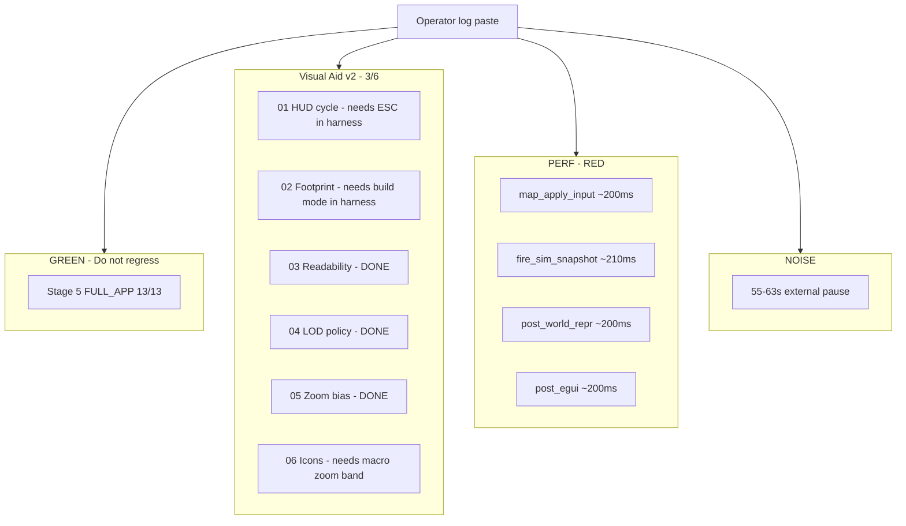

# Visual / VFX test dump response plan (2026-06-21)

**Status:** SIGNED (planner) · **Scope:** Read-only routing from operator paste — no code in this doc  
**Inputs:** `--test visual` session (~00:43–00:51Z) + `--test vfx` release run (~04:15–04:16Z)  
**Related:** [`visual_aidv2.md`](visual_aidv2.md) · [`visual_aidv2_live_todos.rs`](visual_aidv2_live_todos.rs) · [`triage_perf_vfx_fix_live_proof.rs`](triage_perf_vfx_fix_live_proof.rs) · `PERF-INSTR-VFX-002`

---

## Executive summary

The dump is **not one failure** — it is **four independent lanes**:

| Lane | Verdict | Operator takeaway |
|------|---------|-------------------|
| **Stage 5 FULL_APP** | **GREEN** | Spine authoritative; do not reopen Stage 5 gate for this paste |
| **Visual Aid v2 board** | **3/6 stuck** | Product/readability lane — not gated on Stage 5 exit |
| **Interactive perf** | **RED vs 33ms target** | Steady ~250ms/frame (~4 FPS); known PERF lane |
| **Log noise** | **YELLOW** | 55–63s `substage_map_apply_input` gaps = external pause, not sim cost |

**Do not** treat Stage 5 green as Visual Aid complete or perf acceptable.

---

## What the dump proves

### Stage 5 (pass)

At inv 840, 960, 1080, 1200:

- `STAGE5_BOARD_QUIET … passes=true done=13/13`
- `STAGE5_FULL_APP_TRUTH`: all hard gates true, `viol_len=0`, `MISSING_WIRING_FULL_APP: none`

Stage 5 operational readiness for the visual spine is **closed for this run**.

### Visual Aid v2 (partial — 3/6)

Repeated line:

```text
VISUAL_AID_V2_BOARD done=3/6 footprint_ok=false readability=true icons=0
```

Board rows (`VISUAL-AID-V2-01`…`06`) and predicates live in [`visual_aidv2_live_todos.rs`](visual_aidv2_live_todos.rs).

**Inferred done (3):**

| ID | Row | Why likely Done |
|----|-----|-----------------|
| **03** | Tile readability clamp | Log `readability=true` → `TileReadabilityWitness::clamp_active` |
| **04** | LOD building policy | `building_visual_simplified_differs_across_bands()` static true once witness sync runs |
| **05** | Zoom visual bias | `ZoomVisualBias::default().enabled == true` |

**Inferred open (3):**

| ID | Row | Why open in this harness |
|----|-----|---------------------------|
| **01** | HUD panel state machine | `HudPanelStateWitness::cycle_ok` only flips on **Escape** — harness never sends ESC |
| **02** | GPU footprint tiles | `footprint_ok=false` — no active build strip + ghost (`ToolContext::None` / empty `footprint_tiles`) |
| **06** | Macro icon instances | `icons=0` — scaffold requires `WorldLodBand::Macro\|Strategic` **and** `building_visual_simplified` ([`strategic_icon_instances.rs`](../gui/strategic_icon_instances.rs)); test stays tactical zoom |

VFX run briefly showed `done=2/6` before sim entry, then `3/6` after — consistent with readability + repr witnesses coming online after `BaseState::Simulation`.

### Perf (fail vs interactive target)

**Steady state (~200ms × 3 slices ≈ 250ms wall):**

- `substage_map_apply_input` ~198–220ms (p50)
- `substage_fire_sim_snapshot` ~210–230ms (p50); spikes 760ms, 2315ms during world-gen / fire seed
- `post_world_repr` ~198–220ms
- `post_egui` ~200–210ms on many frames

**Frame budget:** `FrameSpike: frame 250.0 ms (avg 250.0 ms)` — aligns with [`triage_perf_vfx_fix_live_proof.rs`](triage_perf_vfx_fix_live_proof.rs) baseline (`p50_ms: 233.84`, `p95_ms: 250.0`).

**Acceptance target** (PERF lane): steady wall p50 **≤ 33ms** — **not met**.

**Megastalls (discard for slice attribution):**

- `substage_map_apply_input: 55848ms`, `63686ms`, `54659ms` (~55–63s)
- Gap pattern: prior frame normal → one empty minute → resume ~200ms cadence
- **Interpretation:** IDE/debugger break, OS sleep, or window focus loss — **not** map_input hot path regression

VFX `--test` (release): world-gen dominates early (`substage_fire_sim_snapshot` 1292ms, 1576ms, 2315ms); post–FullReady sim slices return to ~250–350ms — same structural problem as visual.

### Secondary signals (triage, not P0)

| Signal | Count | Route |
|--------|-------|-------|
| `commit_construction_site: weighted overlap rejected` @ (4,4) | Repeated | Test harness placement — expected reject, not spine break |
| Bevy `B0004` parent without `GlobalTransform` (entities 2v0–25v0) | On procedural spawn | **@coder** — construction/procedural spawn must insert `GlobalTransform` on parent |
| `StylePackRegistry` / module reload on commit | Burst | Construction test path side effect — document, don't chase in perf slice |
| Release compile **182m** | Build infra | Separate from runtime perf; use `--features test_instrumentation` dev loop or sccache |

---

## Root cause map



---

## Phased response

### Phase 0 — Witness compression (same day, @coder-mcp or operator)

**Goal:** Replace log archaeology with JSON the planner already trusts.

| Task | Owner | Command / artifact |
|------|-------|-------------------|
| Refresh visual proof | operator | `cargo run -p proc_A_dine01 --features test_instrumentation -- --test visual` → `debug_runs/stage5_full_app_live.json` + `debug_runs/visual_aidv2_live.json` |
| Refresh spectrum rollup | operator | Same run with `TEST_INSTRUMENTATION` → `debug_runs/sim_spectrum_analytics_live.json` |
| VFX acceptance | coder_b | `cargo run -p proc_A_dine01 --release --features test_instrumentation -- --test vfx` → update `debug_runs/triage_perf_vfx_fix_*_live.json` |

**Exit:** OPS witness index shows visual + spectrum + triage paths fresh; board row statuses in JSON match log inference.

---

### Phase 1 — Visual Aid v2 close 3→6 (product, @coder + @designer)

**Priority order** — smallest harness fix first, then real product gaps.

#### P1a — Harness predicates (closes 01, 02, 06 without feature work)

| ID | Change | File hint |
|----|--------|-----------|
| **VA2-HARNESS-01** | After sim entry, synthesize `cycle_ok` OR inject one ESC frame in test harness | `src/engine/test_harness.rs` |
| **VA2-HARNESS-02** | Visual proof: activate build strip + ghost for N ticks so `footprint_tile_count > 0` | `test_harness` + construction seed |
| **VA2-HARNESS-03** | Zoom out to Macro band before readiness snapshot for icon scaffold | `test_harness` / map camera script |

**Exit:** `VISUAL_AID_V2_BOARD done=6/6` in `--test visual` log; `visual_aidv2_live.json` records all rows Done.

#### P1b — Product gaps (if harness exposes real misses)

| ID | Row | Work |
|----|-----|------|
| **VA2-FOOTPRINT-001** | 02 | Ensure footprint path active during normal sim build preview (not only harness) |
| **VA2-ICONS-001** | 06 | Wire scaffold → projection graph slice; remove placeholder `Vec2::ZERO` icon |
| **VA2-HUD-001** | 01 | Designer sign-off on Collapsed/Peek/Expanded/Pinned UX per [`visual_aidv2.md`](visual_aidv2.md) |

**Authority:** Footprint remains transitional scaffold per [`footprint_tile_instances.rs`](../construction/footprint_tile_instances.rs) — exit via overlay channel, not parallel extract.

---

### Phase 2 — Perf spine (infrastructure, @coder / coder_b)

**Continue** existing `PERF-INSTR-VFX-002` program — do not fork a second perf plan.

| Slice | Target | Notes from dump |
|-------|--------|-----------------|
| **2A** Fire snapshot fingerprint | Skip redundant `FireSimulationSnapshot` work when unchanged | Spikes 760ms, 2315ms on seed ticks |
| **2B** World repr fingerprint | `post_world_repr` p50 → ≤5ms steady | Currently ~200ms every frame |
| **2C** Map camera dirty gate | `substage_map_apply_input` p50 → ≤5ms steady | Dominates wall time |
| **2D** Camera zoom bounds | Reduce smooth-chain cost | Occasional `after_map_camera_smooth` spikes in historical triage |

**Measurement discipline:**

- Reason on `sim_spectrum_analytics_live.json` + `triage_perf_vfx_fix_*` — not raw stall spam
- Treat stall labels as **overlapping wall intervals** ([`triage_perf_vfx_fix_live_proof.rs`](triage_perf_vfx_fix_live_proof.rs) `measurement_note`)
- Ignore frames with gap >5s between timestamps when computing p50/p95

**Exit:** `steady_wall_p50_ms ≤ 33` and slice owners `< 5ms` p50 for 120+ frames in sim after world-gen settles.

---

### Phase 3 — Hygiene (parallel, low urgency)

| ID | Issue | Owner |
|----|-------|-------|
| **CON-PROC-B0004-001** | Parent entity `1v0` missing `GlobalTransform` on procedural commit | @coder |
| **CON-OVERLAP-DOC-001** | Document (4,4) weighted overlap as harness expectation | @designer-mcp / test docs |
| **BUILD-TIME-001** | 182m release compile — profile incremental + feature split for CI | ops / infra |

---

## Queue seeds (machine picks)

Add or unblocked in `tools/orchestrator/queues/multi_parallel_tracks_dispatch_v1.json` / coder home:

```json
[
  {
    "id": "VA2-HARNESS-CLOSE-001",
    "priority": "P1",
    "owner": "coder_a",
    "goal": "Close VISUAL-AID-V2-01/02/06 via test harness actions",
    "exit": "visual_aidv2_live.json done=6/6 on --test visual"
  },
  {
    "id": "VA2-FOOTPRINT-PRODUCT-001",
    "priority": "P2",
    "owner": "coder_a",
    "depends_on": "VA2-HARNESS-CLOSE-001",
    "goal": "Footprint GPU path during live build preview"
  },
  {
    "id": "PERF-INSTR-VFX-002",
    "priority": "P1",
    "owner": "coder_b",
    "status": "in_progress",
    "goal": "Phase 2A–2D dirty gates; triage witness green"
  },
  {
    "id": "CON-PROC-B0004-001",
    "priority": "P3",
    "owner": "coder_a",
    "goal": "GlobalTransform on procedural parent spawn"
  }
]
```

---

## Routing (@orchestrator)

| Next pick | Agent | Rationale |
|-----------|-------|-----------|
| **VA2-HARNESS-CLOSE-001** | @coder | Fastest path 3/6 → 6/6; unblocks designer review |
| **PERF-INSTR-VFX-002** (parallel) | @coder on coder_b lane | Independent; don't block VA2 harness |
| Stage 5 / readiness | **None** | Already green — regression only |
| APS presence todos | Separate lane | Not in this dump |

**Handoff one-liner:** *Stage 5 green; Visual Aid 3/6 is harness + footprint/icons; perf ~250ms is PERF-INSTR-VFX-002; ignore 60s pauses.*

---

## Verification checklist

- [ ] `cargo test -p proc_A_dine01 --lib stage5` — spine regression
- [ ] `--test visual` → `done=6/6` in log + `debug_runs/visual_aidv2_live.json`
- [ ] `sim_spectrum_analytics_live.json` → `frame_wall_ms.p50_ms` trending toward 33ms post Phase 2
- [ ] No new Stage 5 violations after perf dirty gates
- [ ] B0004 warnings absent on construction commit in visual test

---

## SHIPPED / PLANNED / DEFER

| Item | Label |
|------|-------|
| This plan + dump interpretation | **SHIPPED** |
| VA2 harness close | **PLANNED** P1 |
| PERF 2A–2D | **PLANNED** (in flight) |
| Footprint overlay migration | **DEFER** until VA2 board green + designer sign-off |
| 182m release compile fix | **DEFER** infra |
