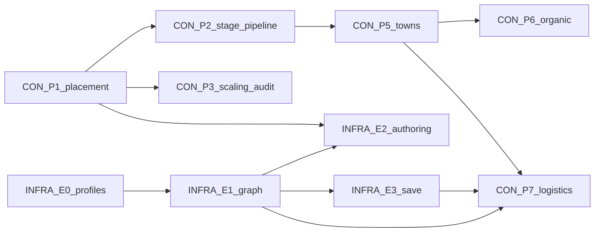

# Planner program alignment hub `v1`

| Field | Value |
|:---|:---|
| **ID** | **PLANNER-PROGRAM-ALIGN-001** |
| **Date** | 2026-06-02 |
| **Status** | **SIGNED** |
| **Purpose** | Single map when **two planner tracks** (construction product 1→11 vs infrastructure world layers) must not fork authority |

---

## 1. Active programs (dual track — all advance)

| Program | Exec / roadmap | Horizon | Coder focus |
|:---|:---|:---|:---|
| **Construction product** | [`construction_product_roadmap_phases_2_10_v1.md`](construction_product_roadmap_phases_2_10_v1.md) · [`plan_construction_stage_pipeline_exec_002_v1.md`](plan_construction_stage_pipeline_exec_002_v1.md) | Phases **1→11** | Sites, parametric, staged `SiteConstructionPhase` |
| **Infrastructure / transport** | [`plan_infrastructure_world_layers_exec_001_v1.md`](plan_infrastructure_world_layers_exec_001_v1.md) | Epics **0→6** | Graph, R8, utilities, tile deprecation |
| **Fleet PHASE-STABLE P2** | [`fleet_stability_phase2_dispatch_v1.md`](fleet_stability_phase2_dispatch_v1.md) | Ongoing tails | Play, WSS, containment, CI — **fill gaps between epics** |
| **Procedural + organic growth** | [`construction_procedural_growth_index_v1.md`](construction_procedural_growth_index_v1.md) | Phases **4–8** (after P2) | Module kit + PG/OG slices; **no** instant Operational |

**Pull queue (authoritative order):** [`coder_unified_backlog_v1.md`](coder_unified_backlog_v1.md) — two columns (Coder A / Coder B), ~20 rows each, file territories in §Owner split.

**Merge policy:** **No single primary** — both tracks run. Respect §3 gates and **file territories** so two coders do not edit the same files in one week. ≤3 files per PR.

---

## 2. User order 1→11 mapped to both planners

| P | Construction roadmap | Infrastructure exec | Notes |
|:---:|:---|:---|:---|
| **1** | Placement validation | — (prereq for INFRA-E2-003) | Close parametric ghost gaps first |
| **2** | Staged site pipeline (`SiteConstructionPhase` + progress) | — | **No** parallel `ConstructionStage` enum |
| **3** | Scaling audit S1–S6 | — | Uses existing `placement_scaling.rs` |
| **4** | Placeholder art / module kit | INFRA-E6-001 partial (material tags) | Designer parallel; not blocking 2–3 |
| **5** | Town / district hierarchy | **INFRA-E5-001** (same concept) | **One** book schema — see §4 |
| **6** | Organic growth | INFRA-E5 + organic growth exec | Same execute funnel |
| **7** | Logistics & trade | **INFRA-E1–E3, E5-002** | Needs transport graph before “graph-only logistics” |
| **8** | GIS import | — | worldgen lane |
| **9–11** | Military / C2 / front | Phase II / strategic | After 7 |

---

## 3. Dependency gates (hard)

| Gate | Rule |
|:---|:---|
| **G-CON-02** | No new code path may set `SiteConstructionPhase::Operational` on commit except `advance_site_construction_tick` + witness-approved tests |
| **G-CON-INFRA** | `INFRA-E2-003` (road/rail → `TransportEdgeRecord`) **after** CON P1 green and **does not** change site phase authority |
| **G-INFRA-07** | CON P7 “logistics on graph” **blocked** until `INFRA-E1-004` hydrate round-trip green |
| **G-TOWN-ONE** | Town/district schema: **CON P5** owns book design; INFRA-E5-001 **imports** ids — no duplicate `Town` resource |
| **G-PHASE-ONE** | `SiteConstructionPhase` is the **only** site lifecycle enum |

---

## 4. Authority map (avoid duplicate types)

| Concept | Authoritative home | Other docs may only… |
|:---|:---|:---|
| Site build lifecycle | `SiteConstructionPhase` in `strategic/site/resources.rs` | Display aliases (`Building` → `UnderConstruction`) |
| Clearing substeps | `SiteStageProgress.substep` or `ClearingSubstep` resource | Forest pipeline example in roadmap §2 |
| Transport graph | `TransportGraph` / R8 snapshot (`systems/transport` → `infrastructure/transport`) | Construction appends edges on **road/rail execute** |
| Corridor profiles | `ProfileRegistry` (`infrastructure/profiles`) | Replace string `profile.contains("rail")` |
| Town / district | `strategic/` books (**CON P5** schema lead) | INFRA settlement attachment by id |
| Building power | `UtilityConnection` (**INFRA E4**) | Remove `has_power` flags in activation |
| Construction execute | `execute_construction_plans_system` only | Preview never commits |

---

## 5. Dual coder model (continuous queue)

| Coder | Pull from | While blocked on… |
|:---|:---|:---|
| **A** | [`coder_unified_backlog_v1.md`](coder_unified_backlog_v1.md) § Coder A | Next row with deps green; or fleet P2 row (minimap, CI) |
| **B** | [`coder_unified_backlog_v1.md`](coder_unified_backlog_v1.md) § Coder B | Same |

**Safe parallel pairs:** backlog doc § “Parallel work safe pairs”.

**Machine mirror:** `coder_active_queue.json` → `coder_a.active[]` / `coder_b.active[]` (current sprint) + `construction_program` / `infrastructure_program` metadata.

---

## 6. Witness / test ownership

| Witness key | Program | Test module |
|:---|:---|:---|
| `construction_site_stage_pipeline_001` | A Phase 2 | `construction::` |
| `construction_scaling_audit_001` | A Phase 3 | `construction::` |
| `transport_network_live.json` | B Epic 3 | `infrastructure::` / transport |
| `construction_stage_live.json` | A (existing) | extend, do not fork |

---

## 7. Product decision (resolved 2026-06-02)

**Dual track — all programs advance.** No serial “primary”; use file territories + dependency gates. Queue: [`coder_unified_backlog_v1.md`](coder_unified_backlog_v1.md).

---

## 8. Doc index (all planner artifacts)

| Doc | Role |
|:---|:---|
| [`construction_product_roadmap_phases_2_10_v1.md`](construction_product_roadmap_phases_2_10_v1.md) | Product phases 2–10 |
| [`plan_construction_scaling_audit_exec_003_v1.md`](plan_construction_scaling_audit_exec_003_v1.md) | Phase 3 scaling audit S1–S6 |
| [`plan_construction_stage_pipeline_exec_002_v1.md`](plan_construction_stage_pipeline_exec_002_v1.md) | Phase 2 site stage pipeline (closed) |
| [`world_layer_infrastructure_model_v1.md`](world_layer_infrastructure_model_v1.md) | Infrastructure design authority |
| [`plan_infrastructure_world_layers_exec_001_v1.md`](plan_infrastructure_world_layers_exec_001_v1.md) | Infrastructure 25-PR program |
| [`plan_fleet_stability_integrity_exec_002_v1.md`](plan_fleet_stability_integrity_exec_002_v1.md) | Proof / cfg P1 |
| [`development_plan_index.md`](development_plan_index.md) | Human index |
| [`construction_procedural_buildings_plan_v1.md`](construction_procedural_buildings_plan_v1.md) | Module assembly + district growth architecture |
| [`construction_procedural_growth_index_v1.md`](construction_procedural_growth_index_v1.md) | Proc/growth deliverables + build order |
| [`plan_procedural_build_gen_exec_001_v1.md`](plan_procedural_build_gen_exec_001_v1.md) | PG-1..4 coder exec |
| [`plan_organic_growth_exec_001_v1.md`](plan_organic_growth_exec_001_v1.md) | OG-1..4 coder exec |
| [`design_procedural_module_kit_v1.md`](design_procedural_module_kit_v1.md) | Designer module kit |
| [`plan_art_design_inbound_alignment_v1.md`](plan_art_design_inbound_alignment_v1.md) | Inbound art/design → signed plans map |
| [`plan_settlement_hierarchy_exec_005_v1.md`](plan_settlement_hierarchy_exec_005_v1.md) | Phase 5 town/district/block books |
| [`design_organic_growth_ux_v1.md`](design_organic_growth_ux_v1.md) | Designer growth UX |

---

## Changelog

| Version | Date | Notes |
|:---|:---|:---|
| v1.0.0 | 2026-06-02 | Align construction roadmap 1→11 with infrastructure exec; gates + primary default A |
| v1.1.0 | 2026-06-02 | Dual-track queue; unified backlog; product: both programs + 2 coders |
| v1.2.0 | 2026-06-02 | Linked procedural/growth index + PG/OG horizon in unified backlog |
