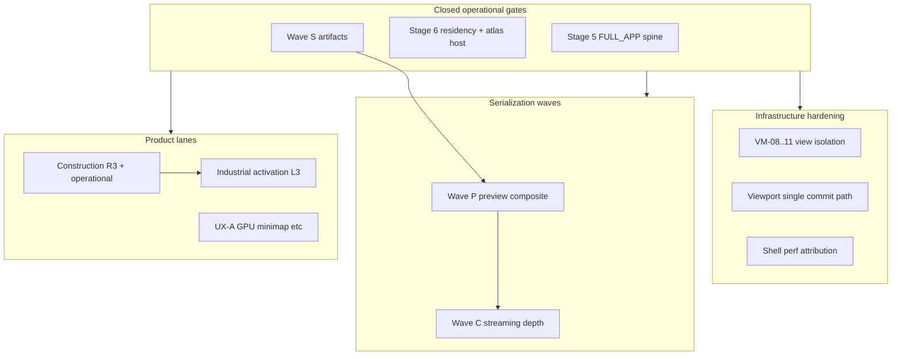

# Post–Stage 6 design plan

**Status:** Active planning (2026-05-23)  
**Prerequisites met:** Stage 5 operational · Stage 5.5 tracks · Stage 6 operational · Wave S save spine (S6-S1/S6-S3)

**Working board:** [`post_stage6_active_todos.md`](post_stage6_active_todos.md)

---

## 1. What we are optimizing for

| Goal | Plain English |
|------|----------------|
| **No second truth** | Preview, minimap, and main map read the same canonical sim + save spine — no parallel extract or mock HUD feeds. |
| **Hardening ≠ reopening gates** | VM/viewport/perf work extends authority; it does not replace `stage6_readiness` or FULL_APP closure. |
| **Wave order** | **S** (save wire) → **P** (preview composite) → **C** (streaming depth) per [`backlog_serialization_preview_streaming_runbook_v1.md`](../../prompts/guides/backlog_serialization_preview_streaming_runbook_v1.md). |
| **Product parallel** | Construction operational → industrial activation; logistics visuals; UX GPU minimap — each with its own witness, not folded into Stage 6. |

---

## 2. Architecture lanes (do not collapse)

**Authority rule (carry forward):** UI requests → viewport resolve → `ViewManager` bridge → representation frame → Stage 6 residency window → extract/GPU. Construction ghosts stay on `SimulationMapViewport` until explicitly multiview-aware.

---

## 3. Phased program

### Phase A — Wave S completion (1–2 cycles)

**Intent:** Save artifacts are **written and loaded** in the running app, not fixture-only.

| Outcome | Design |
|---------|--------|
| Hydrate shell on bundle load | Read `product_shell.ron` after manifest; apply `HudLayoutCollectionR8` via existing `layout_store` API — **no** new layout authority. |
| Blueprint round-trip in editor | Load `blueprints/presets.ron` into construction preset picker stub or queue import — read-only first. |
| Witness | `debug_runs/wave_s_hydrate_live.json` (new) with `shell_loaded`, `blueprint_count`. |

**Defer:** BQ-133 binary envelope; autosave merging shell into incremental manifest (separate BQ).

---

### Phase B — Wave P entry (2–4 cycles)

**Intent:** Preview surfaces consume **canonical** layer graph without mutating gameplay.

| Outcome | Design |
|---------|--------|
| Readiness green in sim | Extend `gather_wave_p_readiness` witness writer (mirror `stage6_live_proof`). |
| No preview-side ECS mutation | Composite graph reads `PreviewLayers` + `PreviewPathAuthority` only; commits stay in world-gen / sim paths. |
| GPU authoritative when promised | `PreviewAuthoritativeSurface::GpuRenderTarget` must match resolved viewport contract (existing `preview_render_contract.rs`). |

**Entry code:** [`src/gui/editor/world_preview/wave_p_readiness.rs`](../gui/editor/world_preview/wave_p_readiness.rs)

**Anti-pattern:** egui panel owning chunk membership or material registry edits (Wave P non-goals in runbook §5).

---

### Phase C — Infrastructure hardening (ongoing, pick 1–2 rows per cycle)

**Intent:** Multiview correctness and sole writers — measured by infra JSON, not FULL_APP alone.

| Priority | ID cluster | Design focus |
|----------|------------|----------------|
| P0 | `TRIAGE-VM-09`, `TRIAGE-PROJ-2` | Eliminate stray `MapCameraDesired` readers; route `world_to_screen` through `ViewProjectionAuthority`. |
| P1 | `TRIAGE-VM-08`, `TRIAGE-VM-10`, `TRIAGE-VM-11` | Per-view overlay masks; minimap lockstep diagnostics; preview semantic audit vs `stage5_full_app_live.json`. |
| P1 | `TRIAGE-PHASE-F-CULL` | Per-view particle/fire caps already started (`PerViewRepresentationPolicy`) — extend to projection graph inputs. |
| P2 | `TRIAGE-GPU-TILE` | Instanced tile debug authoritative; gizmo fallback demoted. |
| P2 | `TRIAGE-PERF-SHELL` | 60s capture → attribute shell buckets; gate world-gen chrome while sim (`perf_attribution_60s.md`). |

**Witness:** `infrastructure_view_isolation_live.json`, `viewport_drift.json`, optional `post_stage6_infra_live.json`.

**Reference:** [`operational_readiness_vs_infrastructure_perf_v1.md`](../../prompts/guides/operational_readiness_vs_infrastructure_perf_v1.md), [`recovery_viewport.md`](recovery_viewport.md), [`stage5_triage_backlog.md`](stage5_triage_backlog.md).

---

### Phase D — Wave C depth (after Wave P green)

**Intent:** Streaming spine matches ghost-band + residency contracts already in Stage 6.

| Outcome | Design |
|---------|--------|
| Close `WAVE_C_OPEN_BACKLOG_ITEMS` | One BQ per row in `wave_c_prerequisites.rs` / runbook §6. |
| TileStorage diff contract | BQ-101 — smooth apply reports feed `TileStorageApplyReport` witness. |
| TaskPool → main-thread apply | Keep S6-22 invariant; extend hydrate only through `PendingStreamApplyQueue`. |

**Already green:** `stage6_virtualization_live.json` `wave_c.passes` — depth work is **behavior**, not boolean gate flip.

---

### Phase E — Product lanes (parallel, witness-driven)

| Lane | North star | Board |
|------|------------|-------|
| **Construction** | P6→P9 → operational green → Round 3 catalog | [`construction_recovery_todos.md`](construction_recovery_todos.md) |
| **Industrial** | JSON buildings → live production ECS | [`industrial_activation_pipeline.md`](industrial_activation_pipeline.md) |
| **Logistics visual** | `log_rows` populated in play scenarios | [`logistics_visual_todos.md`](logistics_visual_todos.md) |
| **UX-A minimap** | GPU compositor, not egui raster owner | [`experience_layer_ux_hud_designer_brief_v1.md`](../../prompts/guides/experience_layer_ux_hud_designer_brief_v1.md) §2 |

**Rule:** None of these reopen Stage 5/6 gates without an explicit gate expansion decision.

---

### Phase F — Stage 7 planning (design-only until Wave P + infra P0)

Behavioral world / comms planes — [`stage7_behavioral_world_designer_brief_v1.md`](../../prompts/guides/stage7_behavioral_world_designer_brief_v1.md). Stage-7 UI mocks exist; **no** comm authority until transmission shell + Wave P composite are stable.

---

## 4. Sequencing recommendation

**Default weekly rhythm:**

1. **One proof cycle** — `cargo test -p proc_A_dine01 --lib` + refresh relevant `debug_runs/*.json`.
2. **Pick one primary track** — A, B, C, or E (not two primary tracks in the same closure cycle).
3. **One infra row** — if primary is product, still allow a small infra row (e.g. VM-09 doc + one callsite fix).

**Suggested order for next 4 cycles:**

| Cycle | Primary | Secondary |
|-------|---------|-----------|
| 1 | Phase A (Wave S hydrate) | PERF-N01 measure |
| 2 | Phase B (Wave P witness) | VM-09 callsite sweep |
| 3 | Phase C (VM-08/10) | Construction P6 slice |
| 4 | Phase D (Wave C BQ-101 stub) | Industrial activation bridge slice |

---

## 5. Design decisions to lock (designer + planner)

| ID | Question | Default if silent |
|----|----------|-------------------|
| **DQ-POST-01** | Autoload shell: every bundle load or user “Restore layout” only? | User-triggered first; autoload behind flag |
| **DQ-POST-02** | Wave P exit: lib readiness only or `--test visual` + JSON? | Lib + `wave_p_live.json` in sim |
| **DQ-POST-03** | Per-view `RepresentationResult` table vs global + hints? | Global + `PerViewRepresentationPolicy` caps (current) until VM-11 audit done |
| **DQ-POST-04** | Construction multiview: when do ghosts use `ViewManager`? | After VM-09 + Wave P green |
| **DQ-POST-05** | Industrial activation entry: which building chain first? | Concrete aggregate→kiln path (assets already added) |

Log decisions in [`stage6_design_decisions.md`](stage6_design_decisions.md) § Post–Stage 6 or new `post_stage6_design_decisions.md` when >3 rows land.

---

## 6. Proof matrix

| Milestone | Required artifacts |
|-----------|-------------------|
| Wave S hydrate | `wave_s_hydrate_live.json`, lib test load bundle tempdir |
| Wave P operational | `wave_p_live.json`, `wave_p_readiness_passes` in sim |
| Infra slice | `infrastructure_view_isolation_live.json` regression clean |
| Perf baseline | `perf_attribution_60s.md` updated sample |
| Construction | `construction_stage_live.json` phase witnesses |
| Industrial | `industrial_activation_live.json` |

---

## 7. Agent routing

| Track | Agent | First read |
|-------|-------|------------|
| Wave S hydrate | **coder** | `wave_s_artifacts.rs`, `load.rs` |
| Wave P | **coder** + **designer** | `wave_p_readiness.rs`, preview composite modules |
| VM / viewport | **sim-steward** + **debug-intelligence** | `recovery_viewport.md`, `base_finsh_5.md` |
| Perf shell | **mto** / main-thread | `frame_budget_diagnostics.rs`, perf guide §2 |
| Construction / industrial | **coder** + **sim-steward** | construction + industrial docs |
| UX minimap | **designer** + **coder** | experience layer brief §2 |

**Orchestrator:** `cargo orchestrate` after check; continuation queue for slice pick.

---

## 8. Explicit non-goals (this program)

- Reopening Stage 5/6 operational sign-offs for feature work  
- Infinite-world / unbounded streaming (Stage 7+ / DQ-S6-10)  
- Campaign transmission scripting before UX-B shell stable  
- Second preview truth or egui-owned minimap raster long-term  
