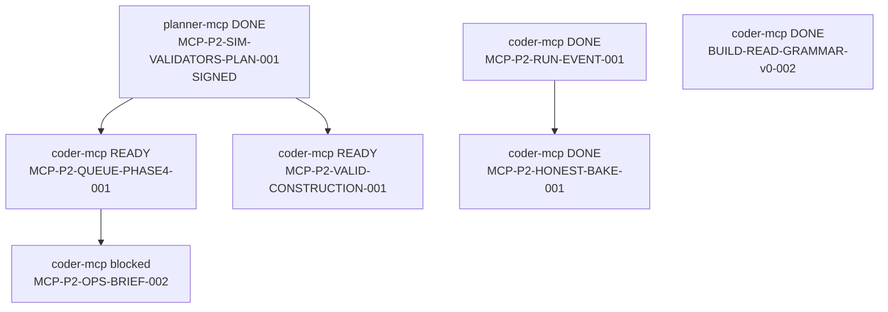

# MCP orchestrator snap — CURRENT (authoritative)

**Date:** 2026-06-13 · **Program:** `MCP-PRODUCTIVITY-P2-001`

| Doc | Role |
|:---|:---|
| **This file** | Dispatch truth — planner drain + coder-mcp blocked chain |
| [`mcp_lane_order_v1.md`](mcp_lane_order_v1.md) | SYMLANG begin-work order — `@orchestrator-mcp` |
| [`mcp_active_queue.json`](mcp_active_queue.json) | Machine queue (P2 tasks) |
| [`HANDOFF.md`](HANDOFF.md) | Session handoff |

---

## Status rollup

| Program | State |
|:---|:---|
| MCP-ART-PROGRAM-GREEN-001 | **CLOSED** |
| MCP-PROD-SPRINT-ROWHOUSE-001 | **CLOSED** |
| MCP-PRODUCTIVITY-P1 (spine/atlas) | **CLOSED** |
| **MCP-PRODUCTIVITY-P2-001** | **ACTIVE** — sim validators plan **SIGNED** · coder-mcp Phase 1+2 **ready** |

**Coder lane (Rust):** `$ref:tools/orchestrator/queues/coder_vegetation_drain_queue.json` v3 — **not** MCP scope unless `VEG-F02-MCP-ATLAS-001` unblocks.

---

## Planner drain order (strict — `@planner-mcp`)

Drain top-down. **Sign-off** = plan on disk + acceptance table in plan doc + `BLANG:Q✓` → update `mcp_active_queue.json` status → unblocks dependents.

| # | ⟨ID⟩ | Pri | Status | Deliverable | Unblocks |
|:--|:---|:---:|:---|:---|:---|
| 1 | **MCP-P2-SIM-VALIDATORS-PLAN-001** | P0 | **SIGNED** 2026-06-13 | [`plan_mcp_sim_product_validators_v1.md`](../../docs/archive/2026-06-src-dev/plans/plan_mcp_sim_product_validators_v1.md) | **unblocked** Phase 1+2 coder-mcp |
| 2 | **MCP-P2-KIT002-PLAN** | P0 | **ready** | `docs/archive/2026-06-src-dev/plans/mcp_kit_production_002_unfreeze_v1.md` + manifest sketch | `kit_production_002+` unfreeze · `@designer-mcp` G0 |
| 3 | **ARCH-002** | P1 | **ready** | `tools/mcp/schemas/variant_graph_v1.schema.json` | `RENDER-001` · `PILOT-001` · variant-aware bakes |

### Planner rules

```text
· Row 1 SIGN is the gate for Tier 1e sim validators — not art bpy
· Rows 2–3 may run parallel with row 1 SIGN work (orthogonal lanes)
· Do not mark row 1 done until acceptance P1–P5 in plan doc are explicit PASS criteria
· After row 2: ΔWF→@designer-mcp G0 rules audit before any kit_production_002 bpy
```

### Row 1 — what “signed” unlocks

Plan doc **exists** (2026-06-02 draft). Planner must add **sign-off line** + flip queue status. Then `@coder-mcp` may implement:

| Phase | Tool / CLI | Owner |
|:---|:---|:---|
| 1 | `review_order_brief` · `slice_exec_brief` · `QUEUE_REGISTRY["phase4"]` | `@coder-mcp` |
| 2 | `witness_brief(profile=construction\|map_pick)` · `validate_report construction` | `@coder-mcp` |
| 3 | `ops_get_retry_guidance` v2 · `ops_get_active_blockers` | `@coder-mcp` |

**Parallel `@coder` (Rust):** `construction_placement_live.json` export — not blocked on planner sign.

---

## Coder-mcp active chain (post-sign)

**Headline:** `MCP-P2-SIM-VALIDATORS-PLAN-001` **SIGNED** 2026-06-13. Phase 1+2 **ready** (parallel). Phase 3 waits on QUEUE.

### Dependency graph



### Active rows (machine)

| ⟨ID⟩ | Status | Depends on | Goal | Witness |
|:---|:---:|:---|:---|:---|
| **MCP-P2-QUEUE-PHASE4-001** | `ready` | SIM-VALIDATORS **signed** | phase4 queue registry + `slice_exec_brief` + `review_order_brief` | `debug_runs/agent_ops/mcp_phase4_queue_live.json` |
| **MCP-P2-VALID-CONSTRUCTION-001** | `ready` | SIM-VALIDATORS **signed** | `witness_brief` profiles + `validate_report construction` | `debug_runs/agent_ops/mcp_valid_construction_live.json` |
| **MCP-P2-OPS-BRIEF-002** | `blocked` | **QUEUE-PHASE4-001** done | `ops_get_retry_guidance` v2 + `ops_get_active_blockers` for G-PLAY | `debug_runs/agent_ops/ops_mcp_function_layer_live.json` |

### Coder-mcp done (do not re-pick)

| ⟨ID⟩ | Witness |
|:---|:---|
| MCP-P2-RUN-EVENT-001 | `debug_runs/mcp_p2_run_event_001_live.json` |
| MCP-P2-HONEST-BAKE-001 | `debug_runs/mcp_p2_honest_bake_001_live.json` |
| BUILD-READ-GRAMMAR-v0-002 / OPS-006 | APS ARCH-DNA + β v0 |

### Unblock sequence (active)

```text
1 @coder-mcp  MCP-P2-QUEUE-PHASE4-001      } parallel — PICK
2 @coder-mcp  MCP-P2-VALID-CONSTRUCTION-001 }
3 @coder-mcp  MCP-P2-OPS-BRIEF-002         — serial after row 1
```

**Exit per row:** implement tool → `BLANG:PY` tests → refresh witness JSON → `BLANG:Q✓` → next row.

---

## Cross-lane MCP blocks (vegetation · not P2 primary)

From `$ref:tools/orchestrator/queues/coder_vegetation_drain_queue.json` v3 — **Phase F**:

| ⟨ID⟩ | Agent | Status | Blocks |
|:---|:---|:---:|:---|
| VEG-F01-DESIGN-ATLAS-001 | `@designer-mcp` | `blocked` | LG-5 iso extract charter |
| VEG-F02-MCP-ATLAS-001 | `@coder-mcp` | `blocked` | tile batch + promote — **depends on F01** |
| VEG-F03-REGISTRY-STAMP-001 | `@coder` | `ready` | Bevy registry — after F02 or spec-only stub |

`@orchestrator-mcp`: route VEG atlas to designer-mcp first; do not queue bpy until G0 + spec sign-off.

---

## P2 dispatch order (`@orchestrator-mcp` session)

```text
1 @orchestrator-mcp  boot → orchestrator-mcp-lane-brief → issue explicit order
2 @coder-mcp         ⟨MCP-P2-QUEUE-PHASE4-001⟩ + ⟨MCP-P2-VALID-CONSTRUCTION-001⟩  ★ parallel PICK
3 @planner-mcp       ⟨MCP-P2-KIT002-PLAN⟩               ★ parallel if bandwidth
4 @planner-mcp       ⟨ARCH-002⟩                         variant graph schema
5 @coder-mcp         ⟨MCP-P2-OPS-BRIEF-002⟩            after QUEUE-PHASE4 done
```

**Copy explicit order from:** [`mcp_lane_order_v1.md`](mcp_lane_order_v1.md) § Delegate paste

**Paused (non-blocking):** `MCP-PILOT-GRAMMAR-001` · **OPS-007** — warehouse production bake (`variant_matrix_warehouse_v1` frozen until operator keyframe + G4).

---

## Operator / engine gates (MCP secondary)

| Gate | Owner | MCP impact |
|:---|:---|:---|
| G-PLAY-01 footprint | `@coder` | MCP lanes **secondary** until `TRIAGE-MAP-PICK-CLOSURE-001` green |
| VEG phase C operator_visible | `@coder` | MCP atlas lane blocked until preview product gate |
| Postgres ops fn_* | defer | JSON compose only — `MCP-OPS-REPORT-001` P3 defer |

---

## CLI

```powershell
python -m rust_engine_mcp.cli orchestrator-mcp-lane-brief
python -m rust_engine_mcp.cli handoff-brief
python -m rust_engine_mcp.cli coder-mcp-drain-brief
```

---

## Unfrozen / frozen

| Class | Items |
|:---|:---|
| **Unfrozen** | `kit_production_001` · `tile_rowhouse_victorian_production_v1` (maintain only) |
| **Frozen until P2 plan** | `kit_production_002+` · other archetype production batches · `kit_greybox_004+` |
| **Frozen warehouse pilots** | `variant_matrix_warehouse_v1` · `variant_matrix_shopfront_v1` · `variant_matrix_bunker_v1` |

---

## Changelog

| Ver | Date | Note |
|:---|:---|:---|
| v3.2 | 2026-06-13 | SIM-VALIDATORS plan SIGNED — coder-mcp Phase 1+2 ready |
| v3.0 | 2026-06-13 | P2 RUN-EVENT + HONEST-BAKE done |
| v2.x | 2026-06-02 | Rowhouse sprint closed |
